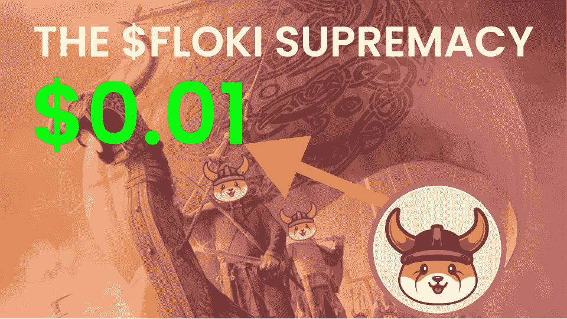
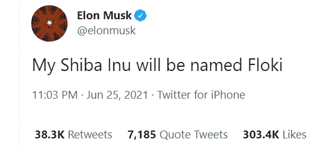
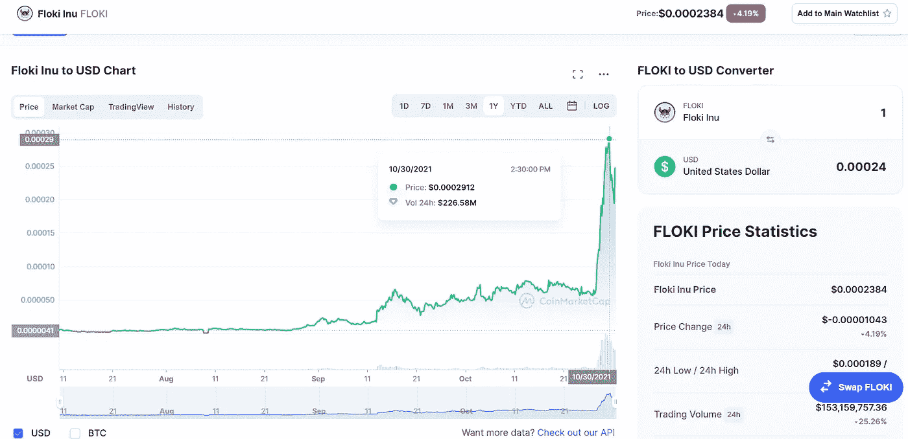
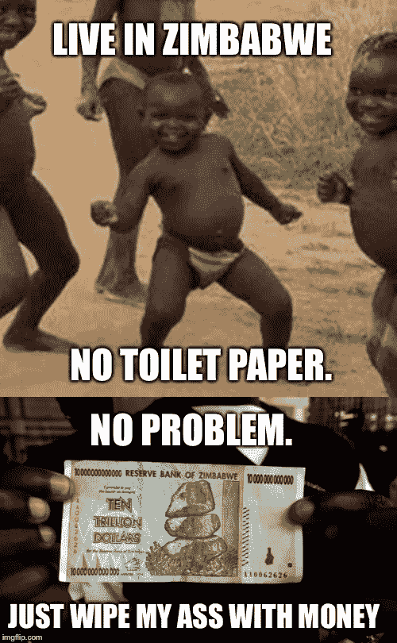
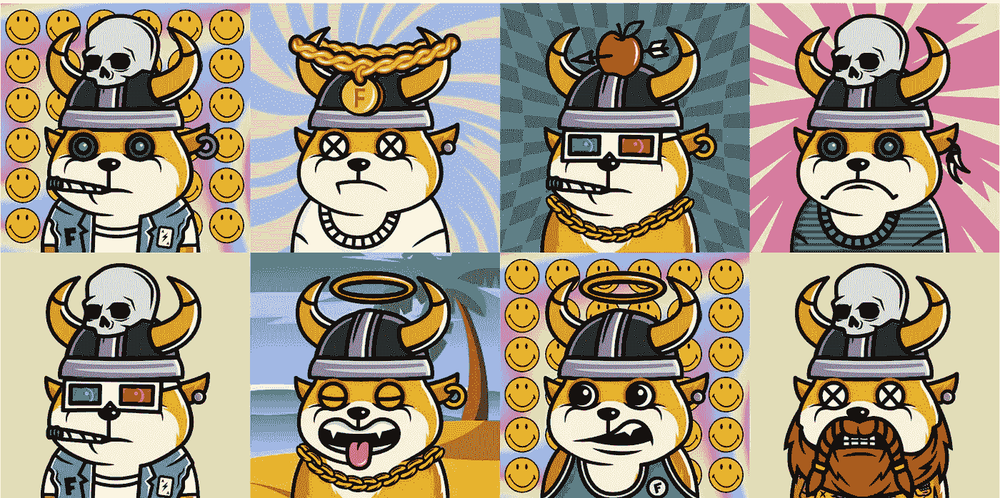
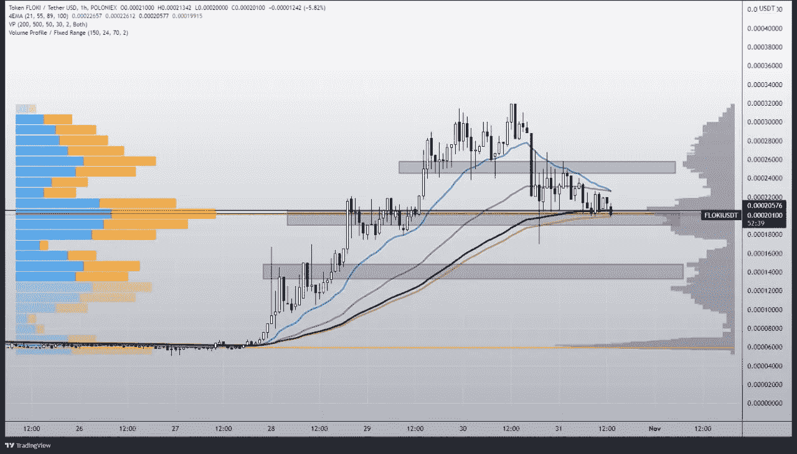
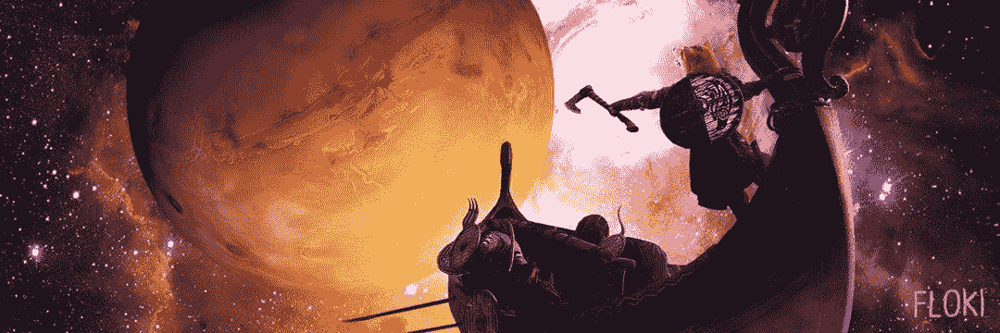

# $ FLOKI Supremacy |我们要涨到 0.01 美元吗？

> 原文：<https://medium.com/coinmonks/the-floki-supremacy-are-we-going-to-0-01-6763d56b9734?source=collection_archive---------0----------------------->

## 你认为 FLoki Inu 会达到 0.01 美元或 1 美分大关吗？首先，让我们看看为什么弗洛基·INU 是一个好的投资。

# 不就是另一个狗币吗？是吗？

弗洛基·INU 是由总督埃隆·马斯克在推特上发布的，以他自己的柴犬·INU 名字弗洛基为原型。不仅如此，弗洛基还是唯一一枚与埃隆的哥哥金巴尔·马斯克的百万花园运动合作的硬币。弗洛基社区一直在努力工作，目标是到达瓦尔哈拉。

几天前，弗洛基在一艘宇宙飞船上运行，创下了 0.00029 美元的历史新高。随后，该指数回调至 0.00019，并重返下一轮反弹轨道。这里的问题是，在这轮牛市结束之前，它是否能够达到 1 美分。让我们找出答案。

弗洛基 INU 在联邦理工学院和生物安全学院链上的总流通供应量为 9.23 吨。不仅如此，它的总流通供应量为 9，227，838，738，612.654 美元弗洛基，总市值为 2，105，594，805.40 美元(截至本文撰写时)。

> *没有足够的资金购买蘸酱？获得免费的 hi 美元！*

# 跳过:历史课

现在这个世界上有一个基本现象叫做稀缺。带你们去 1990 年的津巴布韦。当时该国正经历恶性通货膨胀，印刷津巴布韦元的成本高于其实际价值。当时，津巴布韦中央银行发行了 1000 亿美元的纸币。

现在，你认为当某样东西太多，人们不再重视它时，会发生什么？这个？

# 统计数字

现在弗洛基也有类似的情况；如果数量太多，以至于每个人都能拥有至少 100 万美元的弗洛基，这对 HODL 来说就没什么意义了。因此，随着时间的推移，社区积极燃烧弗洛基因努以减少供应。已经有 49，47，95，14，42，018.016 $弗洛基被烧了，程序一直在继续。

此外，霍德勒必须为 BSC 和 ETH 连锁店的每笔买卖交易支付 3%的税。税收进入了财政部的钱包(我猜是开发商的。LOL)

$FLOKI 在 BSC 和 ETH 链上都有一个 burn 地址，Burn 地址是:0x 0000000000000000000000000000000000 dead

# 弗洛基·INU 创世纪系列

弗洛基伊努社区推出了创世纪系列，也被称为“钻石之手”。这些基本上都是柴犬的 NFT(为什么有人想要狗的 NFT？嗯，和人们买价值几百万的猴子是一个道理)。

这些 NFT 是作为对第一批投资者和首次空投接收者的奖励。

# 弗洛基·INU 分析

根据我们的市场分析师，从 10 月 21 日开始，FLOKI Inu 已经开始抽水，并以 377%的涨幅进入其 ATH。然而，在到达那里后，它遭遇了主要支撑的崩溃，你可以看到成交量看起来很糟糕。此外，它现在正在形成阻力，但目前，它在其第二个支持，那里的成交量看起来也不错，我们也可以看到 89 和 200 均线的支持！

但是，如果它突破这个支撑，我们预计它会触及最后一个支撑，因为 21 和 55 均线在中间。此外，成交量也不乐观。因此，我们可以建议安全交易，并期待最好的结果。

FLOKI Price Prediction

# 瓦尔哈拉殿堂

老实说，对弗洛基·伊努来说，要达到 1 美分的目标很难。但是，是的，我们有可能在那里看到它，在 Dogefather 旁边有几个更好的水泵，我们和 FLOKI 一起坐船去瓦尔哈拉。

本文中没有任何金融建议，你应该只投资于你认为对你的投资组合有利的市场。

与我联系，

[**推特**](https://twitter.com/prabxat) **|** [**领英**](https://www.linkedin.com/in/praxhat/)

> [*比特币:中本聪时代*](/coinmonks/bitcoin-the-age-of-satoshi-nakamoto-fe58157e740d?source=user_profile---------0----------------------------)

> [2021 年 10 月最值得购买的 5 种代用币](/coinmonks/top-5-altcoins-to-buy-in-october-2021-c864fa9140da?source=user_profile---------2----------------------------)
> 
> [2021 年 11 月要购买的五大加密技术](/coinmonks/top-5-crypto-to-buy-in-november-2021-b9c99c44a704?source=user_profile---------1----------------------------)
> 
> [BTCST 刚刚 3 天涨了 5 倍|目标是 1000 美元吗？](/coinmonks/btcst-just-went-5x-in-3-days-is-it-aiming-for-1-000-9dcba894c954?source=user_profile---------1----------------------------)

> [*银行会灭亡还是会适应？DeFi 的未来将会决定。*](/coinmonks/will-banks-perish-or-adapt-the-future-of-defi-will-decide-80f13284f76?source=user_profile---------1----------------------------)

> 你钱包里的 100 美元是钱还是没有价值的东西？
> 
> [2021 年底前比特币还在破 100K 的路上吗？](/coinmonks/is-bitcoin-still-on-its-path-to-break-100k-before-the-end-of-2021-4716a56745ce?source=user_profile---------1----------------------------)
> 
> 作为一名大学本科生，我是如何开始投资 Crypto 的？

这篇文章中所写的一切都是我所相信的，你的想法可能与我的不同(显然，我们是两个不同的人)。所以，把这篇文章当做闲书，如果不喜欢内容，就当没看过吧！

> 加入 Coinmonks [电报频道](https://t.me/coincodecap)和 [Youtube 频道](https://www.youtube.com/c/coinmonks/videos)获取每日[加密新闻](http://coincodecap.com/)

## 另外，阅读

*   [复制交易](/coinmonks/top-10-crypto-copy-trading-platforms-for-beginners-d0c37c7d698c) | [加密税务软件](/coinmonks/crypto-tax-software-ed4b4810e338)
*   [网格交易](https://coincodecap.com/grid-trading) | [加密硬件钱包](/coinmonks/the-best-cryptocurrency-hardware-wallets-of-2020-e28b1c124069)
*   [最佳加密交易所](/coinmonks/crypto-exchange-dd2f9d6f3769) | [印度最佳加密交易所](/coinmonks/bitcoin-exchange-in-india-7f1fe79715c9)
*   [开发人员的最佳加密 API](/coinmonks/best-crypto-apis-for-developers-5efe3a597a9f)
*   [密码电报信号](http://Top 4 Telegram Channels for Crypto Traders) | [密码交易机器人](/coinmonks/crypto-trading-bot-c2ffce8acb2a)
*   最佳[密码借贷平台](/coinmonks/top-5-crypto-lending-platforms-in-2020-that-you-need-to-know-a1b675cec3fa)
*   杠杆代币的终极指南
*   [加密交易的最佳 VPN](https://coincodecap.com/best-vpns-for-crypto-trading)
*   [用于 Huobi 的加密交易信号](https://coincodecap.com/huobi-crypto-trading-signals) | [HitBTC 审查](/coinmonks/hitbtc-review-c5143c5d53c2)
*   [TraderWagon 回顾](https://coincodecap.com/traderwagon-review) | [北海巨妖 vs 双子星 vs BitYard](https://coincodecap.com/kraken-vs-gemini-vs-bityard)
*   [如何在 FTX 交易所交易期货](https://coincodecap.com/ftx-futures-trading)
*   [OKEx vs KuCoin](https://coincodecap.com/okex-kucoin) | [摄氏替代度](https://coincodecap.com/celsius-alternatives) | [如何购买 VeChain](https://coincodecap.com/buy-vechain)
*   [3 commas vs . Pionex vs . crypto hopper](https://coincodecap.com/3commas-vs-pionex-vs-cryptohopper)
*   [如何使用 Cornix 交易机器人](https://coincodecap.com/cornix-trading-bot)
*   [Bitget 回顾](https://coincodecap.com/bitget-review)|[Gemini vs block fi](https://coincodecap.com/gemini-vs-blockfi)cmd |[OKEx 期货交易](https://coincodecap.com/okex-futures-trading)
*   [用信用卡购买密码的 10 个最佳地点](https://coincodecap.com/buy-crypto-with-credit-card)