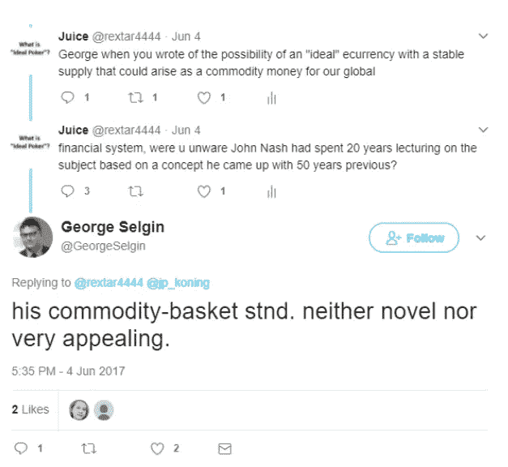
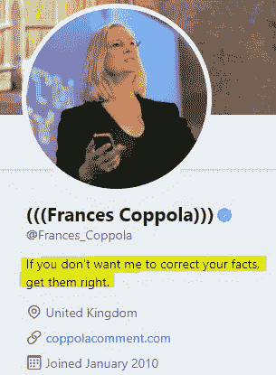

# 应对比特币的卡特尔经济学的形成

> 原文：<https://medium.com/coinmonks/the-formation-of-cartel-economics-in-response-to-bitcoin-4f33b5e408a2?source=collection_archive---------3----------------------->

同一行业的人很少聚在一起，即使是为了娱乐和消遣，但谈话却以反对公众的阴谋或提高价格的某种阴谋而告终 [*【亚当·斯密，国富论(1776)*](https://www.adamsmith.org/blog/regulation-industry/misreading-adam-smith)

这条推文观察了法律和市场之间的关系:

亚当·斯密(Adam Smith)的一个观点反驳了这一观点，即这种针对公众的阴谋(不严格地说，一个 [*卡特尔*](https://en.wikipedia.org/wiki/Cartel) )只能存在于政府监管保护[卡特尔]的地方。

今天有反垄断法禁止这种行为——这表明了法律和市场是如何相互依存的。

在更广泛的层面上，这条推文展示了政府或中央机构在协调经济活动方面的好处:

# 对卡特尔的博弈论回应

事实证明，卡特尔安排之所以有吸引力，是因为它们能促使(有关各方)合作，但长期来看，由于存在脱离的动机，这种安排通常是不稳定的。

博弈论对此提供了解释——这条推文对比特币现金分叉进行了这样的观察:

一个回应:

回复:

进一步观察:

银行形成卡特尔的假设是错误的，因为我们有反垄断法。然而，它确实引出了一些值得进一步研究的问题。

# 哈尔·芬尼的观察

> “乔治·塞尔金详细阐述了竞争性自由银行的理论，他认为这样一个系统将是稳定的、抗通胀的和自我调节的……我相信这将是比特币的最终命运，成为“高能货币”，作为发行自己的数字现金的银行的储备货币。”哈尔·芬尼，2010 年。

# 乔治·塞尔金:自由银行理论

关于 Hal Finney 在《比特币》一文中提到的理论的更深入的理解，可以在这里找到，但是对*自由银行业理论*的总结是，如果任其自生自灭，银行业会随着时间的推移找到一个自然的水平。

由于其调整算法，比特币被认为可以成为这种理论的基础，这种算法创造了需求和供应之间的非政治平衡——在某种程度上，有人猜测塞尔金参与了其创造。

然而，塞尔金暗示了对比特币的厌恶:

这让人想起弗朗西斯·科波拉(Frances Coppola)在 2012 年的主张，即比特币可能会成为货币之间国际比较的基础，这与利率管理和通胀目标截然不同。

然而，和塞尔金一样，科波拉现在表达了对比特币的厌恶:

# 经济学的语言

经济学被称为“沉闷的科学”，大概是因为方法论上的比较差异。

在这方面，约翰·纳西称自己是经济学的[门外汉，呼吁采取更科学的方法。](/coinmonks/economics-bitcoin-nash-and-szabo-f6c96ecfa0b3)

尽管纳什因其对[经济学]的贡献获得了诺贝尔奖，但“圈内人”塞尔金对纳什理想货币的基础做出了如下评论:

纳什也被认为是比特币的创造者，因为它与[纳什的][T4 的]理想货币相似。正如这条推文所指出的，比特币和凯恩斯的 bancor 建议也有相似之处:

# 他们对[英国]了解多少？

或者说，他们对货币经济学家了解多少，而货币经济学家只知道这些？或者看起来是这样的:在央行的语境中，语言就像在任何地方一样是一种游戏:正式英语不需要如此清晰，除了参与其中(游戏):

Immutability?

语言的意义可以改变事实呈现的方式。这并不比通货膨胀的含义更明显，通货膨胀根据意愿从供给条件转变为价格水平条件:所需要的只是对这种意愿的权力。

# 扩展洞察力

词语的增选键是那些提供[词语]意义的键:在任何其他猜想中，自然在这方面都是蛮力。

芬尼对比特币(作为高级结算)的理解让位于货币管理和叙事最高层的困惑，他们希望围绕他们对比特币的理解、货币发行的总体质量以及我们对货币应该是什么的预期，形成类似卡特尔的关系:

# 环境是死的

比特币是一个无法关闭的计算机网络——这大概是其非图灵完整性的要点。在这方面，博弈论是适用的:一种信托标准，其对所有主权货币的出色表现意味着，与 bancor 提案不同，比特币不依赖于民族国家的慷慨接纳。

正如*正义*和*通货膨胀*及其含义会随着时间的推移而改变一样，*环境*也是如此。对此的回应是:

这个:

还有这个:

当故事溜走时，那些希望限制货币的人的反应是:

> [直接在您的收件箱中获得最佳软件交易](https://coincodecap.com/?utm_source=coinmonks)

