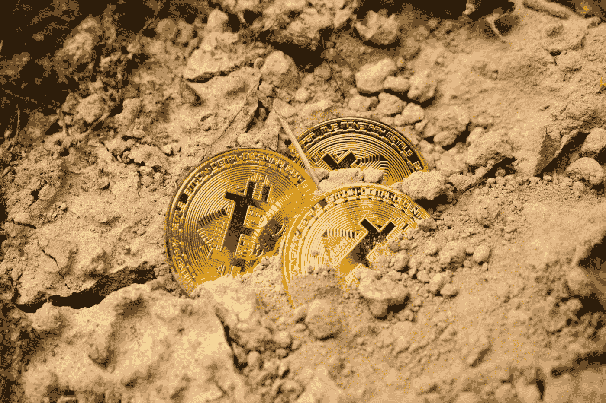

# 密码的基本原理

> 原文：<https://medium.com/coinmonks/the-fundamentals-of-crypto-1f3254cfa76a?source=collection_archive---------0----------------------->

Photo by [Dmitry Demidko](https://unsplash.com/@wildbook?utm_source=unsplash&utm_medium=referral&utm_content=creditCopyText) on [Unsplash](https://unsplash.com/s/photos/cryptocurrency?utm_source=unsplash&utm_medium=referral&utm_content=creditCopyText)

## 加密货币的(非常)粗糙的介绍:

这是什么？

嗯，顾名思义，它是数字形式的货币。但是随便说说，就是 dinero，moola，cheddar，paper——随便你怎么称呼钱。

在某种程度上确实如此。这只是一种新的货币形式，按照我们现代以技术为中心的世界的形象重新塑造。它们不是美钞或金币，而是数字代币，是加密信息的小片段，像硬通货一样，代表着构建我们经济世界的信贷和债务基础系统。

由于我们大多数西方人已经习惯于刷信用卡，或使用 venmo 支付朋友的餐费，数字化和无纸化似乎并不难理解。

那么，为什么要大惊小怪呢？有什么好谈的？实际上，相当多。我们认为这值得探索。因为在明显的相似性背后,[加密货币](https://blog.coincodecap.com/tag/cryptocurrency/)确实是一种不同的动物。

*Crypto*系列的基础将试图展示是什么让 [crypto](https://blog.coincodecap.com/tag/crypto/) 与传统货币不同，以及为什么你应该关注它。我们将以合理的细节探索 [crypto](https://blog.coincodecap.com/tag/crypto/) 背后的一些底层技术，以及 crypto 所处的当代和历史背景。此外，我们打算滔滔不绝地谈论我们认为 crypto 可能带来的一些最令人兴奋的可能性。

但是在我们开始之前，我们想弄清楚我们对这个问题和所有问题的态度。我们在 Hansel 的目标是不要手下留情，不要做“稻草人”式的辩论，只强调积极的一面，掩盖消极的一面。我们认为这对任何人都没有好处。

好的和明智的决策是接受来自各方的最有力的证据和论据的结果。我们的主题报道将试图从所有的角度收集最好的想法，流行的或相反的，保守的，自由主义的，或疯狂的无政府主义的。我们不太在乎标签、党派或地缘政治倾向，我们在乎的是理念和创造开放的对话，为智慧和进步服务。

我们不会总是实现我们的目标，在这个过程中我们会犯很多错误，但我们致力于保持开放。随着新信息的出现，或者我们自身无知的面纱被揭开，我们将重新评估我们的假设，并寻求完善我们的立场。

现在，如果你能原谅上述我们自己的智力喇叭，让我们来谈谈密码！

查看下一期[第一部分:金钱的颜色](/@hanselinvest/the-fundamentals-of-crypto-bb70e416a192)

[Hansel](http://hanselinvest.com) 是一个全自动的备用零钱投资平台，适用于加密爱好者和加密新手。Hansel 专注于优雅的设计和易用性，是个人投资者的必备工具。

> [在您的收件箱中直接获得最佳软件交易](https://coincodecap.com/?utm_source=coinmonks)

