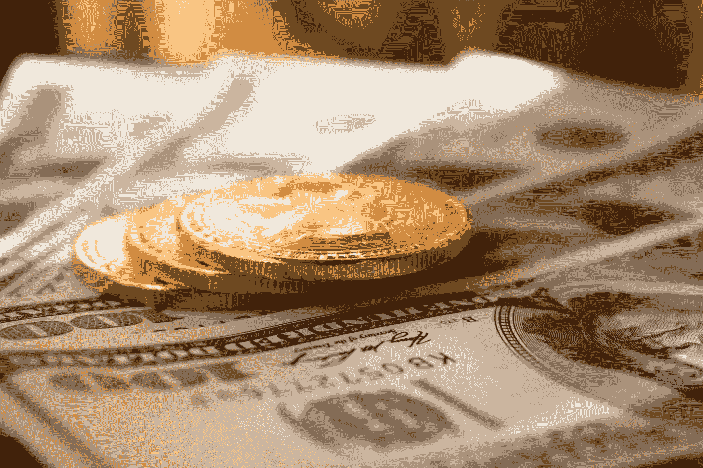

# 金钱的颜色

> 原文：<https://medium.com/coinmonks/the-fundamentals-of-crypto-bb70e416a192?source=collection_archive---------1----------------------->

Photo by [Dmitry Demidko](https://unsplash.com/@wildbook?utm_source=unsplash&utm_medium=referral&utm_content=creditCopyText) on [Unsplash](https://unsplash.com/s/photos/money?utm_source=unsplash&utm_medium=referral&utm_content=creditCopyText)

## 密码学基础—第 1 部分

如果你是美国人，你可能听说过“硬通货”这个说法你已经拥有，或者至少渴望拥有一大堆本杰明(100 美元的钞票)。也许你想“让它下雨”或者，也许你已经发现自己闻到了银行的一张崭新的钞票。

嗯……忘了这一切吧。因为货币的未来就像一种致命的气体——无色、无嗅、感官看不见，但却很强大。这听起来不吉利，但不要担心，因为我们相信有理由庆祝。

本系列将尝试检查新旧货币的属性和特征，并确定新的数字加密货币是如何堆叠的。不过，要达到这一点，质疑一下我们关于货币是什么以及货币如何运作的一些基本假设是有益的。

有钱就是牛逼。

不是“酷”这个词的意思，而是更像圣经中的意思。如此巨大的力量和规模，既令人敬畏又令人害怕。它的本质几乎是基本的。就像磁力一样，它看不见，却一直发挥着它的影响。

金钱也许是我们现代世界最主要的组织原则。它将人们编织成部落、国家和极其复杂的社会网络。但不仅如此。因为金钱并不是简单的吸引和排斥，或者引导资源。这是一项变革性的技术。这是一种工具，当被善良的人们利用时，它可以润滑人类进步的车轮。然而，在更邪恶的人手中，它可以成为一种武器，助长战争和毁灭。

金钱在塑造我们的世界和日常生活中扮演着如此普遍的角色，你可能会认为我们对金钱已经了如指掌。但是我们真的了解它是什么，它是如何工作的吗？表面答案是肯定的。实际上，我们都知道钱是什么。我们每天用美元、欧元和日元来交换商品和服务。这是我们得到报酬的东西，然后我们用来支付其他东西。至少我们一般是这么理解的。

但是当我们以这种方式谈论货币时，我们真正谈论的是货币。我们实际上讨论的不是货币，而是用来代表货币的交换媒介。

钱不是实物。它不像大麦、牛或黄金那样是一种商品。**金钱是信用和债务的基础系统，是一个促进交易的会计系统——商品的买卖**服务，资产&负债，甚至礼物&恩惠。我们所熟悉的“钱”，我们的硬币、钞票和金条，仅仅是代币，是用来代表和结算我们账户的基础系统的记录。

事实证明，货币是一种社会技术，产生于普遍经济价值的概念，这是人们的一种共同信念，即不同领域的事物都有一个可以衡量、协商和交换的价值。货币，我们通常认为是货币的东西，我们在交易中使用的东西，只是一个抽象的单位，价值是用它来命名的。这是米或英里的距离。公斤或磅的重量。

为什么金钱和货币之间的区别如此重要？混淆它们又有什么坏处呢？

这种危险类似于混淆地图和领土本身。这张地图是一个有用的向导。它提供了有助于在空间中导航和定向的有用图片。但是该地图仅包含实际区域内存在的一小部分信息和深度。此外，随着更多的信息被了解，地图可以(也应该)被改变。它们可以不断改进和完善，以更好地反映地区。地图也反映了我们在该地区的意图。一个地区可能有许多不同的地图，一个徒步旅行者可能想知道地形，而一个政治家可能想知道人口密度。

同样，货币是为货币服务的工具。它被用来谈论价值，但它只是测量的单位，**而不是被测量的东西**！如果我们把货币和金钱混为一谈，我们就无法识别潜在的系统；我们对经济形势的理解仍然肤浅。如果我们不理解工具的大背景，或者它们应该服务的功能，我们就无法评估工具的有效性。[加密货币](https://blog.coincodecap.com/tag/cryptocurrency/)的出现可以被理解为一种进化，一种对旧技术的适应，以适应我们的数字世界。因此，要了解什么是[加密货币](https://blog.coincodecap.com/tag/cryptocurrency/)，它们是如何工作的，以及它们是否有任何好处，掌握它们的历史和发展环境是必不可少的。为了做到这一点，我们将认真审视过去、现在和潜在未来的不同货币，试图从坏的和丑的中解析出好的。

本系列的更多内容请看第 2 部分:货币的(非常)基本概述

Hansel 是一个全自动的备用零钱投资平台，适用于加密爱好者和刚接触[加密](https://blog.coincodecap.com/tag/crypto/)的人。Hansel 专注于优雅的设计和易用性，是个人投资者的必备工具。

> [在您的收件箱中直接获得最佳软件交易](https://coincodecap.com/?utm_source=coinmonks)

