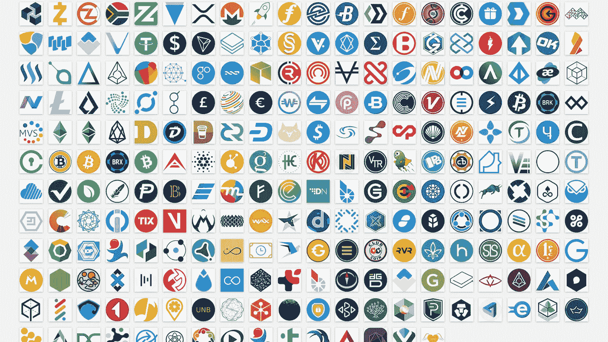
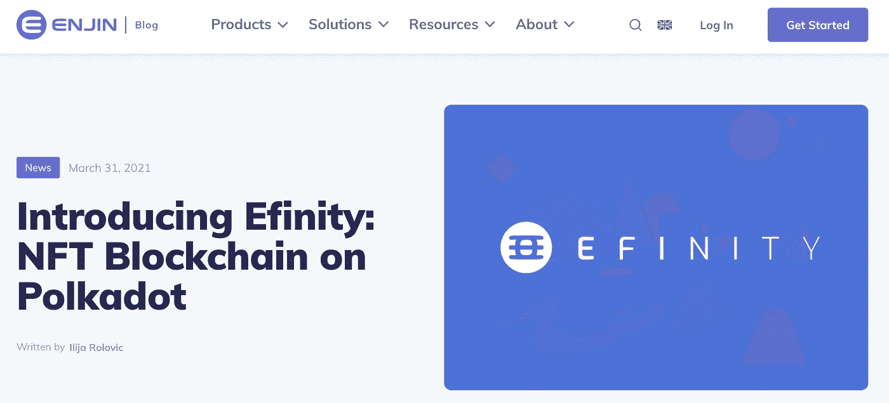

# 未来是多元的

> 原文：<https://medium.com/coinmonks/the-future-is-multi-coin-fe0019cfa264?source=collection_archive---------0----------------------->

## 没有一个硬币能统治所有的人

Source: [Dev.to](https://dev.to/markbloomfield/200-crypto-currency-logos-in-svg-format-41ok)

和往常一样，这篇文章是为教育目的而写的。这既不构成财务建议，也不构成交易建议。过去的表现并不代表未来的结果。

*不要投资超过你能承受的损失。这不是财务建议；总是自己做研究:)*

硬币比以往任何时候都多。

每天，币安智能链上都有[新屎币被铸造](https://www.reddit.com/r/CryptoMoonShots/)。越来越多的项目正在以太坊上创建 ERC-20 令牌——作为他们协议的一种治理或实用形式。

只有比特币和以太坊统治整个行业的世界现在是一个神话。

构建令牌比以往任何时候都更容易——有了像[比特币基地构建工具](https://blog.coinbase.com/introducing-rosetta-build-once-integrate-your-blockchain-everywhere-9b97d284f5b9)这样的公司，可以轻松构建和推出令牌。

那么在这个硬币越来越多的世界里会发生什么呢？

**我们可以得出的最简单的结论是，将需要越来越多的工具来轻松部署更多的加密硬币和令牌。**

[来自 Variant 的 Jesse Walden](https://twitter.com/jessewldn?lang=en) 声称我们正处于区块链的[大型机时代](https://jessewalden.com/4-eras-of-blockchain-computing-degrees-of-composability/):

> 这是区块链的“大型机时代”。虽然由于可组合性(汇集的安全性、用户群、数据和运行的代码)无疑会对早期网络产生影响，但随着对大型机吞吐量限制的采用，这种影响会带来边际回报递减。

这就是以太坊这样的大型单体平台存在的地方——在这个网络中，每一笔交易和每一点数据都在同一条众所周知的高速公路上处理。

像 Solana、BSC 和 Cardano 这样的网络已经创建了它们自己的安全模型、它们自己的共识模型、令牌组学等。

这是一种“从零开始构建”的方法——就像早期计算机时代的大型机一样。

杰西认为我们正在快速进入区块链的“服务器时代”:

> 这意味着，即使是“服务器时代”的区块链仍然是可组合的，但与“大型机时代”的区块链相比，是在不同的维度上。这些区块链计算机需要新的标准来相互通信，而不是运行单个虚拟机，以便实现跨应用程序的组合。— [风险投资公司杰西·沃顿](https://jessewalden.com/4-eras-of-blockchain-computing-degrees-of-composability/)

在这里，区块链由特定于应用程序的用例构建，利用一组共享标准和服务，以便更轻松地创建区块链和令牌。

硬币不再需要建立自己的共识和安全性——它可以利用现有的基础设施，如 Polkadot 网络，更容易地建立一个用于特定目的的区块链:如支付、NFTs、游戏等。

Efinity is an NFT specific blockchain built on Polkadot, leveraging Polkadot’s shared characteristics

在这个新的服务器时代，我们将看到区块链扮演不同的角色，协同工作。

例如，Solana 是另一个第 1 层——长期以来被认为是以太坊的竞争对手——交易更快，汽油费更便宜。

然而，我认为索拉纳是以太坊的完美补充——是“以太坊 CPU 的 GPU”。

当想到一个多硬币的世界时，有理由认为互操作性协议将在不同加密协议之间的通信中发挥重要作用，如以太坊和币安智能链以及 Solana 等。

让我们双击这个。

# 比较波尔卡多特和宇宙

Polkadot 和 Cosmos 是目前该领域领先的互操作性协议。波尔卡多特由加文·伍德博士共同创作，他与维塔利克·布特林共同创作了以太坊。

Cosmos 是由 Tendermint 团队创建的，作为跨越不同区块链的另一种通信方式。

虽然这两种技术的最终目标是相似的，但它们有着非常不同的实现，我想双击一下。

## 履行

波尔卡多特有一个被称为中继链的主链，还有像副链一样的子链分支。副链有自己的操作，但它们总是重新连接回中继链，以实现整体治理、安全性、状态性等。

Cosmos 有一个“中心和区域”模型。每个区域都是一个连接到集线器的辐条，集线器是区域之间的中心连接器链。集线器可以与其他集线器连接，这个互联网络就是宇宙网络。每个区域都是自治的，只连接回区块链国家间通信(IBC)和治理的枢纽。

## 发展

Polkadot 还没有在 mainnet(即真实货币)上上线。他们有一个名为草间弥生的“测试网”网络，大量的开发者支持和一个充满活力的 dapps 社区正在建设中——可以说他们有一个比 Cosmos 更好的社区。

相比之下，宇宙是活的。这是主要成功的区块链的基础，如[泰拉](http://terra.money)和[币安链](http://www.saturn.network/blog/binance-chain-is-built-on-tendermint-cosmos-sdk/)(不是币安智能链)。

## 安全性

Polkadot 利用中继链的共享安全性，因此，parachains 能够使用整个 Polkadot 网络的强大共享安全性，而不是从头开始的自举安全性和一致性。

宇宙区域有他们各自单独安全的单独安全。没有共享的安全性，即使在通过集线器链接的情况下。

## 用户化

由于对中继链的副链有共同的共识，与宇宙相比，波尔卡多特没有对区块链的参数进行太多的定制。

相比之下，Cosmos 有许多区块链，它们形成自己的共识、参数，甚至可以形成私人网络，而无需与网络的其余部分进行通信。

## 成员资格

Polkadot 主持拍卖成为副链，这意味着项目必须付费才能成为网络上的副链。

在 Cosmos 中，任何人都可以免费建造一个中心或区域。

## 共识；一致

波尔卡使用的是一种被称为爷爷的共识机制，中继链决定整个生态系统的状态。因为爷爷只是基于最高的块进行验证，所以这种共识在理论上可以扩展到超过 1000 个验证器。

再说一次，它还没有上线，也没有在 prod 中测试过。

Cosmos 有 Tendermint 共识，其中每个区域快速地彼此对话以实现一个块的终结。这种共识可能会导致验证器过载，并且可能不会超过 200 个验证器。

## 管理

Polkadot 有一个严格的投票过程，基于本地硬币点的股权加权投票。

在 Cosmos 中，每个区域/中心都有自己的治理。他们下注 ATOM，即原生硬币，以参与 Cosmos，即网络中的主要枢纽之一(但同样，在 Cosmos 中，参与 Cosmos 枢纽完全是可选的)。

## 跨链消息传递

这就是波尔卡多特大放异彩的地方。任意信息在副链之间传递。通过该协议得到支持。这意味着 Parachain A 可以调用 Parachain B 内部的智能合约；跨链可组合性很强。然而，这可能会使验证器过载，尽管要跟踪所有的副链状态。

Cosmos 拥有区块链间通信(IBC)，这有利于通过 hub 跨区域转移令牌。只是令牌传输，而不是真正的可组合性。

## SDK

Polkadot 有它的底层 SDK:一个用于任何语言的 WebAssembly (WASM)编译器，可以在 Polkadot 上构建协议和应用。Substrate 还拥有比 Cosmos 更多的开箱即用模块。

Cosmos SDK 是基于 Go 的。

# 比较波尔卡多特和宇宙

一个多币/多链的世界是伟大的。我们将区块链作为一种技术来支持特定于应用程序的用例，因此，我们正在抽象出低级技术，以支持用户友好的应用程序，就像互联网从万维网过渡到脸书等 Web 2.0 平台一样。

区块链很复杂，去中心化计算永远不会有一个放之四海而皆准的模型(抱歉以太坊 maxis)。

我们越能针对不同的用途对技术进行抽象和优化，它就越容易被大众接受。

如果你认为这篇博文值得你花 5 分钟来阅读，请在下面鼓掌(最多 50 次)或者与一个会从这篇内容中受益的朋友分享。非常感谢！

> 加入 [Coinmonks 电报小组](https://t.me/joinchat/uiLERCQL1fQ5ZjA1)，了解加密交易和投资

## 另外，阅读

*   最好的[加密交易机器人](/coinmonks/crypto-trading-bot-c2ffce8acb2a) | [网格交易机器人](https://blog.coincodecap.com/grid-trading)
*   [加密副本交易平台](/coinmonks/top-10-crypto-copy-trading-platforms-for-beginners-d0c37c7d698c) | [五大 BlockFi 替代方案](https://blog.coincodecap.com/blockfi-alternatives)
*   [CoinLoan 审核](/coinmonks/coinloan-review-18128b9badc4)|[Crypto.com 审核](/coinmonks/crypto-com-review-f143dca1f74c) | [火币保证金交易](/coinmonks/huobi-margin-trading-b3b06cdc1519)
*   [尤霍德勒 vs 考尼洛 vs 霍德诺特](/coinmonks/youhodler-vs-coinloan-vs-hodlnaut-b1050acde55a) | [Cryptohopper vs 哈斯博特](https://blog.coincodecap.com/cryptohopper-vs-haasbot)
*   [杠杆代币](/coinmonks/leveraged-token-3f5257808b22) | [最佳密码交易所](/coinmonks/crypto-exchange-dd2f9d6f3769) | [Paxful 点评](/coinmonks/paxful-review-4daf2354ab70)
*   [如何在印度购买比特币？](/coinmonks/buy-bitcoin-in-india-feb50ddfef94) | [WazirX 评论](/coinmonks/wazirx-review-5c811b074f5b) | [BitMEX 评论](https://blog.coincodecap.com/bitmex-review)
*   [双子座 vs 比特币基地](https://blog.coincodecap.com/gemini-vs-coinbase) | [比特币基地 vs 北海巨妖](https://blog.coincodecap.com/kraken-vs-coinbase)|[coin jar vs coin spot](https://blog.coincodecap.com/coinspot-vs-coinjar)
*   [币安 vs 北海巨妖](https://blog.coincodecap.com/binance-vs-kraken) | [美元成本平均交易机器人](https://blog.coincodecap.com/pionex-dca-bot)
*   [印度比特币交易所](/coinmonks/bitcoin-exchange-in-india-7f1fe79715c9) | [比特币储蓄账户](/coinmonks/bitcoin-savings-account-e65b13f92451)
*   [币安费](/coinmonks/binance-fees-8588ec17965) | [Botcrypto 评论](/coinmonks/botcrypto-review-2021-build-your-own-trading-bot-coincodecap-6b8332d736c7) | [Hotbit 评论](/coinmonks/hotbit-review-cd5bec41dafb) | [KuCoin 评论](https://blog.coincodecap.com/kucoin-review)
*   [我的密码副本交易经验](/coinmonks/my-experience-with-crypto-copy-trading-d6feb2ce3ac5) | [购买硬币评论](https://blog.coincodecap.com/buycoins-review)
*   [加密货币储蓄账户](/coinmonks/cryptocurrency-savings-accounts-be3bc0feffbf) | [YoBit 审查](/coinmonks/yobit-review-175464162c62) | [Bitbns 审查](/coinmonks/bitbns-review-38256a07e161)
*   [最佳比特币保证金交易](/coinmonks/bitcoin-margin-trading-exchange-bcbfcbf7b8e3) | [比特币保证金交易](https://blog.coincodecap.com/bityard-margin-trading)
*   [加密保证金交易交易所](/coinmonks/crypto-margin-trading-exchanges-428b1f7ad108) | [赚取比特币](/coinmonks/earn-bitcoin-6e8bd3c592d9) | [Mudrex 投资](https://blog.coincodecap.com/mudrex-invest-review-the-best-way-to-invest-in-crypto)
*   [BlockFi 信用卡](https://blog.coincodecap.com/blockfi-credit-card) | [如何在币安购买比特币](https://blog.coincodecap.com/buy-bitcoin-binance)
*   [顶级付费加密货币和区块链课程](https://blog.coincodecap.com/blockchain-courses) | [币安评论](/coinmonks/binance-review-ee10d3bf3b6e)
*   [MXC 交易所评论](/coinmonks/mxc-exchange-review-3af0ec1cba8c) | [Pionex vs 币安](https://blog.coincodecap.com/pionex-vs-binance) | [Pionex 套利机器人](https://blog.coincodecap.com/pionex-arbitrage-bot)
*   [在美国如何使用 BitMEX？](https://blog.coincodecap.com/use-bitmex-in-usa) | [BitMEX 点评](https://blog.coincodecap.com/bitmex-review) | [币安 vs Bittrex](https://blog.coincodecap.com/binance-vs-bittrex)