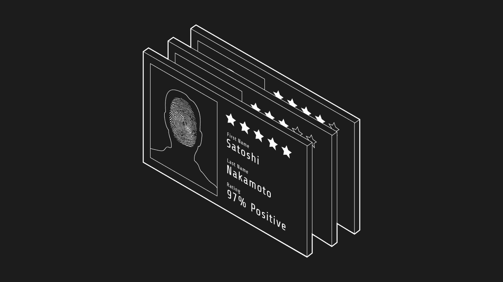

# 信用的未来:区块链和基于信誉的分数

> 原文：<https://medium.com/coinmonks/the-future-of-credit-blockchain-and-reputation-based-scores-bc2aa98c7d8b?source=collection_archive---------0----------------------->

## **发布**

贫富差距是真实存在的，而且还在不断扩大。一般来说，那些无法获得银行和金融服务的人一直在挣扎。例如，获得贷款的能力可以提供住房、商业前景和教育等机会，而在当前的世界结构下，没有这些机会是很难获得的。