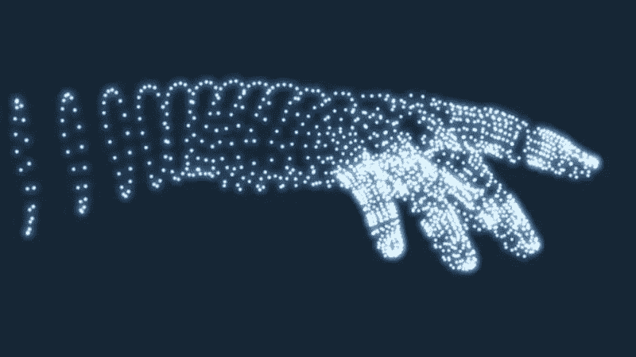

# EOS 代币的未来？

> 原文：<https://medium.com/coinmonks/the-future-of-eos-tokens-c98bdbadbc36?source=collection_archive---------3----------------------->

Boldly going where no token has gone before

代币很重要。根据 [EIDOO](https://eidoo.io/erc20-tokens-list/) 的数据，他们跟踪了近 500 个交易代币，根据 [eosflare](https://eosflare.io/) 的数据，EOS Mainnet 上有 1582 个已部署的代币合约。

在 EOS 世界中，代币的成本为 RAM。“标准”令牌合约的每个唯一令牌余额需要 240 字节的 RAM。如果单个合同部署多个令牌，会节省一些 RAM 成本，但目前这种情况非常少见。

在撰写本文时，这 240 字节的 RAM 成本为 0.18 美元，这是一笔很小的费用……然而，对于希望与近 300，000 个 EOS 帐户共享其令牌的潜在空投者来说，这一成本变为 54，000 美元。

## 代价值得吗？

IQ 和 HORUS 的一些分析显示，在大约 160，000 个账户中，有 16，000 个和 7，000 个交易。不是唯一用户，而是事务，其中许多是索引。

这表明用户参与度非常低，但是这些 DAPPS 仍然处于早期开发阶段。

空投的目的是增加对项目的即时了解，并增加潜在用户群的参与度。空投通常也是为你的项目提供资金的一种方式，高参与度的用户意味着高交易量，使代币对交易所更具吸引力。

但是，有没有更好的办法呢？

## 空中抢劫！

I love airgrabbing Tokens

到目前为止，EOS 生态系统中的许多人已经开始熟悉 Airgrab 的概念(由 EOS Cafe 的 Syed 和 [bloks.io](https://bloks.io) 创造)。这种“选择加入”方法允许参与者自己支付 RAM 成本，以换取未来的空投。这大大降低了空投者的成本，并保证了社区的早期参与。

来自 [eosflare 令牌](https://eosflare.io/tokens)的详细信息表明，使用 airgrab 流程的 EOS 令牌有 7000 到 10，000 个帐户选择接收令牌。这可以推断为表明 airgrab 模型可能比直接空投的令牌看到更高的用户参与度*。*

*Airgrab 模式的缺点是营销要求高得多…用户不会意识到他们余额中的代币，除非他们碰巧看到正确的促销材料，否则可能会错过。*

## *为什么不两者都要？*

*作为 AirdropsDAC(一家即将成立的 EOS 令牌孵化器和服务提供商)的 CTO，我的新职责之一是提供令人兴奋的新方法，使令牌变得可负担、可获得、可销售且极具吸引力。*

*为此，我创建了 **claimable.token —** 一种新的令牌类型，可以为空投器快速恢复 RAM，并提供了一种全新的机制:**天勾***

## *这个 claimable.token 是如何工作的？*

1.  *令牌像平常一样被空投。*
2.  *当一个帐户转移任何数量的令牌时，RAM 成本立即转移到该帐户，从空投者释放 RAM。*
3.  *不希望进行转账的账户可以使用索赔操作来承担 RAM 成本。*
4.  *现在的问题是:空投者可以在预先宣布的一段时间后对任何无人认领的令牌执行**天勾**。从本质上来说，这是一种“逆向下降”,旨在可预测地从非参与用户那里收回 RAM 成本。*
5.  *这些回收的令牌可以被烧掉、重新分发或重新丢弃。天空才是极限！*

## *为什么这么做？*

***claimable.token** 上的这个 **SKYHOOK** 方法开启了许多令人兴奋的可能性和成本节约。您可以创建:*

*   *通过空投获得即时的品牌知名度，*
*   *通过索赔方法和宣布 SKYHOOK 截止日期的即时用户参与，*
*   *部署令牌的可预测成本模型，*
*   *确保只有参与的用户才能访问您的令牌，*
*   *根据您的目的灵活地重新部署或重新分配令牌！*

## *哇，还有什么？*

*在 AirdropsDAC，我们预见这种模式将创造令人兴奋的新可能性。SKYHOOK 创建的可预测定价模型打开了许多大门:*

*   ***PULSEDROPS** :空投一个月的代币，SKYHOOK 任何没有认领的，再次空投，重复！保管你的代币的 FOMO，以及看到代币掉落并从社区中被取回的意识将变得不可抗拒。*
*   ***EVENTDROPS** :通过在活动前投放代币来提高品牌知名度和展示 EOSIO 平台的实力，并使用这些代币和一个简单的二维码移动平台来购买饮料票、礼品、keynote access、VIP access 等。活动结束后使用 SKYHOOK 代币获得可预测的营销和促销成本。*
*   ***SEC safe drops**:Airdrop to the world，SKYHOOK 来自那些无法满足特定国家或目的所需的适当 SEC(或其他)KYC/反洗钱义务的公司。*
*   *你还能想象什么？*

# *AirdropsDAC 会有帮助的！*

**

*…This looks cool and futuristic…*

*这些新合同将是开源的，虽然成本可预测性和回收非常好，但仍然有非常高的前期成本，不是每个人都可以获得。*

*AirdropsDAC 目前正处于成型阶段——当我们的大门打开时，我们将很高兴提供具有成本效益的产品，以比推出自己的产品低得多的固定成本帮助您实现您的想法。我们将以低廉的价格租赁内存、CPU 和网络，并提供法律、工程和营销服务来满足您的需求。*

## *你怎么想呢?*

*我们渴望听到 EOS 社区、整个区块链社区以及整个世界对 SKYHOOK 概念的看法！*

*请留下您对代币世界这一潜在革命性变化的看法。*