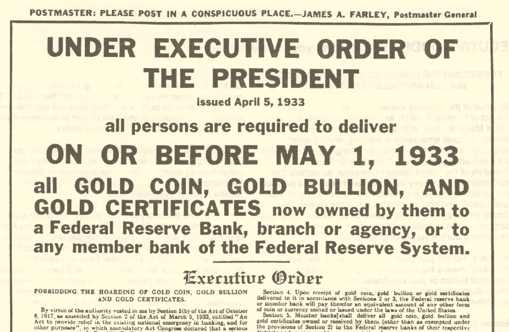
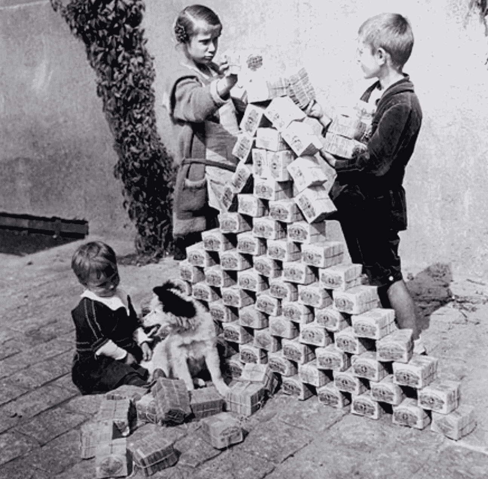
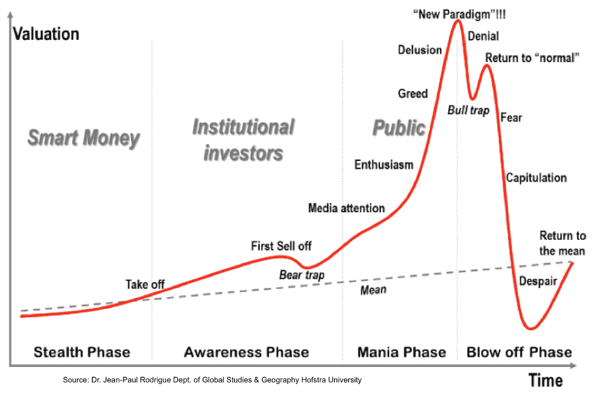
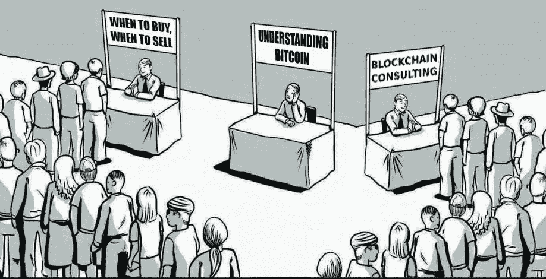
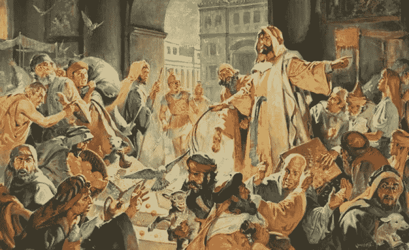

# 从意识形态的角度来看，比特币和闪电网络⚡的未来以及它们成功的原因是一个自我实现的预言

> 原文：<https://medium.com/coinmonks/the-future-of-itcoin-the-lightning-network-and-why-their-success-is-a-self-fulfilling-prophecy-62edb91a911f?source=collection_archive---------4----------------------->

本文是关于比特币和闪电网络的迷你系列的第三部分，也是最后一部分。在第一篇文章中，我简短地看了一下闪电网络，以及为什么它会对 Bitcoi n 和参与加密货币产生催化作用，以放弃闪电并开始使用。另一篇文章致力于闪电网络的[效应，我预计在未来十年左右，基于工作证明的 mining](/coinmonks/bitcoins-future-paradigm-shift-ahead-mining-bitcoin-is-doomed-and-today-a-non-starter-for-31d801e6e90)g 的重要性将会降低，并且规模会持续缩小。我鼓励你阅读闪电网络，并把它理解为比特币的延伸，它纠正了过去几年中出现的所有缺陷。在这篇文章中，我想让你从意识形态的角度得出为什么比特币和闪电网络结合不会失败的结论。请注意，我使用的术语“比特币”相当于“作为比特币顶层的闪电网络”。

在简短地展望未来之前，我需要请你们保持一些耐心，并认识到过去的一些事实和事件。我不会直接从过去的事件中得出结论，但让你决定，它们可能会以何种方式影响比特币的未来。

简单回顾一下历史，你就能明白下面我对比特币未来的想法。

# 要考虑的事件——自我判断

甚至在 100 年前，大多数人的财富都是由黄金支撑的。在这个星球上，黄金的数量过去(现在也是)[是有限的，它是一种世界公认的商品，由于这些事实，它是储存财富和防止通货膨胀的理想选择。中世纪的骑士盔甲、华丽的长袍或今天剪裁考究的高级西装的价格大致相同。](https://www.bbc.com/news/magazine-21969100)

另一方面，法定货币是由国家发行的，过去只有黄金支持。这些时代早已过去。全球黄金储备只能覆盖全球经济的一小部分。黄金通常被严重低估，黄金价格被完全操纵。从这个角度来看，美国钞票上的“我们相信上帝”这句话有很多道理。

由此可以得出结论，法定货币的价值只是发行机构领导下的全体使用者普遍接受的协议。最终用户实际上对货币的估价没有任何影响，而发行机构可以通过控制货币供应来双向影响货币的价值。更多信息请见下文。

无论如何，黄金仍然是储存财富的首选，1933 年所有黄金和金圆券的没收清楚地表明，即使是政府也不相信它们印在纸上的价值。发行纸币从来没有阻止世界各国政府在急需和高需求的时候从人们手中夺走黄金。据说，今天法定货币的价值是由人民的劳动支撑的。财富和工作是否平等？如果连黄金都不是一个选项，你怎么能储存你努力获得的财富并保护它不被夺走呢？

从过去，你可以学到，即使你不相信现金的可持续价值，你用黄金储存你的财富，它也不会受到政府的保护。

你觉得这个例子太牵强了吗？请记住 2007/2008 年[金融危机引发的](https://en.wikipedia.org/wiki/Financial_crisis_of_2007%E2%80%932008)[大衰退](https://en.wikipedia.org/wiki/Great_Recession)。对这两个事件的详细描述远远超出了本文的范围。此外，对规模和持续时间的影响和看法是科学界和经济界正在进行的讨论的主题。

但是对于那些不想阅读大量书籍和科学论文的人，我推荐社会批判、大众化和娱乐化的方法。换句话说，看这些电影:

[**大空头**](https://amzn.to/2JMy5hY)[**资本主义——爱情故事**](https://amzn.to/2Lq901h)[**大崩盘——保证金叫**](https://amzn.to/2uXjevx)

那么，谁从金融危机中吸取了教训？政府呢？接受救助的银行？中央银行和美联储银行？政客？银行家？对冲基金经理？普通人？这是一个严肃的问题。如果你的孩子烧伤了手指，他们会学到一些东西，并且不会重复。但是如果他们不得不再次处理棘手的问题，他们会比以前更加小心，或者？世界各地的中央银行都在以同样的方式行动吗？政府是在试图控制通货膨胀，还是在印更多的钞票？系统一点都没变！

德意志银行看似以所有不良贷款和衍生品的形式留给了老处女，但事实上，它是无懈可击的，因为它已经获得了让整个系统崩溃的力量。这是他们仍然被允许和其他孩子在同一个沙箱里玩耍的唯一原因。

Kids playing with worthless money after hyperinflation.

法定货币不能抵御通货膨胀。它是控制财富的工具。如果政府想要更高的通货膨胀率，他们就会发行更多的纸币(或者发行更多的纸币，或者以更低的利率发放贷款)，如果政府想要抑制通货膨胀率，则相反。但趋势很明显:通过钱的数量，你可以控制价值。而价值不是由人控制的，而是由一个小团体运作的系统。作为一个用户，你无法决定一美元的价值，它是由你的价值决定的。我只看到两种选择:他们在过去节省了财富，并通过复利效应以令人发指的方式致富，或者他们是敢于声称自己是财富发行实体的人。事实上，这一声明使他们有权收取没有任何等值的利息。

但真正的问题是利息的积累。你看，如果你工作，你会得到一份薪水。你用来谋生的薪水。所以你唯一的收入来源就是你的工作。如果你已经拥有合理的财富，并且有足够的钱借出去，你得到的利息。一般来说，利息的价值与贷款人的风险挂钩，或被视为提供资本的报酬(以增加流动性的形式)。这很少质疑任何人，但仍然不是重点。通过贷款获得利息，货币量实际上增加了，从而为通货膨胀提供了资金。但这仍然掩盖了利益体系的最大问题。敢于问这样一个问题:这些机构第一次是如何获得资金并能够借出的？是什么让他们能够积累资产，这样你就可以在没有劳动力的情况下增加收入？

我只看到两种选择:他们在过去节省了财富，并通过复利效应以令人发指的方式致富，和/或他们是敢于声称自己是财富发行实体的人。事实上，该声明使他们有权收取利息，而没有任何等值。

总之，价值从黄金转移到了纸币。纸币是缓冲和控制财富的工具。与黄金相反，货币的数量可能是无限的，并且受制于通货膨胀的规律。**抗通胀的黄金和易通胀的纸币之间的估值差，被货币发行机构(政府)以利息的形式作为附加值减去。利息(而不是税收！)服侍到奶人**。

如果这个系统被相关的统治阶级逼得走投无路，会发生什么？没什么！参与者小心翼翼地重新建立完全相同的结构，然后像往常一样开始工作。银行得到了纾困，经济得到了拯救，但在通胀难以控制的情况下，人们却以更少的工资、更多的工作来支付账单。

很容易将这些条件从微观经济转化为宏观经济，并最终转化为全球关系。

# 郁金香与现代艺术市场

这时候比特币进入了游戏。它满足了现代银行系统的所有要求。它可以储存财富，价值可以从一个转移到另一个。但是与黄金相反，它提供了更多的选择。你可以在几乎没有时间和可接受的附带成本的情况下将价值转移到国外。你不需要有人帮你保存在保险库里。没有单一的发行实体。而最好的是:你是自己用工作创造的价值的主人。将你的收入从法定货币兑换成比特币等数字货币后，其价值比任何纸币都更能抵御通胀。

当然，比特币和其他加密货币正在经历一段遭受高波动性的时期，这使得它们作为全球货币毫无用处。汇率忽上忽下，持有比特币的人感觉自己已经坐上了好几年的过山车。这一旅程比以前所有的经济过山车都要快。错误已经发生，事情的发展与预期完全不同，但另一方面，比特币发明不到十年就取得了巨大的发展。我坚信，大规模采用的时刻很快就会到来，在经过一个从纸币到数字货币转换的(高)阶段后，波动性将会平静下来。闪电网络将在这一发展中发挥决定性作用。那么比特币将成为支付处理器和数字货币。

与此同时，当权派称之为欺诈、庞氏骗局和副业泡沫。一些派别看到了可扩展性问题，以与 Visa、西联、Paypal、银联、支付宝或 Google Pay 等支付处理器竞争。但这些只是支付处理器。支付处理是比特币的副产品，闪电网络能够以低成本或零成本进行近乎无限的扩展。比特币真正的竞争对手是黄金和货币。虽然黄金是一种储存价值的商品，但货币是国家发行的价值的代表。

比特币在过去几年被认为是一个空洞的投资泡沫，并与 17 世纪的郁金香泡沫或 20 世纪 80 年代投资现代艺术的价格泡沫相提并论。我一点也不喜欢这两种比较，因为比特币有一个“真正的用例”，即价值远远高于你家的流行装饰，它可以在短期内大量增长(通货膨胀！)或者现代艺术，情人眼里出西施(主观性)。郁金香受到猪肉周期的影响，当然，暂时的高需求导致了生产的膨胀，并最终变成了投机泡沫，现代艺术可能对艺术史或一个人的个人发展具有假设的科学价值，但它仍然是一种牵强附会和非常主观的价值。

比特币作为数字货币有着明确的用途，它使得价值可以通过数字方式获得、转换和转移，而无需任何第三方。最后一部分至关重要。比特币不能轻易被没收或征用。**它依赖于公开的账本，却逃避了控制。比特币把对财富的控制权交还给了用户，并取消了第三方参与等价工作的选择权。**

我认为唯一正确的比较是，比特币是某种被曲解的网络泡沫。上个千年的结束(除了我还有人用这个词吗？)投资者购买任何一家公司的股票，只要这家公司的名称中有“dot com”字样，他们(投资者)对被称为“互联网”的新技术的选择没有任何概念，或者至少是模糊的认识。与比特币 2017 年的相似之处显而易见。我记得一家冰茶公司更名为“龙区块链”，他们的市值翻了三倍！

# 区块链——炒作才是真正的泡沫，而不是比特币

比特币的底层技术区块链实际上是主要价值的基本假设已经错了！2000 年底的投资者看到了一项技术(互联网),并试图投资于公司，以预测该技术的赢家。凭借极其有限的知识，他们甚至在脸书、Twitter 或亚马逊成立之前就试图识别它们。这种瞄准是错误的，但从投资者的角度来看，至少是有意义的。但是他们从来没有尝试第二次发明互联网与之竞争，或者？

今天，投资者把区块链解释为伟大的发明，但这不是真的。我不想以任何方式贬低中本聪发明的价值！但是，区块链是一个分布式数据库，简单地说，它现在是而且一直是一个数据库。焦点从比特币转移到区块链，仅仅是因为投资者希望获得对一个系统的控制权，这个系统被设计成独立且安全的，不会被控制。如果你不能拥有某些东西，你会怎么做？你复制它。这就是为什么我们有数以千计的区块链服务于数以千计的加密货币的唯一原因，其中只有少数具有独特的用途，或者至少是除了作为加密货币之外的一个额外的独特用例。

**比特币是一种协议。它相当于互联网的 HTTP(或今天的 HTTPS)。它可以免费获得，跳上火车，通过逆向工程重新发明一些东西，获得专利，并最终能够声称技术是你的发明并拥有它，这种想法是完全错误的。从这种对控制权的贪婪中，衍生出了大多数加密货币(只要它们声称充当货币的手段，并与比特币的用例竞争)。可能会有例外。**

**比特币是一种无需第三方参与的处理全球交易的支付协议，而不是一种商品投资，这种商品投资让拥有特殊知识的早期精英成为购买数辆跑车的美元亿万富翁。**

或许比特币在开发者层面完全开源的观念。从意识形态上来说，这是信任一个没有第三方控制的系统的必要条件，也是分散管理公开分类账中所有交易的必要条件。在 Linux 上，比特币提醒非常强烈，它是一个免费的、终极可扩展的、免费可用的和可认证的，并且有足够的专业知识就有可能发现错误、问题或漏洞。

# **“互联网给我们的教训是，中国禁止任何东西，就投资它。”**

[*Fred Wilson*](https://en.wikipedia.org/wiki/Fred_Wilson_(financier)) *on Bitcoin in 2014*

正如你所见，比特币即将改变一些东西。它将货币权力从银行、政府和其他机构转移到个人手中。政府不喜欢，银行也不喜欢！银行已经通过收取保护你的钱安全的费用而获利。在欧洲，你不再得到任何利息，但你必须支付管理费。你从银行里取出现金，然后把它塞进你的枕头套，这样更便宜！事实是，你付钱给银行来管理你的财富，银行控制并参与其中。因此，个人向银行支付评估、保管和转移收入的费用。此外，他们从借钱的人那里得到利息(你的钱！)以及谁的生意做得好。不幸的人会失去一切。

**一些事实:**

*   世界上一半的财富属于最顶层的 1%，
*   顶层 10%的成年人拥有 85%的财富，而底层 90%的人拥有世界总财富的剩余 15%,
*   前 30%的成年人拥有总财富的 97%。

这符合你对财富公平分配的期望吗？财富代表了你的劳动的等价物。

68 年的*一代*想要推翻当权派，开始了一场革命。他们至少在社会学层面上实现了变革。如今，像*占领华尔街*和*我们是 99%的人*这样的运动只是暂时唤起了人们对问题的意识，然后逐渐消失。很快被遗忘，因为他们的成员需要赚钱谋生。为了赚到这些钱，他们需要依靠一个普遍接受的金融体系。他们唯一有经验并且可以选择的金融体系就是我们生活的这个真实的体系。反抗被判失败，并导致社会和经济孤立。

# “每个社会离革命只有三顿饭的距离！”

可以追溯到古罗马社会的各种人物都引用了上面的说法(或其变体)。它们都有一个共同点，那就是它们针对的是那些吃不饱的人，是那些要求改变的人。好吧，只要人们生活在一个向大多数人提供他们可以谋生的想法并因假装他们能够爬上社会阶梯而被捕的系统中，只要电视、互联网、社交媒体和智能手机提供足够的娱乐和消遣来弥补两餐之间的时间，就没有理由开始——更不用说继续——一场革命。

在这一点上不要误解我。我可能听起来像一个，但我不认为自己是一个共产党员。所有的共产主义社会似乎都失败了，并导致腐败，因为人们天生自私自利。建立共产主义的努力最终都是从一个统治阶级到下一个统治阶级的交换，而没有消除潜在的结构。也许在开始的时候，意图改变了人们的想法，但是已建立的外部和内部结构保持不变——最终赶上了人们的现实。我只是意识到，如果共产主义意味着建立一个公平的货币体系，在这个体系中，每个参与者都受到公平对待，并且能够控制自己的全部财富，那么也许我终究是一个共产主义者。

只有一个方法可以打破这个恶性循环:你必须从内部改变这个系统。嗯，成为财政部长、全球领先银行或投资企业的票据持有人或首席执行官、全球最大的对冲基金、全球领导者，或者获得足够的权力自上而下地改变事情，都是相当困难的。

因此，你需要创造一个不显眼的替代方案，成为一个被广泛接受的支付和价值体系，以削弱金融机构的权力。如果它是由用户为用户创造的，并受到保护不被接管，它就有可能改变世界的底部和顶部。不是来自内部并受到腐败的诱惑，也不是来自上层的命令，而是从底层重新开始——钱从零开始积累，由用户通过他们的估价和接受来管理。锲而不舍，默默无闻，将有助于这样一个系统取得世界性的突破。你知道一个吗？

# 比特币的方法不同——一个从零开始建立的货币系统！

你记得利益是个问题吗？关于利息的用途和意义的理论和对收取利息的批评一样多种多样。两者都可以追溯到古代，在不同的思想和宗教体系中被认为是相似的。几乎所有人都有一个共同点，他们认为提高兴趣是不好的，并将其限制在外部群体和/或高度。根据目前的利率批评者，收取利息正在不断扩大贫富差距。此外，经济和债务危机定期和周期性地出现，在最坏的情况下，最终导致武装冲突——无论是在当地还是在全球。

利率导致增长需求、公共债务的指数增长和隐性利率，这是所有产品固有的，因此导致最终消费者的价格普遍上涨。简而言之:利息通过许多穷人的劳动资助了少数富人的生活。当前的利率体系经常被比作庞氏骗局。具有讽刺意味的是，这是许多银行家用来描述比特币的一种表达方式。

Jesus disperses the money lenders from the temple.

当然，在任何类型的货币系统上，你都可以安装一个层，其中包括收取利息，但从其原理和编码来看，比特币不知道利息，目前正在进行一个全球转换过程，以将法定货币的价值返还给那些最初因劳动而创造的人。这一原则是通过铸造新硬币并奖励交易验证工作来实现的。即使新的比特币在开始时只在一个受限制的群体中流通，这个群体也没有理由长期囤积比特币。它没有带来任何兴趣！此外，没有必要控制比特币的通货膨胀，因为根本没有通货膨胀。所谓的鲸鱼可以通过增加或减少自由市场的交易量来影响汇率。即使比特币被大量持有以推高汇率，人们也不会为闲置资本获得利息和复利。

流动性和投资因此得到促进——即使目前情况并非如此。(关键词:HODL。霍德林基于投机动机，这是对机构投机者市场力量的暂时制衡。囤积不符合长期利益，还会损害比特币的整体价值。如果闪电网络关心比特币的大规模采用，它将被削减。)请记住，比特币正处于从平面到数字的转换阶段。

作为一种货币，你可以将法定货币兑换成比特币。在基础上，比特币成为一个在其用户控制下的全球银行系统(主要功能)，此外，它还是一个价值存储和转移系统——不受第三方利益影响，由费用驱动。

# 全球监管者会做什么？

[G20 财长和央行行长峰会刚刚结束。讨论的主要议题是全球贸易限制和即将爆发的贸易战，但也包括加密货币和 ico 的监管。](https://uk.reuters.com/article/us-g20-argentina-bitcoin/g20-agrees-to-monitor-cryptocurrencies-but-no-action-yet-idUKKBN1GW2R9)

> *“我们呼吁国际标准制定机构(SSB)根据其授权，继续监控加密资产及其风险，并根据需要评估多边反应，”G20 领导人在公报中表示。*

这意味着他们只是观察，但实际上，并不采取行动。这在未来也不容易，因为很难就一个共同的方法达成一致。

如果比特币曾经大到不能倒，你只能试图通过控制交易平台和市场来控制和监管从平面到数字的转换过程。全世界已经在为实现这一目标做出广泛努力。但是去中心化的平台正在路上，第一批全球银行已经建立，它们以一种加密友好的方式帮助将菲亚特转换成比特币。

当权派应该做什么？他们无法真正监管比特币。他们不能有效地禁止它。他们不能完全阻止或禁止它。那就像公然剥夺人民一样。有一点是肯定的:比特币的未来在很大程度上取决于它的大规模采用。而比特币为此做好了充分的准备——其他加密货币，尤其是不受闪电网络支持的加密货币，则不然。它们在平面到数字的转换过程中只起暂时的作用。

如果人们开始越来越多地放弃政府发行的法定货币，转而使用数字和自由货币，那么即使是当权派最有效的武器也会最终失败:他们的无知。