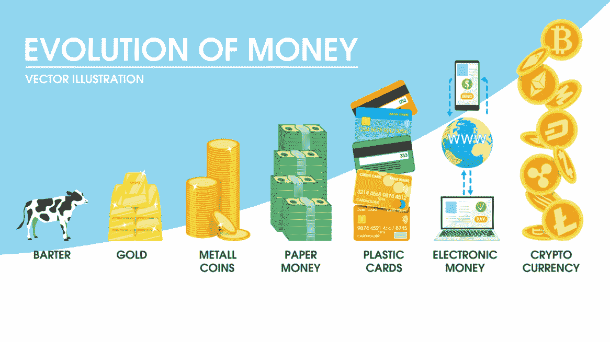
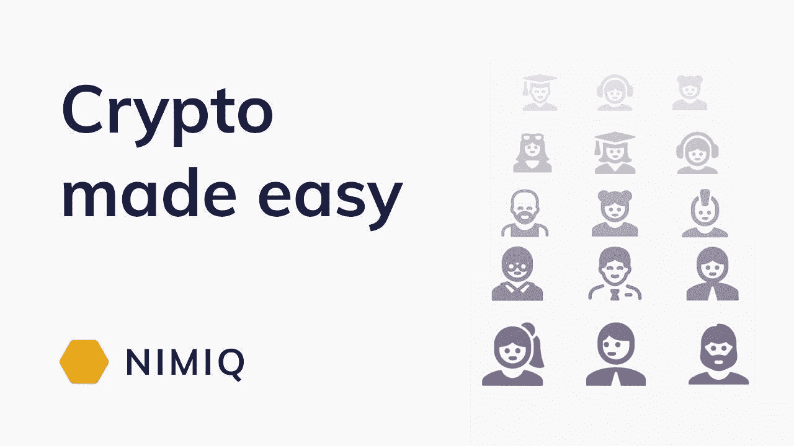
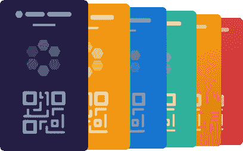
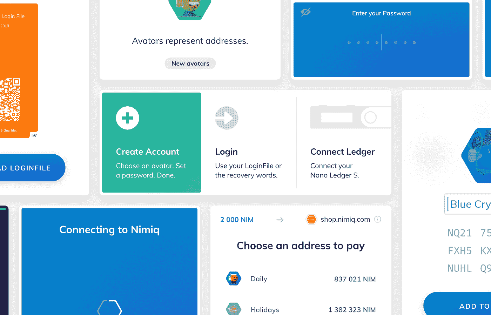
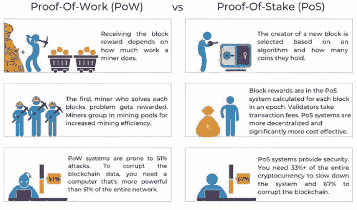
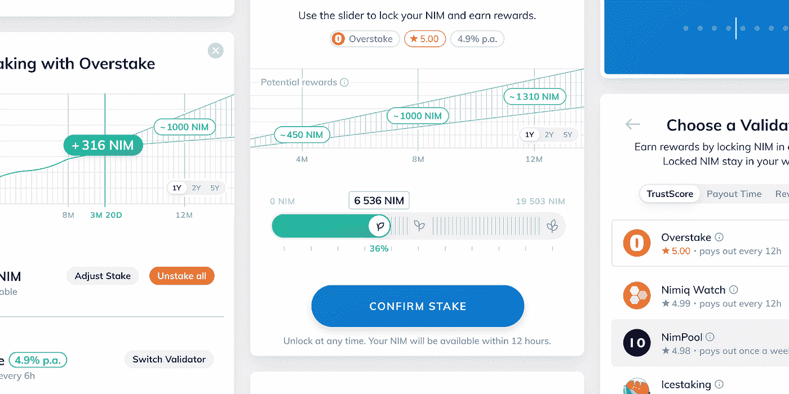
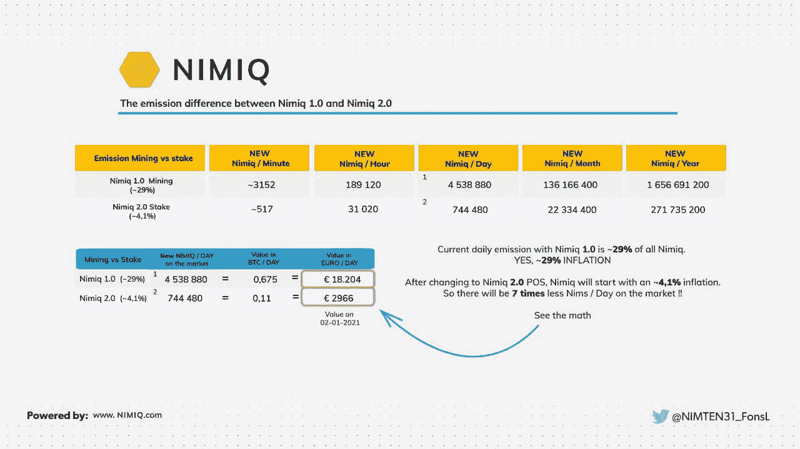
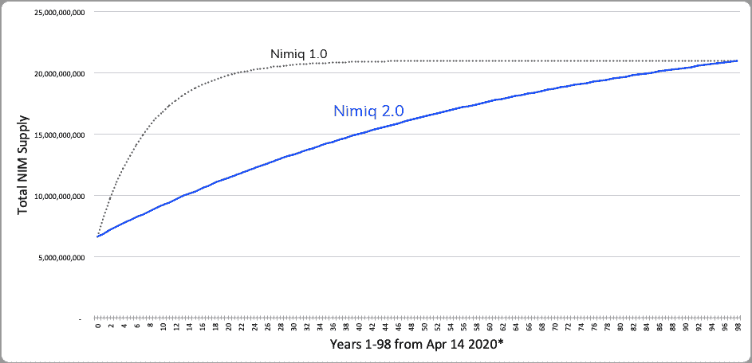

# 支付方式的未来

> 原文：<https://medium.com/coinmonks/the-future-of-payment-methods-8005e6ed266e?source=collection_archive---------2----------------------->

covid 已经存在一年多了，我们可能都听说过。信用卡和借记卡支付增加了，使用纸币的人减少了。不仅仅是因为病毒和卫生重要性的增加，还因为这种改变早就应该发生了。

分析支付方式的历史，你会发现新的货币和习惯并不是一夜之间出现的，而是慢慢成为主导方式的。然而，这还远远不够。实际的替换总是需要需求的突然变化。

在古代，人们一直渴望建造家园，因此人类开始用食物交换其他材料。后来，在中世纪，男人们觉得有必要打仗，所以他们开始用金币购买战争物资。如今是疫情迫使我们去适应。

[Physical Money still builds the foundation today](https://www.publish0x.com/cryptosorted/the-origin-history-and-evolution-of-money-the-transition-to-xyjkkg)

仔细观察这张图表，很明显，直到现在实物货币仍然是我们当前支付系统的基础。诚然，疫情已经帮助改变了一点点，但我们仍然没有看到几百年来的重大转变。

现在的问题是，为什么网上银行不能彻底改变我们的支付结构？答案是很复杂。这就是加密货币应该发挥作用的地方。然而，这些又太复杂了，因为谁想运行重型机械只是为了用一些比特币买一杯咖啡？这就是为什么我要把你介绍给 NIMIQ。

[Nimiqs “simple and secure” approach](https://twitter.com/nimiq/status/1378771581489586181?ref_src=twsrc%5Etfw%7Ctwcamp%5Etweetembed%7Ctwterm%5E1378771581489586181%7Ctwgr%5E%7Ctwcon%5Es1_&ref_url=https%3A%2F%2Fpublish.twitter.com%2F%3Fquery%3Dhttps3A2F2Ftwitter.com2Fnimiq2Fstatus2F1378771581489586181widget%3DTweet)

Nimiq 将自己描述为一种简单、安全且能抵御审查的加密货币，事实证明这是名副其实的。与其他密码不同，Nimiq 在你的浏览器中完全起作用，并且注重简单性。

## 简单但安全

像其他加密货币一样，NIM 也依赖于一个私钥和一个公钥。

然而，私钥不是一个 64 位的字母数字短语，而是一个简单的“登录文件”。这是一个 png 文件，创建钱包时必须下载。作为一个额外的安全网，你必须设置一个密码，作为第二个安全层。

[Login files](https://www.nimiq.com/security/)

另一方面，公钥是您的地址，其格式与 IBAN 相同。

比如:NQ57 KNAL 9pg 2 ATVG EBDD 6 SMG HUHD M959 SG1B

为了更好的日常可用性，这些地址中的每一个都用一个独特的“标识”来表示。

[Nimiq Identicons](https://www.nimiq.com/whitepaper/)

要备份钱包，您可以复制 24 个“恢复单词”。这是 24 个完全随机的单词，万一你丢失了你的登录文件，你可以使用它们。为了安全起见，最好把它们放在一个安全的地方。

Nimiqs 的另一个主要特点是设计的整体方法。我们的目标是创建一个无缝的、简单的、但是信息性的设计。这就是为什么 Nimiq 选择在整个生态系统中使用相同的颜色和方案。流畅简单的动画能够承载大量的原始数据。

[Overview of the Nimiq Interface](https://www.nimiq.com/whitepaper/)

## 购买 Nimiq 只需三个简单的步骤，感谢绿洲

*   创建钱包
*   设定您想要购买的数量
*   完成 SEPA 即时交易

【OASIS 具体是怎么工作的？

每个拥有 Nimiq 钱包的人都可以轻松使用“购买”按钮打开 OASIS 界面。你首先要设置你是客户的国家和银行。现在你可以选择你的订单金额，或者用你的货币，或者用印度货币。截至目前，每月最高限额为 1000 美元和 500 美元。进入下一步，将显示 EN31 银行(Nimiq 的合作伙伴)的银行详细信息。然后，您有 90 分钟时间完成 SEPA-instant 交易。一旦发送，您只需确认，NIM 将被发送到您的钱包。购买密码的简单方法——无需任何 KYC，但由于 SEPA 支付的安全性，它仍然是安全的。

Walktrough trough OASIS

**展望**

目前 OASIS 正在进行公开测试，不过完整版很快就会发布。这将带来许多新的功能，如销售或购买更高的金额。然而，后一种情况需要与 EN31 银行进行 KYC 流程。此外，Nimiq 正在寻求扩展到欧洲以外，以支持 SEPA-instant 之外的其他支付方式。

目前，有一种替代方式，你可以通过信用卡(moonpay)支付，当然还有标准的交易所。

## Nimiq 正从电源走向 PoS

随着 Nimiq2.0 的更新(预计今年晚些时候)，Nimiq 将转向“信天翁”算法。这基本上意味着 Nimiq 正在转向 PoS (=利益证明)网络。简单的说:奖励将会分配给锁定资产而不是采矿。拥有 NIM 的每个人都将能够加入网络。

Difference between PoW and PoS

更重要的是，要破坏这个网络，你需要拥有至少 50%以上的流通供应量。由于这实际上是不可能的，PoS 网络将更加安全。

赌注将有可能直接从钱包和重点在于简单。您将从钱包中显示的排名中选择一个“赌注池”(基本上是一个提供商)。下一步将确定 NIM 的数量，并预测大致的回报。然而，实际回报将取决于 3 个主要因素:

*   总赌注时间
*   网络中赌注 NIM 的百分比→总赌注 NIM 越低，个人奖励越高
*   重新获得回报——如果你选择重新获得回报，这将产生复利，从而使你的收益最大化

[Staking interface](https://www.nimiq.com/blog/nimiq-20-status-and-outlook/)

随着 Nimiq2.0 的更新，供应曲线也将发生变化。新 NIM 的排放量将减少 7 倍，从而降低通货膨胀率。这不仅有助于定价，而且更新的供应曲线确保了未来几年更稳定的分配。

[Reduction of the Emission](https://forum.blocktrainer.de/t/nimiq-die-erste-browser-basierende-blockchain/8884)

[Updated supply curve](https://www.nimiq.com/blog/supply-curve-for-nimiq-20-finalized/)

## 结论

凭借其“简单而安全”的方法，Nimiq 拥有巨大的潜力。由于 OASIS 的直接性，实际上每个人都可以买卖密码。凭借现代和视觉上吸引人的设计，Nimiq 不仅吸引了年轻一代，而且是极少数可以被技术上更具挑战性的人使用的加密货币之一。此外，与德国 EN31 银行的合作是非常有利的，因为 EN31 银行是一个非常有前途的加密生态系统的领导者。一场革命迫在眉睫，Nimiq 给自己的定位很理想。