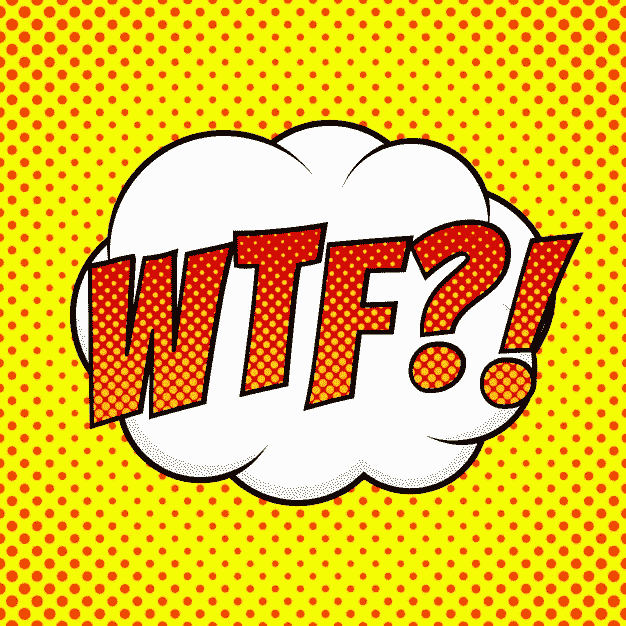

# 18 万亿美元的负收益率债务有什么意义

> 原文：<https://medium.com/coinmonks/the-game-theory-18t-in-negative-yielding-debt-2d8f6d29063b?source=collection_archive---------4----------------------->

## 用简单的英语解释简单的例子

据彭博称，到 2020 年底，我们有 18 万亿美元的负收益债务。关于债券在不健康的环境中如何表现的奇怪的博弈理论趋向于(如果不是低于)零界限:0%。因此，在零界限上下讲故事是最简单的例子。负收益率债券没有任何正常之处，但它仍是可以解释的。首先让我们了解债券是如何运作的。

## 债券如何运作

如果你购买了 1000 美元的收益率为 1%的债券，而美联储将利率降至 0%，那么你的 1%债券比新的 0%债券更有价值。收 10 美元显然比收 0 美元好。但要理解负利率的意义，你需要接受债券的另一个特征:它们是可交易的资产，就像股票一样。你可以通过比较债券的收益率和当前收益率来确定债券的价值。在上面的例子中，如果你购买了 1000 美元的债券，那么利率下降到 0%，你仍然得到 1%。这意味着你的债券面值在公开市场上更值钱了。在这个例子中，假设你现在可以以 1010 美元的价格卖出 1%的债券。如果你决定卖掉它，这额外的+10 美元就是你的溢价。如果相反的情况发生，利率上升到 2%，那么你的债券就贬值了，比如说 990 美元。这个赤字-10 美元是一个折扣。注意，为了简单起见，这些数字是方向性的，而不是字面上的。

奇怪的是。如果利率为负，这意味着当债券期限结束时，债券的回报将少于你最初投入的资金。但是，如果你购买收益率为-0.25%的债券，当它跌至-1.00%时，你的债券价值仍会上升。你的直觉是正确的:“这感觉不对”。你的逻辑大脑也是正确的:“这有点奇怪扭曲的方式有意义”。只要(1)利率继续下降,( 2)债券持有人能够找到买家，债券的面值就会上升。

> 当涉及到负债券时，忽略明显的(票面利率)，专注于公开市场(面值)动态。

现在我们可以缩小画面，看看更大的债券画面。如果债券市场上有 1000 亿美元，其中 200 亿美元的收益率在<1%, what happens if raise the rates to 1.25%? Answer: you blow up existing bondholder positions by making their investments worth less. In a healthy bond market (> 5%之间，新的买家将会进来，买入收益率更高的债券，因为这些债券在更健康的利率下仍然具有吸引力。但在我们生活的时代，大多数人都处于过度杠杆化状态，说服投资者购买债券变得越来越难。从最坏的意义上说，如果政府提高债券收益率，这是一种不对称的风险。

以下是加息对债券市场的影响

1.  *小奖励*。从 1%提高到 1.25%并不是一个很大的激励，尤其是因为它仍然没有超过通货膨胀率。这是一个微小的进步。
2.  *贸易的反面*。所有 1.25%的债券持有人现在都很痛苦，因为他们的债券正在折价出售。
3.  潜在买家因担心利率再次上涨而变得紧张。如果你继续购买 1.25%的债券，你有什么信心他们明天不会将利率提高到 2%？
4.  吓跑你的顾客。政府需要其他人购买他们的债券，否则他们将需要“吃自己的产品”，政府的资产负债表将令人不安地迅速扩大。

换句话说，在一个过度杠杆化、不健康的经济中，当你接近 0%的门槛时加息是一座需要跨越的危险桥梁。尽管负利率毫无意义，但这是短期生存的两个选择中更好的一个。只要债券流通，新的资金就可以注入经济。

降低利率的陷阱正在演变成一种经济状态，理性衰退，不可预测的奇怪行为肯定会随之而来——恐慌。关键是，如果没人买我们的债券…我们就惨了。许多国家不想进入负领域，但他们有什么选择呢？只有美元可以印刷，没有严重后果。所以我们这样做是因为我们可以。这是滥用权力和特权。

## 债券为何重要

债券是每个经济体的基石。当政府需要筹集新的资本时，它们会发行债券。这些债券被购买，兑换的美元开始慢慢流入系统。值得注意的是，这些资金最终流向了下游企业、购买房屋和股票(以及其间的所有经济交易)。因为债券是我们经济体系的基础，每一个在较高水平购买的“性感”资产最终都会受到基础较低水平债券的影响。换句话说，当债券市场感冒时，经济就患上了肺炎。不管媒体怎么说，我们正处于一个脆弱的状态，我们最不需要的就是债券市场的恐慌。

这就是为什么美联储宣布利率将在 2022 年保持不变。他们在向市场发出信号:“不要担心，我们不会把你岌岌可危的头寸炸掉。”由于美元是全球储备货币，我们有权利无限量地印刷钞票。这意味着，如果需要实施收益率曲线控制，美联储有权通过购买自己的债券来操纵债券市场。

债券市场的收益率不是由美联储决定的，而是基于供求关系。美联储可以通过购买(需求方)债券来人为保持低利率，从而控制债券收益率。印刷大量的钞票对其他国家来说并不简单，因为他们最终会被他们印刷的钞票所套牢，因为它不像美元那样普遍受欢迎。

**以下是提高利率对普通大众的影响:**

1.  随着利率上升，借贷将会收紧。更难获得的钱意味着支出减少。随着货币流通不那么自由，这可能会导致通货紧缩螺旋上升。
2.  *僵尸组织和个人:*边缘经营面临资不抵债风险。根据定义，僵尸公司的利息支出超过了收入。加息加速了这种不可挽回的债务下降趋势。
3.  宏观层面的通货紧缩螺旋就像多米诺骨牌一样，伴随着一连串的失败。可怕的是，全球经济如此紧密地交织在一起，以至于看不到清晰的尽头。为了防止自由落体，极端干预是必要的。这解释了为什么政府在 2020 年的大规模刺激计划中表现过度，也解释了为什么它会持续到 2021 年。经济自由落体与纯粹的混乱难以区分。
4.  *更深层次的财富不平等:*银行只会放心地贷款给信用高、违约风险低的人——1%的人。已经拥有绝大部分资产的超级富豪，享受着上文第二点提到的僵尸资产的尸体带来的独家购物狂欢。

前两个会带来系统性风险。最后两个带来了革命性的风险，因为可以说，资本主义只有在这个游戏值得玩的时候才会发挥作用。当你玩大富翁时，一个玩家拥有 90%的棋盘，游戏的其余部分只是理论上的。大部分玩家会喊犯规，要求游戏重置(又名革命)。这就是为什么世界各国政府都在吹捧他们的最新口号:伟大的重置。

> 如果游戏不能玩，人们会反抗。

## 继续降低利率

在我们的经济环境中，提高债券收益率的行为类似于戴着防护帽穿过雷区。结局并不好。不那么疯狂的方法是继续降低利率。

以下是降低利率对债券市场的影响

1.  *不要吓到顾客*。政府需要继续假装有人，也许是政府本身，会以更高的票面价值购买这些分崩离析的债券。面值必须抵消错过的票面利率，同时还要考虑通货膨胀风险。换句话说，政府在玩一场信心游戏，故意出售劣质产品。
2.  自杀挤压:大量购买负利率或零利率债券。政府要求买家将他们的信任和信心扩展到合理的限度之外。冒着成为没什么好处的傻瓜的风险。俗话说:“如果你相信，我有一座桥卖给你”。
3.  *积习难改*。自 2008 年以来，“债券专家”的整个职业生涯都是围绕这种单向交易展开的:购买债券，等待利率下降，然后溢价卖出。冲洗并重复。这之所以成为可能，是因为债券自 2008 年以来一直在下跌。习惯生物会在零边界识别游戏变形吗？

**以下是降低利率对主街的影响:**

1.  保持资金流动。当金钱停止时，麻烦就开始了。世界各国政府正在进入未知领域，对债券利率做出不可思议的事情，因为这意味着资金继续在大街上流动。
2.  *通货膨胀*。资金将继续流动，但随着通胀将超过实际生产，事情将变得越来越困难。政府否认这一事实，至少他们希望公民相信通货膨胀已经得到控制。
3.  我们会付给你钱。这是负利率最奇怪的副产品之一。如果你得到负利率贷款，你偿还的比你原来借的要少。这打击了每一家银行，因为它使它们的核心业务无利可图。奇怪吧？

## 盯紧国王

理解负利率和零利率收益率是不可持续的，只需要常识。政府不得不在糟糕的选项中做出选择。即将出现的一个阶段转变将迫使领导人展示他们的真实本性。政府可以被人格化为介于明智的国王和疯狂的国王之间的光谱。你的个人责任是确定你的政府目前的状态，目的是回答一个问题:*我有一个什么类型的政府？明智的统治者意识到更多的相同行为是不够的，他会通过进化寻求改变，甚至可能需要转变。疯狂的统治者会采取行动限制你的自由，加倍现有的计划，不知道现实是时代已经改变，旧的计划不再为人民服务。*