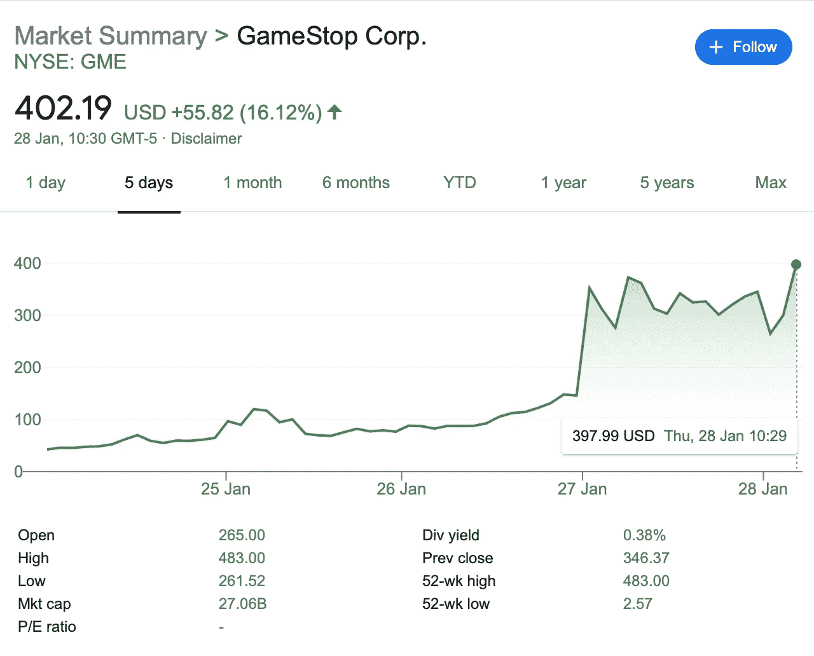

# GameStop 传奇&为什么我们需要比特币

> 原文：<https://medium.com/coinmonks/the-gamestop-saga-why-we-need-bitcoin-33eeaa225863?source=collection_archive---------4----------------------->

Photo by [Kristina V](https://unsplash.com/@christya_v?utm_source=unsplash&utm_medium=referral&utm_content=creditCopyText) on [Unsplash](https://unsplash.com/s/photos/bitcoin-freedom?utm_source=unsplash&utm_medium=referral&utm_content=creditCopyText)

## 金融危机再次向我们展示了它的本来面目。这表明了它对普通人的蔑视。他们利用他来中饱私囊，他们不喜欢他开始自己赚钱。

# 情况正好相反

过去一周，GameStop (GME 在纽约证券交易所上市)的股票在 Reddit 上由业余投资者策划的牛市中飙升。r/WallStreetBets 的用户最初认为该股被低估，并希望快速获利。这个消息不胫而走，随着对股票的需求激增，股价也随之上涨。

后来很明显，该股遭到了几家大型对冲基金的做空。随着 GME 价格的上涨，“做空”该股的对冲基金开始大量亏损，最初的交易提示变成了一个骚扰金融精英的机会。

GME price chart (image courtesy of Google)

在最初的泵，使股票超过 125 美元，“巨魔泵”已带 GME 到惊人的 400 美元以上。对冲基金 Melvin Capital 由于 Reddit 的注资，现在已经亏本关闭了其在 GME 的空头头寸，据推测[该基金在 1 月份损失了 30%的资本。](https://www.reuters.com/article/us-gamestop-melvin/hedge-fund-melvin-capital-has-closed-gamestop-position-spokesman-idUSKBN29X0EN)

## 这告诉我们什么？

它告诉我们，市场确实是一种向世界传达我们的价值观和偏好的方式。告诉那 1%的人去他妈的他们自己没有任何作用。然而，摧毁华尔街对冲基金告诉他们要这样做，以非常直接和实际的方式。

# **金融审查**

在 GME 政府注资之后，投资者被禁止在交易平台 Robinhood 购买更多股票。这是在马萨诸塞州州务卿比尔·加尔文几乎不加掩饰地要求股票停牌 30 天之后做出的:

> “从短期来看，我认为在这种情况下，市场本身肯定有能力暂停它……**他们不应该为这种类型的活动提供论坛。”**

Galvin 还认为，GME 交易应该暂停，因为它“没有反映现实”。我们的整个金融体系没有反映现实！当经济不景气时，凭空印钱来解决经济没有产生足够价值的问题。当大机构做出糟糕的决策并亏损时，他们会得到 [**和**](/incerto/corporate-socialism-the-government-is-bailing-out-investors-managers-not-you-3b31a67bff4a) 来自纳税人的数十亿美元的薪酬。

在全球疫情期间，所有市场都创下了历史新高，各经济体都在努力以实际价格生存。这在现实中没有依据，但繁荣的股市有利于精英阶层，因此他们没有兴趣监管这种不存在的现象。

## 这告诉我们什么？

它告诉我们，黑手党是愤怒的，国家行为者与 1%的人勾结，以拯救他们的屁股。黑手党对平民从这种局势中获利的前景更加愤怒。这是操纵市场，我很反感。然而，我也很兴奋:我们找到了摆脱困境的方法。

# **死于比特币**

这些机构如此严厉地取缔只是因为他们害怕了。他们已经意识到“我们人民”有力量推翻他们强加给我们的秩序。他们关闭了市场，因为他们意识到我们可以利用市场来改变力量的平衡。不过，有一个市场他们绝对无法污染或控制:比特币。

有了比特币，没人能控制经济。经济自己运行。人们的决定是在市场中聚合的，这些信号不能被印钞稀释，也不能被救市阻挡。任何信号都可以发出，而且不能瞒过账本。我们当前的金融体系过滤了真实世界的信号(例如，阻止人们购买他们想要的股票)，从而扭曲了市场。它通过审查排除了真实的市场信号，这意味着市场实际上不能反映人们的真实偏好。

比特币完全不受审查，这给了我们一个对抗精英的绝佳位置。它让我们可以随心所欲地付钱给任何人。只要我们有一个钱包地址和互联网连接，没有人能阻止我们购买任何东西。我们可以支持某人，即使帕特里翁因“仇恨言论”而将他们下狱。没有交易平台告诉我们不能致富，我们可以投资任何东西。

所以给市场一个信号:买比特币。让精英们知道他们的日子不多了。

> 加入 Coinmonks [Telegram group](https://t.me/joinchat/EPmjKpNYwRMsBI4p) 并了解加密交易和投资

## 另外，阅读

*   什么是[闪贷](https://blog.coincodecap.com/what-are-flash-loans-on-ethereum)？
*   最好的[密码交易机器人](/coinmonks/crypto-trading-bot-c2ffce8acb2a) | [网格交易](https://blog.coincodecap.com/grid-trading)
*   [3 商业评论](/coinmonks/3commas-review-an-excellent-crypto-trading-bot-2020-1313a58bec92) | [Pionex 评论](/coinmonks/pionex-review-exchange-with-crypto-trading-bot-1e459d0191ea) | [Coinrule 评论](https://blog.coincodecap.com/coinrule-review-a-perfect-trading-bot)
*   [AAX 交易所评论](/coinmonks/aax-exchange-review-2021-67c5ea09330c) | [德里比特评论](/coinmonks/deribit-review-options-fees-apis-and-testnet-2ca16c4bbdb2) | [FTX 密码交易所评论](/coinmonks/ftx-crypto-exchange-review-53664ac1198f)
*   [零审核](/coinmonks/ngrave-zero-review-c465cf8307fc)
*   [Bybit Exchange 审查](/coinmonks/bybit-exchange-review-dbd570019b71) | [Bityard 审查](https://blog.coincodecap.com/bityard-reivew)|[inter tax 审查](https://blog.coincodecap.com/interdax-review)
*   [3Commas vs Cryptohopper](/coinmonks/3commas-vs-pionex-vs-cryptohopper-best-crypto-bot-6a98d2baa203)
*   最好的比特币[硬件钱包](/coinmonks/the-best-cryptocurrency-hardware-wallets-of-2020-e28b1c124069?source=friends_link&sk=324dd9ff8556ab578d71e7ad7658ad7c) | [BitBox02 回顾](/coinmonks/bitbox02-review-your-swiss-bitcoin-hardware-wallet-c36c88fff29)
*   [总账与 n 平均](https://blog.coincodecap.com/ngrave-vs-ledger)
*   [密码拷贝交易平台](/coinmonks/top-10-crypto-copy-trading-platforms-for-beginners-d0c37c7d698c) | [比特码拷贝交易](https://blog.coincodecap.com/bityard-copy-trading)
*   [莱杰纳米 s vs x](https://blog.coincodecap.com/ledger-nano-s-vs-x)
*   [沃德评论](https://blog.coincodecap.com/vauld-review) | [尤霍德勒评论](/coinmonks/youhodler-4-easy-ways-to-make-money-98969b9689f2) | [区块链评论](/coinmonks/blockfi-review-53096053c097)
*   最好的[加密税务软件](/coinmonks/best-crypto-tax-tool-for-my-money-72d4b430816b) | [硬币追踪评论](/coinmonks/cointracking-review-a-reliable-cryptocurrency-tax-software-5114e3eb5737)
*   最佳[加密借贷平台](/coinmonks/top-5-crypto-lending-platforms-in-2020-that-you-need-to-know-a1b675cec3fa)
*   [莱杰纳米 S vs 特雷佐 one vs 特雷佐 T vs 莱杰纳米 X](https://blog.coincodecap.com/ledger-nano-s-vs-trezor-one-ledger-nano-x-trezor-t)
*   [block fi vs Celsius](/coinmonks/blockfi-vs-celsius-vs-hodlnaut-8a1cc8c26630)|[Hodlnaut 审查](https://blog.coincodecap.com/hodlnaut-review)
*   [Bitsgap 审查](/coinmonks/bitsgap-review-a-crypto-trading-bot-that-makes-easy-money-a5d88a336df2) | [四项审查](/coinmonks/quadency-review-a-crypto-trading-automation-platform-3068eaa374e1)
*   [埃利帕尔泰坦评论](/coinmonks/ellipal-titan-review-85e9071dd029) | [赛克斯斯通评论](https://blog.coincodecap.com/secux-stone-hardware-wallet-review)
*   [BlockFi 评论](/coinmonks/blockfi-review-53096053c097) |在您的密码中赚取高达 8.6%的利息
*   [DEX Explorer](https://explorer.bitquery.io/ethereum/dex) 和[区块链 API](https://explorer.bitquery.io/graphql)
*   [加密套利](/coinmonks/crypto-arbitrage-guide-how-to-make-money-as-a-beginner-62bfe5c868f6)指南:新手如何赚钱
*   最佳[加密制图工具](/coinmonks/what-are-the-best-charting-platforms-for-cryptocurrency-trading-85aade584d80)
*   了解比特币最好的[书籍有哪些？](/coinmonks/what-are-the-best-books-to-learn-bitcoin-409aeb9aff4b)

> [直接在您的收件箱中获得最佳软件交易](/coinmonks/newsletters/coinmonks)

