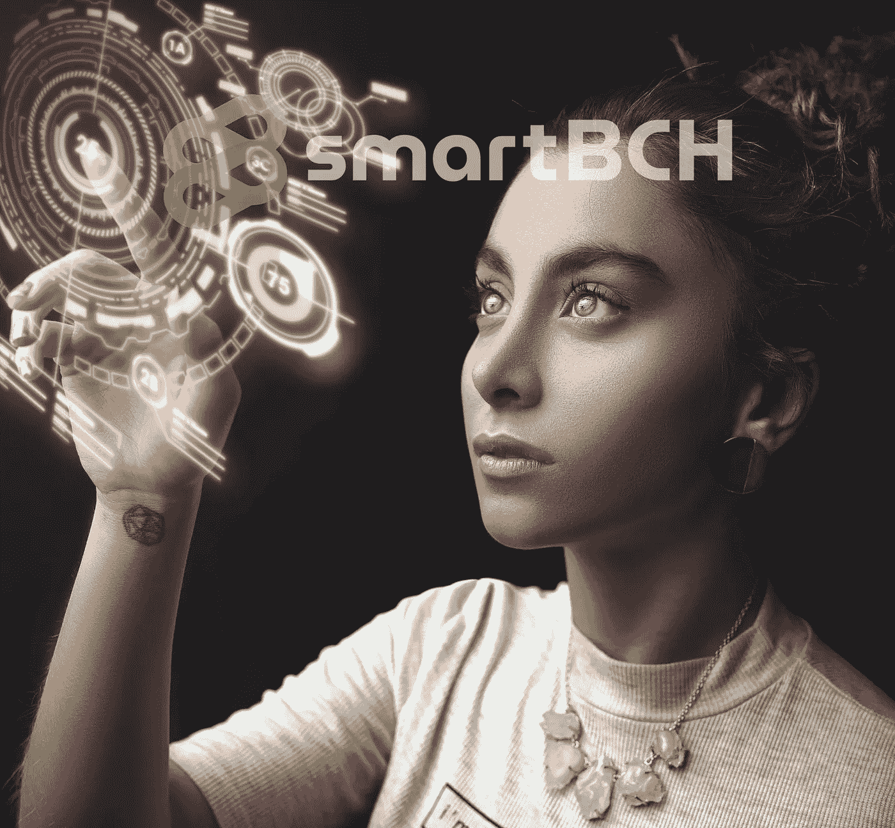
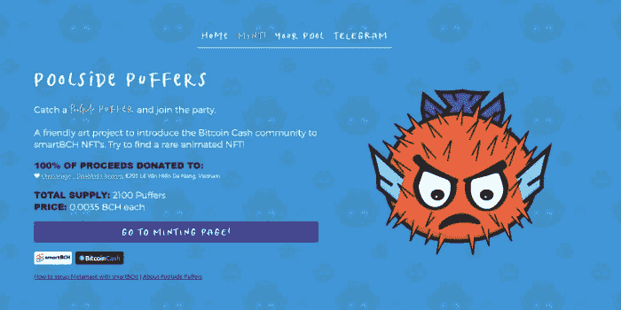
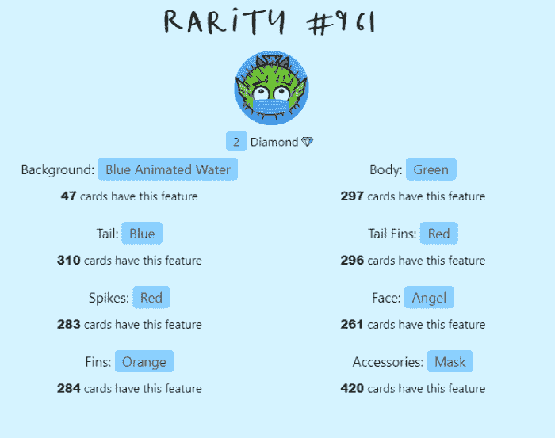
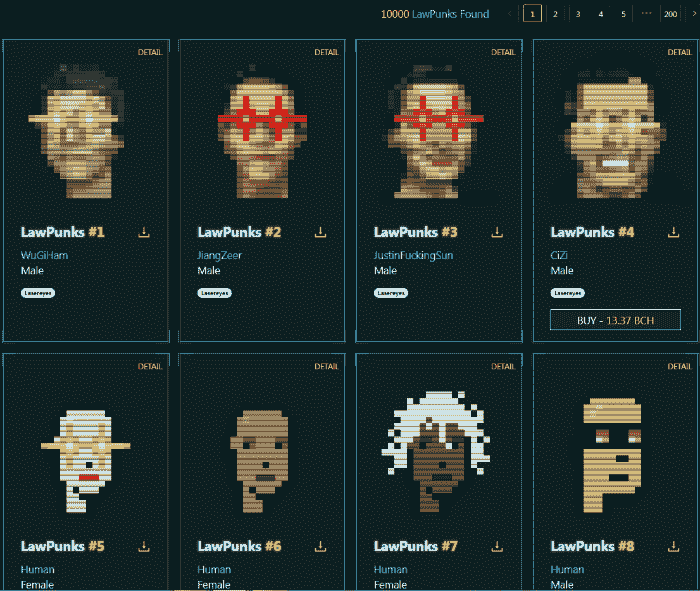
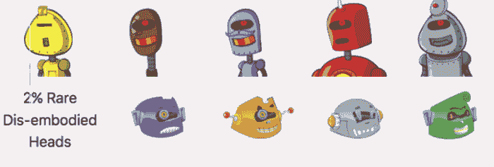
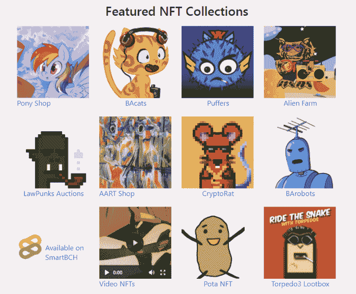
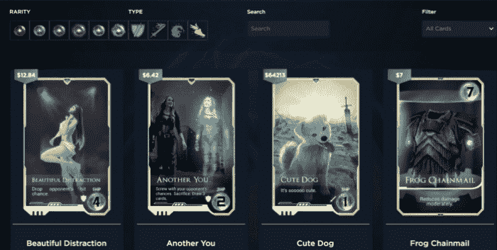
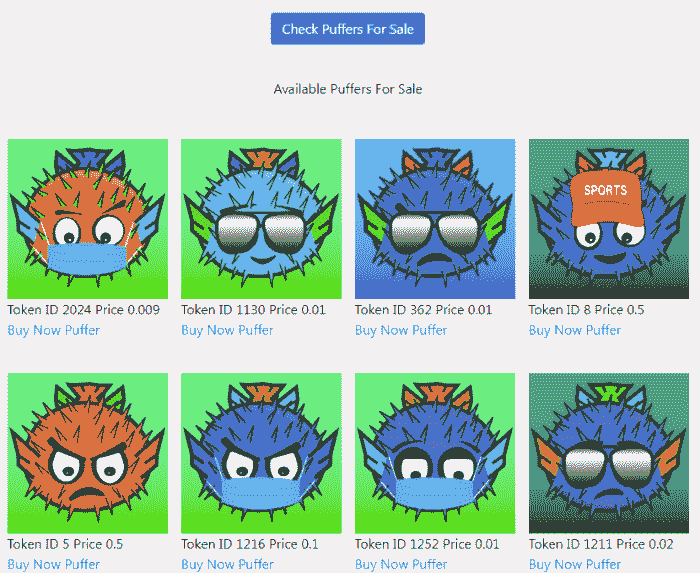
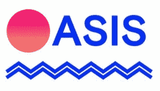

# 智能 NFT 宇宙的起源

> 原文：<https://medium.com/coinmonks/the-genesis-of-the-smartbch-nft-universe-e7161f1031c0?source=collection_archive---------6----------------------->

*Image from:* [*Pexels*](https://www.pexels.com/photo/photo-of-woman-wearing-turtleneck-top-2777898/) *(modified)*

在过去的两年里，NFTs 的崛起令人瞩目。

以太坊、WAX、金恩和 Polygon 是一些被迅速采用并广受欢迎的平台。

各种艺术家和名人发现这是一个有利可图的行业，我们看到太多的人进入这一领域只是为了快速“攫取现金”，尽管市场已经证明这不仅仅是一种时尚，而是具有弹性，并将继续增长。

通过 SmartBCH，比特币现金在今年夏天正式进入智能合约领域，而开发者已经在创建提供独特投资工具和机会的 DeFi 平台。

NFT 肯定是下一个，第一批已经在这里了。SmartBCH 社区接受了这些尝试，并正在努力打造 NFT。这成为一种趋势，已经有一些著名的收藏。

NFT 的艺术家们注意到了这一点，并正在积极制作，很快将发布他们的 SmartBCH NFTs 版本，并提供比特币现金。市场正准备接纳非传统艺术，并为艺术家和收藏家提供安全的平台。

> 订阅 [**Coinmonks Youtube 频道**](https://www.youtube.com/c/coinmonks/videos) 获取每日加密新闻。

# SmartBCH 上的 NFT 系列

我们已经在 SmartBCH 上推出了几个系列，我将立即展示。

[Source](https://smartbch.org/)

## 池畔河豚

[***Puffers.cash***](https://puffers.cash/)

(阅读更多:[池畔河豚！—一个明智的 NFT 艺术项目，目的很好！](https://read.cash/@Pantera/poolside-puffers-a-smartbch-nft-art-project-with-a-good-purpose-93fc2ee5))

Corbin Fraser 设计的独特 NFT 系列仅在 3 天内就销售一空！NFT 收藏家铸造了全部 2100 只河豚，该项目将所有收益捐给了一家孤儿院。

你可以在[网站](https://puffers.cash/)上查看收藏，查看每只河豚的稀有程度。此外，我们可以连接 Metamask 并找到我们的河豚池。

Puffer Stats, [***Puffers.cash***](https://puffers.cash/)

## 法律朋克

一个有趣的 NFT 集合，由 BlockNG 创建，同时发布了一个 SmartBCH 令牌(LAW)。

NFT 藏家可以[造币](https://blockng.money/#/mint)拉朋克，价格 0.01BCH ( [链接](https://blockng.money/#/mint))。同一个网址可以用来转移我们的 NFTs 到另一个帐户。

前四个 [**LawPunks**](https://blockng.money) 数字包含密码体中流行的名字，例如 CZ 和 Justin“f ..”孙！

[**LawPunks**](https://blockng.money) 遵循顶级以太坊 NFT 系列之一(加密朋克)的相同逻辑。它在 SmartBCH 中引入了人脸的相同概念，包括独特的特征。

[**劳朋克**](https://blockng.money) 与以太坊的竞争对手有相似之处，但我们不能否认的事实是，需求是 NFT 受欢迎程度和价格上升的原因。

几乎一半的朋克已经被铸造了。这不是一个小数目，而是 5000 个 NFT 薄荷糖。这个 NFT 以 0.01BCH 的价格创造了 50 BCH 的体积。

这对于 SmartBCH 网络的早期阶段来说是相当大的数量。

*法律朋克网站:* [***屏蔽***](https://blockng.money/#/)

## BA 机器人

[**BA.net**](https://ba.net/amkt-smartbch/collections.html)提供了一些使用 SmartBCH 智能合约创建的 NFT 集合。

我们找到了 SmartBCH 版的绒毛小马和几个更像**的巴猫**、 [**的巴机器人**](https://ba.net/barobots-smartbch/) ，以及 [**的外星农场**](https://alienfarm.org/) **。**

这些是首批在 SmartBCH 上进行艺术创作的艺术家。他们提供有收藏价值的 NFT，这些 NFT 可能会以更高的价格转售，或者用于未来的 NFT 展览。

[*Source*](https://ba.net/barobots-smartbch/nft/automint.html)

今天的 NFT 仍然是一种原始的数字艺术形式，随着 3D 平台的出现，如分散的土地，我想我们知道这将导致什么。因此，在未来，每个 NFT 都会有一个用例，即使现在没有。

安息 BA.net 智能系列:

## 特别提及:

*   [**球体**](https://enter-the-sphere.com/)**:NFT·元宇宙。**(**SLP**NFT 和区块链的比赛)。

SLP NFTs 一度有过宣传，但后来逐渐消失了。尘埃落定后留下的是最有前途、潜力巨大的项目。

球体提供了吸引人的 NFT 收藏艺术品。

[**The Sphere**](https://enter-the-sphere.com/)

随着更多的开发，我认为 Sphere 将有能力获得大量的粉丝，并达到其他流行的区块链游戏的声誉。

Sphere 对比特币现金社区具有重要意义，因为它不仅是一个高质量的 NFT 系列，而且还设定了游戏用例。

这是一个非常有趣的游戏和 NFTs 在 SLP 上的实现，这个项目的标志 **ORB** 现在已经迁移到 SmartBCH。我们不得不期待更多有趣的发展。

阅读更多信息:

[**smart BCH 上的球体元宇宙&SLP——发布了什么？什么来了？**](https://read.cash/@Joey_B_Wong/the-sphere-metaverse-on-smartbch-slp-whats-released-whats-coming-b303f6c6)

## 即将推出的系列:

*   **现金猫**

[*Source*](https://t.me/CashCats/57502)

期待这个特别的 NFT 系列引起狂热，我希望它有少量的薄荷糖，并提供不同稀有程度的独特的猫 NFT。

现金猫(Fuego)的开发者也参与了 OASIS marketplace 的开发。

# SmartBCH NFT 市场

## BA.net

有一个 NFT 平台提供智能非功能性交易，也有一些在那里上市的非功能性交易，即使价格仍然相对较低。

如果你错过了薄荷，BA.net 提供了一个列出或购买河豚的网站。([链接](https://ba.net/puffers/))

[Source](https://ba.net/puffers/)

## 发育不全

*   **绿洲**

[Source](https://read.cash/@OASIS/introducing-oasis-a-fully-decentralized-nft-exchange-on-smartbch-b9513c71)

它将很快活跃起来，并且可能会享受到来自 SmartBCH 粉丝群的即时高流量。据该团队称，距离 Oasis 正式发布还有几周时间。对于 SmartBCH NFTs 来说，这是一个激动人心的消息，因为我们将拥有一个完全专注于 SmartBCH 项目的现代市场。

**绿洲背后的团队:**

> *-* ***杰伦****(SmartScan 的创造者)*
> 
> *-****Tijn****(专业平面设计师)*
> 
> *-****Fuego****(现金猫的创造者)*

在 read.cash 上阅读有关 Oasis 的更多信息:

[**介绍 OASIS:smart BCH 上一个完全分散的 NFT 交易所**](https://read.cash/@OASIS/introducing-oasis-a-fully-decentralized-nft-exchange-on-smartbch-b9513c71)

我们都在以很高的期望等待这一个。

*   **稀有金属**

**Rares.cash**

我们期待来自 rares.cash 的消息已经有一段时间了。它是由 marketcap.cash 网站的同一个开发商开发的，但我们没有太多关于它开发的消息。

*   **更多市场**

更多的开发正在进行中，一个 read.cash 成员正在创建他自己版本的 smart BCH market place(off road . cash)，并在这篇 read.cash 帖子中介绍了它。

# 最后

虽然在开始时，我们很多人都找不到 NFTs 的目的，但最终这个概念是如此之大，以至于我们不能忽视它太久。NFT 存在泡沫，但不是整个市场。一些 NFT 被有意夸大到不切实际的估值，这是有原因的。

如果我错过了 NFT 的收藏，请评论并帮助我注意到。我将在以后的文章中介绍它。这种情绪对今天的 SmartBCH 非常积极，不管主流加密货币新闻网站(Cointelegraph，CoinDesk 等)故意缺乏关注。)加密货币社区和投资者不会错过这个机会。

SmartBCH 即将成为 NFT 创作者的“热门”平台。许多人已经在看了，成交量也在上升。

凭借低廉的费用和快速的速度，SmartBCH 网络为 NFT 创作者提供了最好的可能。开发者正在构建基础设施，很快将准备好宣布安全的 NFT 市场。

有了这些早期的发展，我们只能希望 SmartBCH NFT 领域有一个光明的未来。

**相关文章:**

*   [SmartBCH Metamask 教程——连接网络，转移 BCH，添加代币，进行代币交易](https://read.cash/@Pantera/smartbch-metamask-tutorial-connect-to-network-transfer-bch-add-tokens-and-trade-on-dexs-601f4b17)
*   [如何设置元遮罩并添加网络:币安(BSC)，多边形(Matic)，OKEx，SmartBCH —教程](https://read.cash/@Pantera/how-to-set-up-metamask-and-add-networks-binance-bsc-polygon-matic-okex-smartbch-tutorial-7265e1c4)
*   [非功能性技术的使用案例:了解非功能性技术可以主导的领域](https://read.cash/@Pantera/the-use-cases-of-nfts-a-look-into-the-fields-nfts-can-dominate-e0b511c5)
*   [池畔河豚！—一个明智的 NFT 艺术项目，目的很好！](https://read.cash/@Pantera/the-genesis-of-the-smartbch-nft-universe-7cef1a9c#bad-link)
*   [SmartBCH:这是关于什么的，为什么我们应该关注？](https://read.cash/@Pantera/smartbch-what-is-this-about-and-why-we-should-care-5688867f)

*****SmartBCH 空投警报*****

如果您之前使用过 SmartBCH 并进行交易，请打开此链接并连接您的 SmartBCH 元掩码帐户:[**https://app.checkbook.cash/receive**](https://app.checkbook.cash/receive)

你会发现王魁( **500 $CATS** 和 **2 EBEN** )的礼物在等着你！

Follow me on: ● [ReadCash](https://read.cash/@Pantera) ● [NoiseCash](https://noise.cash/u/Pantera99) ● [Medium](/@panterabch) ● [Hive](https://hive.blog/@pantera1) ● [Steemit](https://steemit.com/@pantera1) ●[Vocal](https://vocal.media/authors/pantera) ● [Minds](https://www.minds.com/pantera99/) ● [Twitter](https://twitter.com/Panterabch) ● [LinkedIn](https://www.linkedin.com/in/panterabch/) ● [email](https://read.cash/@Pantera/localcryptos-p2p-exchange-is-now-offering-bitcoin-cash-trading-06637230#bad-link)

***支持内容创作者。***

如果你喜欢这个故事，就订阅吧！

*最初发布于*[*https://read . cash*](https://read.cash/@Pantera/the-genesis-of-the-smartbch-nft-universe-7cef1a9c)*。*

> 加入 Coinmonks [电报频道](https://t.me/coincodecap)和 [Youtube 频道](https://www.youtube.com/c/coinmonks/videos)了解加密交易和投资

## 另外，阅读

*   [尤霍德勒 vs 科恩洛 vs 霍德诺特](/coinmonks/youhodler-vs-coinloan-vs-hodlnaut-b1050acde55a) | [Cryptohopper vs 哈斯博特](https://blog.coincodecap.com/cryptohopper-vs-haasbot)
*   [如何匿名购买比特币](https://blog.coincodecap.com/buy-bitcoin-anonymously) | [比特币现金钱包](https://blog.coincodecap.com/bitcoin-cash-wallets)
*   [币安 vs FTX](https://blog.coincodecap.com/binance-vs-ftx) | [最佳(索尔)索拉纳钱包](https://blog.coincodecap.com/solana-wallets)
*   [如何在 Uniswap 上交换加密？](https://blog.coincodecap.com/swap-crypto-on-uniswap) | [喜美元评论](https://blog.coincodecap.com/hi-dollar-review)
*   [3 commas vs . Pionex vs . crypto hopper](https://blog.coincodecap.com/3commas-vs-pionex-vs-cryptohopper)
*   [币安 vs 北海巨妖](https://blog.coincodecap.com/binance-vs-kraken) | [美元成本平均交易机器人](https://blog.coincodecap.com/pionex-dca-bot)
*   [新加坡十大最佳加密交易所](https://blog.coincodecap.com/crypto-exchange-in-singapore) | [收购 AXS](https://blog.coincodecap.com/buy-axs-token)
*   [投资印度的最佳密码](https://blog.coincodecap.com/best-crypto-to-invest-in-india-in-2021) | [HitBTC 评论](/coinmonks/hitbtc-review-c5143c5d53c2)
*   [加拿大最佳加密交易机器人](https://blog.coincodecap.com/5-best-crypto-trading-bots-in-canada) | [赌注加密](https://blog.coincodecap.com/staking-crypto)
*   [如何在印度购买比特币？](/coinmonks/buy-bitcoin-in-india-feb50ddfef94) | [WazirX 审查](/coinmonks/wazirx-review-5c811b074f5b)
*   [比特币主根](https://blog.coincodecap.com/bitcoin-taproot) | [Bitso 评论](https://blog.coincodecap.com/bitso-review) | [排名前 6 的比特币信用卡](/coinmonks/bitcoin-credit-card-bc8ab6f377c6)
*   [我的密码交易经验](/coinmonks/my-experience-with-crypto-copy-trading-d6feb2ce3ac5) | [《比特币基地评论》](/coinmonks/coinbase-review-6ef4e0f56064)
*   [CoinFLEX 评论](https://blog.coincodecap.com/coinflex-review) | [AEX 交易所评论](https://blog.coincodecap.com/aex-exchange-review) | [UPbit 评论](https://blog.coincodecap.com/upbit-review)
*   [AscendEx 保证金交易](https://blog.coincodecap.com/ascendex-margin-trading) | [Bitfinex 赌注](https://blog.coincodecap.com/bitfinex-staking) | [bitFlyer 审核](https://blog.coincodecap.com/bitflyer-review)
*   [麻雀交换评论](https://blog.coincodecap.com/sparrow-exchange-review) | [纳什交换评论](https://blog.coincodecap.com/nash-exchange-review)
*   [维护卡审核](https://blog.coincodecap.com/uphold-card-review) | [信任钱包 vs MetaMask](https://blog.coincodecap.com/trust-wallet-vs-metamask)
*   [Exness 点评](https://blog.coincodecap.com/exness-review)|[moon xbt Vs bit get Vs Bingbon](https://blog.coincodecap.com/bingbon-vs-bitget-vs-moonxbt)
*   [如何开始通过加密贷款赚取被动收入](https://blog.coincodecap.com/passive-income-crypto-lending)
*   [加密货币储蓄账户](/coinmonks/cryptocurrency-savings-accounts-be3bc0feffbf) | [加密交易机器人](https://blog.coincodecap.com/best-crypto-trading-bots)
*   [BigONE 交易所评论](/coinmonks/bigone-exchange-review-64705d85a1d4) | [CEX。IO 审查](https://blog.coincodecap.com/cex-io-review) | [交换区审查](/coinmonks/swapzone-review-crypto-exchange-data-aggregator-e0ad78e55ed7)
*   [最佳比特币保证金交易](/coinmonks/bitcoin-margin-trading-exchange-bcbfcbf7b8e3) | [比特币保证金交易](https://blog.coincodecap.com/bityard-margin-trading)
*   [加密保证金交易交易所](/coinmonks/crypto-margin-trading-exchanges-428b1f7ad108) | [赚取比特币](/coinmonks/earn-bitcoin-6e8bd3c592d9)
*   [WazirX vs CoinDCX vs bit bns](/coinmonks/wazirx-vs-coindcx-vs-bitbns-149f4f19a2f1)|[block fi vs coin loan vs Nexo](/coinmonks/blockfi-vs-coinloan-vs-nexo-cb624635230d)
*   [BlockFi 信用卡](https://blog.coincodecap.com/blockfi-credit-card) | [如何在币安购买比特币](https://blog.coincodecap.com/buy-bitcoin-binance)
*   [火币交易机器人](https://blog.coincodecap.com/huobi-trading-bot) | [如何购买 ADA](https://blog.coincodecap.com/buy-ada-cardano) | [Geco。一次审查](https://blog.coincodecap.com/geco-one-review)
*   [加密复制交易平台](/coinmonks/top-10-crypto-copy-trading-platforms-for-beginners-d0c37c7d698c) | [五大 BlockFi 替代品](https://blog.coincodecap.com/blockfi-alternatives)
*   【Crypto.com 评论】|[|](/coinmonks/crypto-com-review-f143dca1f74c)|[信用交易](/coinmonks/huobi-margin-trading-b3b06cdc1519)
*   [Bybit vs 币安](https://blog.coincodecap.com/bybit-binance-moonxbt)|[stealth x 回顾](/coinmonks/stealthex-review-396c67309988) | [Probit 回顾](https://blog.coincodecap.com/probit-review)
*   [顶级付费加密货币和区块链课程](https://blog.coincodecap.com/blockchain-courses)
*   [在美国如何使用 BitMEX？](https://blog.coincodecap.com/use-bitmex-in-usa) | [BitMEX 评论](https://blog.coincodecap.com/bitmex-review)