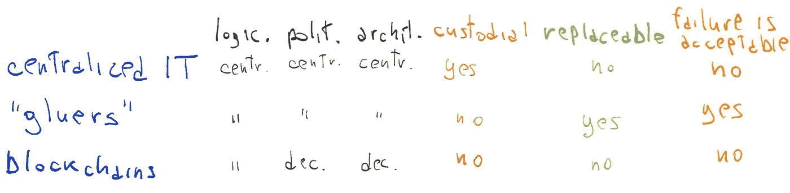
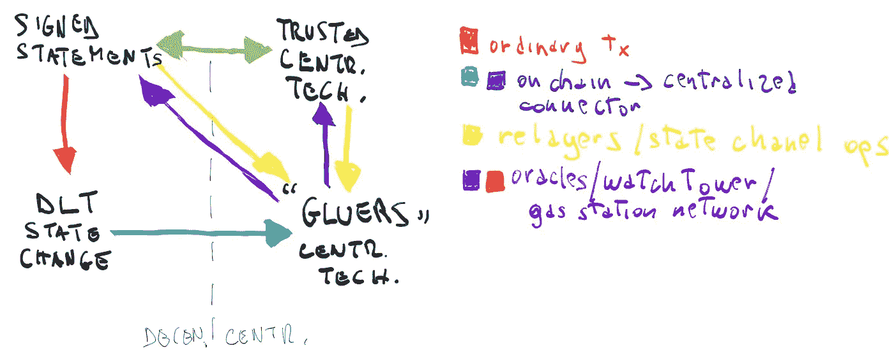

# 胶合宣言

> 原文：<https://medium.com/coinmonks/the-gluing-manifesto-159cabef0532?source=collection_archive---------0----------------------->

集中式系统的优点如何帮助分散式系统努力

# 分权至上主义

经济系统已经通过集中式技术(电子邮件、API、CRM、电子商务、ERP、SQL 数据库、云计算)运行了几十年。然后，分散化技术出现了，使人们能够与任何人进行安全的经济互动，甚至是你不信任的陌生人。你只需要相信技术。太神奇了！

有时候，我们会如此热爱这一新范式，以至于只能设想一个平行的全新世界，在那里一切都需要去中心化，因为“中心化”是邪恶的，应该不惜一切代价避免。

我们关注的是最大程度去中心化的解决方案，这很好，因为它推动我们建立消除任何信任点的解决方案。然而，这种激进的方法并不总是让我们欣赏可接受的妥协，这种妥协可以使这些系统易于使用、高效并被广泛采用。

充分利用分散技术潜力的最佳方式是什么？设计一个基于分散和集中组件之间的**紧密互动的经济系统，其中开发者和公司根据哪些组件需要不可信来明智地决定如何混合它们**。

# 第三条路

我们认为“集中保管技术”与“分散/区块链”的对立将很快成为过去。**第三类已经初露端倪。**

遵循 Vitalik 的[经典框架](/@VitalikButerin/the-meaning-of-decentralization-a0c92b76a274)，思考一下一类技术，它们在逻辑上、架构上和政治上与传统 IT 系统一样集中，但是:

*   **未被羁押**。他们是集中的，但是不能偷你的资金！
*   **可随时更换**。
*   **可能会出现故障**，因为 a)你同时使用了很多，因为它们是可替换的，所以如果一个出现故障也没什么大不了的。重要的是至少有一个可以工作，或者更简单地说，b)低失败率是可以接受的。

最终，这些技术——“胶合者”——不需要完美，不需要被信任，也不需要容错，他们只需要工作。**系统的可靠性是基于组件的总和(不可信的组件+众多胶水+你信任的集中式 IT)**，而不是单个胶水。

# 胶水:概述

简化一点，Gluers 从分散技术到集中技术读取和转发签名的语句，反之亦然。几个例子:

*   **继电器**。他们没有监护权。他们只是传达你的命令。例如:单个 0x 网状或状态通道 txs 中继器可能出现故障，并且是可替换的。不过还好，因为你整体上是依赖网络的。继电器是胶水。
*   **神谕连接器**。分散式智能契约 oracle 依赖于许多单一的集中式 Oracle 连接器，这些连接器向契约发送描述区块链之外的世界状态的签名声明。这些 oracles 连接器中的任何一个都可能出现故障，是可替换的，并且不是托管的…它们是胶水！
*   **了望塔**。他们阅读签署的声明(以太坊状态)并将交易(上升的纠纷)发送到链上以保护他们的客户。你想租多少个了望塔都可以，所以单个的可以失效，可以替换。他们是胶水工。
*   **加油站网络**。他们会转发您签署的对账单，并为您支付交易费用。你不需要相信单一继电器。你可以在需要的时候切换，或者同时使用多个。
*   **ZKP 交易聚合器**。在基于零知识证明的第 2 层扩展设置中，任何知道先前状态的聚合器节点，聚合已签名的语句(事务)，创建新状态的 ZKP 证明，并将其链上发送到验证智能契约…是可替换的，并且可能失败。是胶水！
*   **订单匹配器**。你的订单发送给越多的外链订单匹配者越好，因为你有更多的机会找到匹配你的订单。订单匹配器不是托管的，可能会失败。如果至少有一个订单匹配器是真诚的，那么你就没问题。他们可以被视为胶水。
*   **状态连接器**(这将是巨大的！).基本版本:如果匹配特定的触发器(onchain - >传统集中式),则该工具从区块链读取数据并将数据转发到传统集中式系统——API、电子邮件、数据库、电子商务。高级版本:如果是这样，那么这个工具支持 onchain - > onchain 工作流，甚至是 off chain(relayers)<->onchain<->传统集中式工作流的任意组合。胶水！

# 宣言

粘合器是一种魔法，它将使我们能够创建一个基于分散和集中组件之间的密集交互的经济系统，其中**开发人员和公司将根据哪些组件需要信任或不信任来明智地决定如何混合它们。**我们相信，多亏了胶水，这个行业将会被广泛采用。

我们的**宣言**:

1.  中央集权并不邪恶，如果它是可替换的，而不是托管的
2.  让我们来关注一下*分权*如何帮助——而不是“击败”——*集权*。反之亦然
3.  让我们把*集中化*和*去中心化*想象成一个单一的技术领域，很快就会成为一个单一的开发者社区
4.  老式开发商是我们的朋友！让我们花更多的时间来构建工具，帮助非加密开发人员访问*去中心化的世界*，而不必首先完全理解它(99%的 web 开发人员不知道 HTTP 到底是如何工作的。为了衡量以太坊，我们应该得到一个类似的点)
5.  让我们合法的胶水技术。它们高效、安全、可替换……而且确实需要它们！
6.  完成比完美更好。采用了比 100% *更分散的*。让我们避免最大化分权
7.  让我们建造东西吧！

2020 年 2 月 10 日

> [直接在您的收件箱中获得最佳软件交易](https://coincodecap.com/?utm_source=coinmonks)

