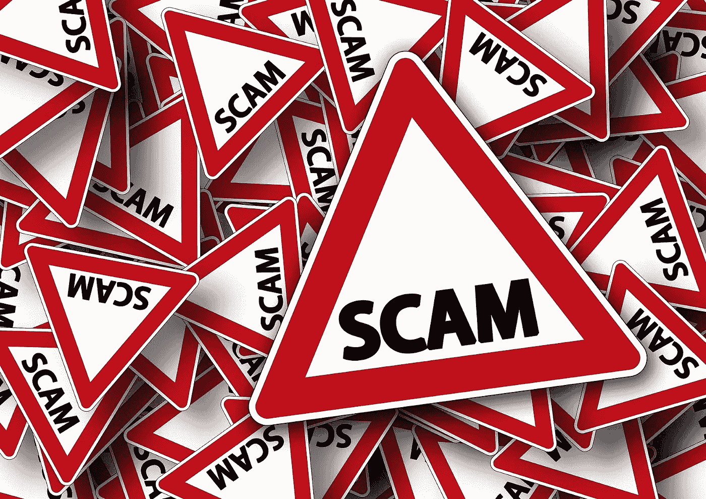

# 好的，坏的和丑陋的，对加密硬币进行分类。

> 原文：<https://medium.com/coinmonks/the-good-the-bad-and-the-ugly-classifying-the-crypto-coins-9d192154579a?source=collection_archive---------0----------------------->

前一段时间，我写了一个中型故事，在这个故事中，我寻找最有潜力发展成为一个新的加密支付系统的硬币。
还有最近的一个故事，我恳求[白帽道德投资者站出来](/@aat.de.kwaasteniet/the-white-hat-ethical-investor-6a57d570c1e2)。(仅荷兰语)。两篇文章都提到了诈骗。这些硬币与真相不太接近，或者只是骗局。如果有一个硬币的概述，交易者/投资者应该交易或不交易，那该多好。在这项研究中，推动了这一名单。我们从 Coinmarketcap 的数字 1 开始。这并不是说列表中的优先级顺序有什么价值，而是因为很容易将所有数据整齐地放在手边，而不会漏掉一枚硬币。所以我们不看硬币的价值，而只是检查某个硬币是否可靠。不会说这个硬币和那个硬币是骗局，因为需要确凿的证据，但往往不能提供，但会给出建议，哪些硬币应该避免，哪些看起来可靠。

由于野外有超过 2000 枚硬币，这项研究无法完成，因为涉及到大量的工作。有可能的是，将会有一个公共的电子表格，所有的数据都将放在其中，并定期补充来自新调查的数据，这些数据可以由任何人通过[此评估表](https://docs.google.com/document/d/1chpdFXeNdLstPPYp34CILlVkXm_x-O0zrwEnI2l7BRU/edit?usp=sharing)提供。复印一份寄给这篇文章的作者。然后，我将确保在检查后，该表被添加到被检查的硬币列表中。

对硬币可靠性的研究集中在以下问题上:

*   硬币的分散性。如果一个密码是以一种集中的方式工作的，设计者对密码一无所知或者有不同的计划。选择有高、中、低。
    **高**是无话可说或者几乎无话可说的情况，
    **中等**用主节点、超节点等给硬币打分。
    **低**是不想知道任何去中心化的硬币像 Ripple，EOS 和它的 21 个区块制作人或者 TRON 的 27 个‘超级代表’等等。
*   硬币和区块链的技术数据的可追溯性
    选择好、中、差
    T2【好】好:如果一切都可以在自己的网站上找到。
    **中等**:如果只能找到主要特征
    **不好**:必须找到大量带有“googling”的数据时。
*   所追求的透明度。他们在 Github 能找到吗？
    选择:是/否
*   Github 有活动吗？来判断硬币是否还有积极的发展。在过去的 12 个月中，超过 700 次提交被认为是活动的，150–700 次被认为是中等活动，如果提交少于 150 次，则很少或没有活动。其来源是 [Cryptomiso](https://www.cryptomiso.com/) 。
*   额外/额外金额或起始金额(超过最大金额的 25%。供应或 50%的流通导致红色标记)
*   循环供给的不规则性。这通常意味着操纵，因此给出了一个危险信号。为此，Coinmarketcap 的(已处理的)历史数据被绘制成图表。

在数据的基础上，对每枚硬币制作一张表格，列出结果和理由。被调查的硬币可以“赚取”以下谓词:

*   **“白帽道德投资者认可”**这些是不多说，推荐交易的币/代币。
*   **【可疑】**这些币既不推荐也不劝阻。硬币有可疑的边缘。自己决定是否要交易它们。
*   **“避免交易”**如果你真的交易了这些硬币/代币，你就支持了 crypto 在媒体上的坏形象，并填满了 crypto-cowboys 的口袋。

> **免责声明！这项研究的结果只是基于我对秘密世界应该如何运作的想法。在我看来，加密的哲学是关于一个分散的系统和网络，在这个系统和网络中，创造网络的人会因为达成共识而获得回报。crypto 出现的主要原因是为了摆脱中间人，成为你自己的银行，不让任何人控制你的钱或资产。因此，人们非常重视硬币的分散性和溢价的数量及其变化。为必要的开发支付少量的溢价是可以的，但是 100%的溢价和很大一部分的“储备”是不好的。那么操纵价格或者仅仅是填满创始人的口袋就太容易了！
> 这些结果不能被视为一种建议，而更像是我对加密货币应该如何发展的看法。顺便说一下，我没有这些硬币，我只有居尔登和 NLG。**

下面你会发现一份已经检查过的硬币清单。点击**链接**了解更多信息，它将引导您找到相关证明。

[**比特币、BTC**](https://docs.google.com/document/d/1xAIwlvzBEHyzIpas4lfpZQUYl_Xf83_EiHSl40xZihQ/edit?usp=sharing) :认可 WHEI
[**涟漪、XRP**](https://docs.google.com/document/d/1RFdSSvktV7g-IVUIpDo3-HiRtiduYX9u-ezy9TZzhCI/edit?usp=sharing) :避免交易
[**以太坊、ETH**](https://docs.google.com/document/d/1dfa7AfpCuGsKm-n0DikwEZlezruMIxGfzxcTY7qyJcw/edit?usp=sharing) :可疑
[**比特币现金、BCH**](https://docs.google.com/document/d/1-yCLfF3zXHSe3Buek0VHq86WW6K2LfJO204GfIw-Zss/edit?usp=sharing) :可疑
[**恒星、XLM**](https://docs.google.com/document/d/1WBIloJBo4BuQ8hQUJCKNhms5kM1XGbFYSlSGPDzSG4c/edit?usp=sharing) :避免交易
[**EOS、** USDT](https://docs.google.com/document/d/19bQX7WMjvnadv7BFQS5wqBREarsL9O2uAljksb9YDuI/edit?usp=sharing) :回避交易
[**卡达诺、阿达**](https://docs.google.com/document/d/1YXswNI1nkis7dBVp71A_yjY8JDHHbh1KAtcCXLfNXnA/edit?usp=sharing) :回避交易
[**莫内罗、XMR**](https://docs.google.com/document/d/1QpzJYrMc1M6ydGpAPNfP5Q3rKcMPGKmb7uCXE5Vd2Yw/edit?usp=sharing) :认可惠伊
[**创、** :](https://docs.google.com/document/d/1OHOSZ8-bbTY7ly5e3MnpOZ2MAFKa-R261MlO1BKkoDA/edit?usp=sharing) 回避交易
[**Iota、MIOTA**](https://docs.google.com/document/d/1IfCKOzYnpGe34QCKGMs7-cDGMjzzj_0Jc1sqPQUiaHs/edit?usp=sharing) :回避交易
[**破折号、破折号【破折号 XEM**](https://docs.google.com/document/d/1wi0IpwAu0-ZwZ4cVpI9SHfoGvsp2XSTrGKlLSpB-aTc/edit?usp=sharing) :回避交易
[**以太坊经典等**](https://docs.google.com/document/d/1Y3SwpCJJEqcQ2cR_WRm04KelxIy_KUlR9c2dNQCrW_Y/edit?usp=sharing) :存疑
[**NEO，NEO** :](https://docs.google.com/document/d/1mxG9ijQLV2U4z2Y4Ri_BcJasdvvqeu7h4IJZlnatE2E/edit?usp=sharing) 回避交易
[**特佐斯，**](https://docs.google.com/document/d/1JSk-Un-pVyJJNk3lg5wDvOM0rAQBLX6xnmAmIrzxq0A/edit?usp=sharing) :回避交易
[**Zcash，**](https://docs.google.com/document/d/1yfuYvXLXT4GvVNaD-IyDKm6uGQhuNSmKVhAPW-k5ygo/edit?usp=sharing) :通过 WHEI
ONT :避免交易
[**Dogecoin，DOGE**](https://docs.google.com/document/d/17G6WO7wDd18n7Lsnsd32uNwUQhoRlkOAyxD-4RM4xb8/edit?usp=sharing) :通过 WHEI
[**OmiseGO，OMG**](https://docs.google.com/document/d/1-HFgoD00BiZMSOv1a3sMg--LJy7NywqHIQF7AhhaBxw/edit?usp=sharing) :避免交易
[**Qtum**](https://docs.google.com/document/d/1HKwyxclZASLFTy3cdz2lB905Hdn8VEQnNfNh7AHFlFU/edit?usp=sharing):避免交易
[**法令，**](https://docs.google.com/document/d/1z8BjZMpHxgh-knrcz7yXBBzKCFv0B4vTsjkolmGOjX0/edit?usp=sharing)

> [直接在您的收件箱中获取最佳软件交易](https://coincodecap.com/?utm_source=coinmonks)

