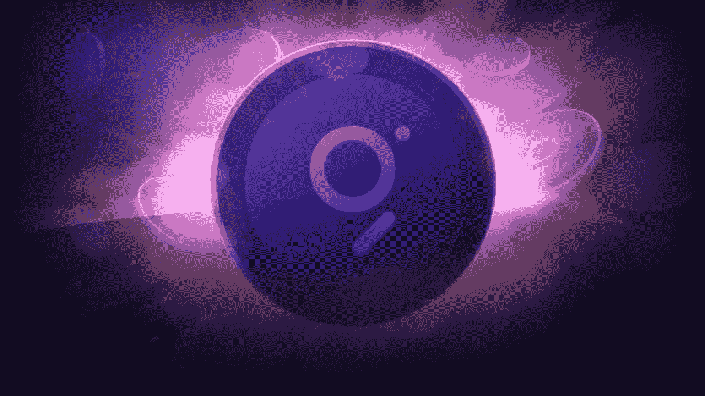

# 该图整合了 Polkadot、Solana、NEAR 和 Celo，成为区块链的谷歌

> 原文：<https://medium.com/coinmonks/the-graph-integrates-polkadot-solana-near-and-celo-and-becomes-the-google-of-blockchains-8d7467bc5667?source=collection_archive---------2----------------------->

Web 3.0 分析和查询平台 Graph 在 2020 年 12 月在区块链以太坊上线后，正在整合另外四个主要的区块链。

根据其最新的博客帖子，该图表现在将在其自托管服务上支持对 Polkadot，Solana，NEAR 和 Celo 的查询。但这似乎只是…