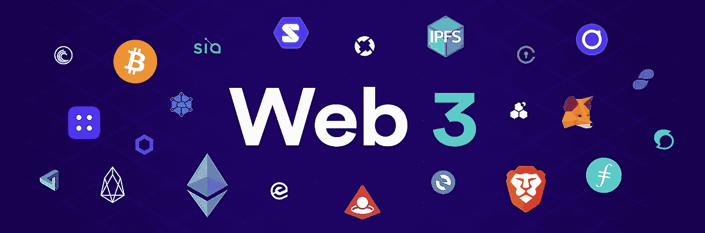
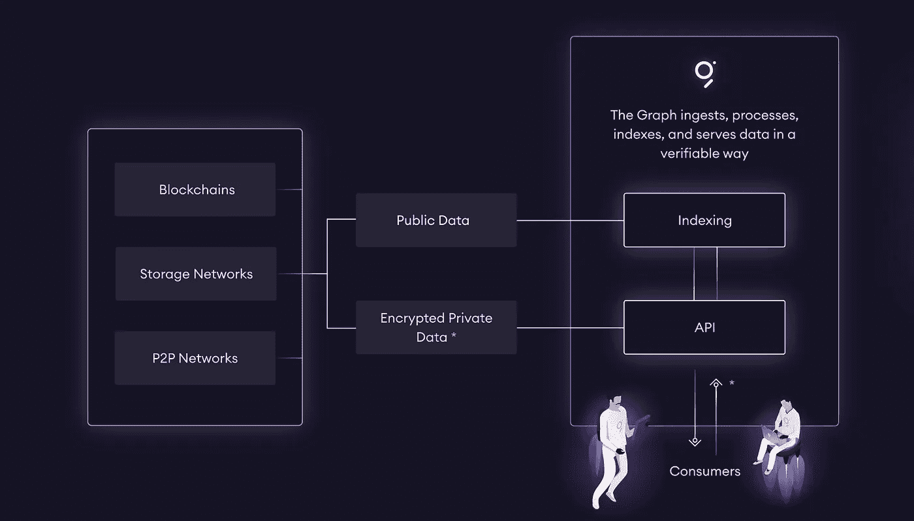

# 图表协议——下一步是什么？

> 原文：<https://medium.com/coinmonks/the-graph-protocol-whats-next-17e9f9578da9?source=collection_archive---------0----------------------->

虽然听起来可能很荒谬，但你可能会有兴趣知道互联网(Web 1.0 和 2.0)是一个集中式系统，即使我们愿意相信它只是一个计算机网络(包括你和我的)一起工作以促进数据和信息的共享，但重要的是要注意它的集中化赋予一些用户一些特权。例如，因为你已经决定使用一个特定的基于网络的服务，他们可能会决定关闭或改变可能对你产生不利影响的政策，而你可能对此无能为力。集中式互联网流行的另一个原因是，在人们不知情的情况下，人们的私人数据被用于不同的目的，这在过去引发了不同的问题和争议。

Web3 似乎是对由互联网的集中特性引起的不规则性的解决方案，自从它被提及以来，它受到了一些怀疑论者和批评家的强烈反对，他们认为去中心化应用程序(DApps)永远不会成为许多人采用的主流系统。

## **使用 Web3 的应用和数据**

Web3 的主要好处之一是，来自世界各地的开发人员可以在一个公平的环境中一起工作，创建开放源代码的应用程序，并可以无缝地相互协作。随着 DApp 开发者相互合作并为 Web3 的发展做出贡献，在 Web3 上创建一个快速增长的 DApp 创作者和用户网络变得很容易。

开发人员已经开始创建惊人的应用程序来增强人类与基于互联网的系统的交互，这已经不是什么新闻了。对于 Web3，将使用分散平台的数据和应用程序分为 6 个主要领域:

## **DeFi(分权财务)**

分散金融在加密社区越来越受欢迎，其发展速度超出了任何人的预期。集中化的金融面临着不同的挑战，分散化将无缝解决这些挑战。

## **治理**

当治理是集中的时，这意味着有一个中央权力机构可以提出可能考虑或可能不考虑贡献者的政策，因此如果中央权力机构做出了错误的决策，它会影响贡献者。然而，一个分散的治理系统是完美的解决方案，其中贡献者对系统的决策负责。有了 Web3 协议，分散治理将为更好的管理系统开辟道路。

## **赠款和慈善事业**

像这样的类别需要尽可能的透明和隐私，像区块链这样的不可变技术使数据和记录足够透明，可以看到，但又足够隐私，不能访问和更改。为赠款和慈善事业创建 DApps 将是一个受欢迎的发展，可用于 Web3 平台，因为它将消除中央系统造成的垄断。

## **市场**

近年来，我们看到了如此多的电子商务平台的出现，因为它给这些平台的用户带来了一些做生意的便利。然而，中央系统的缺陷也会影响在线市场和交易。无论您是从流行的在线商店购买商品，还是使用 FX 或加密交易所进行交易，使用 Web3 协议上的 DApps 执行这些任务都将更好，因为它让用户可以更好地控制他们在相关平台上的活动。此外，分散式系统以消除对中介的需求而闻名。

*   **娱乐**

娱乐是一个广阔的领域，有许多子类别，和其他类别一样，如果他们的全部潜力需要被利用，他们需要一个分散的系统。从知识产权到音乐许可，从电影平台到游戏，DApps 可以为不同的娱乐相关系统而创建。目前，加密社区已经开始享受一些娱乐 dapp，这足以证明 dapp 的大规模采用指日可待。

## **社交**

有了去中心化的社交应用，可能性是无穷的。这种社交 DApps 的用户不会成为垄断系统的受害者，在垄断系统中，社交平台比用户对用户数据拥有更大的权力。社交 DApps 将消除数据窃取的机会，并促进世界各地用户之间的无缝社交通信。

## 图中应该索引哪些数据？

在创建图表之前，开发人员承担着创建和促进专有索引服务器的责任，除了大量资源投入到这些索引服务器的操作、安全性、安全性、效率等事实之外。是用户经常遇到的问题。该图使得数据查询安全、高效、可靠、快速。数据是任何系统中最重要的部分之一，因此为这些重要的数据建立索引以便于以后检索是很重要的。

来自世界各地的公共信息应该在图表上进行索引，因为可以将这些数据转换成不同的形式，并对它们进行组织以便于检索。

## **图和子图的未来**

看到 DApps 在加密社区中的发展速度令人惊讶，这些应用程序被主流使用只是时间问题。与 10 年前第一种加密货币推出时相比，发生了很多变化，可以肯定地说，图表和子图表已经从战略上为 Web3 功能化做好了准备，并符合 DApps 成为主流应用的时间。节点操作符形式的索引器、控制信号和数据组织的策展人以及负责创建 DApps 和图表的开发人员都做得很好，考虑到他们正在提供像数据索引这样的不常见服务，该平台的未来看起来很光明。系统正在寻找安全可靠的平台用于索引目的，而 Graph 拥有为用户提供最佳数据索引服务所需的一切。

[https://twitter.com/graphprotocol](https://twitter.com/graphprotocol)

> **有用链接:**

[图表](https://thegraph.com/)

[图形浏览器](https://thegraph.com/explorer/)

[博客](https://thegraph.com/blog/)

[文档](https://thegraph.com/docs/introduction)

[Github](https://github.com/graphprotocol)

[推特](https://twitter.com/graphprotocol)

[电报](https://t.me/graphprotocol)

[Reddit](https://www.reddit.com/r/thegraph/)

## 另外，阅读

*   密码交易机器人
*   [Uniswap API](https://bitquery.io/blog/uniswap-pool-api) —如何获取 Uniswap 数据？
*   [AAX 交易所评论](/coinmonks/aax-exchange-review-2021-67c5ea09330c) |推荐代码、交易费用、利弊
*   [Deribit 审查](/coinmonks/deribit-review-options-fees-apis-and-testnet-2ca16c4bbdb2) |选项、费用、API 和 Testnet
*   [FTX 密码交易所评论](/coinmonks/ftx-crypto-exchange-review-53664ac1198f)
*   [Bybit 交换审查](/coinmonks/bybit-exchange-review-dbd570019b71)
*   最好的比特币[硬件钱包](/coinmonks/the-best-cryptocurrency-hardware-wallets-of-2020-e28b1c124069?source=friends_link&sk=324dd9ff8556ab578d71e7ad7658ad7c)
*   [密码本交易平台](/coinmonks/top-10-crypto-copy-trading-platforms-for-beginners-d0c37c7d698c)
*   [Bitsgap vs 3 commas vs quad ency](https://blog.coincodecap.com/bitsgap-3commas-quadency)
*   最好的[加密税务软件](/coinmonks/best-crypto-tax-tool-for-my-money-72d4b430816b)
*   [最佳加密交易平台](/coinmonks/the-best-crypto-trading-platforms-in-2020-the-definitive-guide-updated-c72f8b874555)
*   最佳[加密借贷平台](/coinmonks/top-5-crypto-lending-platforms-in-2020-that-you-need-to-know-a1b675cec3fa)
*   [莱杰纳米 S vs 特雷佐 one vs 特雷佐 T vs 莱杰纳米 X](https://blog.coincodecap.com/ledger-nano-s-vs-trezor-one-ledger-nano-x-trezor-t)
*   [block fi vs Celsius](/coinmonks/blockfi-vs-celsius-vs-hodlnaut-8a1cc8c26630)vs Hodlnaut
*   [bits gap review](/coinmonks/bitsgap-review-a-crypto-trading-bot-that-makes-easy-money-a5d88a336df2)——一个轻松赚钱的加密交易机器人
*   为专业人士设计的加密交易机器人
*   [PrimeXBT 审查](/coinmonks/primexbt-review-88e0815be858) |杠杆交易、费用和交易
*   [alt ready 审查](https://blog.coincodecap.com/altrady-reivew)
*   [埃利帕尔泰坦评论](/coinmonks/ellipal-titan-review-85e9071dd029)
*   [赛克斯石评论](https://blog.coincodecap.com/secux-stone-hardware-wallet-review)
*   [BlockFi 评论](/coinmonks/blockfi-review-53096053c097) |赚取高达 8.6%的加密利息
*   [面向开发人员的最佳加密 API](/coinmonks/best-crypto-apis-for-developers-5efe3a597a9f)
*   [最佳区块链分析工具](https://bitquery.io/blog/best-blockchain-analysis-tools-and-software)
*   [加密套利](/coinmonks/crypto-arbitrage-guide-how-to-make-money-as-a-beginner-62bfe5c868f6)指南:新手如何赚钱
*   顶级[比特币节点](https://blog.coincodecap.com/bitcoin-node-solutions)提供商
*   最佳[加密制图工具](/coinmonks/what-are-the-best-charting-platforms-for-cryptocurrency-trading-85aade584d80)
*   了解比特币的[最佳书籍有哪些？](/coinmonks/what-are-the-best-books-to-learn-bitcoin-409aeb9aff4b)

> [在您的收件箱中直接获得最佳软件交易](/coinmonks/newsletters/coinmonks)

