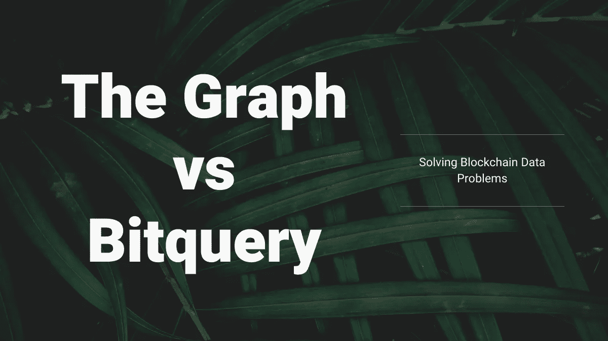
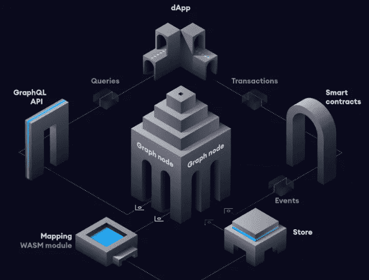
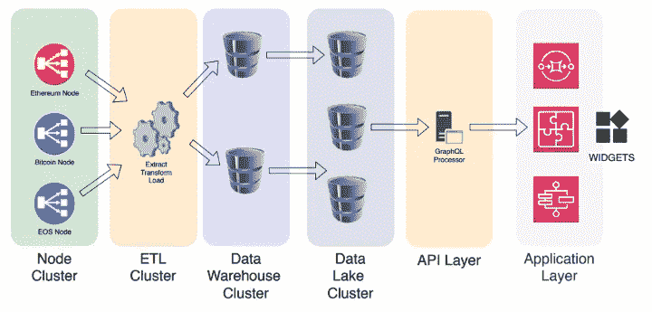

# 图形 vs 位查询——解决区块链数据问题

> 原文：<https://medium.com/coinmonks/the-graph-vs-bitquery-solving-blockchain-data-problems-331eb69013b7?source=collection_archive---------4----------------------->

区块链是“厄里斯的镜子”你总能在其中找到自己的兴趣。

经济学家视区块链为经济体。技术专家将区块链视为构建去中心化应用的平台。企业家将它们视为将其产品货币化的新方式，执法机构正在区块链寻找犯罪活动。

每个人都以自己的方式看待区块链。然而，如果没有简单可靠的区块链数据，每个人都是盲目的。

# 区块链数据问题

区块链每天都会产生数百万个交易和事件。因此，要分析区块链以获取有用的信息，您需要提取、存储和索引数据，然后提供一种高效的访问方法。这产生了两个主要问题:

*   **基础设施成本** —在开发应用程序之前，您需要可靠地访问区块链数据。为此，你需要对基础设施进行投资，这对开发者和创业公司来说成本很高，也是一个障碍。
*   **可操作的见解** —为了推动区块链数据的价值，我们需要增加背景。例如，区块链交易是标准交易还是 DEX 交易。是正常的 DEX 交易还是套利？有意义的区块链数据有助于企业提供可行的见解来解决现实世界的问题。

本文将探讨图和位查询[的异同。](https://bitquery.io/)

# 图表概述

[Graph](https://thegraph.com/)项目正在[以太坊](https://ethereum.org/)和 [IPFS](https://ipfs.io/) 之上构建一个缓存层。使用 Graph 项目，任何人都可以创建一个 GraphQL 模式(子图),并根据自己的需要定义区块链数据 API。图形节点使用该模式提取和索引数据，并提供简单的 GraphQL APIs 来访问数据。

## 图表解决的问题

出于多种原因，构建分散式应用程序(Dapp)的开发人员必须依赖集中式服务器来处理和索引他们的智能合约数据，例如为第三方服务创建 API，或者为他们的 Dapp 用户提供更多数据以增强 UX。然而，这给 Dapps 带来了单点故障的风险。

Graph 项目通过创建一个分散的网络来访问 Dapps 的索引智能合同数据，并消除对集中式服务器的需求，从而解决了这个问题。

# Bitquery 概述

Bitquery 正在构建一个区块链数据引擎，它提供了跨多个区块链的简单数据访问。使用 [Bitquery 的 graph QL API](https://explorer.bitquery.io/graphql)，可以访问 30 多个区块链的任何类型的区块链数据。

## Bitquery 解决的问题

开发人员、分析人员、企业出于各种原因都需要区块链数据，例如分析网络、构建应用程序、调查犯罪等。
Bitquery 提供统一的 API，用于跨多个区块链访问数据，以满足各个行业的任何区块链数据需求，如合规、游戏、分析、DEX 交易等。

我们的统一模式允许开发人员快速扩展到多个区块链，并在单个 API 中从多个链中提取数据。

# 普通的东西

## GraphQL

Graph 和 Bitquery 都广泛使用了 Graph QL T4，并使 GraphQL APIs 为最终用户提供了灵活查询区块链数据的自由。当谈到区块链数据时，在这里阅读为什么 [GraphQL 优于 Rest API](https://bitquery.io/blog/blockchain-graphql)。

## 去除基础设施成本

这两个项目都消除了最终用户的基础设施成本，并为他们提供了一种只需为所用付费的模式。

# 图形架构

该图包含了通过一群[索引器和管理器](https://thegraph.com/docs/introduction#how-the-graph-works)实现的去中心化。

索引器运行图节点，存储和索引子图数据。和管理器帮助验证数据完整性，并发出新的有用子图的信号。

该图旨在成为一个分散的缓存层，以实现对以太坊和 IPFS 数据的快速、安全和可验证的访问。

# 位查询体系结构

Bitquery 拥抱性能和开发者体验而非分散化。我们的中央服务器处理来自 30 多个区块链的超过 200 的数据。

我们专注于构建工具，为个人和企业轻松探索、分析和消费区块链数据。

# 图形和位查询的区别

Graph 和 Bitquery 之间有相当大的差异。让我们来看看一些显著的区别。

## 区块链支持

该图形仅支持以太网和 IPFS。然而，Bitquery 支持 20 多种区块链，并允许您使用 GraphQL APIs 查询其中任何一种。

## API 支持

该图允许您创建 GraphQL 模式(子图)并将其部署在图节点上。通过创建模式，开发人员可以将任何区块链数据作为 API 进行访问。

Bitquery 遵循统一模式模型，这意味着它为所有区块链 it 支持提供了类似的 GraphQL 模式。目前，Bitquery 扩展了这个模式，以支持更广泛的区块链数据 API。然而，我们正在构建 FlexiGraph，这是一个允许任何人扩展我们的模式以支持更复杂的区块链数据查询的工具。

## 易用性

使用 Bitquery，您只需要学习 GraphQL 并使用我们的模式来查询区块链。然而，对于这个图，您还需要理解编码，因为如果您正在寻找的数据在 community schema 中不可用，您需要部署您的 schema。

## 分散

该图是一个分散的图节点网络，用于索引和管理以太坊数据。我们认为 Graph 分散区块链数据访问的使命是一个新颖的目标，我们对此表示赞赏。然而，Bitquery 专注于构建 API，以支持最快的、可伸缩的多区块链数据访问，并配有有用的查询工具。

## 性能

Bitquery 的技术栈针对性能和可靠性进行了优化。此外，我们的集中式架构有助于我们优化延迟和响应速度以及其他性能指标。

图形去中心化方法使其成为数据访问的健壮网络。但是，该图仍在努力实现持续的性能交付。

## 开放源码

该图是一个完全的[开源项目](https://github.com/graphprotocol)。开发人员可以根据自己的需要验证代码库、派生代码库或集成代码库。

我们 Bitquery 也支持开源开发，尽可能地让我们的工具开源。例如，我们的[浏览器的前端](https://github.com/bitquery)是完全开源的，但是我们的后端是闭源的。

然而，我们总是按时重温我们的技术，看看是否有机会开源任何模块。

## 数据可验证性

区块链几乎所有的数据都是金融数据；因此，数据可验证性非常重要。图表网络有管理员，负责验证数据的准确性。

在 Bitquery，我们已经建立了自动系统来检查 API 的数据准确性。

## 定价

Graph 项目创建了 GRT 令牌，这将推动其网络上的定价。但是，GRT 令牌目前还不面向公众。

Bitquery 也处于公测阶段；因此，定价尚未公开。然而，生产中的许多项目都使用 Bitquery 和 Graph。目前，这两个项目都提供免费的 API。

# 结论

区块链数据中充满了丰富的信息，等待分析师去发现。我们支持 Graph 项目的目标，为应用构建者分散以太坊和 IPFS 的数据访问。然而，我们 Bitquery 选择了一条不同的道路，为个人和企业释放高度可靠的多区块链数据的真正潜力。

我们认为 Graph 和 Bitquery 相辅相成，解决了区块链数据市场的不同需求，并有一些明显的交集。我们的目标是构建一套产品，为个人和企业轻松探索、分析和消费区块链数据。该图旨在建立一个分散的网络，以实现对以太坊和 IPFS 数据的可靠访问。

请在评论部分告诉我们您看到的图形和 Bitquery 之间的相似之处和不同之处。

您可能还会对以下内容感兴趣:

## 关于 Bitquery

[**Bitquery**](https://bitquery.io/?source=blog&utm_medium=about_coinpath) 是一套软件工具，以统一的方式解析、索引、访问、搜索和使用区块链网络上的信息。我们的产品是:

如果您对我们的产品有任何疑问，请通过我们的[电报频道](https://t.me/Bloxy_info)提问，或发邮件至 [hello@bitquery.io](mailto:hello@bitquery.io) 联系我们。此外，请订阅我们下面的时事通讯，我们将为您提供加密货币世界的最新动态。

您可能还会对以下内容感兴趣:

*   [以太坊 DEX GraphQL APIs 示例](https://bitquery.io/blog/ethereum-dex-graphql-api)
*   [如何获得新创建的以太坊令牌？](https://bitquery.io/blog/newly-created-etheruem-token)
*   [如何调查一个以太坊地址？](https://bitquery.io/blog/investigate-ethereum-address)
*   [获取以太坊智能合约事件的 API](https://bitquery.io/blog/ethereum-events-api)
*   [获取最新 Uniswap 对列表的简单 API](https://bitquery.io/blog/uniswap-pool-api)
*   [ETH2.0 分析浏览器、小部件和 graph QL API](https://bitquery.io/blog/eth2-explorer-api-widgets)
*   [使用 Bitquery 区块链浏览器分析分散式交易所](https://bitquery.io/blog/dex-blockchain-explorer)

*最初发布于 2020 年 11 月 5 日*[*https://bit query . io*](https://bitquery.io/blog/thegraph-and-bitquery)*。*