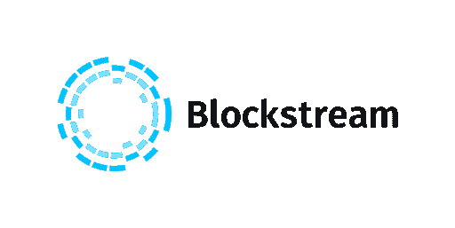
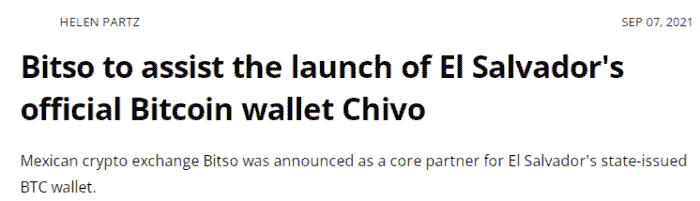
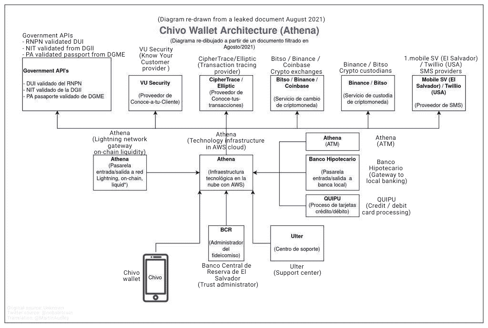
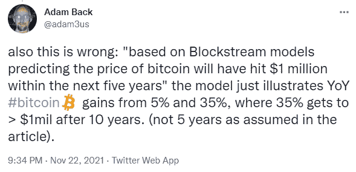
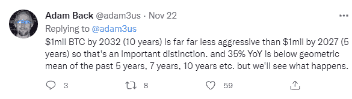
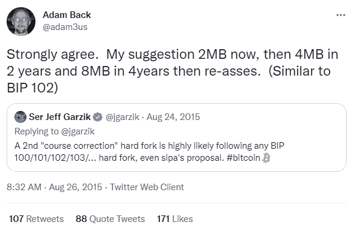
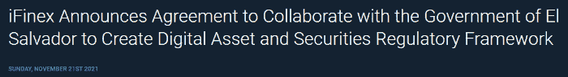

# 伟大的萨尔瓦多最大掩盖:阿尔格兰德，奇沃和$1B 块流债券

> 原文：<https://medium.com/coinmonks/the-great-el-salvador-maximalist-cover-up-algorand-chivo-the-1b-blockstream-bond-daeda20b72c4?source=collection_archive---------4----------------------->

主流媒体和新闻，经常歪曲新闻，争论和所有出现在秘密和区块链世界的情况。

然而，不管任何误导性叙述的协调努力，真相终将获胜。

在大部分必要的基础设施(代码、用户基础、品牌、愿景)完成后，目前的 BTC 智库仍然由 2015 年接管比特币的旧管理员和开发人员组成。

认为市场的其余部分只是“狗屎硬币”，或者认为它们没有任何用处，没有任何技术优势或金融创新，这是不理智的。

BTC 最大化主义者正在使用这种欺骗性的技术来削弱加密领域的创新，并将焦点转向比特币 BTC。

BTC 最大化主义者对其他致力于为世界创造有用产品的加密货币的大规模进攻，唯一的目的是创造额外的价格“泵”，并将人们推向一种加密资产，即 BTC。

比特币的影响者和受欢迎的人物，如斯诺登、多尔西、马斯克和塞勒，正在推广这种可怕的 BTC 最大主义方法。然而，这种方法只会限制该领域的创新，反而会加剧投机。

来自萨尔瓦多的最新报道对 Chivo 钱包基础设施提出了质疑。密码分析师和研究人员提出了一个新的假设，即萨尔瓦多也使用阿尔格兰德区块链，并提供额外的支付轨道来促进奇沃交易。

然而，对于萨尔瓦多政府和 Chivo wallet 对 Algorand 的具体使用情况，还没有任何官方声明。crypto media、Salvador 和 algrand 的所有猜测和不完整信息造成了这样一种印象，即考虑到 algrand 在 Chivo App 中的使用，新闻是被禁止的。

然而，我们仍然不知道 Algorand 是如何或是否被用来促进 Chivo 钱包，除非我们设法验证这些说法并找到证据，或提供官方解释。

# 区块流和比特币历史的改变

*Source:* [*Wikimedia Commons*](https://en.wikipedia.org/wiki/File:Blockstream_logo.svg) *(public domain)*

比特币代码只需要很小的修改就可以实现非常理想的可扩展性，但奇怪的是，block stream(AXA 和 Mastercard 等公司资助的营利性私人公司)旗下的一群开发人员发起了一场运动，以保持区块较小并阻碍大规模采用。

Blockstream 成立于 2014 年，比中本聪推出比特币晚了 5 年。Blockstream 的首席执行官亚当·巴克(Adam Back)从 2013 年底开始涉足比特币，他发表了第一篇 bitcointalk 帖子，介绍自己是比特币中 Satoshi 使用的技术 [Hashcash](https://en.wikipedia.org/wiki/Hashcash) 的创始人。在 Hashcash 的[白皮书](https://www.bitcoin.com/bitcoin.pdf)中，Satoshi 确实引用了 a。

更不寻常的是 Blockstream devs 提出的比特币缩放问题的解决方案。这个解决方案是运行在比特币之上的第二层网络，如闪电网络和灵动网络，都是由 Blockstream 资助和开发的。

“巧合的是”, Blockstream 也在与公众沟通的所有三个比特币媒体渠道的主要管理员的规模辩论中获得了支持。Bitcoin.org、Bitcointalk 和 Reddit 主要的比特币 subreddit r/Bitcoin。三家顶级比特币媒体，都掌握在一个匿名的人手中，这个人的昵称是 Theymos。

这种媒体报道的集中化对社区内任何有思想的人来说都是一种威胁，也是不可取的。Bitcointalk 和 r/比特币在缩放辩论中被武器化，审查了缩放支持者的声音，阻碍了讨论的真正进展。

从这一点上来说，辩论是不平等的。Blockstream 赢了，尽管社区中的大多数人希望比特币规模化，尽管 Blockstream 的反对意见有限。

Theymos 的立场很难理解，但研究人员在 Theymos 和 Blockstream 之间发现了一个有趣的联系，一个几乎从未被讨论过并被埋没在 bitcointalk 领域的事件([跟随(资金)流](https://forum.bitcoin.com/post32869.html#p32869)，[证明 Theymos 盗用论坛资金](https://www.reddit.com/r/btc/comments/55xjai/proof_that_theymoss_embezzled_forum_money_has/))。

目前，bitcointalk 或 Reddit 上任何质疑数字黄金(或“价值储存”)主要叙事的讨论或辩论都会遭到一群愤怒的 BTC 最大化主义者的愤怒评论。目的永远很明确，都是为了“数字上去”。

# 最近关于萨尔瓦多和使用阿尔格兰德的启示

*Source:* [*Wikimedia Commons*](https://commons.wikimedia.org/wiki/File:Algorand_Full_logo_black_small.png) *(CC BY-SA 4.0* [*licence*](https://creativecommons.org/licenses/by-sa/4.0/deed.en)*)*

萨尔瓦多将 LN 用于保管 Chivo 钱包，但仍然没有为任何区块链基础设施计划实施 BTC 区块链。它使用由 Strike 开发的 Chivo 应用程序，然而在 Chivo 架构中有各种各样的团体，Algorand 可能也参与其中。

这是我们将要探讨的被抑制的新闻部分。BTC 的叙述中没有提到，而是表达了对 LN 最终被(强有力地)用作萨尔瓦多的一个试验阶段的喜悦。

在许多场合发布了新闻，解释萨尔瓦多政府如何与阿尔格兰德公司合作，然而，即使这一事实也几乎没有传到主流媒体。

## 为什么如此巨大的合作关系对公众来说仍然是秘密的？

BTC 最大化主义者认为加密领域的其他创新不如比特币 BTC 项目和“狗屎硬币”。萨尔瓦多与阿尔格兰德的伙伴关系与这种说法相矛盾。

主流媒体将推动某一议程，该议程目前支持 Blockstream 控制下的 BTC。

在研究了两份关于此事的 Cointelegraph 报道( [source1](https://cointelegraph.com/news/bitso-to-assist-the-launch-of-el-salvador-s-official-bitcoin-wallet-chivo) 、 [source2](https://cointelegraph.com/news/here-s-why-algorand-algo-price-just-rallied-to-a-new-multi-year-high) )后，纳斯达克出版物最近[宣布了](https://www.nasdaq.com/articles/as-el-salvador-delves-deeper-into-blockchain-give-algorand-a-closer-look-2021-11-02)阿尔格兰德交易。

海伦·帕兹(Cointelegraph 记者)没有在标题[中包括 Cointelegraph 报道的最重要的新闻部分，即 Algorand。研究人员花了一段时间才找到这条新闻，并把这些点联系起来。然而，同样，这一切都表现得很松散，没有明确解释 Algorand 在 Chivo 应用程序中的作用。](https://cointelegraph.com/news/bitso-to-assist-the-launch-of-el-salvador-s-official-bitcoin-wallet-chivo)

> **雅典娜比特币将提供一些前端服务和 Chivo 的 ATM 相关操作，而阿尔格兰德将作为官方区块链提供商。**
> 
> *来源:* [*币报*](https://cointelegraph.com/news/bitso-to-assist-the-launch-of-el-salvador-s-official-bitcoin-wallet-chivo)

目前还不清楚 Algorand 在这个难题中的确切位置，然而，从泄露的解释 Chivo 钱包架构的文件中，我们观察到 Athena 比特币是 ATM 提供商，同时在 Chivo 生态系统中也具有核心地位。

[Twitter](https://twitter.com/AgoraExplora/status/1474163087464972295/photo/2)

然而，在上面的图表中找不到阿尔格兰德。

在我发现的所有相关文章中，都没有明确解释阿尔格兰德公司目前向萨尔瓦多提供何种区块链服务。布克勒政府和阿尔格兰德公司宣布合作，并解释说阿尔格兰德公司将帮助布克勒建设国家区块链基础设施。然而，大多数研究人员怀疑 Algorand 已经为 Chivo-LN 钱包提供了基础设施。

虽然，虽然流行的解释是 Algorand 应该提供一些模糊的支付轨道，但官方消息来源并没有确切地提到 Algorand 在 Chivo 应用程序中的使用方式以及它在整个过程中的作用。([源 1](https://cryptosrus.com/did-you-know-el-salvadors-chivo-app-runs-on-algorand/) ，[源 2](https://cryptosrus.com/did-you-know-el-salvadors-chivo-app-runs-on-algorand/) )

各种出版物中作为证据来源提到的新闻只是解释萨尔瓦多和阿尔格兰德之间将建立基础设施的伙伴关系的新闻。(即雅虎新闻:[萨尔瓦多**使用 algrand**](https://finance.yahoo.com/news/el-salvador-develop-blockchain-infrastructure-084104876.html)开发区块链基础设施)。没有可靠的消息来源提到 Algorand 正在使用支付轨道，而仅仅是对这一事实的猜测。

然而，一个重要的事实是有一个伙伴关系，萨尔瓦多有计划与区块链运动，BTC 最大主义者会声称是另一个“狗屎硬币”一样。

不过，还有一项与萨尔瓦多的交易，其实际意图更加令人困惑:

# 10 亿美元的债券！

Blockstream 在 2021 年 6 月接触了 Bukele，最近我们得知它成功谈判了一份 10 亿美元的合同，被称为“比特币债券”。

> **其中，5 亿美元将用于帮助建设所需的能源和比特币采矿基础设施，5 亿美元将用于购买更多的比特币。**
> 
> 来源: [Coindesk](https://www.coindesk.com/business/2021/11/21/el-salvador-to-create-bitcoin-city-use-500m-of-planned-1b-bond-offering-to-buy-more-crypto/)

让我们看看这种债券的模型表明了什么，因为 Blockstream 和萨尔瓦多似乎在这笔交易中大量参与了 BTC 价格投机。

> Blockstream 的首席战略官萨姆森·莫(Samson Mow)告诉听众，10 亿美元的令牌化债券将以 10 年期美元计价，初始利率为 6.5%。Mow 表示，经过五年的锁定期后，萨尔瓦多将开始出售其持有的加密货币，并向债券持有人支付额外的股息。
> 
> Mow 说，10 年后，年收益率将达到 146%

此时，所有人都想知道萨尔瓦多将如何支付这 146%的利息。让我们看看:

> … **根据区块流模型预测，比特币的价格将在未来五年内达到 100 万美元。**
> 
> Mow 说，事实上，通过使用所得的 5 亿美元购买比特币并锁定五年，萨尔瓦多希望通过让这么多的加密货币退出流通这么长时间，有助于比特币的价格升值。

我必须摘录并再次呈现萨姆森·莫在这里用大写字母说的话:

> ***“区块流模型预测未来五年内比特币价格将触及 100 万美元”***

**根据 Blockstream 的首席战略官 Samson Mow 的说法，总结一下**我们目前从这笔交易中读到的内容:

一个十亿美元的债券将由一个政府发行(buke le-Salvador)，而这个债券的成功是基于比特币-BTC 在未来五年内达到一百万美元的价格。

**宏不是这样工作的。**

虽然，似乎这个金融谬误甚至被 Blockstream 的首席执行官 Adam Back 注意到了，他跑到 Twitter 上缓解经济理性研究人员可能的爆发:

Source: [Twitter](https://twitter.com/adam3us/status/1462867225350754313)

因此，Samson Mow 的错误在于他使用的区块流“模型”，回溯可能运行更多的定量模型，发现比特币 BTC 达到 100 万美元的十年可能最符合这种说法。

五年不是故事实现的长期范围，所以用十年来代替吧。这是一个合理的时间“霍德尔”，然后根据亚当回来评估你的投资！或者，如果 BTC 没有达到 100 万美元，这可能是 Blockstream 成功或彻底失败的地平线。

然而，亚当·贝克刚刚验证了这种债券的投机(赌博)部分，以及它如何将成功建立在比特币 BTC 达到 100 万美元的基础上。不是按他说的 5 年，而是 10 年！一个比来自萨姆森的预测更温和的预测！

**Source:** [**Twitter**](https://twitter.com/adam3us/status/1462869100296822796)

因此，在萨尔瓦多纳税人的钱进行了所有这些不负责任的赌博之后，巴克唯一担心的是，比特币 BTC 不会在五年内达到 100 万美元，因为这太快了！但 10 年后，谁知道呢，极有可能，然后债券就成功了。

在 Blockstream 创造的这类金融工具中，我找不到任何专业性或理性的金融目标。

让我想起另一个关于增加块大小的 Adam Back 估计，向 Jeff Garzik 保证块流正在支持比特币的进步和可扩展性:

**Source:** [**Twitter**](https://twitter.com/adam3us/status/636410827969421312?lang=en)

Adam Back 显然在拖延和误导比特币开发者和社区对他的真实意图的理解。([阅读更多](https://read.cash/@Pantera/dr-strangelove-or-how-i-learned-to-stop-worrying-and-love-the-btc-6ae04220))。

Tether(当然)也参与了这种结合，因为它将通过 iFinex 来组织。

[source](https://www.bitfinex.com/posts/741)

Tether 将如何参与这笔交易还有待观察。

# 总之:萨尔瓦多纳税人知道这笔交易吗？

Adam Back 不是 YouTube 上的另一名交易员，但“比特币债券”是 Blockstream 和政府之间的实际交易。这是一笔涉及中美洲和拉丁美洲最贫穷国家之一纳税人资金的交易。

这种“比特币债券”行动是不负责任和堕落赌博成瘾的最大程度的最终表现，这种行为已经蔓延到整个比特币-BTC 社区。

“目的证明手段”是 BTC 今天的核心宗旨。

“数字上升”。这是一个庞氏骗局，和其他任何骗局一样，它有尽头，也将会崩溃，因为 BTC 失去对其他加密货币价格行为的控制的那一刻，将是创新解放的时刻。

这是萨尔瓦多公民必须问自己的一个聪明的问题，他们是否值得政府用他们的钱赌博。

布克勒办公室是一个政府，被指责为独裁主义和各种做法，不会增加任何杠杆时，它将不得不处理真正的金融世界。萨尔瓦多将发现前方的问题，这将对其经济造成不可挽回的损害，Blockstream 不会被任何人追究责任。

阿尔格兰德现在正在摧毁 BTC 最大化叙事，虽然从技术角度来看，这可能不是最好的区块链决策，但它仍然扩展到了 BTC 没有的范围，即智能合约。一个很好的问题是关于 Algorand 的去中心化模型，它似乎缺乏不变性和防篡改的基本原则，同时也可能存在审查交易的问题。

虽然，阿尔格兰德只是 BTC 叙事谬误的一个例子。

由 Blockstream 和 BTC maximalists 设定的 BTC 哲学是永远不要改变任何事情，保持区块链残废，而有利于第三方和保管服务。

表达这种立场的同一个 BTC 最大主义者，也站在 Blockstream 一边，宣传并积极推广这个集中的私人实体。

BTC 最大主义者对加密领域创新的立场仍有待观察，因为直到今天，它只是通过任何可能的手段“提升”BTC 价格。

这位 BTC“国王”如今正努力保住他的王位。12 年后，只是一些操纵交易的机制让它保持在那里。

是时候结束只关注一种资产的目光和价格了，让该领域真正的创新项目蓬勃发展，不受不负责任的投机者的突发奇想和操纵的干扰。

*在以下网站写作:●*[*read cash*](https://read.cash/@Pantera)*●*[*noise cash*](https://noise.cash/u/Pantera99)*●*[*Medium*](/@panterabch)*●*[*Hive*](https://hive.blog/@pantera1)*●*[*Steemit*](https://steemit.com/@pantera1)*●*[*声乐*](https://vocal.media/authors/pantera)

> **免责声明**:本内容中发布的所有材料均用于娱乐和教育目的，并符合**公平使用**的准则。
> 
> 无意侵犯版权。如果您是或代表本文所用材料的版权所有者，并且对所述材料的使用有疑问，请发送 [**电子邮件**](https://read.cash/@Pantera/cryptouknowns-battlegrounds-the-crypto-battle-royal-part-i-0ca762da#bad-link) 。

***支持内容创作者。***

如果你喜欢这个故事，就订阅吧！

*最初发布于*[*https://read . cash*](https://read.cash/@Pantera/the-great-el-salvador-maximalist-cover-up-algorand-chivo-the-1b-blockstream-bond-06e46345)*。*

> 加入 Coinmonks [电报频道](https://t.me/coincodecap)和 [Youtube 频道](https://www.youtube.com/c/coinmonks/videos)了解加密交易和投资

## 另外，阅读

*   [德国最佳加密交易所](https://blog.coincodecap.com/crypto-exchanges-in-germany) | [WazirX P2P](https://blog.coincodecap.com/wazirx-p2p)
*   [如何购买 Monero](https://blog.coincodecap.com/buy-monero) | [IDEX 评论](https://blog.coincodecap.com/idex-review) | [BitKan 交易机器人](https://blog.coincodecap.com/bitkan-trading-bot)
*   [如何在 Bitbns 上购买柴犬(SHIB)币？](https://blog.coincodecap.com/buy-shiba-bitbns) | [印度币安](https://blog.coincodecap.com/binance-in-india)
*   [币安 vs 比特邮票](https://blog.coincodecap.com/binance-vs-bitstamp) | [比特熊猫 vs 比特币基地 vs Coinsbit](https://blog.coincodecap.com/bitpanda-coinbase-coinsbit)
*   [如何购买 Ripple (XRP)](https://blog.coincodecap.com/buy-ripple-india) | [非洲最好的加密交易所](https://blog.coincodecap.com/crypto-exchange-africa)
*   [非洲最佳加密交易所](https://blog.coincodecap.com/crypto-exchange-africa) | [晤交易所评论](https://blog.coincodecap.com/hoo-exchange-review)
*   [eToro vs robin hood](https://blog.coincodecap.com/etoro-robinhood)|[MoonXBT vs by bit vs Bityard](https://blog.coincodecap.com/bybit-bityard-moonxbt)
*   [Stormgain 回顾](https://blog.coincodecap.com/stormgain-review) | [Bexplus 回顾](https://blog.coincodecap.com/bexplus-review) | [币安 vs Bittrex](https://blog.coincodecap.com/binance-vs-bittrex)
*   [Bookmap 评论](https://blog.coincodecap.com/bookmap-review-2021-best-trading-software) | [美国 5 大最佳加密交易所](https://blog.coincodecap.com/crypto-exchange-usa)
*   [如何在 FTX 交易所交易期货](https://blog.coincodecap.com/ftx-futures-trading) | [OKEx vs 币安](https://blog.coincodecap.com/okex-vs-binance)
*   [如何在势不可挡的域名上购买域名？](https://blog.coincodecap.com/buy-domain-on-unstoppable-domains)
*   [印度的加密税](https://blog.coincodecap.com/crypto-tax-india) | [altFINS 审查](https://blog.coincodecap.com/altfins-review) | [Prokey 审查](/coinmonks/prokey-review-26611173c13c)
*   [布洛克菲 vs 比特币基地](https://blog.coincodecap.com/blockfi-vs-coinbase) | [比特坎评论](https://blog.coincodecap.com/bitkan-review) | [币安评论](/coinmonks/binance-review-ee10d3bf3b6e)
*   [Coldcard 评论](https://blog.coincodecap.com/coldcard-review) | [BOXtradEX 评论](https://blog.coincodecap.com/boxtradex-review)|[uni swap 指南](https://blog.coincodecap.com/uniswap)