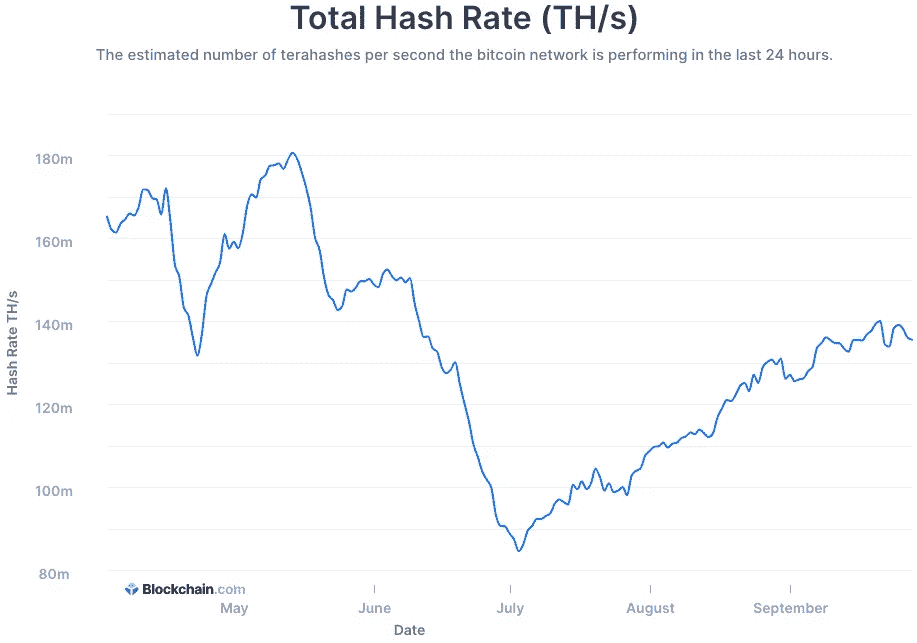

# The Greatest Power Grab in History

> 原文：<https://medium.com/coinmonks/the-greatest-power-grab-in-history-4d0f18632dab?source=collection_archive---------8----------------------->

Hello Everyone,

If you’re reading this, subscribe to my free newsletter, I heard its good:

[innovators.substack.com](https://innovators.substack.com/)

This newsletter was initially created to serve as a medium to communicate with a small group of investors interested in what I had to say about startups, and has quickly evolved into a community of intellectually curious folks interested in business, startups, and emerging technologies; so shout out to all of you. If you like it, I would appreciate it if you would share it with your friends who may like it as well!

— — — — — — — — — — — — — — — — — — — — — — — — — — — — —

By no means are we abandoning startup breakdowns and investment memos, but after a lot of positive feedback, I have added another layer of analysis surrounding the protocols shaping the future of the internet.

Two weeks ago I sent out a letter discussing [what Web 3.0 is and why it matters](https://innovators.substack.com/p/web-30-a-brave-new-internet-?r=onooc&utm_campaign=post&utm_medium=web&utm_source=). Since then a lot has transpired in the geopolitical crypto ecosystem and I have had a slew of people reach out with questions about what’s going on and what the implications might be.

Today we will look at China and the threat decentralization poses to totalitarianism, how the United States should address crypto regulation, and the opportunity that exists for the US to position itself as the global front runner in an emerging, digital frontier.

Let’s get into it.

Over the last nine months, modern day China, under the rule of the Chinese Communist Party (CCP), has increasingly drawn parallels to Nazi Germany. Allegations catalyzed by a complete disregard for human rights, nationalization of the country’s most valuable assets, and ultimately a cruel, overreaching authoritarian government. All done with the proclaimed rationale of striving towards “common prosperity”.

Xi Jinping and the CCP believe the most efficient way to build a society that is less corrupt and more equal is to do it themselves through authoritarian rule and by commanding the eradication of anyone or anything that stands in the way. Even if that means kneecapping the country’s most successful private companies.

For years China championed the growth of domestic tech giants like Alibaba, Tencent, Baidu, and Huawei because they created hundreds of thousands of jobs and contributed to an improving quality of life for Chinese citizens. These companies grew to contest their American and European competitors and validated that China was not just a “developing” nation but a player on the global tech stage.

The domestic peace that was created by increased prosperity at the hands of corporations gave the Chinese people a reason to take pride in these tech giants.

But now the CCP fears Big Tech presents a threat to the party’s quest for absolute hegemony. Late last year Chinese regulators blocked Ant Group’s IPO, one that was projected to be the largest in history. This year they have issued a massive antitrust fine to Alibaba, blocked app downloads of the ride sharing giant, Didi, after they IPO’d in the United States, and outlawed all edtech companies from generating a profit.

“Xi Jinping is always worried about political loyalty: to him, the Communist Party, and the party’s ideology,” says Susan Shirk, chair of the 21st Century China Center at UC San Diego.

These corporations have governance structures allowing them to know more about Chinese citizens than the CCP does. The enormous stores of data at the disposal of rich and famous tech titans is too big of a risk to leave unchecked. Recently, [an editorial by the state-run Global Times](https://www.globaltimes.cn/page/202107/1227859.shtml) said Didi (who owns 80% of the Chinese ride-hailing market) holds sensitive information about citizens’ personal travel and habits. It said the government won’t let internet giants “become rules-makers of data collection and usage,” and went even further to say ”the standards must be in the hands of the government.”

Though masked by efforts of consumer protection, China is not concerned with what kind of data is being held, they’re worried about who is holding it. Data has become one of the most critical resources of the 21st century and Xi Jinping does not want big tech to maintain exclusive access to it.

But why does this matter?

The common denominator in the actions of the CCP is an assertion of unprecedented control over the Chinese people. This point was underscored with the most recent crackdown on cryptocurrencies, banning all transactions within China’s borders. But it’s not merely a currency that causes Xi and the Chinese government to worry.

China is in fact testing its own digital currency, the digital yuan. The digital yuan stands in stark contrast to decentralized currencies like Bitcoin, Ethereum, and others because it is controlled by a centralized body, the Chinese government. This should serve as validation that even the greatest opposition is a proponent of the technology; having an official digital currency will allow China to better monitor citizens’ economic activity and enforce rules accordingly, essentially creating the greatest all-encompassing surveillance the world has ever seen.

In an Op-Ed, the [Human Rights Foundation’s Chief Strategy Officer, Alex Gladstein](https://twitter.com/gladstein) states, “Communist party officials would be using blockchain technology to prolong the lifespan of a regime built on cruelty and fear.”

Using blockchain on a centralized network is weaponizing the capabilities of the technology and further ingraining governmental control.

讽刺的是(也可能不是)，当政府监管集中式密码公司时，它们将推动去中心化金融平台的发展。例如，当中国打击加密时，火币(像比特币基地一样)看到了大量的资本外流；DeFi apps，相应地，看到了大量的资本流入。

这不应该是一个令人难以置信的发现。当专横的政府审查他们的公民时，将资产转移到一个抵制审查的平台是一个合乎逻辑的举动。

来自独裁国家的更大压迫只会加速资本流入 DeFi 协议。

权力下放是区块链的一个特点，而不是一个缺陷。它的好处是创造一个不受任何单一实体控制的平行经济。

强制集权及其伴随的控制与自由和自由相对立。中国已经在沙地上划了一条线，拒绝向 Web 3.0 过渡的国家承诺效忠秘密治理，而支持去中心化和鼓励创新的国家承诺透明和普遍繁荣。

人们想要自由，通常不愿意接受更少的自由。

当中国上次在 5 月份打击加密货币时，他们禁止矿工在中国运营(矿工指的是在区块链网络上验证交易的计算机)。

哈希速率是指区块链网络中计算机的速度和效率；随着越来越多的矿工以更快的速度验证交易，散列率会增加。在镇压之前，中国是世界上矿工最集中的国家。当它在 5 月份被宣布为非法时，哈希费率下降了 50%以上，因为矿工们实际上打包了他们的钻机(计算机)并搬迁到更适宜的国家。这表现为自 7 月份的低谷以来，网络上的散列率逐渐线性恢复。

想想物理学领域的分散化；能量守恒定律说能量既不能被创造也不能被消灭，只能被重新分配。在这里，我们将创造“分权第一定律”，链上的采矿权既不能被创造也不能被消灭，只能被重新分配。当暴虐的国家打击加密时，动能(散列率)下降并转化为势能，而矿工则迁移到更宽容的国家。

> 密码监管不是消费者保护。是银行保护，是义不容辞的保护。
> 
> —巴拉吉·斯里尼瓦桑(@巴拉吉斯)[2021 年 7 月 30 日](”https://twitter.com/balajis/status/1421131285255184388?ref_src=twsrc%5Etfw")

我通常反对先发制人的监管。美国是建立在创新而非监管的基础上的。你必须允许和鼓励人们打破东西，试图建立更好的东西，除非公众的福祉处于危险之中。

监管者和政策制定者没有动力成为梦想家，推动“颠覆性”(也就是创新性)技术，因为这些好处不会在他们的任期内实现。他们受到激励而变得保守，支持现任者，这样当下一轮选举周期到来或者到了重新提名的时候，他们的位置就稳固了。

然而，我将在讨论中增加另一层内容。Web 3 和去中心化在很大程度上仍处于早期，被恰当地称为蛮荒的西部。美国政府有机会与该领域的思想领袖合作，建立一个宽松的监管框架，保护消费者免受欺诈，并为开发商在法律范围内进行建设提供指导，但同时也是开放、宽容和鼓励破坏的。

典型的例子:

> 1/最近美国证券交易委员会出现了一些非常粗略的行为。
> 故事时间…
> 
> —布莱恩·阿姆斯特朗(@布莱恩 _ 阿姆斯特朗)[2021 年 9 月 8 日](”https://twitter.com/brian_armstrong/status/1435439291715358721?ref_src=twsrc%5Etfw")

在比特币基地首席执行官 Brian Armstrong 的这条 Twitter 帖子中，他指出，SEC 没有提供什么是允许的，什么是不允许的指导，但威胁要起诉比特币基地推出特定产品。

如果这种“粗略的行为”继续下去，美国将会落后，采用将自下而上。发展中国家迫切需要更好的操作系统，并且更倾向于立即实现区块链技术的好处，例如萨尔瓦多刚刚宣布比特币为法定货币。

我将更进一步预测，如果美国继续在支持向权力下放的过渡上拖后腿，历史书将会记住未来几十年是历史上最伟大的全球权力再分配。

迄今为止，美国监管机构采取的立场是捂着耳朵，希望未来会消失。

另一方面，潜在的未来美国参议员布莱克·马斯特斯呼吁美国政府通过购买比特币的战略储备来为这一潜在的未来做好准备。

> 中国上周禁止加密货币。
> 
> 我们反过来做。美国政府应该购买比特币的战略储备——中本堡，新的诺克斯堡。相关:我的美国参议员竞选团队现在接受 BTC 的捐款。给我发短信或写信给 bgm@blakemasters.com 了解捐赠信息。
> 
> —布莱克·马斯特斯(@ BG masters)[2021 年 9 月 27 日](”https://twitter.com/bgmasters/status/1442539765102833664?ref_src=twsrc%5Etfw")

在最近的一篇文章中， [Anthony Pompliano](https://twitter.com/APompliano?ref_src=twsrc%5Egoogle%7Ctwcamp%5Eserp%7Ctwgr%5Eauthor) 分析了这种不对称赌注的数学，他说，如果美国以大约今天的价格购买 200 亿美元(2022 年财政预算的 0.3%)，美国将以不到一年国家预算的 0.5%成为世界上最大的比特币持有者之一。

如果比特币跌至 0 美元，美国的损失可以记为舍入误差，但如果未来看起来像去中心化支持者所设想的那样，美国将继续保持其作为创新和机遇领导者的地位。

国家将权力下放视为威胁还是机遇，将揭示他们如何看待个人自由和个人自由。我很期待看到这一切的结局。

直到下一次✌️，

交流电（alternating current）

— — — — — — — — — — — — — — — — — — — — — — — — — — — — —

如果你喜欢这篇文章，分享给你的朋友。

如果你不喜欢这篇文章，把它分享给你的朋友，也许他们会喜欢！