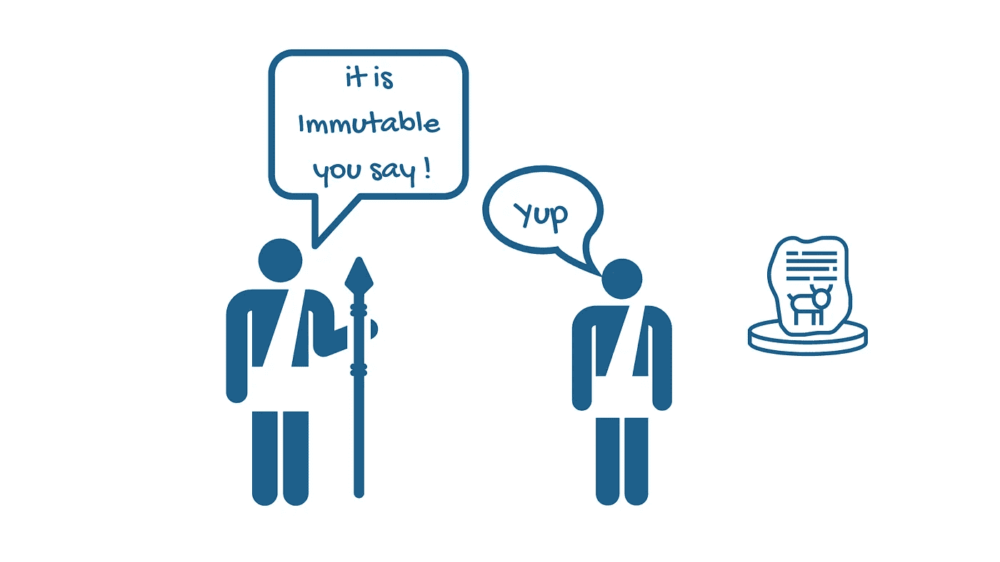
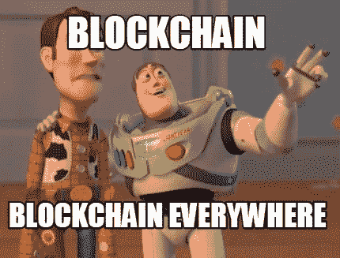
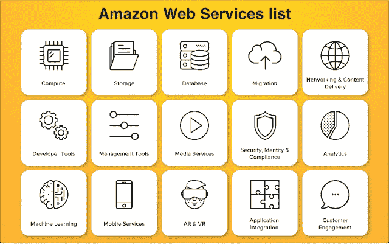
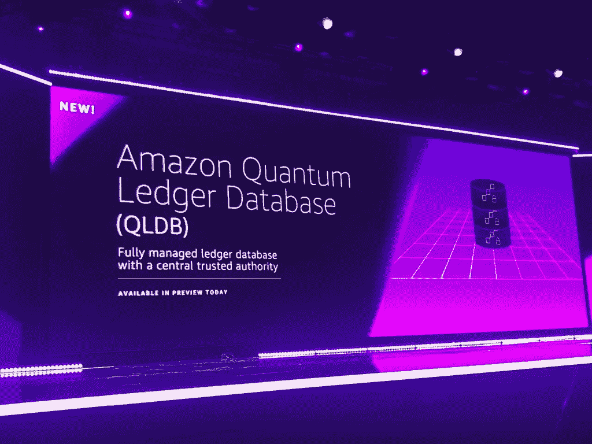
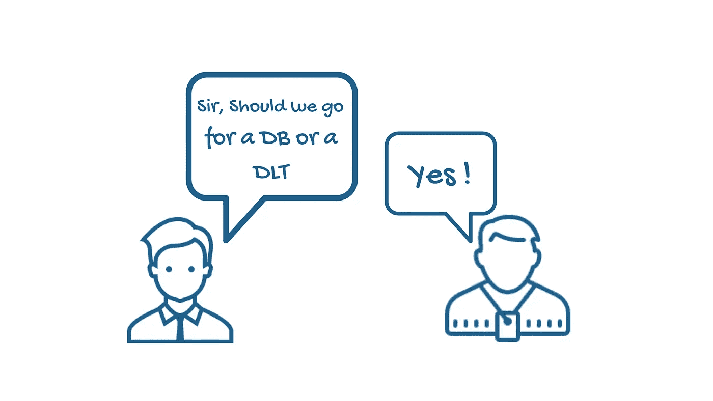
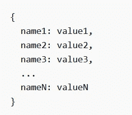
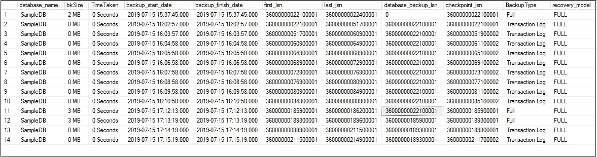
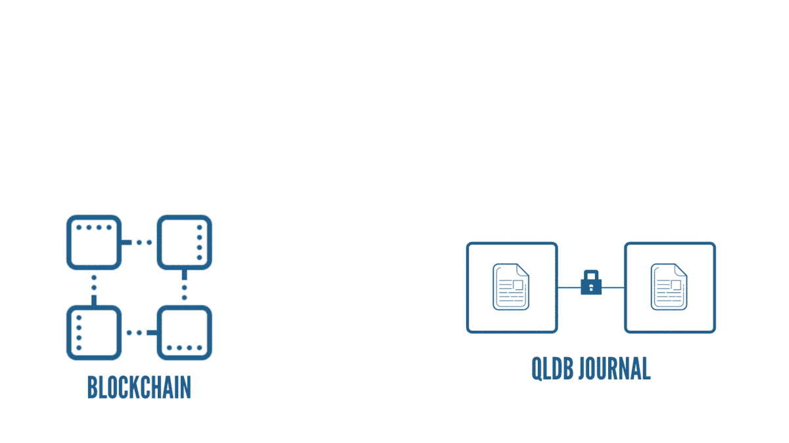
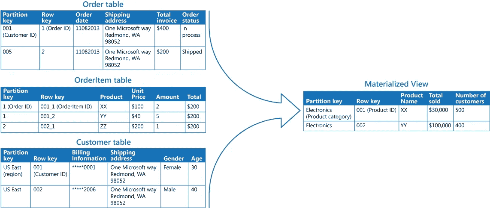
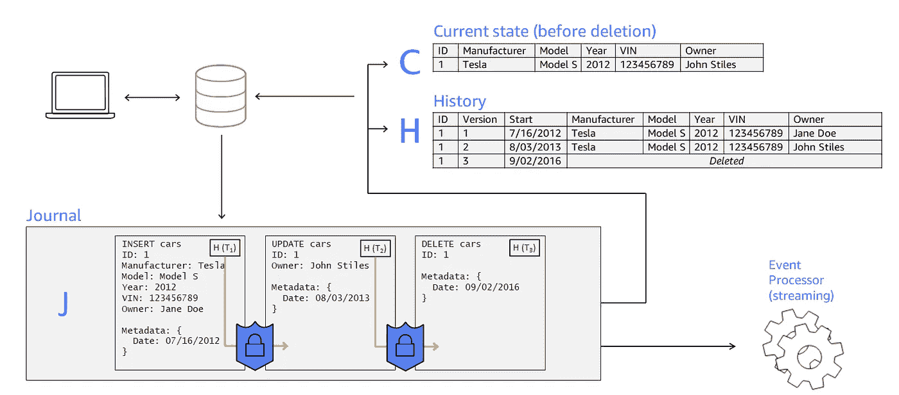

# DB 的心脏和 DLT 的灵魂…

> 原文：<https://medium.com/coinmonks/the-heart-of-db-and-the-soul-of-a-dlt-f5fe1229649e?source=collection_archive---------0----------------------->

## 量子账本数据库概述。

# 于是开始了探索…

在每一个伟大创新的核心，都有一个需求。这同样适用于分类帐技术。以我们首次尝试这项技术为例。不，我不是在说 satoshi 和比特币。我的故事更古老，大概有 5000-6000 年了。在一个简单得多的时代，一些随机的美索不达米亚公民，大概是农民，正在寻找跟踪他们的产品的方法。他们将代表他们产品的图像和数量刻在泥板上。这一事件标志着我们第一次尝试创造一种账本技术。

这是有必要的，因此一个解决方案诞生了。这些泥板标志着一个探索的开始，一个寻找完美账本技术的探索。从复式记账系统到分布式账本技术(DLT)，一切都源于这种追求。

有了 DLTs，事情变得非常有趣。还记得几年前，人们开始建造 DLT 只是为了它，你知道，每一个场合都有一个。这是最新的热门馅饼，每个人都想分一杯羹。

然而，最近的趋势显示，这种不稳定的行为有所减少。根据 Gartner 的图表，人们正从“DLT 能治愈癌症”的阶段转向更实际的观点。我们开始关注技术满足实际需求的用例(你必须有需求！).

说到任务和需求，2019 年 9 月，亚马逊推出了他们最新的任务竞争者。

一个久经考验的竞争者。

所以，这篇博客的目的是探索这个新竞争者背后的故事和原因。

# 故事

我们很清楚 AWS(亚马逊网络服务)的巨大。他们是领先的云服务提供商之一。从存储到计算，它们提供的产品足以填满一个商店。

Tip Of The Ice Berg. (Source: [Amazon Cloud Linux](https://www.amazoncloudlinux.com/2019/01/all-aws-products-and-use-of-each.html))

现在，服务越多，责任越大。我的意思是，想想看，有超过 100 万大大小小的客户依赖这些服务。想象一下这些人每天处理的数据。除了用户数据，AWS 还必须跟踪与负责运行这些服务的各种内部操作和系统相关的数据。现在，这种数据可能非常棘手。仅仅存储这些数据对你没有多大好处。您还必须找到方法来跟踪数据经历的所有变化。这样，当你需要进行审计，或者如果你想跟踪一个错误，或者如果事情出了差错，你可以使用这些“日志”。这种数据带来的另一个挑战是维护其完整性。

哦，你可能还想保持它不可变，我的意思是，你不会希望人们篡改这种关键日志，现在你会吗？

在这一点上，你们中的许多人可能会说这样的话，“嗯，他们必须有一个了不起的数据库来处理所有这些事情。”他们确实做到了。但是，在为此目的使用传统数据库时，[他们发现它无法扩展或提供支持他们最广泛使用的服务所需的性能](https://www.businesswire.com/news/home/20181128005679/en/AWS-Announces-Amazon-Quantum-Ledger-Database-QLDB)。

这时，AWS 的人们决定开发一种新技术来解决这些问题。他们开发了一种新型数据库来存储和跟踪数据。该数据库有助于维护一个完整的、不可变的、仅附加的数据更改记录。这是有必要的，因此一个解决方案诞生了。多年来，他们使用这项技术来跟踪数据的变化(尤其是配置细节之类的)。该技术帮助他们解决了传统数据库面临的可扩展性和性能问题。一切都很平静，AWS 继续繁荣。结束了。

开玩笑的。

# 满足需求！

根据马克·曼森的名言，“如果你遇到了一个问题，那么数百万其他人过去、现在和将来都有可能遇到这个问题。”这意味着一个可行的解决问题的方法可能会帮助所有这些人。因此，像任何优秀的公司一样，亚马逊与客户互动，发现许多客户面临着他们所面临的同样的问题。

您知道，跟踪数据变化对许多企业来说至关重要，但是使用传统数据库创建审计功能涉及到创建审计表之类的东西。这些事情往往会变得复杂。随着复杂性的增加，出错的机会也在增加。纠缠在一起的一组表也会影响可伸缩性。我是否提到了这样一个事实，即数据库通常不是不可变的，或者使用传统的数据库来合并这样的功能需要时间？

所以，在考虑了这一切之后，2019 年 9 月，亚马逊向普通大众推出了他们的新竞争者，名为量子账本数据库(QLDB)。

Source: [Techcrunch](https://techcrunch.com/2018/11/28/amazon-gets-into-the-blockchain-with-quantum-ledger-database-managed-blockchain/)

QLDB 是一个专门构建的数据库，它提供了一个透明的、不可变的、可加密验证的事务日志，帮助您跟踪应用程序数据发生的所有变化。

等一下！区块链怎么样？他们几乎做完全相同的事情，没有人称赞他们，对不对？嗯，关于区块链的事情是，它是分散的，最适合当有多方参与你的用例时。 **QLDB 是针对集中式应用的。它由中央权力机构拥有和运营**。它提供了类似 DLT 的功能，没有设置多节点网络的麻烦，也不需要共识机制。

# 第一个分类帐数据库。

如果您注意的话，您现在一定已经理解了 QLDB 实际上是一个数据库。不只是任何普通的数据库，它是一个分类帐数据库，第一个这样的数据库。你可能会问什么是分类账数据库，嗯，根据它的创建者所说，它是“**一个 NoSQL 数据库，它提供一个不可变的、透明的和可加密验证的交易日志，由一个中央机构拥有**简而言之，这是一个面向文档的数据库，具有区块链式的特性，归一个实体所有。

让我们试着理解这个区块链式的数据库的内部工作原理！

# 这一切是如何展开的！

假设我使用 QLDB 来跟踪数据。在 QLDB 中，我们使用文档表来组织数据。不，它不是典型的“关系数据库”表。您看，在这个面向文档的数据库中，您不仅仅存储文档的最新修订(或版本)。在这里，**您可以保留整个文档修订集** ( [一个*“修订”*代表文档完整数据集](https://docs.aws.amazon.com/qldb/latest/developerguide/qldb-glossary.html)的一次迭代)。没错，在 QLDB 中，一个表就是文档修订的集合。这些迭代中的每一个都有一个唯一的 ID 和版本号。

现在，在我开始创建表之前，我需要创建一个数据库实例。在 QLDB 的传说中，这被称为总账。在分类帐中，我可以构建自己的表，在这些表中，我可以存储文档。现在，这些是 Amazon ION 文档(类似于 JSON 的改进版)

所以，为了清楚起见，我将我的数据存储为一个 ION 文档并放在一个表中，这个表是分类帐的一部分。

完美。现在让我们改变数据。

与许多传统数据库一样，我们可以使用数据库事务来更改应用程序数据。我可以构建一个应用程序，将这些交易提交到分类帐。大多数数据库都保留了此类事务的日志。如果出现问题，这些日志可以帮助重新创建事务和检索数据。

Source: [SQL Stack](https://www.sqlshack.com/understanding-log-sequence-numbers-for-sql-server-transaction-log-backups-and-full-backups/)

通常，这些日志不是不可变的，用户很难访问这些数据。然而，在 QLDB 中，这些日志占据了中心位置。**QLDB 的核心组件之一是一个叫做日志的小东西。它类似于事务日志，其目的是存储所有数据变更的完整且可证明的历史**。这有点像坐在 DB 里面的区块链。我的意思是，当你仔细想想，相似之处是惊人的。与区块链一样，日记账是一种只附加的、不可变的结构，记录交易的详细信息。它将数据存储在称为块的单元中，这些块通过存储其前一个块的哈希值(SHA 256)来创建与相邻块的“加密链接”。

**每个分类账都有一个单独的日记账。**日志中的块包括用于提交修订的**语句(CRUD 语句)、表示提交的文档修订的对象以及其他元数据**。我们使用 partiQL(一种 SQL 兼容的查询语言)来编写语句。对于单个事务，QLDB 可以将一个或多个链式块写入日志。

所以，我做的每一笔交易都被顺序记录在这个防篡改的日志里。

我之所以称之为核心组件，是因为 QLDB 遵循所谓的“日志优先”方法。

在这种方法中，每个事务最初都提交到日志中。QLDB 通过将事务数据具体化到表中，使用来自日志的数据来确定数据的状态。

为了正确看待这一切，我们来看一盘棋。你可能已经注意到玩家如何通过改变棋盘上棋子的位置来移动，以及他们如何在记事本上记录这些移动。

嗯，在“日志优先”的方法中，玩家必须首先在笔记中写下移动，验证它，然后，根据他们的书写，在棋盘的状态中做出适当的改变。

这一切听起来很奇妙，但是如果我想访问我的数据的当前状态呢？嗯，最明显的方法是遍历日志中的所有事务，将它们应用到我的初始文档中，然后自己解决整个问题。嗯，那可不好玩，尤其是涉及到成千上万笔交易的时候。

这就是观点出现的地方。一个“视图”让生活简单多了。"**QLDB 中的*视图*是表中数据的投影。**“可以把它想象成一个虚拟的表格，其中包含了表格中定制的信息。您看，视图通过提供集中的简单子集，帮助隐藏表中数据的复杂性和错综复杂性。

Example Of A View | Source: [Redpanthers](https://redpanthers.co/materialized-views-caching-database-query/)

QLDB 为我们提供了表的内置视图。 **QLDB 使用事务信息来制定视图，它们促进了高性能查询**。下面是 QLDB 生成的视图，这些视图帮助用户使用简单的 partiQL 语句查询信息。

**用户视图**，本质上为您提供数据的当前状态，以及

**提交的视图**，它包含您的数据的最新修订以及系统生成的元数据(文档 ID、修订号等等)。

您还可以通过使用 history 函数获得特定文档的完整历史。该函数从提交的视图中返回修订详细信息。

# 总之…

因此，QLDB 是一个分类帐数据库，可以帮助我跟踪应用程序数据的变化。为了对数据进行修改，我使用了事务。QLDB 最初将事务存储在日志中，并使用日志来确定数据的状态。QLDB 还为我提供了各种视图，让我可以快速访问所需的信息。嗯，很好。

Image Source: [AWS Docs](https://docs.aws.amazon.com/qldb/latest/developerguide/what-is.overview.html)

QLDB 的用例包括财务数据管理、资源和物流管理、保险等。你看到模式了，不是吗？所有这些领域都非常重视数据血统。因此，如果您心中有这样一个用例，请考虑 QLDB。

好了，伙计们，这是对 Quantum Ledger 数据库的简要概述。

如需更详细的解释，请查看以下链接:

[文档](https://docs.aws.amazon.com/qldb/index.html)。

[在我们信任的数据中。](https://www.forbes.com/sites/amazonwebservices/2019/12/23/in-data-we-trust-the-why-and-how-of-amazon-qldb-a-purpose-built-immutable-and-verifiable-database/#3ad2cf9451c7)

QLDB 中的“Quantum”是对数据原子变化的认可，与超快速计算无关。

## 另外，阅读

*   最好的[密码交易机器人](/coinmonks/crypto-trading-bot-c2ffce8acb2a)
*   [密码本交易平台](/coinmonks/top-10-crypto-copy-trading-platforms-for-beginners-d0c37c7d698c)
*   最好的[加密税务软件](/coinmonks/best-crypto-tax-tool-for-my-money-72d4b430816b)
*   [最佳加密交易平台](/coinmonks/the-best-crypto-trading-platforms-in-2020-the-definitive-guide-updated-c72f8b874555)
*   最佳[密码借贷平台](/coinmonks/top-5-crypto-lending-platforms-in-2020-that-you-need-to-know-a1b675cec3fa)
*   [最佳区块链分析工具](https://bitquery.io/blog/best-blockchain-analysis-tools-and-software)
*   [加密套利](/coinmonks/crypto-arbitrage-guide-how-to-make-money-as-a-beginner-62bfe5c868f6)指南:新手如何赚钱
*   最佳[加密制图工具](/coinmonks/what-are-the-best-charting-platforms-for-cryptocurrency-trading-85aade584d80)
*   [莱杰 vs 特雷佐](/coinmonks/ledger-vs-trezor-best-hardware-wallet-to-secure-cryptocurrency-22c7a3fd391e)
*   了解比特币的[最佳书籍有哪些？](/coinmonks/what-are-the-best-books-to-learn-bitcoin-409aeb9aff4b)
*   [3 商业评论](/coinmonks/3commas-review-an-excellent-crypto-trading-bot-2020-1313a58bec92)
*   [AAX 交易所评论](/coinmonks/aax-exchange-review-2021-67c5ea09330c) |推荐代码、交易费用、利弊
*   [Deribit 审查](/coinmonks/deribit-review-options-fees-apis-and-testnet-2ca16c4bbdb2) |选项、费用、API 和 Testnet
*   [FTX 密码交易所评论](/coinmonks/ftx-crypto-exchange-review-53664ac1198f)
*   [n 零审核](/coinmonks/ngrave-zero-review-c465cf8307fc)
*   [Bybit 交换审查](/coinmonks/bybit-exchange-review-dbd570019b71)
*   [3Commas vs Cryptohopper](/coinmonks/cryptohopper-vs-3commas-vs-shrimpy-a2c16095b8fe)
*   最好的比特币[硬件钱包](/coinmonks/the-best-cryptocurrency-hardware-wallets-of-2020-e28b1c124069?source=friends_link&sk=324dd9ff8556ab578d71e7ad7658ad7c)
*   最佳 [monero 钱包](https://blog.coincodecap.com/best-monero-wallets)
*   [莱杰 nano s vs x](https://blog.coincodecap.com/ledger-nano-s-vs-x)
*   [bits gap vs 3 commas vs quad ency](https://blog.coincodecap.com/bitsgap-3commas-quadency)
*   [莱杰纳米 S vs 特雷佐 one vs 特雷佐 T vs 莱杰纳米 X](https://blog.coincodecap.com/ledger-nano-s-vs-trezor-one-ledger-nano-x-trezor-t)
*   [block fi vs Celsius](/coinmonks/blockfi-vs-celsius-vs-hodlnaut-8a1cc8c26630)vs Hodlnaut
*   [Bitsgap 评论](/coinmonks/bitsgap-review-a-crypto-trading-bot-that-makes-easy-money-a5d88a336df2)——一个轻松赚钱的加密交易机器人
*   为专业人士设计的加密交易机器人
*   [PrimeXBT 审查](/coinmonks/primexbt-review-88e0815be858) |杠杆交易、费用和交易
*   [埃利帕尔泰坦评论](/coinmonks/ellipal-titan-review-85e9071dd029)
*   [SecuX Stone 评论](https://blog.coincodecap.com/secux-stone-hardware-wallet-review)
*   [BlockFi 评论](/coinmonks/blockfi-review-53096053c097) |从您的密码中赚取高达 8.6%的利息