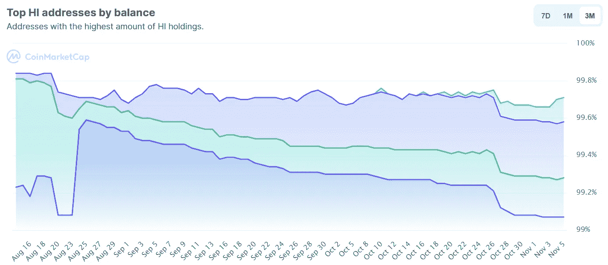

# hi 美元短短十天涨了 3 倍|现在买安全吗？

> 原文：<https://medium.com/coinmonks/the-hi-dollar-went-3x-in-just-ten-days-is-it-safe-to-buy-it-now-c299ad0ac3c6?source=collection_archive---------2----------------------->

## 10 月 26 日，1 美元兑 0.33 美元，截至 11 月 3 日，1 美元兑 0.93 美元，约为 3 倍。那么，美元升值是一个好的投资机会吗？让我们来了解一下！

# 嗨！

你好，hi.com 是一家总部设在新加坡的非营利组织，致力于通过其产品带来一场金融革命。此外，Hi 具有易于注册和开始的流程，以及知道他们在做什么的专业团队，因为 Hi 是由 Bitcoin.com 前首席执行官 Stefan Rust 和 Crypto.com 前 CMO Sean Rach 在 2021 年初创立的。

hi dollar 是平台的原生令牌，它将是您解锁 hi 生态系统的各种产品和功能的钥匙。因此，在这篇文章中，我们将试图找出 Hi 美元的未来，因为它将在该平台的成功中发挥重要作用。

# hi 美元为什么存在？

hi dollar 是一个基于 ERC 20 的实用令牌，帮助您与他们的各种产品进行交互。此外，持有 hi 美元的投资者有权获得 UPTO [20% APY](https://cms.hi.com/uploads/hi_Whitepaper_en_4da11a89e8.pdf) ，并获得以下平台的高级会员资格:

不仅如此，任何在 hi 上注册的人都有权每天领取 1 hi 美元。然而，这些资金将被锁定一年，你只能在成功完成身份验证后才能提取。

# 高价统计数据

根据 hi 团队，目前 hi 美元的流通供应量为 580，396，604 hi，目前的市值为[528，241，706 美元](https://coinmarketcap.com/currencies/hi-dollar/)。此外，根据 Coinmarketcap 的数据，持有 hi 美元的地址总数随着时间的推移不断上升，显示出投资者的良好兴趣。

然而，大约 99%的流通 hi 美元由前 10 个钱包地址持有。这可能最终意味着该令牌仍处于早期采用阶段，并可能成为早期采用者的一个好机会。

# 高美元技术分析

看下面的图表，我们可以看到，与之前的高点相比，交易量很高。此外，hi 美元成功地从底部泵出，并以显著的成交量打破了途中的所有阻力。然而，截至目前，它处于一个强阻力区，即 0.91 至 0.95，如果突破，可能会导致其牛市趋势的延续和新的历史高点。

# 你应该投资美元吗？

根据上面的技术分析，很明显，如果美元能够通过合理的采用和高交易量突破强阻力区，那么美元可以走很长的路(* *甚至 UPTO 10 美元)。此外，通过在 PancakeSwap 上列出 hi dollar，该平台已经提升了令牌。

此外，它还没有在集中交易所上市，这为它提供了很好的早期采用机会。我希望你们能意识到，一旦一枚硬币在任何一个集中交易所上市，会发生什么？它使劲抽；如果你忘了，1inch 刚刚让[在 Upbit 上上市](https://cryptobriefing.com/1inch-aave-soar-korean-exchange-listing/)，从大约 3.7 美元涨到 7.72 美元(是的，单日涨幅超过 100%)。进一步，我们可以从项目的快速增长中看到它的采用；因为它在成立仅六个月内就有超过 160 万的会员。

# 这还没有结束

是的，这不是它；如果你仍然怀疑是否拥有 hi 美元，你可以通过你的 Whatsapp 或 Telegram 注册成为社区的一员，每天 ***免费赚取 1 美元*** 。这对于资本较低的交易者来说是一个在早期积累硬币的绝佳机会。你所要做的就是在平台上注册并连接你的任何一个社交账户。

# 结束语

综上所述，hi dollar 还处于起步阶段，还没有在任何一家集中交易所上市。此外，hi.com 有一个广泛的社区，并向任何与该平台互动的人提供免费的 hi 美元。最后，从技术指标来看，一旦突破强阻力区，我们似乎可以看到一次像样的反弹。因此，从现在开始，你可以在 PancakeSwap 或 Uniswap 上投资 100 美元，成为早期用户。此外，如果你需要免费的 hi 美元，只需使用你的任何社交渠道注册即可。

# 常见问题

## 美元的价格会上涨吗？

截至上面文章中的技术分析，如果市场以高成交量突破 0.91 美元至 0.95 美元之间的高阻力区，那么是的，我们可以看到 Hi 美元的价格大幅上涨。

## **为什么美元兑日元的价格在上涨？**

最近，hi dollar 在 PancakeSwap 上市，为更多投资者投资它铺平了道路。此外，随着时间的推移，持有 hi 美元的地址数量也在增加，这表明投资者长期看好。

## **2021 年美元兑日元的价格预测是什么？**

随着加密投资者越来越乐观的情绪，比特币市场周期可能接近尾声，随着它的到来，我们肯定会看到其他硬币的新高。到 2021 年 10 月，我们可以期待它的价格再翻 5 到 10 倍。

## **该不该买 hi 美元？**

这个问题的答案最终取决于你的风险偏好。你可以浏览上面文章中的分析，也可以做自己的研究，然后，如果你觉得美元是一个很好的投资机会，那就去做吧！

本文没有任何金融建议，你应该只投资于你认为适合你的投资组合的市场。

与我联系，

[**推特**](https://twitter.com/prabxat) **|** [**领英**](https://www.linkedin.com/in/praxhat/)

> [比特币:中本聪时代](/coinmonks/bitcoin-the-age-of-satoshi-nakamoto-fe58157e740d?source=user_profile---------0----------------------------)

> [2021 年 11 月要购买的五大加密技术](/coinmonks/top-5-crypto-to-buy-in-november-2021-b9c99c44a704?source=user_profile---------1----------------------------)
> 
> [美元弗洛基霸权|我们要 0.01 美元吗？](/coinmonks/the-floki-supremacy-are-we-going-to-0-01-6763d56b9734?source=user_profile---------1-------------------------------)
> 
> [BTCST 刚刚 3 天涨了 5 倍|目标是 1000 美元吗？](/coinmonks/btcst-just-went-5x-in-3-days-is-it-aiming-for-1-000-9dcba894c954?source=user_profile---------1----------------------------)

> 银行会灭亡还是会适应？DeFi 的未来将会决定。

> [你钱包里的 100 美元是钱，还是没有价值的东西？](/coinmonks/is-the-100-bill-in-your-wallet-money-or-something-that-has-no-value-99263e8dfba6?source=user_profile---------0----------------------------)
> 
> [2021 年底前比特币还在破 100K 的路上吗？](/coinmonks/is-bitcoin-still-on-its-path-to-break-100k-before-the-end-of-2021-4716a56745ce?source=user_profile---------1----------------------------)
> 
> 作为一名大学本科生，我是如何开始投资 Crypto 的？

这篇文章中所写的一切都是我所相信的，你的想法可能与我的不同(显然，我们是两个不同的人)。所以，把这篇文章当做闲书，如果不喜欢内容，就当没看过吧！

> 加入 [Coinmonks 电报频道](https://t.me/coincodecap)，了解加密交易和投资。

**同样，阅读**

*   [币安 vs 北海巨妖](https://blog.coincodecap.com/binance-vs-kraken) | [美元成本平均交易机器人](https://blog.coincodecap.com/pionex-dca-bot)
*   [如何在印度购买比特币？](/coinmonks/buy-bitcoin-in-india-feb50ddfef94) | [WazirX 审核](/coinmonks/wazirx-review-5c811b074f5b) | [BitMEX 审核](https://blog.coincodecap.com/bitmex-review)
*   [比特币主根](https://blog.coincodecap.com/bitcoin-taproot) | [Bitso 回顾](https://blog.coincodecap.com/bitso-review) | [排名前 6 的比特币信用卡](/coinmonks/bitcoin-credit-card-bc8ab6f377c6)
*   [双子座 vs 比特币基地](https://blog.coincodecap.com/gemini-vs-coinbase) | [比特币基地 vs 北海巨妖](https://blog.coincodecap.com/kraken-vs-coinbase) | [硬币罐 vs 硬币点](https://blog.coincodecap.com/coinspot-vs-coinjar)
*   [印度加密交易所](/coinmonks/bitcoin-exchange-in-india-7f1fe79715c9) | [比特币储蓄账户](/coinmonks/bitcoin-savings-account-e65b13f92451) | [Paxful 审核](/coinmonks/paxful-review-4daf2354ab70)
*   [杠杆令牌](/coinmonks/leveraged-token-3f5257808b22) | [最佳加密交易所](/coinmonks/crypto-exchange-dd2f9d6f3769) | [AscendEX 评论](/coinmonks/ascendex-review-53e829cf75fa)
*   [Godex.io 审核](/coinmonks/godex-io-review-7366086519fb) | [邀请审核](/coinmonks/invity-review-70f3030c0502) | [BitForex 审核](https://blog.coincodecap.com/bitforex-review) | [HitBTC 审核](/coinmonks/hitbtc-review-c5143c5d53c2)
*   【Crypto.com 费用】 | [僵尸密码审查](/coinmonks/botcrypto-review-2021-build-your-own-trading-bot-coincodecap-6b8332d736c7) | [币安替代品](https://blog.coincodecap.com/crypto-com-alternatives)
*   [有哪些交易信号？](https://blog.coincodecap.com/trading-signal) | [Bitstamp vs 比特币基地](https://blog.coincodecap.com/bitstamp-coinbase)
*   [ProfitFarmers 回顾](https://blog.coincodecap.com/profitfarmers-review) | [如何使用 Cornix 交易机器人](https://blog.coincodecap.com/cornix-trading-bot)
*   [MXC 交易所评论](/coinmonks/mxc-exchange-review-3af0ec1cba8c) | [Pionex vs 币安](https://blog.coincodecap.com/pionex-vs-binance) | [Pionex 套利机器人](https://blog.coincodecap.com/pionex-arbitrage-bot)
*   [我的加密副本交易经历](/coinmonks/my-experience-with-crypto-copy-trading-d6feb2ce3ac5) | [比特币基地评论](/coinmonks/coinbase-review-6ef4e0f56064)
*   [CoinFLEX 评论](https://blog.coincodecap.com/coinflex-review) | [AEX 交易所评论](https://blog.coincodecap.com/aex-exchange-review) | [UPbit 评论](https://blog.coincodecap.com/upbit-review)
*   [AscendEx 保证金交易](https://blog.coincodecap.com/ascendex-margin-trading) | [Bitfinex 赌注](https://blog.coincodecap.com/bitfinex-staking) | [bitFlyer 审核](https://blog.coincodecap.com/bitflyer-review)
*   [麻雀交换评论](https://blog.coincodecap.com/sparrow-exchange-review) | [纳什交换评论](https://blog.coincodecap.com/nash-exchange-review)
*   [加密货币储蓄账户](/coinmonks/cryptocurrency-savings-accounts-be3bc0feffbf) | [赌注加密](https://blog.coincodecap.com/staking-crypto)
*   [BigONE 交易所评论](/coinmonks/bigone-exchange-review-64705d85a1d4) | [CEX。IO 审查](https://blog.coincodecap.com/cex-io-review) | [Swapzone 审查](/coinmonks/swapzone-review-crypto-exchange-data-aggregator-e0ad78e55ed7)
*   [最佳比特币保证金交易](/coinmonks/bitcoin-margin-trading-exchange-bcbfcbf7b8e3) | [比特币保证金交易](https://blog.coincodecap.com/bityard-margin-trading)
*   [加密保证金交易交易所](/coinmonks/crypto-margin-trading-exchanges-428b1f7ad108) | [赚取比特币](/coinmonks/earn-bitcoin-6e8bd3c592d9) | [Mudrex 投资](https://blog.coincodecap.com/mudrex-invest-review-the-best-way-to-invest-in-crypto)
*   [WazirX vs coin dcx vs bit bns](/coinmonks/wazirx-vs-coindcx-vs-bitbns-149f4f19a2f1)|[block fi vs coin loan vs Nexo](/coinmonks/blockfi-vs-coinloan-vs-nexo-cb624635230d)
*   [BlockFi 信用卡](https://blog.coincodecap.com/blockfi-credit-card) | [如何在币安购买比特币](https://blog.coincodecap.com/buy-bitcoin-binance)
*   [火币交易机器人](https://blog.coincodecap.com/huobi-trading-bot) | [如何收购 ADA](https://blog.coincodecap.com/buy-ada-cardano) | [Geco？一次审查](https://blog.coincodecap.com/geco-one-review)
*   [加密副本交易平台](/coinmonks/top-10-crypto-copy-trading-platforms-for-beginners-d0c37c7d698c) | [五大 BlockFi 替代方案](https://blog.coincodecap.com/blockfi-alternatives)
*   [CoinLoan 点评](https://blog.coincodecap.com/coinloan-review)|[Crypto.com 点评](/coinmonks/crypto-com-review-f143dca1f74c) | [火币保证金交易](/coinmonks/huobi-margin-trading-b3b06cdc1519)
*   [Bybit vs 币安](https://blog.coincodecap.com/bybit-binance-moonxbt)|[stealth x 回顾](/coinmonks/stealthex-review-396c67309988) | [Probit 回顾](https://blog.coincodecap.com/probit-review)