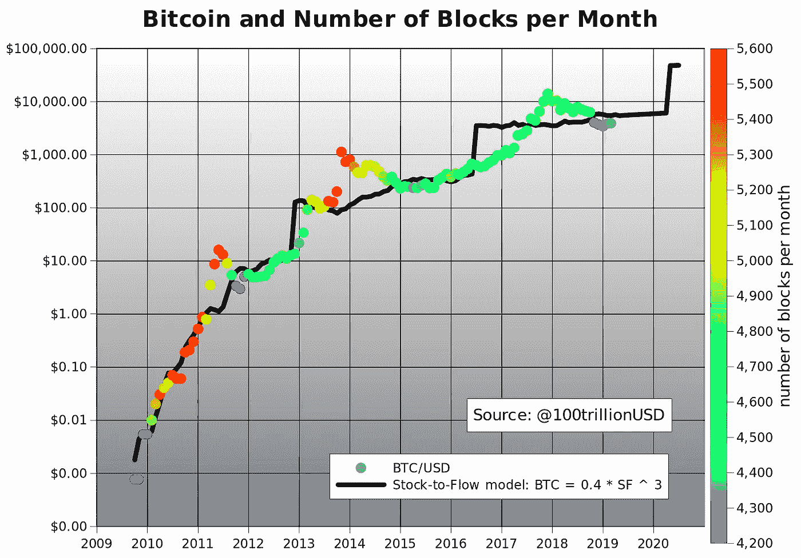
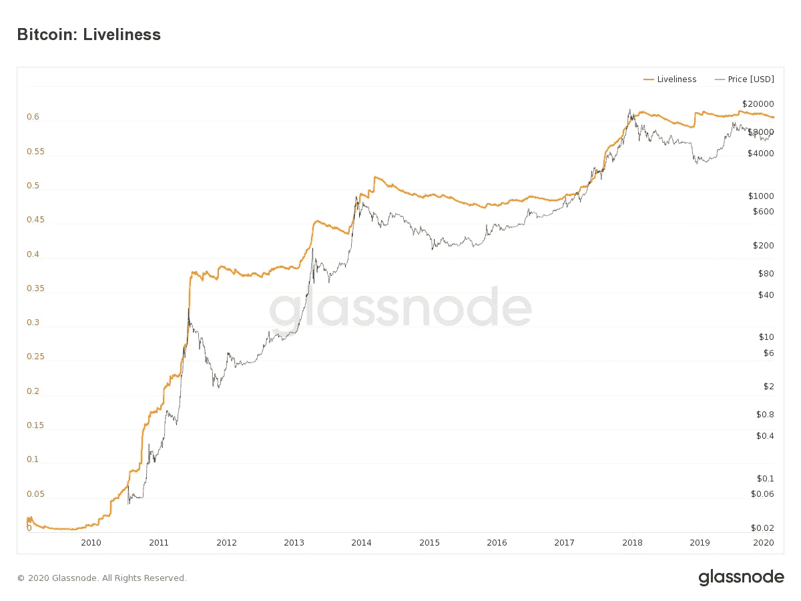

# 霍德勒的博弈——博弈论在比特币定价中的应用

> 原文：<https://medium.com/coinmonks/the-hodlers-game-a-summary-83ea4bac22d9?source=collection_archive---------1----------------------->

The Prisoner’s Dilemna: A famous application of Game Theory ([Picture](https://michigantoday.umich.edu/2019/09/26/the-prisoners-dilemma/))

# 介绍

霍德勒的游戏模型旨在为比特币社区目前讨论最多的两个话题提供不同的视角:S2F 模型是否准确，以及减半是否已计入价格。社区中已经有很多观点，但大多数都是从技术/IT/统计的角度(或者只是出于直觉)。这个模型将为讨论增加一个经济学的观点。总体而言，它将调查两个问题:我们是否会继续看到类似的价格波动和价格周期，如果是，为什么？

## 金钱和稀缺的概念

一项资产需要满足几个属性才能被认为是货币，例如:耐用、可分、可携带、统一、稀缺等等。许多数字资产很容易满足这些属性中的许多属性，除了“稀缺性”，因为相同的数字资产可以被无限复制。比特币被认为是第一种真正稀缺的数字资产，一些人甚至认为它是地球上最稀缺的资源之一，因为它的供应是不可逆的固定的，并且 100%已知——稀缺是使东西有价值的少数因素之一。

库存与流量比率是用来衡量稀缺性的。它将特定资产的现有库存/储备除以其年供应量(或增长率)。因此，库存与流动比率越高，供应的价格弹性越低。价格弹性低的供给对需求波动非常“不灵活”，需求波动会对资产价格产生放大效应。经济学家发现 S2F 比率与资产价格有很强的相关性，并引入了比特币的 S2F 比率(Saifedean Ammous——比特币标准)。根据这一观察，PlanB 开发了一个基于比特币 S2F 比率的模型来[预测未来的价格发展(PlanB，2019)](/@100trillionUSD/modeling-bitcoins-value-with-scarcity-91fa0fc03e25) 。S2F 模型表明，到目前为止，比特币价格可以通过该模型非常准确地建模，并且比特币的价格将在每减半后继续逐步增加，遵循 S2F 比率的模式(图 1)。

Figure 1: [S2F Ration by Plan B (2019)](/@100trillionUSD/modeling-bitcoins-value-with-scarcity-91fa0fc03e25)

# 霍德勒的博弈模型

## 观察

基于观察，霍德勒的博弈模型假设两种不同类型的人参与市场:霍德勒和机会主义者。霍德勒是长期投资者，他们已经(几乎)持有了他们觉得合适的数量的比特币(大多数已经达到了最大风险/财务敞口)。另一方面，机会主义者是具有中短期投资眼光的新手和/或交易者。

霍德勒倾向于在低波动时期积累，在价格飙升时卖出，而机会主义者则在交易的另一边，当他们进入市场时开始波动(图 2)。

Figure 2: *“*[*Liveliness*](https://studio.glassnode.com/metrics?a=BTC&m=indicators.Liveliness&mAvg=0&mScl=lin&pScl=log) *is defined as the ratio of the sum of Coin Days Destroyed and the sum of all coin days ever created. Liveliness increases as long-term holder liquidate positions and decreases while they accumulate to HODL.” Hodlers are selling their holding when the price increases, re-buy them during downturns and accumulate in low volatility phases.* (Glassnode.com, 2020) *& (Tamas Blummer)*

## 博弈论

在霍德勒的博弈模型中，两个参与者都被归因于他们通常在不同市场周期中使用的策略，对应于上述行为。根据对手的策略，玩家的潜在支付(效用)将因其每种策略而异。这些支出是根据观察和经验主观得出的。在一个博弈论设置中，参与者的行为是为了最大化他们的支出(红圈)。当两个参与者的最佳反应策略匹配时(两个红圈在同一个矩阵交叉点上)的情况称为一个[纳什均衡。](https://en.wikipedia.org/wiki/Nash_equilibrium)

Figure 3: Phase I — Hodlers vs Hodlers, Phase II — Hodlers vs Opportunists, Phase III — Hodlers vs Opportunists

该模型表明，在再积累阶段，霍德勒将通过购买或霍德林保持或多或少恒定的积极购买压力。其原因是，他们几乎已经达到了他们的最大承受风险，宁愿看到价格上涨，而不是进一步增加他们自己的风险。这种持续且相当轻的购买压力减缓了之前的“崩溃”，稳定并缓慢地再次提高价格(平坦的 U 形)(第一阶段)。通过将比特币的供应量减半，加上持续的购买压力，比特币的价格和波动性将继续缓慢上升，因为持有者不会因为这一事件而改变他们的策略。价格/波动性的增加使新的/更多的机会主义者陷入向上的恶性循环，而霍德勒开始出售(第二阶段)。机会主义者的优势策略是“购买”:无论对手做什么，购买都会给他们带来最高的回报，而“出售”是霍德勒的弱优势策略。这种动态一直持续，直到没有足够多的机会主义者继续进入市场，价格才回落(第三阶段)。比特币仍然被认为是一个风险很高的市场，大多数人仍然“害怕”它。因此，准备进入市场的潜在买家(机会主义者)很快就会枯竭。在这一点上，霍德勒回购他们的持股，因为“购买”现在是他们的弱优势策略(连同“Hodl”作为一个选项)，而“出售”是机会主义者的优势策略。机会主义者的退出最终会使大多数霍德尔留在市场上，这自然会导致“购买-霍德尔”均衡→再积累(第一阶段)。

霍德勒的游戏模型预测的行为，即纳什均衡，其中没有一个玩家有盈利偏差，与在真实条件下观察到的行为相匹配。根据定义，这一事实意味着参与者的行为是理性的和可预测的，因为它是理性战略决策均衡的结果。霍德勒的游戏模型所描述的合理性和可预测性有几个含义。

## 含义

*第一个寓意*

第一个含义是，类似的价格周期(再积累期后出现峰值)将在未来继续出现，这一预测与 S2F 模型的预测一致。此外，每个主要的机会主义者进入/退出时期都伴随着巨大的波动，在此期间，S2F 比率是 S2F 模型中的主要异常值。

Figure 4: The 5% highest volatility days (positive and negative) are gathered around 3 major periods.

因此，如果条件保持不变，在下一个机会主义者进入时期，价格很可能会继续超过 S2F 模型预测的“正常”价格。

Figure 5: The highest volatility days’ S2F ratios coincide with the most extremes S2F Model’s outliers

*第二层含义*

第二个含义是，未来的价格周期依赖于机会主义者在每个周期后转变为霍德尔。如果周期仅由具有周期性峰值的平坦再积累阶段组成，平均价格将保持相当平坦(就像“心电图”图)。那么，正如 S2F 模型所展示的那样，它是如何“逐步”增加的呢？在每个周期之后，一些机会主义者转变为霍德尔，这增加了长期市场参与者的数量。这些参与者，霍德勒，负责在下面的再积累阶段将价格保持在较高水平:S2F 模型的下一个“步骤”。

*第三层含义*

第三点，也是最有趣的一点是，比特币价格减半并没有反映在价格中，现实要微妙得多。霍德勒知道未来会减半，并知道比特币“应该”值多少钱。然而，它并没有相应地定价，因为霍德勒缺乏必要的资源来这样做:“我希望我有 1/6.15/21/100 比特币，可惜我买不起这么多”。愿意认真评估和长期投资比特币的资源的总聚合价值与他们估计的比特币的价值相比相形见绌。这一事实阻碍了市场按照参与者对比特币价值的估计为其定价。因此，矛盾的是，比特币价格持续上涨的事实部分是由于每个时间点的资源缺乏。机会主义者首先被不断增长的波动性所吸引，并在价格减半后长期留在市场上，他们对价格的长期大幅上涨负有责任。因此，人们可以说，halvings 通过吸引额外的资源进入比特币的定价，帮助市场更“有效”地为比特币定价。

因此，我们可以假设，只要可用于评估比特币价值的资源超过霍德勒赋予它的价值，比特币就有可能被“正确”评估。当满足这一条件时，我们可以假设未来的减半将被计入价格，从而打破 S2F 模型(逐步急剧增加将被平滑)。加速这一过程的一个因素是机会主义者的学习曲线(以及公众的学习曲线)，因为它将影响临界估值达到的速度。显然，霍德勒意识到他们高估了比特币(不切实际的预期、监管等)或潜在机会主义者的枯竭，也将打破 S2F 模型和比特币持续的周期性价格上涨。

## 结论

霍德勒的游戏模型表明，被许多人视为“非理性”的比特币价格实际上是理性行为的结果。这种合理性为未来价格周期的走向提供了一定的可预测性。它成立的一个重要条件是市场参与者的动态保持不变:机会主义者分批进入市场，一小部分人长期停留，霍德尔在较长时间内支持价格水平。

> [在您的收件箱中直接获得最佳软件交易](https://coincodecap.com/?utm_source=coinmonks)

