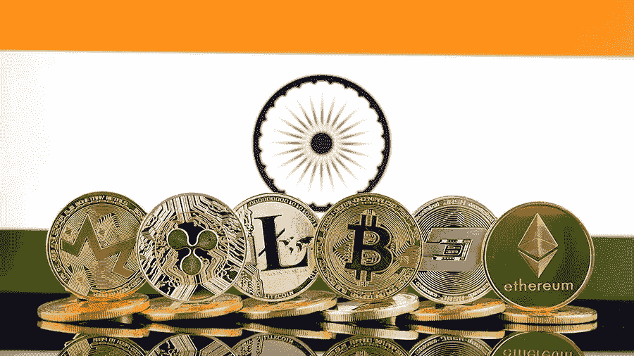

# 印度，关于加密税的喧嚣！

> 原文：<https://medium.com/coinmonks/the-hullabaloo-about-crypto-taxes-india-d0d985904eea?source=collection_archive---------7----------------------->

Image : Bharat Briefing

如果您是 Crypto 新手，并且希望探索和理解该技术背后的基本概念，我建议您浏览我以前的文章，以获得关于该主题的一些动力。

 [## 破译密码术语！！

### 节点:任何连接到区块链网络的计算机都称为节点。一个节点的主要目的是验证每一批…

medium.com](/@hksrise/deciphering-the-crypto-lingo-dcbcb51eadee)  [## 比特币挖矿中的复杂难题不再复杂！

### 在我们开始解密比特币挖掘的复杂性之前，我觉得有必要快速了解一下…

medium.com](/coinmonks/complex-puzzle-in-bitcoin-mining-aint-complex-no-more-9035b25b2a10) 

加密一直是最近最热门的投资工具。疫情事实上加速了好奇的散户投资者对它的采用，这在他们中间造成了关于加密税的进一步混乱。我将试着让你摆脱这个负担，并简化围绕印度秘密税的猜测。

# 让我们先了解加密货币是如何获得或生成的？

获得加密货币有三种主要方式，如下所述:

1.  挖掘:这是一种活动，矿工利用他们的计算机能力，通过解决维护加密区块链所必需的难题来获得加密资产。
2.  从加密交易所购买:使用真实货币从货币交易所购买，并以数字形式存储在在线货币钱包中。其中的一些交易所是[币安](https://www.binance.com/en)、 [CoinDCX](https://coindcx.com/) 、 [Coinswitch 俱吠罗](https://coinswitch.co/)、[比特币基地](https://www.coinbase.com/)。
3.  作为法定货币:可以作为商品和服务销售的对价，代替真实货币。

# 印度加密货币的税务影响:

印度央行尚未给予任何加密货币在印度的法定货币地位。因此，没有明确的准则来定义加密货币的可征税性，这需要 IT 部门的具体澄清。

根据 1961 年《所得税法》和 2017 年《中央商品和服务法》，根据交易类型，加密货币有多种征税可能性。

# 根据 1961 年所得税法，不同的加密货币交易及其税务影响:

A.**工资和房产收入&房产** —由于加密货币还不是法定货币，雇主不能使用加密货币转账支付工资。

B.**资本收益** —根据[所得税第 2(14)](https://indiankanoon.org/doc/1944929/) 节的规定，加密货币转让产生的任何收益，如果是用于投资，都必须被视为资本收益。根据投资持有的持续时间，它将受到长期资本利得(20%后 [*指数化*](https://cleartax.in/s/indexation-helps-reduce-tax-debt-fund-gains#:~:text=Indexation%20is%20used%20to%20adjust,effectively%20means%20a%20lower%20tax.&text=The%20rate%20of%20inflation%20to,Cost%20Inflation%20Index%20(CII).) *)* 或短期资本利得(根据个人税板征税)。

C.**业务收益** —根据所得税的[第 2(13)](https://indiankanoon.org/doc/1272810/) 节，收取加密货币作为销售商品和提供服务的对价，以及销售和购买加密货币作为贸易中的股票都应纳税。任何持续的活动，如加密货币贸易，都包含在该定义中，根据所得税法第[节第 28](https://taxguru.in/income-tax/section-28-profits-gains-business-profession.html) 条，实现的利润应纳税。

D.**加密货币开采** —据信开采产生的加密将被视为“来自其他来源的[收入](https://taxguru.in/income-tax/notes-income-sources.html)”。

E.**接受加密作为礼物** —接受加密作为礼物的加密货币将在其他来源的收入项下按相关平板税率征税，接受价值 50，000 卢比及以上的加密货币应全部征税。一些貌似合理的免税礼物是收到的礼物:

1.  从亲戚那里
2.  在结婚之际
3.  根据遗嘱或通过继承的方式

# CGST 法案下的税收:

印度密码交易所已经向用户收取商品及服务税。这种间接税包含在交易所加在比特币、以太坊等买入价格上的交易费用中。此外，交易所向政府支付商品及服务税，作为其一般税款的一部分。

最近，中央经济情报局(CEIB)向中央间接税和关税局(CBIC)提出了一项提案，将加密货币交易所和平台纳入商品及服务税的管辖范围。它建议将加密货币开采视为一种服务供应，因为它产生加密货币并收取交易费，因此，应归类为无形资产，并吸引 18%的商品及服务税。CEIB 还提议，作为加密货币矿商运营的纳税人，如果年收入超过 200 万印度卢比，将被要求根据商品及服务税进行注册。GST 将承担交易费用和/或奖励，即开采的货币。

在接下来的博客中会有更多关于加密的内容，再见！

*演职员表:Indiankanoon.org，Cleartax.in，India-briefing.com，Taxguru.in*

> 加入 Coinmonks [电报频道](https://t.me/coincodecap)和 [Youtube 频道](https://www.youtube.com/c/coinmonks/videos)了解加密交易和投资

## 另外，阅读

*   [尤霍德勒 vs 科恩洛 vs 霍德诺特](/coinmonks/youhodler-vs-coinloan-vs-hodlnaut-b1050acde55a) | [Cryptohopper vs 哈斯博特](https://blog.coincodecap.com/cryptohopper-vs-haasbot)
*   [如何匿名购买比特币](https://blog.coincodecap.com/buy-bitcoin-anonymously) | [比特币现金钱包](https://blog.coincodecap.com/bitcoin-cash-wallets)
*   [币安 vs FTX](https://blog.coincodecap.com/binance-vs-ftx) | [最佳(SOL)索拉纳钱包](https://blog.coincodecap.com/solana-wallets)
*   如何在 Uniswap 上交换加密？ | [喜美元评论](https://blog.coincodecap.com/hi-dollar-review)
*   [3 commas vs . Pionex vs . crypto hopper](https://blog.coincodecap.com/3commas-vs-pionex-vs-cryptohopper)
*   [币安 vs 北海巨妖](https://blog.coincodecap.com/binance-vs-kraken) | [美元成本平均交易机器人](https://blog.coincodecap.com/pionex-dca-bot)
*   [新加坡十大最佳加密交易所](https://blog.coincodecap.com/crypto-exchange-in-singapore) | [收购 AXS](https://blog.coincodecap.com/buy-axs-token)
*   [投资印度的最佳密码](https://blog.coincodecap.com/best-crypto-to-invest-in-india-in-2021) | [HitBTC 评论](/coinmonks/hitbtc-review-c5143c5d53c2)
*   [加拿大最佳加密交易机器人](https://blog.coincodecap.com/5-best-crypto-trading-bots-in-canada) | [赌注加密](https://blog.coincodecap.com/staking-crypto)
*   [如何在印度购买比特币？](/coinmonks/buy-bitcoin-in-india-feb50ddfef94) | [WazirX 审查](/coinmonks/wazirx-review-5c811b074f5b)
*   [比特币主根](https://blog.coincodecap.com/bitcoin-taproot) | [Bitso 评论](https://blog.coincodecap.com/bitso-review) | [排名前 6 的比特币信用卡](/coinmonks/bitcoin-credit-card-bc8ab6f377c6)
*   [最佳免费加密信号](https://blog.coincodecap.com/free-crypto-signals) | [YoBit 评论](/coinmonks/yobit-review-175464162c62) | [Bitbns 评论](/coinmonks/bitbns-review-38256a07e161)
*   [huo bi 的加密交易信号](https://blog.coincodecap.com/huobi-crypto-trading-signals) | [BitMEX 评论](https://blog.coincodecap.com/bitmex-review)
*   [7 个最佳零费用加密交换平台](https://blog.coincodecap.com/zero-fee-crypto-exchanges) | [硬件钱包](/coinmonks/hardware-wallets-dfa1211730c6)
*   [分散交易所](https://blog.coincodecap.com/what-are-decentralized-exchanges) | [比特 FIP](https://blog.coincodecap.com/bitbns-fip) | [Pionex 审查](https://blog.coincodecap.com/pionex-review-exchange-with-crypto-trading-bot)
*   [用信用卡购买密码的 10 个最佳地点](https://blog.coincodecap.com/buy-crypto-with-credit-card)
*   [OKEx 回顾](/coinmonks/okex-review-6b369304110f) | [Kucoin 交易机器人](/coinmonks/kucoin-trading-bot-automate-your-trades-8cf0ca2138e0) | [期货交易机器人](/coinmonks/futures-trading-bots-5a282ccee3f5)
*   [AscendEx Staking](https://blog.coincodecap.com/ascendex-staking)|[Bot Ocean Review](https://blog.coincodecap.com/bot-ocean-review)|[最佳比特币钱包](https://blog.coincodecap.com/bitcoin-wallets-india)
*   [霍比审核](https://blog.coincodecap.com/huobi-review) | [OKEx 保证金交易](https://blog.coincodecap.com/okex-margin-trading) | [期货交易](https://blog.coincodecap.com/futures-trading)
*   [Godex.io 审核](/coinmonks/godex-io-review-7366086519fb) | [邀请审核](/coinmonks/invity-review-70f3030c0502) | [BitForex 审核](https://blog.coincodecap.com/bitforex-review)
*   [Crypto.com 费用](/coinmonks/binance-fees-8588ec17965) | [僵尸密码审查](/coinmonks/botcrypto-review-2021-build-your-own-trading-bot-coincodecap-6b8332d736c7) | [替代品](https://blog.coincodecap.com/crypto-com-alternatives)
*   [有哪些交易信号？](https://blog.coincodecap.com/trading-signal) | [Bitstamp vs 比特币基地](https://blog.coincodecap.com/bitstamp-coinbase) | [买索拉纳](https://blog.coincodecap.com/buy-solana)
*   [ProfitFarmers 回顾](https://blog.coincodecap.com/profitfarmers-review) | [如何使用 Cornix Trading Bot](https://blog.coincodecap.com/cornix-trading-bot)
*   [MXC 交易所评论](/coinmonks/mxc-exchange-review-3af0ec1cba8c) | [Pionex vs 币安](https://blog.coincodecap.com/pionex-vs-binance) | [Pionex 套利机器人](https://blog.coincodecap.com/pionex-arbitrage-bot)
*   [我的加密副本交易经历](/coinmonks/my-experience-with-crypto-copy-trading-d6feb2ce3ac5) | [比特币基地评论](/coinmonks/coinbase-review-6ef4e0f56064)