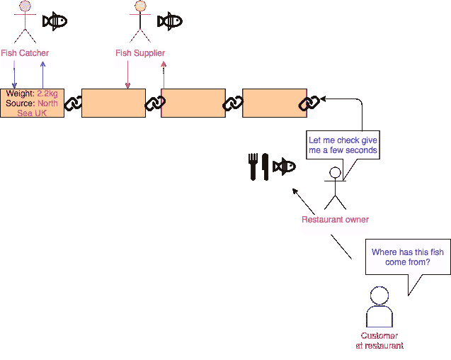

# 超级账本的大肆宣传

> 原文：<https://medium.com/coinmonks/the-hype-of-hyperledger-a85817de9f5b?source=collection_archive---------10----------------------->

希望这是对 HyperLedger 世界的一个美好而轻松的介绍。如果你没有见过 Hyperledger，那么你可能想知道它是什么？

Hyperledger 是一个开源的合作项目，旨在推进跨行业的区块链技术。这是一次全球合作，包括金融、银行、物联网、供应链、制造和技术领域的领导者。Linux 基金会在基金会“下托管 Hyperledger

【hyperledger.org】的[T3](http://hyperledger.org)

但在比特币等加密货币的世界里，Hyperledger 基本上不像区块链吗？

答案是*“算是吧”！*

Hyperledger 仍然是去中心化的、非基于货币的、基于许可的(仅认证用户),并且是为行业建立的，以简化他们的流程。这似乎太简单了，对吗？这不像区块链的比特币和以太坊，它们依赖于挖掘硬币、智能合约、点对点共识，没有认证。然而以太坊得到了摩根大通([https://www.jpmorgan.com/global/Quorum](https://www.jpmorgan.com/global/Quorum))等公司的大力支持，获得了区块链的许可，这也将解决类似的企业问题。对所有区块链来说，核心概念都是相似的，这将在文件中进一步概述。

Hyperledger 希望超越基于货币的区块链，带来更广泛的技术和发展。它希望确定以下几点:

*   **信任** — *建立信任，因为交易是由授权机构完成的，而不是加密货币，任何人挖掘比特币都可以获得区块链。不要误会我的意思，这将是非常困难的黑客！*
*   **问责** — y *你会知道处理区块链的人*
*   **透明** — *能够看到同行之间进行的交易*

最近的炒作都是关于比特币和以太坊区块链，但超级账本将能够解决现实世界的问题，无论是商业还是人们可能有的任何其他想法。

我认为这对许多行业都有很大的好处，因为可以在可信方之间运行的单一网络可以给人们提供更多的数据安全保障，不会被随机的人看到。

许多玩家目前正在使用 hyperledger，并得到了 IBM、微软 Azure 平台等大公司的支持，甚至亚马逊最近也委托了他们自己的 BAAS(区块链即服务)。

让我们看一个 hyperledger 有用的例子。下图显示了鱼的供应链。

这里有三个演员:

1.  捕鱼器
2.  供应者
3.  餐馆

目前，数据由每个参与者记录。因此，如果买家想知道鱼是在哪里捕到的，他们需要去找供应商，供应商再去找捕鱼器

从上面的图表中，你可以看到基本流程。粉红色的箭头是鱼穿过链条的动作。绿色是从餐馆发出的查询，以找出鱼来自哪里。

在上面的标准场景中，因为信息不容易获得，所以对餐馆的保证可能需要时间。由于鱼是新鲜的，顾客会食用，因此鱼的原产地信息可能无法及时返回。

那么，区块链将如何解决上述问题呢？

简单！一个分散的网络，又名区块链。

所以为了简单起见，数据将由捕鱼器输入并存储在区块链上。通过这种方式，供应商和餐厅可以通过一个 web 应用程序看到鱼的产地和其他记录的属性，如重量等，该应用程序通过 Hyperledger fabric 连接到区块链。这将在几秒钟内发生，而不是几天或几周。这是最简单的形式，但在现实世界中会更复杂。

**总账网**

hyperledger 框架有多种解决方案，但解决上述问题的关键是:

1.  hyperledger fabric—【https://www.hyperledger.org/projects/fabric 
2.  锯齿—【https://www.hyperledger.org/projects/sawtooth 

我将在以后的文章中更详细地讨论这些。

在 Hyperledger 平台上，像 IBM 这样的主要贡献者似乎正在进行大量的工作，而且只会越来越好。

**结论**

希望你喜欢这篇文章，它会让你对 Hyperledger 和区块链的基本概念有所了解。

利用这些平台解决企业内部的问题以及现实世界的问题有着巨大的潜力。如果能够在只有获得许可的人才能查看的地方分发分类帐，将会极大地有利于允许相关人员进行安全和治理。它可以加快处理时间，以前需要几天的事情现在只需要几秒钟。

我的目标是在接下来的几篇文章中讨论编码视角的更多技术细节，因为有很多东西需要理解。所以继续关注吧……

感谢阅读，请分享