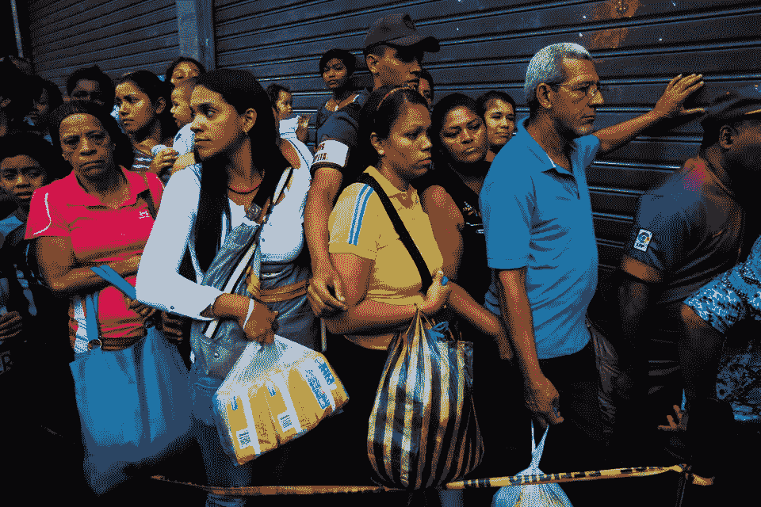

# 低通胀的幻觉&加密货币中隐藏的阿尔法

> 原文：<https://medium.com/coinmonks/the-illusion-of-low-inflation-the-hidden-alpha-in-cryptocurrencies-46dd9783bd75?source=collection_archive---------0----------------------->

No they’re not lining up for a Justin Timberlake concert, this is Venezuela, where to get a loaf of bread is to endure hours of a special kind of humid hell. This is what rampant inflation looks like.

尽管发达国家经济快速增长，但通货膨胀率长期以来一直很低，这很容易被认为是理所当然的。不知何故，“这一次是不同的”，经济的主人已经设法拥有他们的蛋糕并吃掉它，同时仍然保持那些六块腹肌。但是通货膨胀的精灵并不是某种神秘的生物…