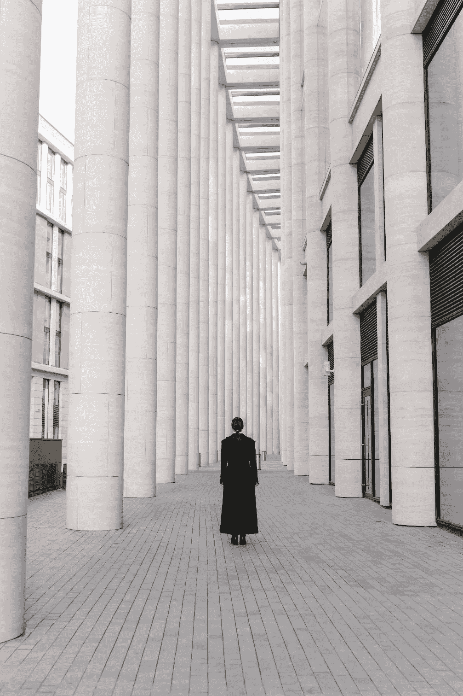
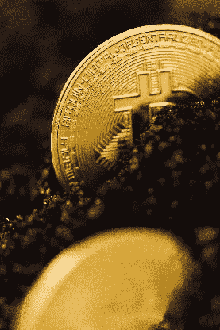

# 秘密存储的完美概念

> 原文：<https://medium.com/coinmonks/the-immaculate-conception-of-cryptostorage-dc772d77d35?source=collection_archive---------4----------------------->

Photo by RODNAE Productions from Pexels

本文是关于密码存储的 3 部分系列的第 3 部分。在继续之前，您可能想在这里阅读前两部分[。](https://mangocart.medium.com/the-creation-of-cryptostorage-and-its-wider-implications-8f9492c02db9)

如果你对比特币的概念和价值感兴趣，自然会问为什么是 T2 的这个 T3 比特币，而不是它的另一个版本？

> 也许有人会推出更好或者更能被政府和监管机构接受的东西。

> **这可能是最重要的问题，因为这个问题的答案揭示了比特币到底是什么。**

让我们来玩这个想法，某人，即银行(中央或私人)或金融服务公司创建了一种加密资产或加密货币——这与比特币有多相似？

首先，你需要信任实体，让我们忽略一个事实，他们中的一些人已经因为欺诈和不道德的行为被罚款几次。这么说吧，实际上，你信任他们，事实上，他们持有你的退休金和投资账户，并且有着良好的工作关系。

因此，Acme Bank 询问您想要什么产品？你说什么？

如果你说我要那个 10x/100x 比特币的东西，没有资本损失，你能做到吗？他们会怎么说？如果他们诚实，他们会说不存在这样的产品，试试彩票，或者我们不兜售庞氏骗局。

所以现在你明智地说，我想要一种不会损失我的本金并能抵御通货膨胀的产品。Acme 告诉您开立储蓄账户或购买债券。但是我们已经在上一篇文章中解释了为什么这对于某些人来说是不可行的。

厌倦了，你说，“我想要一个像比特币这样的反通胀投资产品，你能做一个吗？”你坚持认为，“只要拿起比特币代码，稍微整理一下，改变那可怕的橙色，并在一个新的网络上推出，我就会和我真正的亿万富翁朋友一起投资它”。

"好吧，你想让我们发行一个令牌( [ICO](https://en.wikipedia.org/wiki/Initial_coin_offering) )？"Acme 问道。

现在你开始问自己，过去几年发行了数百只 ico，但没有一只成功抓住了任何认真的投资者，这是为什么？

你可能会说，因为这些是由业余爱好者或骗子发行的，但如果是由一家声誉良好的银行或金融服务公司发行的，那就不一样了，它会吸引主要投资者。

“但是，如果他们能做到这一点，他们早就创造出来了，不是吗？毕竟技术是存在的，而且是开源的”，你问自己。

> “为什么金融机构实际上在推广比特币信托，为什么不竞争？”，你多琢磨琢磨这个。

你意识到自己需要找一家利基投资银行，于是你去找了中本聪投资，亮出你的资历，要求见见这位 CEO。你解释说你想创造一个新产品——一个真正的，诚实的劳动人民——“毕竟，有需求！”，你在肯定中对前台小姐和你自己说。

中本聪，首席执行官同意见你。你乘电梯，走到会议室，拉一把椅子坐下。

“听说你要我们发行代币？”，她疑惑地问道。

“为什么会这样。我们将支付所有的开发和部署成本，你没有什么好担心的”，你回答。

“好吧，跟我解释一下，我们到底要怎么推出这个东西？”

你解释说:“嗯，你发行 10 亿代币，我代表的是少数能注入 10 亿美元的投资者，所以赎回比例是 1:1。”

”*然后呢？*”她说

“嗯，当我们把比特币投放市场时，人们就会产生需求，而且它的基础是比特币，供应量有 2100 万个限制，等等。”，你解释一下。

“他们为什么要买这个，不买另一个，顺便说一句，你刚刚跑在公众前面，”中本聪说。

“没错，但比特币的正面——ra ...”，你停下句中、 ***开始理解有机种植的概念与在实验室中培养相比。*** *早期用户忍受了风险、投机、波动，更不用说公开羞辱了。*

你会意识到，总会有一个人处于起步阶段，但如果这个网络继续按计划运营，并在未来 10 年提供流动性，它就一定有某种实质内容。

Photo by Min An from Pexels

现在，中本聪开始解释为什么亚马逊还没有推出这样的产品，她说:“让我们仔细考虑一下。”

“我们推出代币，然后向公众开放，等到价格上涨 100 倍，所有人都抛售了，价格就会暴跌，流动性也就不复存在。她解释说:“这个系统可能会失灵，极大地损害我们的信誉。”

如果你想找到解决办法，你会说:“好吧，我们可以把所得的 1%放进一个公用罐子里，这样它就会给所有人带来利息，并随着时间的推移得到分配。我们还会要求所有初始参与者都有一个锁定期，作为创始人，我们的锁定期将长于公众。所有这一切都将编入《守则》。你又一次开始意识到，利益的错位，这一次，公众会在所有人都抛售之前套现，创始人肯定会抛售投资资本。你的亿万富翁投资者绝不会同意这样的事情。

你也开始意识到，很难说服人们投资这样一种复杂的产品，而且，即便他们投资了，这种产品也不具有流动性，而且有所有这些规则和限制。

决心看看还有没有办法。你说“我有个主意！”，“我们预先挖掘 10 亿代币分配给我们，然后我们向公众发布代码，并立即要求公众挖掘他们的奖励，并以去中心化的方式接管网络。”

Photo by Thirdman from Pexels

Satoshi 回忆起 4 年前她在董事会会议室度过的漫漫长夜，当时她的 R&D 团队在研究推出比特币竞争产品的各种方式，她接着说:“好吧，那么我们让这个东西在野外自由活动，你如何保证你不会受到攻击、黑客攻击或攻击？”

这些概念中的一些会掠过你的脑海，但你确实意识到，你无法知道矿工们是否会采用这个网络(或者有多少)。您还记得，公共区块链的安全性取决于簿记的分散程度。

Satoshi 继续说道，“……顺便说一句，你需要向市场提供流动性，你必须赎回代币，你所有的朋友都愿意让 10 亿美元自由流动吗？我甚至没有开始解释我们需要兑换这种代币的交易所，人们不会马上接受东西。”

你回答说，“*我们首先需要确保我们在世界各地有足够多友好的矿工，然后……*”，你被打断了。

> “**停止**！你不会得到有机的扩展，比特币网络每年消耗超过 70 泰拉瓦时的能量；投票权和收养不是一件容易的事情。

“美国普通家庭每年消耗 11，000 千瓦时。*这相当于近 10 万个家庭或全瑞士的能源消耗量，这不是一蹴而就的*。

你会明白，如果那些矿工想和你玩玩，男孩他们可以——分散能源保护 5000 亿美元永远不会稀释它的 2100 万硬币，通过发行更多的硬币。另一方面，要说服公众你不会修改代码或改变规则是一场艰苦的战斗，更不用说在没有重要联盟和前期资本成本的情况下保证网络的安全性，以防你的网络受到攻击。

> 你的眼睛突然为这种新发现的对比特币增长和激励模式的美丽和对称的欣赏而流泪。

*Satoshi 继续说，“你为什么不想用已经存在的东西，你担心什么？世界各地的开发者将继续升级软件，增加新功能，我们将继续提供信托基金。”*

你没有答案，除了 100 倍的梦想或对模糊监管的恐惧——你意识到新经济体系的波动是不可避免的，事实上，有机地加强该体系是可取的，使其抗脆弱。

你最后一次尝试，“聪，现在最后一个问题，可以吗？”，你问。

“很好”她说。

“*说真的，听起来去中心化是个问题*，让我们创建一个遍布全球的安全中央网络，由每个国家的央行管理，运行完全相同的比特币协议，这样可以吗？”，你兴奋地问。

“首先，我们是一家私人投资公司，所以我真的不能对此发表评论，但你会去找谁呢？联合国，国际货币基金组织，世界银行？而且你相信你会得到共识吗？”

Photo by C Technical from Pexels

她补充称:“创建一个跨国结算网络并就此达成一致是一回事，但这是另一回事，**这是货币政策**，想想你将需要面对的所有合规障碍。”。

“好吧，让我们把注意力集中在我们的国家，有足够的流动性财富，只有一个管理机构”，你回答。

“听起来你已经忘记了第一点，你如何公平地启动这个系统，即使是在我们国家？”她问道。

“你能保证管理机构不会根据谁掌权而改变代码，以任何其他方式稀释供应或网络规则吗？”她补充道。

"是的，我们通过法律授权，我们有一个稳定的政府."，你自信地说。

"所以你需要透明度和可听见性，对吗？"，她回答。

“是的，监管者将执行审计，每个人都可以查看账本，实际上央行承担了这些角色”，你说。

“好吧，这可以在今天通过固定货币供应和创造一种数字货币来实现，为什么要经历这么多麻烦呢？”，她问你。

“……因为我不想要货币。我想要一种储备资产，来储存我的财富。政府仍然可以创造一种数字货币，这是两码事。”，你澄清一下。

“为什么不买年金？”她问道。

“你知道为什么，它以菲亚特为基础，正在贬值，需要融资，因此存在市场风险。你回答说:“我还不如买我的银行股，获得价格升值和股息。”。

“好答案”，她说。

“但说真的，让我们用比特币代码，在一台安全的、经过政府审计的电脑上运行，然后高枕无忧”，你说。

然后电灯泡的时刻来了，“哦！这是一个中心弱点，而 ***因为公共问责制，我们将需要后门来扭转交易*** ，因此另一个弱点，此外公共政策可以改变”，你大声说！

**确切地说是**。这是无限不安全的几个脆弱点的设计——一个蜜罐！”Satoshi 说。"**相信我**，如果我们能创造它，我们早就创造了。她补充道:“比特币的网络安全性随着全球的采用而提高，这是因为它的无身份性和开放性。”。

> 你终于意识到，这是无处可逃的，这只能是一个草根的，草喂养的，有机生长的数字有机体。

尽管无数次试图关闭、攻击和诋毁比特币，但它还是设法存活了下来。

它最终获得了政府、监管机构和大型金融机构的认可。

创造新的比特币几乎是不可能的。数字原生货币网络的第一层已经建成，它被称为比特币。由于它的开源性质，新的开发将被添加到这第一层之上，以提供人们需要的各种金融服务，即提供[收益率曲线](https://en.wikipedia.org/wiki/Yield_curve)、[速度](https://en.wikipedia.org/wiki/Lightning_Network)，以及更复杂的智能合约。

在 [30 年的反复试验](https://www.investopedia.com/tech/were-there-cryptocurrencies-bitcoin/)之后，这种新的、原始的资产类别——比特币——出现了，它就在这里，就在你眼前。它工作了。

> 你的眼睛又湿润了——你是见证金钱互联网出现的一代人中的一员。这个概念一点也不完美。

Photo by Karolina Grabowska from Pexels

**备注&签名**

***ECD sa:****1 mangorabpe 5 mehobfqdhscp 2 ubvnsdn7n* ***MSG:****[https://medium.com/@themangocart/dc772d77d35](/@themangocart/dc772d77d35)***验证:***hfzukvl5c zotsrhvgsl 7/k 7 qrwfskq 5 ysaqdapjoi/EEG cdd/aah 0*

*安托诺普洛斯使用的术语*

> *加入 [Coinmonks 电报频道](https://t.me/coincodecap)，了解加密交易和投资*

## *另外，阅读*

*   *[尤霍德勒 vs 科恩洛 vs 霍德诺特](/coinmonks/youhodler-vs-coinloan-vs-hodlnaut-b1050acde55a) | [Cryptohopper vs 哈斯博特](https://blog.coincodecap.com/cryptohopper-vs-haasbot)*
*   *[币安 vs 北海巨妖](https://blog.coincodecap.com/binance-vs-kraken) | [美元成本平均交易机器人](https://blog.coincodecap.com/pionex-dca-bot)*
*   *[如何在印度购买比特币？](/coinmonks/buy-bitcoin-in-india-feb50ddfef94) | [WazirX 评论](/coinmonks/wazirx-review-5c811b074f5b) | [BitMEX 评论](https://blog.coincodecap.com/bitmex-review)*
*   *[比特币主根](https://blog.coincodecap.com/bitcoin-taproot) | [Bitso 回顾](https://blog.coincodecap.com/bitso-review) | [排名前 6 的比特币信用卡](/coinmonks/bitcoin-credit-card-bc8ab6f377c6)*
*   *[双子座 vs 比特币基地](https://blog.coincodecap.com/gemini-vs-coinbase) | [比特币基地 vs 北海巨妖](https://blog.coincodecap.com/kraken-vs-coinbase) | [CoinJar vs CoinSpot](https://blog.coincodecap.com/coinspot-vs-coinjar)*
*   *[印度加密交易所](/coinmonks/bitcoin-exchange-in-india-7f1fe79715c9) | [比特币储蓄账户](/coinmonks/bitcoin-savings-account-e65b13f92451) | [Paxful 审核](/coinmonks/paxful-review-4daf2354ab70)*
*   *[杠杆令牌](/coinmonks/leveraged-token-3f5257808b22) | [最佳加密交易所](/coinmonks/crypto-exchange-dd2f9d6f3769) | [AscendEX 评论](/coinmonks/ascendex-review-53e829cf75fa)*
*   *[Godex.io 审核](/coinmonks/godex-io-review-7366086519fb) | [邀请审核](/coinmonks/invity-review-70f3030c0502) | [BitForex 审核](https://blog.coincodecap.com/bitforex-review) | [HitBTC 审核](/coinmonks/hitbtc-review-c5143c5d53c2)*
*   *[Crypto.com 费用](/coinmonks/binance-fees-8588ec17965) | [僵尸加密审查](/coinmonks/botcrypto-review-2021-build-your-own-trading-bot-coincodecap-6b8332d736c7) | [替代品](https://blog.coincodecap.com/crypto-com-alternatives)*
*   *[MXC 交易所评论](/coinmonks/mxc-exchange-review-3af0ec1cba8c) | [Pionex vs 币安](https://blog.coincodecap.com/pionex-vs-binance) | [Pionex 套利机器人](https://blog.coincodecap.com/pionex-arbitrage-bot)*
*   *[我的密码交易经验](/coinmonks/my-experience-with-crypto-copy-trading-d6feb2ce3ac5) | [比特币基地评论](/coinmonks/coinbase-review-6ef4e0f56064)*