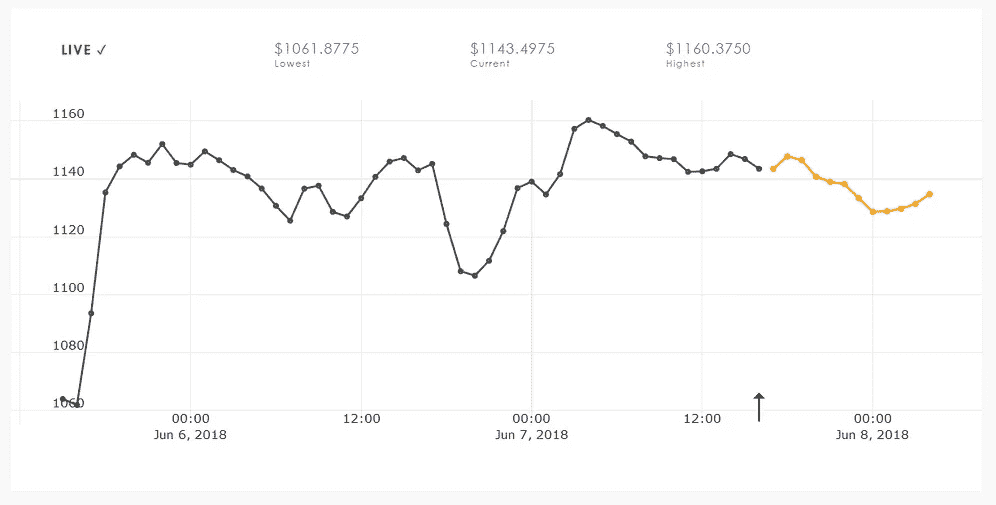

# 比特币现金的影响与分析(BCH)

> 原文：<https://medium.com/coinmonks/the-impact-and-analysis-of-bitcoin-cash-bch-b1ce8972f909?source=collection_archive---------14----------------------->

每隔几天或几周，我们就会添加新的功能、货币，并为我们的用户创造更多的工具。今天，我们将比特币现金(BCC 或 BCH)添加到我们的系统中。在接下来的文章中，我将对这种加密货币进行简要的分析和讨论。

比特币现金通常缩写为 BCH，之前被称为 BCC，是世界上最大和交易量最大的加密货币之一(按交易量计算)。由于 BitConnect 庞氏丑闻，市场决定将其缩写为 BCH，而不是 BCC，但许多交易所仍然使用原来的符号。

## 价格预测

与我们的人工智能预测系统的集成是成功的。BCH 没有造成任何问题，预测工作完美无缺。

AI generated price predictions for BCH using 10-min and 60-min candlestick intervals.

## 贸易信号

由于我们的交易算法是通用的，它们应该可以与许多现有的加密货币一起工作，所以在没有添加任何新算法的情况下，我们只是将 BCH 插入到系统中。我们不排除这一点，但 BCH 在回报(ROI)方面占据主导地位，超过了我们的许多其他加密货币(BTC、ETH 和 LTC)。在下面的图片中，我已经标出了(绿色矩形)所有新的密件抄送 USDT 条目，这样你就可以将它们与现有的进行比较。

让我们更深入一点，分析单个的买入和卖出信号。我不会检查每一个条目，所以让我们只看表现最好和最差的。

BCC-USDT 的最佳执行算法是 Pistis 1.0，使用 30 分钟的烛台间隔:

而性能最低的是使用 30 分钟间隔的 Voltra 1.0:

正如我在以前的文章中提到的；性能最差的算法只能通过投资回报率来衡量，但这并不意味着它们毫无用处或毫无价值。所有这些算法/策略之间的主要区别在于它们的“销售”启发式。为了说明“Voltra 1.0”是一个不错的算法，但只是需要一些调整，看看下面的截图。我放大到一个随机选择的区域，这样我们可以更好地分析买入&卖出信号。

我们看到它的“买入”位置大多很体面，通常位于一个山谷里。但是“卖出”信号的时机和位置充其量是平庸的，这就是为什么投资回报率是负的。

我们的一些交易者可能会发现 Voltra 算法比其他算法更有用，特别是它的“买入”头寸。但是请记住，你不应该依赖“卖出”信号，而是自己决定何时退出。

## 结论

如果你不交易比特币现金，也许这是一个开始的电话。无论如何，我感谢你所有的支持和反馈。如果你想继续收听下一集，请务必订阅。如果你喜欢我们的工作，那么请免费试用 CryptoPredicted 你可以在我们的个人资料描述中找到链接。

祝您愉快！
——伊利亚·内沃林