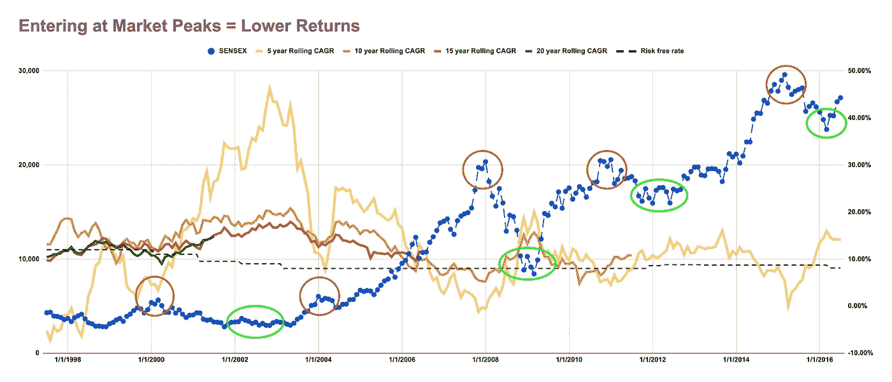

# “把握市场时机”的重要性

> 原文：<https://medium.com/coinmonks/the-importance-of-timing-the-market-497ece22c7e5?source=collection_archive---------3----------------------->

在市场上。在生意上。在生活中。

> “时机”是至关重要的

这非常非常重要。我不能强调这一点不够，因此我会尝试在这里再次强调。我相信事实上，这是任何成功的最重要的原因。

我将试图证明“时机”在股票市场中的重要性。

让我们通过只理解一张图表来深入了解这一点。

让我们从快速更新上面的图表开始。

上图在左轴绘制了“SENSEX ”,在右轴绘制了 5 年、10 年、15 年和 20 年的 CAGR。

让我们举一个例子来演示每一行到底显示了什么。

> 比方说，在 2000 年互联网热潮期间，你花 5000 英镑买了一支 SENSEX 股票。你的这项投资在用黄色细线描绘的 **5 年**后，将产生大约 **6%** CAGR 的回报。如橙色线所示，你的这项投资在 10 年后会产生大约 11%的 CAGR 回报。红线所示的 15 年**后**你的这项投资将产生约 **11%** CAGR 的回报。你的这项投资在绿线所描绘的 20 年后会给 CAGR 带来大约 10%的回报。所有这些都发生在你可以选择获得 15 年期政府债券 11%利息的时候。你冒险得到的回报毫无意义。太糟糕了。市场不会自动给出高于无风险利率的回报，即使你原地不动 20 年。你本可以投资政府债券，放松一下，而不是被从众心理和贪婪所吞噬。要意识到，这种情况实际上发生在市场上成千上万最聪明的股票交易者身上。

让我们深入研究一下，因为我们现在对上面的图表已经很熟悉了。

从上图中我们应该真正理解三个要点，

## 每一次市场高峰都对应着 5-20 年的低滚动回报

因为任何在股票市场交易过一段时间的人都明白，永远正确的说法很少。上面的陈述就是这样一个例子。

图表中显示的**红点**是**警告信号**，告诉你什么时候不应该在市场上增加资金。如果这笔钱投入政府债券而不是昂贵的市场，它会产生更大的回报。而且，不仅仅是短期，就连 20 年的回报率也低于无风险利率。

> 永远不要在昂贵的市场购物。一直卖。

这条黄金法则永远适用。一直都是。没有什么能逃脱这条黄金法则，没有哪种市场。不是股票。不是期货。不是加密货币。不是工作。不是房地产。不是商品。不是营销购买。没什么。

请不要理解，这只适用于整体市场，绝对不适用于你投资组合中的优秀股票。不，它适用于每一只定价过高的股票。**在昂贵的市场上，一切都很昂贵。**如果你真的想长期持有这只股票，现在就卖掉它，把收益放在一只债券基金中，两年后在一个便宜的市场上买回。回报将会翻倍。

> **这就是“计时”的力量**

对于批评家来说，市场峰值的定义已经引起了一些问题。事后来看很容易确定市场的顶峰，困难在于事先找到它。伟大的捕获，答案在于所有市场的相关性。我将在下一篇文章中深入探讨这个非常重要的话题。

## 每次市场下跌都对应着 5-20 年的高滚动回报

因为任何在股票市场交易过一段时间的人都明白，永远正确的说法很少。上面的陈述是另一个这样的例子。

图表中显示的**绿点**是**欢迎信号**，表明一个人应该在什么时候增加市场资金。这笔钱只产生了超过 **15%** 到 **40%** 的超额回报。请注意，这只是通过把握市场时机实现的，没有任何投资市场的策略。只要把握好市场时机，任何策略的疯狂改进都很容易实现。而且，我们不仅从长期来看会看到这些巨大的回报，即使是上图中的 5 年回报，甚至是当前后 covid 市场中的 1 年回报。

> 总是在便宜的市场购物。千万不要卖。

这条黄金法则也永远适用。一直都是。没有什么能逃脱这条黄金法则，没有哪种市场。不是股票。不是期货。不是加密货币。不是工作。不是房地产。不是商品。不是营销购买。没什么。

如果你的购买足够多样化，你买什么真的不重要。它会给你承诺的所有共同基金的 15%的回报，甚至不知道任何公司实际上在做什么。

> **这就是“计时”的力量**

对于批评家来说，市场萧条的定义已经引起了一些问题。事后很容易识别市场的暴跌，困难在于事先发现它。我将在下一篇文章中深入探讨这个非常重要的话题。

## **持有期越长=收益越大，风险越小**

对于敏锐的观察者来说，这种观察已经很明显了。令人惊讶的是，随着持仓时间的增加，回报的变化会急剧下降。

这意味着你持有的时间越长，你承担的风险所产生的回报只会增加。但是，请注意，这适用于多样化的投资组合，而不是任何单一的股票。

在这里补充另一个非常敏锐的观察是，收益方差的边际下降也随着持有期的增加而减少。从上面的图表中可以看出，与 10 年至 15 年相比，5 年至 10 年的方差下降更大，并且先验大于 15 年至 20 年。10 年似乎是个神奇的数字。

> 坚持更久。时间越长越好。

这条黄金法则永远适用。一直都是。这条规则其实比上面两条更厉害。因为这条规则胜过其他两条。如果你持有的时间足够长，你何时入市的重要性就会逐渐消失。

保持住。不管怎样。从长远来看，它总能给你带来不错的回报。一直都是。它甚至胜过你糟糕的切入点。随着收益的方差越来越小，从长远来看，它越来越接近一条直线。

*请注意，上述规则适用于多元化投资组合，不适用于任何股票*

# 3 分是，

> 永远不要在昂贵的市场购物。一直卖。
> 
> 总是在便宜的市场购物。千万不要卖。
> 
> 坚持更久。时间越长越好。

## **关闭思路**

“时机”的重要性不仅在谈论市场时很重要，在生活中几乎任何事情都是如此。

获得正确的教育需要与就业市场同步。

找到合适的工作需要与整体经济同步。

正确开展业务需要与客户行为趋势同步。

如此等等。

> 就像冲浪一样，你必须正确地驾驭海浪。

这很重要。但是这个成功的关键因素从未被提及。是因为这个因素是所有导致成功的因素中最不可控的。这也意味着我们对这一因素的任何微小控制都会带来巨大的回报。

有各种各样的其他因素在成功中得到超过他们应得的。一些常见的疑点是，

1.  想法/创造力
2.  人才/团队/网络
3.  金钱/权力/影响力

是啊。以上都很重要。但是任何伟大的商人或企业家都不会低估在正确的时间出现在正确的地点**的重要性。时机。**

可悲的是。与其说是努力，不如说是命运。

> 这并不意味着努力不重要。没有努力，你甚至不在游戏中。然而，即使你尽了最大努力，胜利者还是由命运决定的。

我们高估了努力的力量，低估了命运的力量。

然而，我不会用任何其他方式做它。因为无论如何努力是我们能控制的。不是命运。

所以要学会正确驾驭这股浪潮。

你的投资伙伴，

D

> 加入 [Coinmonks 电报频道](https://t.me/coincodecap)，了解加密交易和投资

## 另外，阅读

*   [尤霍德勒 vs 科恩洛安 vs 霍德诺特](/coinmonks/youhodler-vs-coinloan-vs-hodlnaut-b1050acde55a) | [隐蝠 vs 哈斯博特](https://blog.coincodecap.com/cryptohopper-vs-haasbot)
*   [币安 vs 北海巨妖](https://blog.coincodecap.com/binance-vs-kraken) | [美元成本平均交易机器人](https://blog.coincodecap.com/pionex-dca-bot)
*   [如何在印度购买比特币？](/coinmonks/buy-bitcoin-in-india-feb50ddfef94) | [WazirX 审核](/coinmonks/wazirx-review-5c811b074f5b) | [BitMEX 审核](https://blog.coincodecap.com/bitmex-review)
*   [比特币主根](https://blog.coincodecap.com/bitcoin-taproot) | [Bitso 评论](https://blog.coincodecap.com/bitso-review) | [排名前 6 的比特币信用卡](/coinmonks/bitcoin-credit-card-bc8ab6f377c6)
*   [双子座 vs 比特币基地](https://blog.coincodecap.com/gemini-vs-coinbase) | [比特币基地 vs 北海巨妖](https://blog.coincodecap.com/kraken-vs-coinbase) | [硬币罐 vs 硬币点](https://blog.coincodecap.com/coinspot-vs-coinjar)
*   [印度密码交易所](/coinmonks/bitcoin-exchange-in-india-7f1fe79715c9) | [比特币储蓄账户](/coinmonks/bitcoin-savings-account-e65b13f92451) | [Paxful 审核](/coinmonks/paxful-review-4daf2354ab70)
*   [杠杆令牌](/coinmonks/leveraged-token-3f5257808b22) | [最佳加密交易所](/coinmonks/crypto-exchange-dd2f9d6f3769) | [AscendEX 评论](/coinmonks/ascendex-review-53e829cf75fa)
*   [Godex.io 评审](/coinmonks/godex-io-review-7366086519fb) | [邀请评审](/coinmonks/invity-review-70f3030c0502) | [BitForex 评审](https://blog.coincodecap.com/bitforex-review) | [HitBTC 评审](/coinmonks/hitbtc-review-c5143c5d53c2)
*   [Crypto.com 费用](/coinmonks/binance-fees-8588ec17965) | [Botcrypto 审查](/coinmonks/botcrypto-review-2021-build-your-own-trading-bot-coincodecap-6b8332d736c7) | [替代方案](https://blog.coincodecap.com/crypto-com-alternatives)
*   [MXC 交易所评论](/coinmonks/mxc-exchange-review-3af0ec1cba8c) | [Pionex vs 币安](https://blog.coincodecap.com/pionex-vs-binance) | [Pionex 套利机器人](https://blog.coincodecap.com/pionex-arbitrage-bot)
*   [我的密码交易经验](/coinmonks/my-experience-with-crypto-copy-trading-d6feb2ce3ac5) | [比特币基地评论](/coinmonks/coinbase-review-6ef4e0f56064)
*   [CoinFLEX 评论](https://blog.coincodecap.com/coinflex-review) | [AEX 交易所评论](https://blog.coincodecap.com/aex-exchange-review) | [UPbit 评论](https://blog.coincodecap.com/upbit-review)
*   [AscendEx 保证金交易](https://blog.coincodecap.com/ascendex-margin-trading) | [Bitfinex 赌注](https://blog.coincodecap.com/bitfinex-staking) | [bitFlyer 审核](https://blog.coincodecap.com/bitflyer-review)
*   [麻雀交易所评论](https://blog.coincodecap.com/sparrow-exchange-review) | [纳什交易所评论](https://blog.coincodecap.com/nash-exchange-review) | [菜鸟评论](https://blog.coincodecap.com/probit-review)
*   [加密货币储蓄账户](/coinmonks/cryptocurrency-savings-accounts-be3bc0feffbf) | [赌注加密](https://blog.coincodecap.com/staking-crypto) | [窃取 x 评论](/coinmonks/stealthex-review-396c67309988)
*   [BigONE 交易所评论](/coinmonks/bigone-exchange-review-64705d85a1d4) | [CEX。IO 审查](https://blog.coincodecap.com/cex-io-review) | [Swapzone 审查](/coinmonks/swapzone-review-crypto-exchange-data-aggregator-e0ad78e55ed7)
*   [最佳比特币保证金交易](/coinmonks/bitcoin-margin-trading-exchange-bcbfcbf7b8e3) | [Bityard 保证金交易](https://blog.coincodecap.com/bityard-margin-trading) | [Prokey 审核](/coinmonks/prokey-review-26611173c13c)