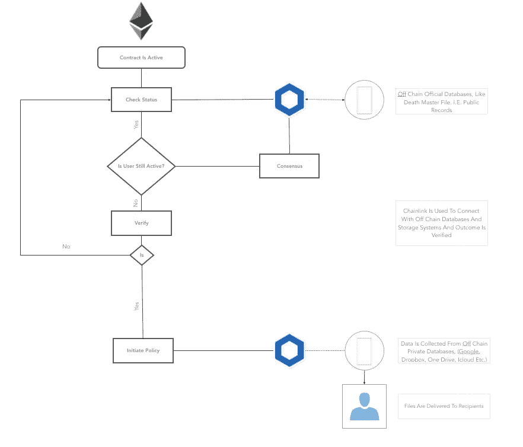

# 不活跃的客户经理 dApp(白色博客)

> 原文：<https://medium.com/coinmonks/the-inactive-account-manager-dapp-white-blog-61ccad718a5b?source=collection_archive---------1----------------------->

*新想法和实施*

我正在开发一种新型的不活跃账户管理器应用，或者有人可能会称之为“死亡开关”，当我变得不活跃时，它会接管我的账户。我想在以太坊上用一个去中心化的智能契约来构建它，这样当我不可避免地变得不活跃时，没有实体会控制我的数据。

有了这样一份合同，我可以放心，我珍惜的音乐和文字、照片和个人物品将留给我的孩子、加密货币和数字资产，或者我选择的任何人。此外，我有一些帐户，我的妻子可能需要，以便获得一些文件和法律的东西。

我联系了有成就的 IT 朋友来帮助开发，他们马上问了我这个问题。“但是，为什么每个人都应该信任您来管理他们的数据呢？”我天真地认为我是值得信任的，但我意识到这是一个主要问题。不仅是因为客户不希望让公司访问其所有帐户，而且数据集中化不是一件好事，这肯定会使公司容易受到攻击。

在深入挖掘区块链兔子洞后，我突然灵光一现。一个去中心化的应用程序，有效地说是一个与外链数据库交互的链上智能契约，可能是一个完美的解决方案。

**它是如何工作的？**

1.  用户将策略输入智能合同的直观仪表板。每个帐户都需要与服务提供商核实。
2.  智能合同定期监控用户状态。当用户仍处于活动状态时，智能合约处于“休眠”状态，不会提示任何活动。
3.  如果检测到不活动，将启动验证过程。网络上的验证器相互通信，并根据协议从数据库中收集数据。
4.  如果确认不活动，智能合同会提示执行用户设置的策略，并根据已故用户的请求与相应的服务进行通信，以收集、删除或留下数据。
5.  文件被发送、删除和关闭。

对于技术人员来说，这个图更好地展示了这个过程。

**声称数据是每个人的一大痛苦:**

在我的研究中，我已经花了很多时间通过各种门户网站联系在线账户提供商的服务代表。没多久我就意识到，验证过程对每个相关人员来说都是一件令人头疼的事情。对于每一个人，我需要证明个人已经死亡，有时还需要邮寄死亡证明、律师证明的硬拷贝，并且每个服务部门都需要根据自己的标准来验证状态。

这是一个漫长而艰苦的过程。相对来说很难，服务复杂且官僚化，责任风险巨大。从本质上来说，亲属试图从一个旨在保护数据的系统中获取数据。我也无法想象服务代表会特别喜欢这样，因为我可以想象会有很多沮丧和情绪。可以理解的是，这些公司也有他们的政策来遵守和关心现有用户，所以在某些情况下，公司最容易拒绝访问非活跃用户的数据。

我们可以简单、优雅、一劳永逸地解决这个问题。如果我们创建一个智能合同，存储你的意愿，数据和网络会发生什么，确保你的意愿得到满足。

智能合同将以安全的方式存储所有策略，然后通过公共记录和数据库监控用户的状态，允许各方就用户的状态达成共识，无论是活跃还是不活跃。这样做，用户的意愿将以简单的方式执行。与此同时，用户和服务提供商的安全性将立即提高，并降低误报和网络见证文件被交付给合法接收者的可能性。

**现有技术:**

如今存在不活跃的账户管理器，最先进的是[谷歌的 IAM](https://support.google.com/accounts/answer/3036546?hl=en) ，它允许用户为他们已经注册的账户和服务设置策略，如果他们变得不活跃的话。然而，Google IAM 只适用于由 Google 拥有或运营的服务。在谷歌的 IAM 案例中，你可以选择收件人，根据你的需要和一个直观的界面接收尽可能多或尽可能少的文档。脸书让你指定一个遗产联系人，如果你去世了，他可以接管你的脸书。那么问题出在哪里？

**问题是真实存在的，而且只会越来越大！**

问题是普通用户已经注册了多个在线服务。并非所有服务都提供“IAM”解决方案，而且通常很难设置或功能有限。其次，通常一个亲属需要联系该服务，提供死亡证明和律师证明，表明该亲属有权访问这些数据。在审查之后，相应的服务可能拒绝或允许该请求。

问题的第二层也是，你的数据，根据 GDPR 法律是你的财产，是在一个集中的一方保管。这一方并不分享你对死亡的兴趣，也就是说，他们更关心的是保护你的数据，而不是提供访问它的权限。但问题很简单，如果你没有设置策略，服务提供商决定如何处理你的数据。

第三个问题，也可能是宏观上最大的问题是，网上存储的数据越来越多，越来越多的人注册，我们还没有到达第一代真正的网上一代何时会衰老的临界点。

**总结一下:**

*   管理您的事后数据权限是复杂的。
*   申请或关闭账户的过程漫长而令人窒息。
*   对于服务来说，管理这些请求的成本很高，并且不利于它们超越当前状态。
*   服务的责任风险是巨大的。
*   由于能见度有限，没有证人证明数据已交付。

**有什么好处？**

*   给用户带来的好处:以简单安全的方式管理您的数据策略，并提供清晰的概览。遗嘱被执行了。
*   对亲属的好处:在悲痛阶段节省时间和精力，并确保死者的意愿得到遵守。
*   对服务提供商的好处:随着时间的推移节省成本、节省法律费用、合规性和客户支持。该合同应降低责任风险，因为责任从服务提供商转移到网络运营合同。服务提供商还可以专注于产生日常收入的活跃用户。
*   对所有人都有好处:见证人—网络将见证数据是否被传递。可以监视契约状态，以查看它是否被公平地执行，所有消息是否被安全地传递。

**运营与治理:**

许多不同的方面，包括公司和个人，都将从合同中获得价值，并需要能够影响治理和安全性。

因此，合同的经营者，即确保其完整性的实体，需要是一个具有高度透明度的基金会，可以作为非营利或营利性基金会运作。

为了保持完整性和确保公平竞争，代码需要是开源的，并且各方都可以审计。

所有参与者都应为网络付费，并被要求轮流参与其治理。

**坐以待毙:**

如果你是开发商、投资者或企业家，请联系我们。

> [直接在您的收件箱中获得最佳软件交易](https://coincodecap.com/?utm_source=coinmonks)

