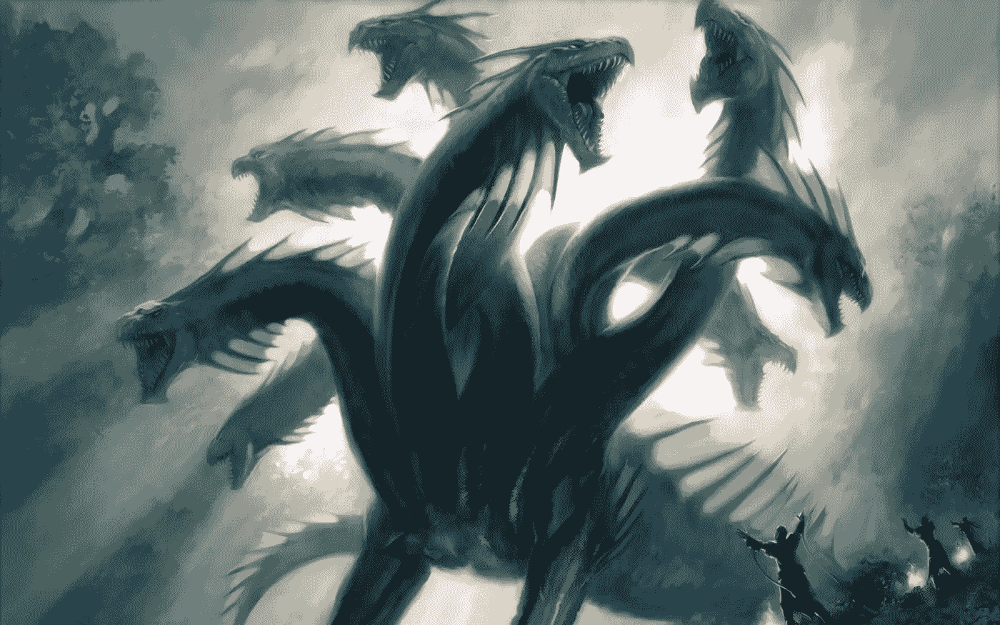
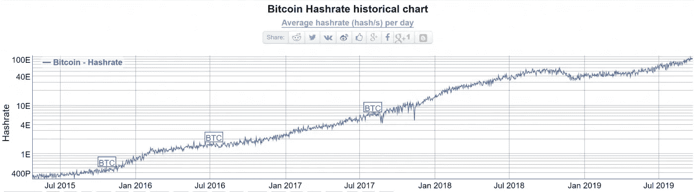
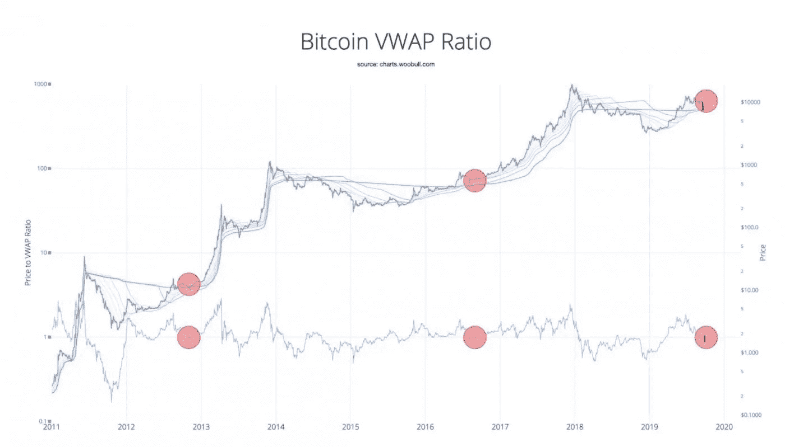
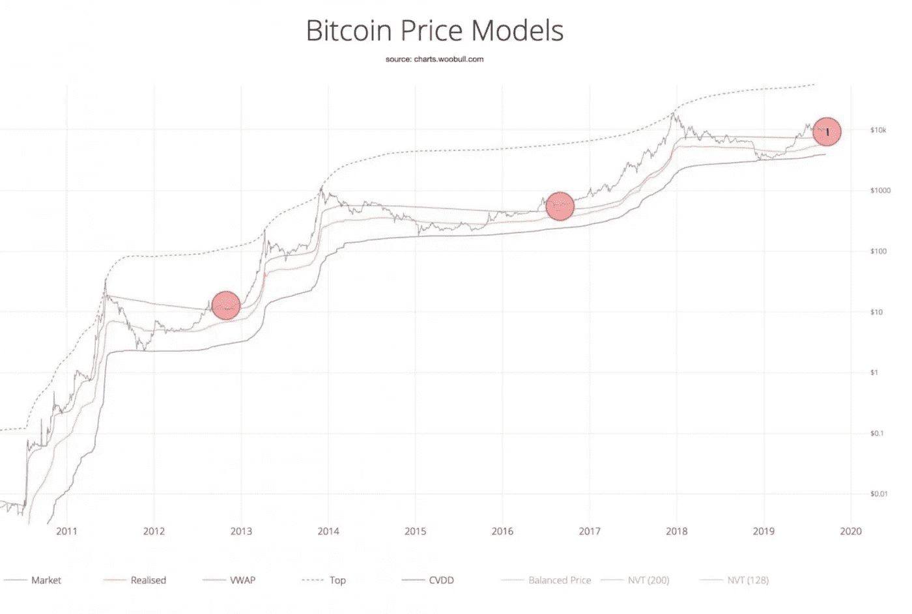
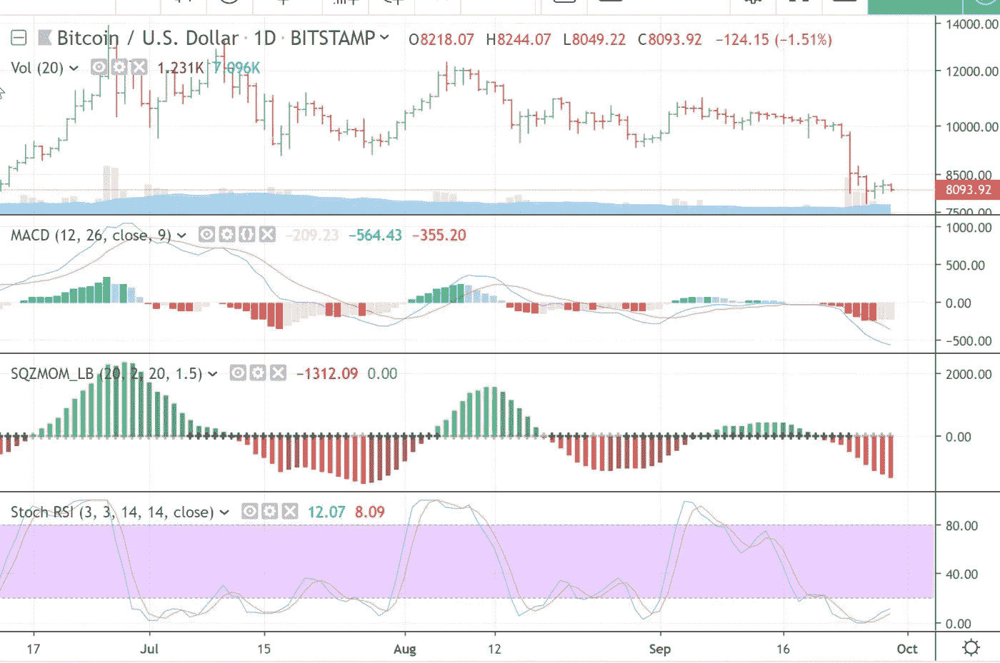

# 无限为首的海德拉:衰退即将来临？比特币蓝调？

> 原文：<https://medium.com/coinmonks/the-infinite-headed-hydras-recession-near-bitcoin-blues-4af02aec9580?source=collection_archive---------1----------------------->

**由克利斯·凯驰博士主持的** [**汉瑟数字接入**](https://hansedigitalaccess.com) **、KJA 数字资产投资** [**美德自私投资**](http://www.selfishinvesting.com)

**crypto technologies…Cryptonite for Governments**

Image courtesy of Username: cortezgold on Steemit

**侧栏:跳到“衰退一定会发生吗？”如果你已经熟悉困扰全球的衰退灾难。如果你只是想了解比特币为何跌破 8000 点，以及它接下来可能走向何方，请跳到“比特币在路上”一节。**

**制造业困境**

正如预期的那样，美联储在最后一次会议上降低了利率，但表示到今年年底可能只有一次额外的降息。尽管芝加哥商业交易所联邦期货交易所(CME Fed)认为这是最有可能的结果，但市场起初抛售，但随后出现强劲反弹，收于盘中交易区间的顶部。这并不奇怪，因为市场知道量化宽松将继续推动长达十年的牛市。

特朗普无耻地乐观表示，美国经济是有史以来最强劲的，他一直敦促美联储大幅降息，以使其更加强劲，因为通胀率很低，风险很小或没有风险。圣路易斯联储主席布拉德对此表示支持，但持相反观点。他说，美联储应该削减更多，因为制造业“已经出现衰退。”

随着贸易战的继续，全球制造业的低迷正在损害出口大国中国和德国的增长。中国刚刚经历了自 2002 年以来最糟糕的单月工业产出数据，8 月份生产者价格以三年来最快的速度下降，突显出中国制造业面临的问题，中国制造业在很大程度上依赖于进入美国市场。

在欧元区，9 月份制造业信心跌至近 7 年来的最低水平，表明经济在第三季度末几乎停滞。德国 9 月制造业 PMI 从 43.5 降至 41.4，为 2009 年大衰退以来的最差水平。德国通常是该地区最可靠的增长源。

难怪国际货币基金组织(IMF)将今年的全球增长预期下调至 3.2%，这是自 2009 年以来由于 2008 年金融崩溃而导致的最低水平。火上浇油的是，作为世界上最大的石油进口国，中国特别容易受到油价上涨的影响，因此预计沙特袭击导致石油产量下降 5%将推高油价。

**关于下一次衰退时机的常见问题解答**

鉴于上述情况，有人问我，当下一次衰退来袭时，房地产价格会发生什么变化。下一次衰退将是地球的一个巨大挑战，因为债务处于创纪录水平，而由于利率处于历史低位，央行几乎没有启动经济的空间，你只能如此消极。如果全球经济继续拖累——这是一种真实的可能性，特别是考虑到德国在衰退中徘徊的长期贸易战——美国最早可能在 2020 年的某个时候降至 0%。只有 7 次降息 25 个基点至 0%。

下一次衰退可能比前几次衰退严重得多，或者可能相当于 2008 年后的衰退，这显然将对股票和房地产价格产生巨大的负面影响。 **QE 只是推迟了衰退，但利率只能维持在这么低的水平**，随着时间的推移，美国越来越有可能难以支付医疗保健和养老金，因此 QE 加速增长和进一步降息是可能的。

当美元在 1971 年之前与黄金挂钩时，由于黄金在一夜之间从 20.66 美元升值到 35 美元，美国能够在一夜之间将美元贬值 41%。这一次，QE 是各国央行武器库中的主要武器。

**事件的可能顺序是什么？**我们知道，全球央行别无选择，只能跟随美联储降低利率，并重启 QE(就欧洲央行而言)。**各国央行可能会继续尽可能多地降低利率，因为即使在贸易战开始之前，这也是利率的大方向。现在，加上正在进行的贸易战的压力，你更有可能降低利率。**

负利率存在于越来越多的主要国家，如德国、日本和瑞士。让利率变得更负无异于孤注一掷。我认为股票、房地产、黄金和比特币都有上涨的空间，因为在通过更大幅度的降息和 QE 的更大提振实现更大程度的法定贬值之前，利率油箱可能至少还有一两年的时间。

在 QE 筋疲力尽之后，房地产和股票价格可能会达到最高点。当 QE 的进一步刺激和更低的利率无助于全球经济，同时挖了一个更深的债务坑时，这种情况就会发生，之后，我们就会陷入衰退。衰退的严重性、深度和持续时间将与 QE 产生的债务水平(需要解除多少债务)、可能有助于缓和局势的指数增长技术以及川普的亲商政策相关，川普的亲商政策可能使美国像二战后一样摆脱债务。

**衰退一定会发生吗？**

某些国家的通货膨胀失控，和/或美联储在错误的时间提高利率，和/或主要国家(如德国，尽管有 QE)陷入全面衰退，和/或指数增长技术提供的提振晚于早，都会导致经济陷入衰退。制造业摇摇欲坠，美联储的布拉德认为美国制造业已经陷入衰退。因此，与此同时，继续在房地产、股票、黄金和比特币上顺势而为。中央银行不会停止印刷，除非我们从指数增长技术中获得足够的帮助，这有助于提高 GDP，从而给美联储加息的空间。但这可能要到经济衰退后才会发生。

也就是说，更聪明的“老卫士”在黄金、房地产和其他资产中处于有利地位，可以抵消法币贬值的影响。但是，下一次衰退可能会被指数增长的技术缓和甚至避免，而不是一天的清算。指数增长总是被低估，因为它是…指数增长。GDP 受到了这种技术的惩罚。作为众多例子中的一个，Skype 是一种免费或费用很低的技术，因此给普通人带来了很大的通信自由。然而，它扰乱了电信行业，让他们损失了一大笔钱，从而损害了 GDP。

然而，由于 QE 人为地让世界保持运转，这个星球已经十年没有衰退了，所以一次衰退或许是应该的。央行可能看起来势不可挡，因为一些人曾经认为泰坦尼克号不会沉没，但主权债务泡沫越大，多米诺骨牌倒下时潜在的崩溃就越大。但不排除 ExpoTech 的钢化效果。

虽然 QE 仍然健在，并对美国长达十年的牛市负有责任，但要知道，没有什么是直线上升的，因此在有保证的情况下转移到现金的风险管理是谨慎的。虽然牛市始于 2009 年，但主要股指出现了高达-20%的大幅回调，个别股票的回调幅度更大。在这种调整期间，在正确的名称上建立空头头寸是有利可图的。

**比特币步入正轨**

我已经详细讨论了为什么一个比特币的价格会在未来几年里持续上涨到几十万甚至几百万美元。我使用的各种指标(其中一些我曾在之前的报告中使用过)一起称之为 2011 年以来比特币的每一个主要顶部和底部，并显示比特币当前的修正是牛市期间比特币修正的典型特征，在牛市期间，比特币通常会在几周或更短的时间内修正-28%至-42%，然后恢复其长期上升趋势。

当前调整的深度是从波峰到波谷的-44%。预计比特币的价格迟早会达到历史高点。虽然其 hashrate 在一个小时内大幅下跌，立即将**比特币**的价格推低到【8000 以下，但这可能是由两个因素引起的: 1)一群矿工离线，中国可能在其中发挥了作用，因为他们已经将采矿定为非法，2)链上交易量显示，通过 UTXO 的短期持有者对 Bakkt 推出当天的低交易量感到失望。这种挫折是暂时的，因为它的 hashrate 已经大幅反弹。我在以前的报告中讨论过的所有顺风仍然有效。

上述指标显示，目前的挫折仍然是图表上的一个小亮点，可能处于或接近去年 12 月开始的本轮牛市的低点。此外，下面显示的短期指标也表明比特币处于或接近低点，记住 MACD 上的红线和绿线仍需交叉，SQZMOM(挤压动量)仍可能走低，尽管它可能接近低点，Stoch RSI 仍需推进紫色区域:

价格/交易量也表明，比特币可能会跌破之前低点的低点将得到重新测试。正如我们所知，比特币的波动性很大，因此在尘埃落定后买入往往是一种更好、风险更低的方式，而不是试图接住落下的刀。

**无限为首的海德拉**

监管是一把双刃剑，因为它们对比特币有利，因为它们使主要机构能够集体加入比特币，如上周一推出的 Bakkt，但监管也可能对加密空间不利，因为如果 SEC 过于严厉，加密货币的价格可能会暂时停滞或下降。这种情况最终会将受保护的加密平台推向其他更容易接受的司法管辖区，就像我们看到的那样，这是由于纽约州繁琐而昂贵的比特许可证，以及俄罗斯和中国的情况。切掉一个头，它会在别的地方再长出来。

**规范个人**

尽管如此，一些人明智地指出，尽管 SEC 表示比特币是分散的，因此无法受到监管，但我们可能很快就会让 FinCEN 在比特币网络上运行节点，并监控个人违反反洗钱法的似是而非的交易。因此，虽然比特币本身无法监管，但交易比特币的个人可以。但我问，那又怎样？这难道不是为了更大的利益吗？区块链的透明度使执法部门能够以创纪录的精确度跟踪非法活动。与此同时，随着比特币被用作一种无国界的价值交易工具，合法活动可以蓬勃发展。

**政治迫害正义**

当然，人们可以正确地指出,“正义”系统往往是什么，但正如深刻的腐败往往存在于这样的系统。危机时期被用来作为通过额外法律的理由，以保护国家免受暴政之害，但这只是通过法律的一个幌子，这些法律给予国家更多的控制，因此往往会削弱权利。相当于几个世纪前反对女巫的法律一直延续到今天。已经说过了，人性还在幼儿园。

无数的例子比比皆是，比如二战后时代的麦卡锡主义，20 世纪 60 年代的反大麻运动，直到今天中国和香港等一些国家的反大麻运动，911 后的反恐运动，反毒品运动和反性运动。因此，一些法律可以被以各种方式操纵和解释，使几年前合法的东西在今天成为非法的。

一个人交易比特币的行为可能是完全合法的，但根据《爱国者法案》的法律，这个人可能会被贴上恐怖分子或洗钱者的标签，而没有合法代表权。该法案的公开目的是“阻止和惩罚美国和世界各地的恐怖主义行为，加强执法调查工具，以及其他目的。”对该法案的许多批评之一是，“其他目的”通常包括侦查和起诉非恐怖分子涉嫌的未来犯罪。

**禁止比特币**

现在，如果一个政府，比如说美国，采取更严厉的措施，在某个时候宣布比特币交易非法，这将类似于他们反对非法点对点文件共享的立场。自 20 世纪 90 年代中期 Napster 时代以来，大量纳税人的钱已经被用来推翻那些为非法文件交换提供便利的网站。但是 p2p 文件共享也是一条多头蛇，每砍掉一个头，就会长出更多的头。

如今有多少类似“海盗湾”的网站？不计其数。是的，虽然一些 ISP 可以跟踪非法活动，然后节流违规用户的带宽，数百万人使用 VPN 来对抗这一点。任何老黑客都知道，任何保护措施都可能被推翻。事实上，没有什么代码是无法破解的，即使是在量子水平上。量子只是保护的高阶变种。甚至剑桥大学管理剑桥量子计算的教授也会同意。

如果美国或任何其他政府采取这种极端措施来非法使用比特币，这种情况也会发生。因此，虽然我完全支持区块链打击真正罪犯的透明度，但我坚决反对任何裙带资本主义或根深蒂固的国家腐败，随着消除中间人信任模式的指数增长技术在全球扩散，这些将有望成为遥远的记忆。

**(͡:B ͜ʖ ͡:B)**

> [在您的收件箱中直接获得最佳软件交易](https://coincodecap.com/?utm_source=coinmonks)

