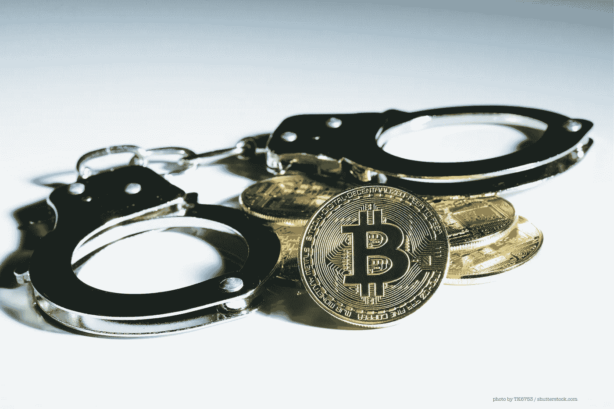

# 加密货币的固有缺陷；斯托克霍德尔综合征。

> 原文：<https://medium.com/coinmonks/the-inherent-flaw-of-cryptocurrencies-stockhodl-syndrome-8fb0b83f50f1?source=collection_archive---------3----------------------->

目前的加密货币有一个固有的缺陷，这将永远使它们成为资产而不是“货币”，这使得“加密货币”成为一个误称。

我把这种内在缺陷称为“斯托克霍德尔”综合症。斯托克霍德尔综合症是“斯德哥尔摩综合症”和古老的交易格言“低买高卖”的融合。

当一个人买入一种加密货币，并期望在价值增加时出售，而他们自己似乎没有兴趣将硬币或代币用于预期目的时，它就开始了。一段不健康的关系会让一个人时好时坏。随着高点越来越高，人们越来越不愿意卖出，而低点会让人们更紧地持有。最终，这个人看不到什么时候该卖出，并不停地念叨着，“嗬~DL！HO~DL！”。

为什么这是一个固有的缺陷？

当设计某种应该作为货币使用的东西时，就意味着把它作为交换媒介。那么它的目的应该是充当一个经常易手的中介，并不真正属于任何人。就像河流有助于船只和货物的航行一样，一个好的货币应该有一定的流动性，允许货物(和服务)的健康流动。但如果每个人都坚持自己的货币，那就好像每个人都在修建大坝来阻挡河流的支流。河流中剩下的水越来越少，船只的航行范围将会缩小，水深也会带来问题，因此船只必须更小，运载的货物也更少。

这正是加密货币目前的情况。很大一部分硬币或代币被 HODL(或者应该是 HEDL？).当持有这么多时，就没有足够的流动性来允许数量上的波动。人们习惯了低水位，并决定建造到水位线，认为这是最好的房地产。那么，当有人出售大量的硬币/代币时，就像毫无预警地打开一座大坝。水喷涌而下，迅速提高了河水的水位，摧毁了靠近水的任何建筑。

这个问题是由前面提到的“斯托克霍德尔综合征”引起的。因为加密货币被视为并被视为一种资产，而且目前还没有明确的日常用途，所以当有人购买任何密码时，购买的最初原因是为了在它的价值增加时出售。

这种“斯托克霍德尔综合症”变得更加严重，因为奖励持有人和惩罚消费人的方法多种多样。这种让人们持有的动机只是为了制造一种虚假的稀缺感，以提高价值，这反过来又强化了“斯托克霍德尔综合症”。

有一些加密货币例外，它们确实具有某种内在价值或确实提供了价值。然而，说目前 99.9%的加密货币是作为资产设计的，换句话说，是为你“hodl”它们而设计的，这并不遥远。

加密货币表现为资产或被视为资产对加密货币行业不利。资产容易受到投机的影响，因此价格也会波动。郁金香狂热是由一种资产类别商品的不健康升值(就其所有含义而言)引起的，引发了对尚未种植的郁金香期货的疯狂市场投机。事实上，经济泡沫也被称为资产泡沫。

据我研究，传统法定货币传统上不被视为资产，只是在处理外汇交易时，它似乎进入了灰色地带(或在会计中使用时)。如果你住在美国，你不会将美元作为一种资产持有，期望从其增值中获利，但你可能会持有欧元或一些其他外币，以对冲美元对外币的价值变化。

因此，排除法定货币在外汇交易或会计中的这种用途，你可以说，从国家/地方的角度来看，货币不是资产，也不作为资产进行交易。货币是一种交换媒介，你可以用它来获得你正在交易的等值资产。以储蓄形式存在银行并赚取利息的货币可以被视为一种金融产品，因此也是一种资产。但是你床垫下的现金什么都得不到。

所以货币的唯一目的就是被使用。如果不能作为交换媒介使用，交换媒介就会失去它的作用。这导致了目前加密货币的使用。加密货币将继续作为资产存在，除非在其框架内实施一种诱导支出和抑制持有的方法。

> [在您的收件箱中直接获得最佳软件交易](https://coincodecap.com/?utm_source=coinmonks)

加密货币的价值不应该取决于货币的单位，而应该取决于货币的使用，因此所有加密货币都不符合这一重要标准，并将其持有者作为人质。