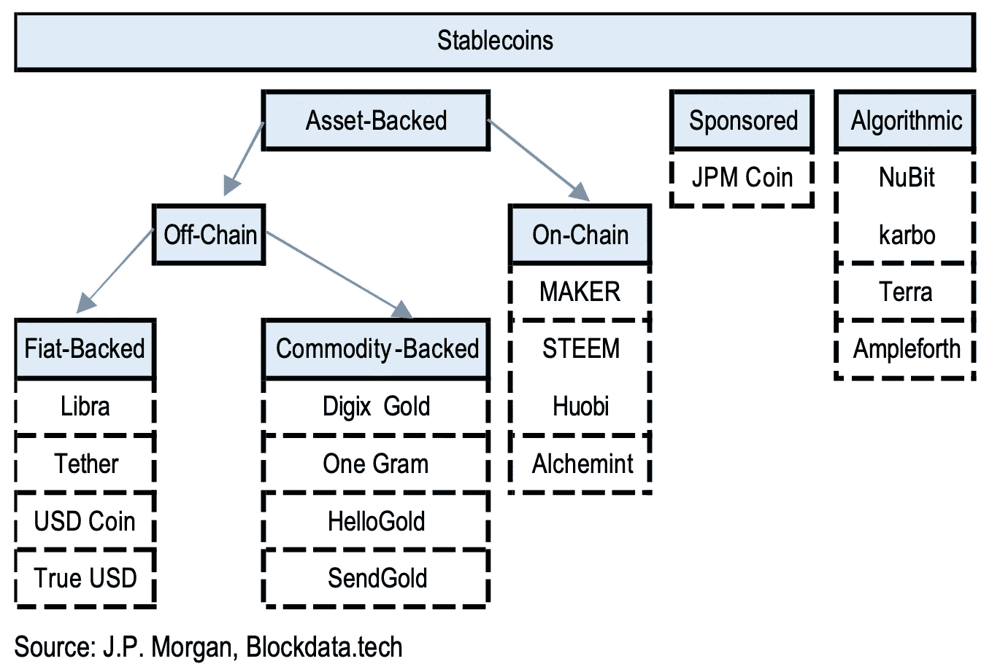
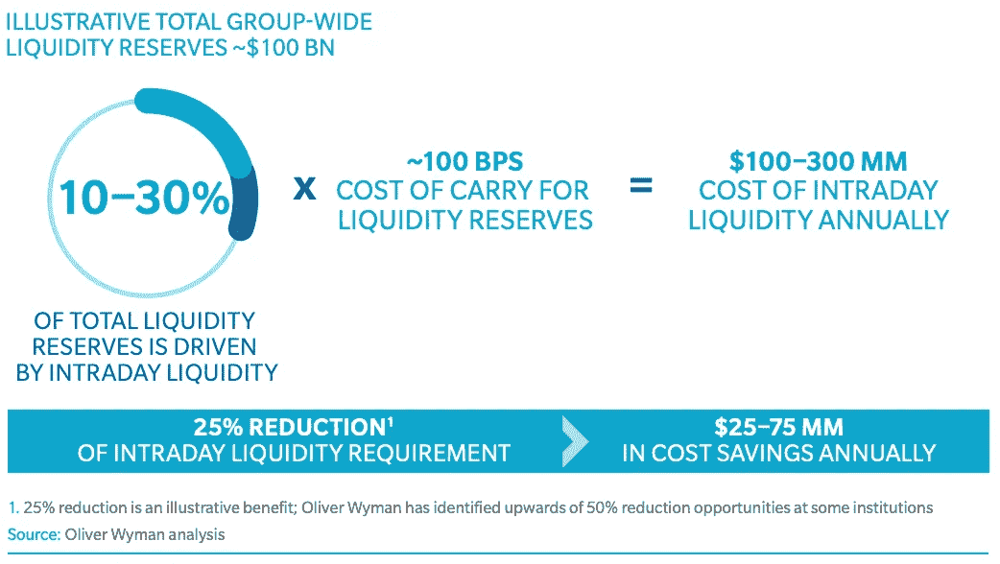
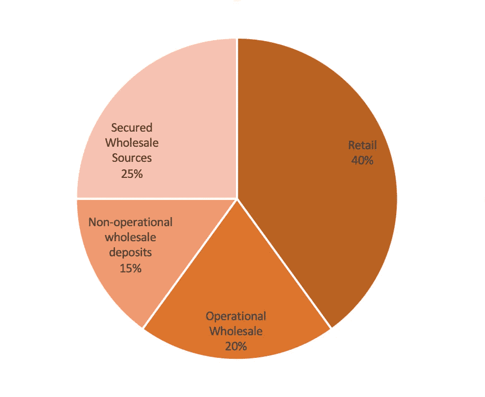

# JPM 硬币有趣的使用案例

> 原文：<https://medium.com/coinmonks/the-interesting-use-cases-of-jpm-coin-3cbe1b747e1f?source=collection_archive---------2----------------------->

## 企业区块链没有炒作就出手了。

# 介绍

虽然去金融化正在获得巨大的推动力，但区块链企业也在前进。JPM 币去年诞生于 JPM 区块链卓越中心。在本分析中，我们看一下摩根大通硬币的一些可能的使用案例，以了解企业区块链在金融界是如何获得牵引力的。

## JPM 硬币——是什么？

JPM 硬币本质上是现有支付轨道和区块链网络之间的桥梁，完全由 JPM 通过自己的资产负债表提供支持。对于不同类型的 stablecoins 的良好入门，请查看 [Haseeb Quershi 的帖子](https://haseebq.com/stablecoins-designing-a-price-stable-cryptocurrency/)中的介绍文章。关于宏观经济影响的更深入的分析，请查看 [JPM 的报告:Libra 和其他稳定货币的市场影响](https://www.docdroid.net/bZeM0KU/jpm-j-p-morgan-perspect-2020-02-21-3274027-pdf)和[国际清算银行关于稳定货币的报告](https://www.bis.org/cpmi/publ/d187.htm)。

Stablecoins and various forms of tokenized payments can be broadly split into asset-backed, sponsored, and seigniorage-style (algorithmic), and the asset-backed can be backed by a mix of on- and off-chain collateral

上图显示，摩根大通已将 JPM 硬币归类为“赞助”硬币。这与密码世界的看法不同，后者广泛认为任何基于基础资产一对一发行的稳定账户都是“资产支持的”。

JPM 硬币不同于其他资产支持的稳定硬币，原因有二。首先，*它只对 JPM 的机构客户开放。从这个角度来看，它与公司内部的簿记系统几乎没有太大的不同。其次，也可以说是其更重要的特点，是 JPM 硬币由 JPM 赞助，因此它拥有大银行的所有担保，如 FDIC 保险(如果存款类型适用)，该系统在压力时期可以获得[美联储日光透支](https://www.investopedia.com/terms/d/daylight-overdraft.asp#:~:text=A%20daylight%20overdraft%20occurs%20when,end%20of%20the%20business%20day.)等。*

# JPM 硬币对当前系统的好处

*   实时兑换货币，而不影响基础账户、交易过账或国际交易的对账基础设施(平台和流程不同)。
*   全球各地将能够在延长的工作时间内交换资金，而不受传统过账基础设施或网络基础设施差异的限制。
*   可以信任结算的终结性，减少转账时间和对账成本。
*   企业客户不必改变他们的支付流程、现金管理责任或关系管理实践就能从中受益。
*   支持[与其他区块链(如以太坊)的互操作性](https://www.r3.com/wp-content/uploads/2017/06/chain_interoperability_r3.pdf)，支持多种用例，其中一些我们将在下面解释。

# 当前使用案例

## 当前用例#1:公司内部跨境支付的即时结算

跨境支付是一个相当枯燥但有利可图的市场。2018 年，这个行业的总收入为[2310 亿美元](https://www.mckinsey.com/~/media/mckinsey/industries/financial%20services/our%20insights/tracking%20the%20sources%20of%20robust%20payments%20growth%20mckinsey%20global%20payments%20map/global-payments-report-2019-amid-sustained-growth-vf.ashx)。假设 JPM 币只适用于 B2B 市场，市场规模为 1490 亿美元。由于收入利润率较低(0.1%)，B2B 部门的收入增长主要是由销量驱动的。直到 2018 年，该行业每年增长 4%，预计增长 3%。然而，[贸易战](https://image-src.bcg.com/Images/BCG-Global-Payments-2019-Tapping-into-Pockets-of-Growth-September-2019-rev_tcm74-231986.pdf)和最近的冠状病毒爆发可能会使增长率变成负数。

激烈的竞争仍然给利润率带来压力:

*   金融科技专家:TransferWise 和 Revolut 正在国际支付和外汇领域建立独特的主张，从银行手中夺取份额，压低利润率
*   以前没有参与批发 PCM 竞争的银行，如高盛，现在瞄准了这个领域

充分利用 JPM 硬币可以使 JPM 的银行业务对一个全球性的公司更有吸引力。JPM 币可以实现公司内部的即时跨境转移，使支付更加高效，而不是依赖于长时间(如一个月)的净额结算。

## 当前用例#2:降低日内流动性成本

在交易衍生品时，市场价格的变化要求银行不断管理衍生品的基础抵押品。这个过程叫做衍生品管理。 [73%](https://www.barbicanconsulting.co.uk/collateral) 的场外衍生品使用现金作为抵押品。转移现金抵押品的过程，也称为结算过程，占用了资金，导致银行手头的现金超过理想水平，否则它可以借出这笔资金来获利。

通过带来价值链，抵押品可以更容易地在不同方之间交换，从而缩短结算过程，降低在这一过程中被套牢的现金数量。这最终实现的是减少日内流动性所需的资本量。

奥纬咨询(Oliver Wyman)2018 年的一份报告指出，对于拥有 1000 亿美元流动性储备的银行来说，日内流动性每年会耗费 1 亿至 3 亿美元。将当天的流动性要求降低 25%，可以节省 2500 万至 7500 万美元。

Intraday liquidity costs for a large bank

已经有一家初创公司在解决这个问题— [HQLAᵡ](https://www.hqla-x.com/) 是一家金融技术创新公司，它利用 R3 的分布式账本技术 Corda 来提供流动性管理和抵押品管理。这家卢森堡初创公司通过数字抵押品登记处允许资产转移或抵押品互换，从而实现了高效的证券借贷。该平台是与德意志交易所集团联合开发的，该集团也是 HQLAᵡ.的投资者

## 当前用例#3:提高财务比率，同时满足 LCR 流动性要求

金融危机后，巴塞尔委员会建立了[流动性覆盖率](https://www.bis.org/basel_framework/standard/LCR.htm?type=all)的指标，以确保银行能够在严重的压力情景下满足其流动性需求。(上面的用例也来源于这个需求，但为了简单起见，我们跳过了上下文)高质量流动资产(HQLA)与银行 30 天预期净现金流出的比率必须大于 100%。流动性覆盖率的计算非常简单:

> 流动性覆盖率=优质流动资产金额(HQLA) /净现金流量总额

A typical funding mix of a canonical commercial bank. Source: [JPMorgan Global Research: Can Stablecoin Achieve Global Scale?](https://www.docdroid.net/bZeM0KU/jpm-j-p-morgan-perspect-2020-02-21-3274027-pdf)

流动性要求对银行来说成本很高:无担保的经营性批发存款的流失率假定为 40%，这意味着这些存款中只有 60%可以计入 HQLA。看左边的图表，我们可以计算出——因为所有可操作的批发存款的 40%被假设在一个月内流失，所有存款的 40%×20% = 8%永远不能被借出，必须留在银行。一个更极端但不太突出的类别是超出其他法律实体客户(如银行、证券公司、保险公司等)要求的无担保批发融资。这类存款的径流率为 100%。(你可以在 [BIS 的网站](https://www.bis.org/basel_framework/standard/LCR.htm?type=all)上了解不同类型存款各自的流失率。)

所有不符合 HQLA 要求的存款都只是银行的负债，因为监管规定这些存款必须有充足的资金，并且任何时候都不能被杠杆化，这相当于银行业的巨大机会成本。**通过利用即期结算和** [**建立另一张资产负债表**](https://amp.ft.com/content/3c203978-2c4a-31a4-9c4b-68b3599d67ab) **，银行可以使其与现金相关的财务比率，如资本回报率，更具吸引力。**举个例子，许多全球性银行作为 [Vostro 帐户](https://www.investopedia.com/terms/c/correspondent-bank.asp)满足许多小型银行的跨境需求。由于资金流入和流出资产负债表的速度相当快，这一重要类别获得了 100%流出率的额外待遇。拥有大量跨境业务的银行可以将现金存放在表外实体，从而提高财务比率。像 JPM 硬币这样的工具可以实现即时结算，这可以将表外实体变成按需银行账户。

# 未来使用案例

## 跨行跨境支付

许多中央银行的区块链项目已经对跨境转账进行了广泛的探索，[摩根大通在其中一个项目中发挥了积极作用](https://www.accenture.com/_acnmedia/pdf-99/accenture-cross-border-distributed-ledger-technologies.pdf)。使用 JPM 硬币作为结算工具，JPM 可以立即促进跨境转移。

## 跨链证券结算

证券交易所已经在实施分布式分类账系统，如澳大利亚证券交易所和特拉维夫证券交易所。在这种情况下，JPM 硬币运行的区块链可以与上述区块链互操作，以实现证券的即时、原子结算。智能合约还可以自动支付利息，让 JPM 客户的结算时间比竞争对手更快。

这些未来的使用案例只是 JPM 硬币的一瞥。但是它们仍然离生产相对较远，因为它们需要不同利益相关者之间的大量协调，例如中央银行、股票交易所、个别商业银行等。但是，随着生态系统的成熟，跨链解决方案变得越来越普遍，以及像摩根大通这样的实体领导这一努力，我们肯定会看到更多的企业区块链的采用。

> [在您的收件箱中直接获得最佳软件交易](https://coincodecap.com/?utm_source=coinmonks)

📣*通过* [***订阅***](/@ze_chen) *并在*[***Twitter***](https://twitter.com/zesc_chen)*上关注我对区块链/fintech 空间的所有深入研究保持最新！*