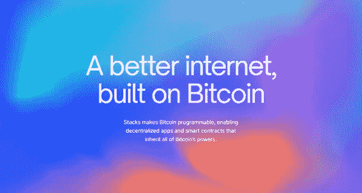
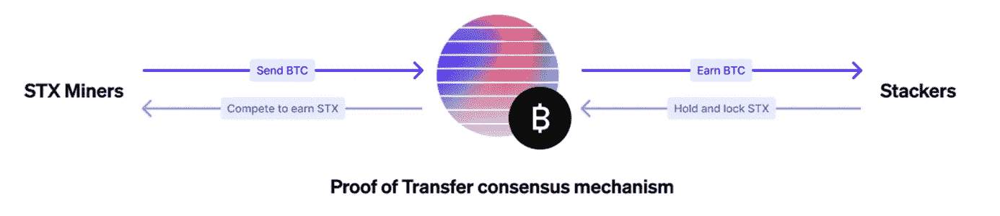

# 互联网坏了。

> 原文：<https://medium.com/coinmonks/the-internet-is-broken-38780cff11d4?source=collection_archive---------6----------------------->

## 为什么我们迫切需要一个新的去中心化网络

2013 年，爱德华·斯诺登震惊了世界，他与美国情报机构决裂，并透露美国政府正在秘密寻求收集每一个电话、短信和电子邮件的手段。结果将是一个前所未有的大规模监控系统，能够窥探地球上每个人的私人生活。

九年后，网络隐私和安全方面没有太大变化。近日，荷兰发生大规模数据泄露事件。市政卫生服务“GGD”主要冠状系统的数百万公民服务号码、地址信息和电话号码被盗，导致他们的个人信息在黑暗网络上被交易。[1]然而，这只是人们的数据被出售的一个最近的例子。越来越多的证据表明，我们的在线隐私需要更多的关注，以保护我们免受政府、大公司、其他恶意人士和我们自己的伤害。[【2](#_ftn1)

数据泄露增加了网络钓鱼、身份欺诈和跟踪的风险。使用当前的 Web 2.0，您的数据存储在中央服务器上。你在网上的每一步都被跟踪和存储，你的身份很容易被窃取。大公司和政府想知道和利用你做的事情，而隐私是很少有人能负担得起或理解的奢侈品。你可能在网上没有什么可隐藏的，但你有一切要保护…

> “争辩说你不在乎隐私权是因为你没什么好隐瞒的，这和说你不在乎言论自由是因为你无话可说没什么区别。”—爱德华·斯诺登

## 老大哥在看着你

如今，我们生活在一个数字化的世界，在互联网上花费了大量的时间。我们依赖于数字系统或网络，却没有意识到它们只集中在少数基于互联网的公司手中，如谷歌、YouTube、脸书和其他一些公司。在访问网络平台和网页时，我们并没有完全理解互联网的底层结构已经变得中心化。因此，我们相信集中的网络垄断会控制和操纵我们的数字生活、敏感数据和隐私。

随着我们进入第四次工业革命，我们的生活变得越来越数字化，我们一生中共享的数据量急剧增加。毕竟，每个人的数字版自己都包含着对人们生活的洞察；他们在哪里，他们想什么，他们做什么，他们买什么，他们的社会关系，健康状况等。因此，我们必须不断考虑，物理生活中的人权是否也在每个人的数字生活中得到保障。

## 集中式与分散式

我们比以往任何时候都更需要一个新的互联网。一个把权力还给用户，把安全和自由放在建筑设计最前沿的互联网。目前，去中心化是将数据、隐私和安全控制权交还给公民的关键。当前的互联网和去中心化的网络之间的区别并不复杂。目前，互联网网络配备有充当数据保管人的服务器，并且所有数据都通过该服务器传递。因此，我们正在使用我们必须信任的大型科技公司和政府等集中式运营商，来处理我们的数据并将其存储在他们的云服务中。相反，分散式网络连接依赖于建立在社区上的对等网络，其中各种互联网设备充当主机，而不是一组有动力的服务器。在这种情况下，没有一个实体拥有任何数据，我们也不依赖这些中介来连接我们。相反，用户保留对其数据的控制权，并可以直接与其网络中的其他人进行连接和交互。

知识就是力量。这是这些中介完全理解的。在这些封锁期间，你可能已经看过关于网飞的电影《社会困境》。它展示了你的数据是如何被利用来获取利润的(这也使得政府更容易进行监控)。

# 输入堆栈:

建立在比特币基础上的更好的互联网

[https://www.stacks.co/](https://www.stacks.co/)

## 什么是堆栈？

Stacks 生态系统是一个独立实体、开发者和社区成员的集合，致力于在比特币上建立一个用户拥有的互联网。Stacks 使比特币可编程，实现了继承比特币所有功能的去中心化应用和智能合约。Stacks 允许您访问分散的应用程序，并使用充当您的数字身份的数字密钥来保护您的数据。这些数字密钥让您无需依赖远程服务器或身份提供商即可登录应用。所有数据都被加密并存储在 Gaia(一种可扩展的分散存储架构)上，可以在当前 400 多个应用程序之间轻松共享。因此，你真正拥有你的数据，数字自我主权。

## 为什么是比特币？

比特币是世界上最安全的网络。比特币是真理的防篡改来源，是一种价值结算协议。一旦你有了事实的最终来源，其他分散的协议和用例就可以建立在它的基础上。[【3】](https://joerivdpol.medium.com/the-internet-is-broken-38780cff11d4#_ftn3)Stacks 是第 1 层区块链，使用比特币区块链作为安全基础层。它将智能合约和去中心化应用与比特币的安全性、稳定性和经济实力进行了天然整合。

## 转移证明

*两个区块链之间的第一个共识算法(比特币&栈)*

分布式账本技术的主要特点是缺乏中央权威。达成共识是区块链运营的核心，这意味着网络参与者需要就账本的状态达成一致。公共区块链的共识算法需要计算或金融资源来保护区块链状态。比特币是第一个公共区块链，并使用工作证明，其中节点将计算资源专用于参与共识算法。由于工作证明，任何单个恶意参与者拥有足够的计算能力来攻击网络实际上是不可行的。

Stacks 生态系统创建了一种新的共识机制，称为传输证明(PoX ),以保护和完成其用户拥有的互联网平台的使命。PoX 是一种达成共识的新方法，要求矿工花费比特币来赢得 STX 令牌中的下一个块奖励。PoX 不是在工作证明上烧电，而是将已经铸造好的比特币重新用作“计算证明”，矿工直接代表他们的开采成本。由于这种共识机制，通过提供与比特币的本地连接，PoX 可以通过使用比特币作为安全基础层来保护堆栈区块链。

在 Stacks 网络中有两种类型的参与者:STX 矿工和 STX 持有者。

1)堆栈矿工可以在比特币和堆栈区块链上查看状态。STX 矿工通过在比特币区块链上发送交易来参与领导人选举。可验证的随机函数(VRF)随机选择每一轮的领导者，领导者将新块写入堆栈链。STX 矿工获得每个区块新铸造的 STX (coinbase 奖励)、交易费和 Clarity 合约执行费。STX 矿工表达了在 BTC 采矿的成本，并花费 BTC 参与领导人选举。

2)栈持有者可以通过将他们的 STX 锁定一个周期，运行一个完整的节点，并在网络上以事务的形式发送有用的信息来参与共识。积极参与共识的 STX 持有者可以获得比特币奖励。[【4】](#_ftn4)

## 堆叠令牌和堆叠

Stacks 加密货币(STX)是网络活动和合同执行的燃料。STX 持有者可以锁定它来赚取比特币奖励，以支持区块链共识书库。这个锁定 STX 从协议中赚取 BTC 奖励的过程叫做“堆叠”。

STX 加密货币通过美国历史上第一个 SEC 认证的代币发行向公众发行。新的转移证明共识机制在 STX 和 BTC 之间建立了一个本地交换对，并使 STX 成为一种独特的资产，因为你可以用它来赚取另一种货币(BTC)的收益。

 [## Stacks 今日价格、STX 实时市值、图表和信息| CoinMarketCap

### Stacks 是一个第 1 层区块链解决方案，旨在将智能合同和分散应用(…

coinmarketcap.com](https://coinmarketcap.com/currencies/stacks/) 

## 摘要

Stacks 生态系统认为，比特币可以成为更好的用户拥有的互联网的基础，就像传统互联网的 TCP/IP 一样，各种区块链最终将在比特币上创建。比特币的网络效应意味着围绕比特币的智能合约可以获得更多的加密资本，并受益于更高的安全性。栈可以通过将被动的比特币资本转化为主动部署的资本，并为比特币生态系统带来更多的应用和智能合约，从而使比特币变得更有价值。但最重要的是，创造一个更好更安全的互联网。

隐私、安全和数据所有权是您在老大哥和大数据时代需要的权力。

[【1】](#_ftnref1)[https://www . volkskrant . nl/nieuws-achtergrond/data lek-bij-GGD-gegevens-van-miljoenen-nederlanders-in-criminele-handen ~ b 7f 17 bea/](https://www.volkskrant.nl/nieuws-achtergrond/datalek-bij-ggd-gegevens-van-miljoenen-nederlanders-in-criminele-handen~b7f17bea/)。

【https://en.wikipedia.org/wiki/List_of_data_breaches】[。](#_ftnref2)

[【3】](#_ftnref3)[https://Gaia . block stack . org/hub/1 axypunhhahieffxweskbvmbpgqv 138 FP/stacks . pdf](https://gaia.blockstack.org/hub/1AxyPunHHAHiEffXWESKfbvmBpGQv138Fp/stacks.pdf)。

[【4】](#_ftnref4)[https://github . com/block stack/stacks # stacks-apps-and-smart-contracts-for-bit coin](https://github.com/blockstack/stacks#stacks-apps-and-smart-contracts-for-bitcoin)。

> 加入 Coinmonks [电报频道](https://t.me/coincodecap)和 [Youtube 频道](https://www.youtube.com/c/coinmonks/videos)了解加密交易和投资

# 另外，阅读

*   [如何在 FTX 交易所交易期货](https://coincodecap.com/ftx-futures-trading) | [OKEx vs 币安](https://coincodecap.com/okex-vs-binance)
*   [OKEx vs KuCoin](https://coincodecap.com/okex-kucoin) | [摄氏替代品](https://coincodecap.com/celsius-alternatives) | [如何购买 VeChain](https://coincodecap.com/buy-vechain)
*   [ProfitFarmers 回顾](https://coincodecap.com/profitfarmers-review) | [如何使用 Cornix 交易机器人](https://coincodecap.com/cornix-trading-bot)
*   [如何匿名购买比特币](https://coincodecap.com/buy-bitcoin-anonymously) | [比特币现金钱包](https://coincodecap.com/bitcoin-cash-wallets)
*   [瓦济克斯 NFT 评论](https://coincodecap.com/wazirx-nft-review)|[Bitsgap vs Pionex](https://coincodecap.com/bitsgap-vs-pionex)|[Tangem 评论](https://coincodecap.com/tangem-wallet-review)
*   [如何使用 Solidity 在以太坊上创建 DApp？](https://coincodecap.com/create-a-dapp-on-ethereum-using-solidity)