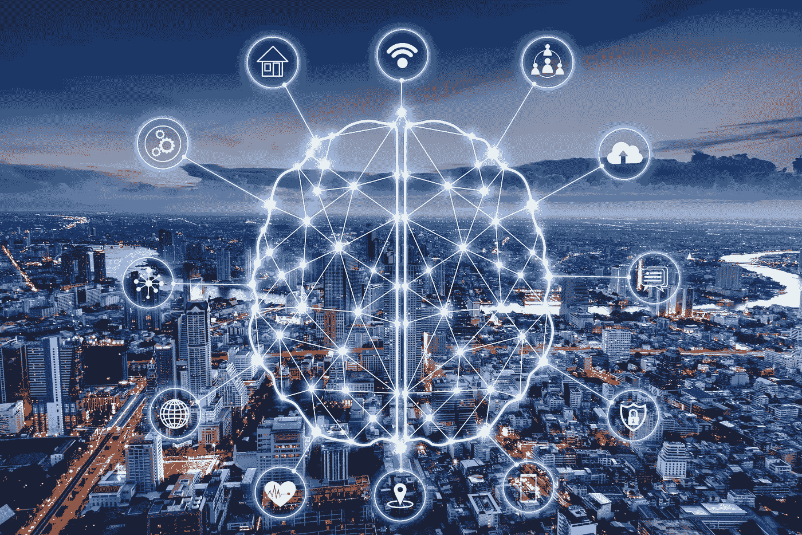
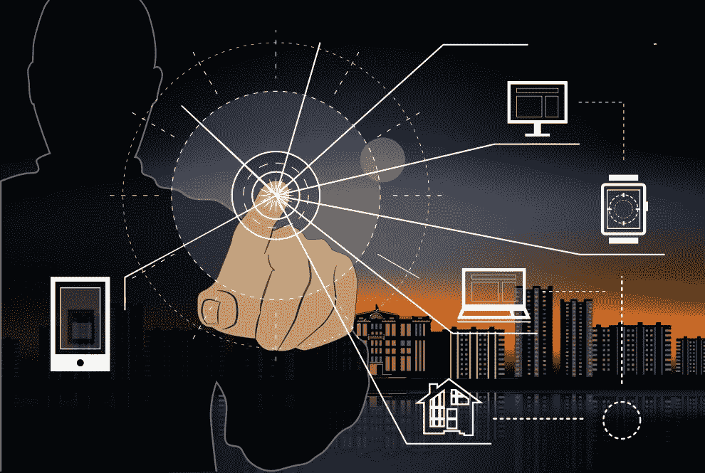
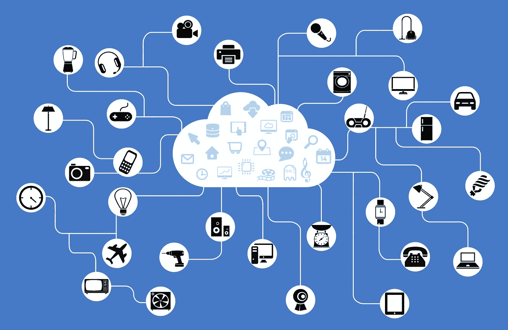
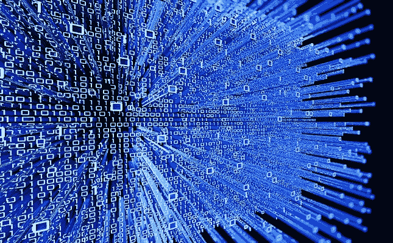
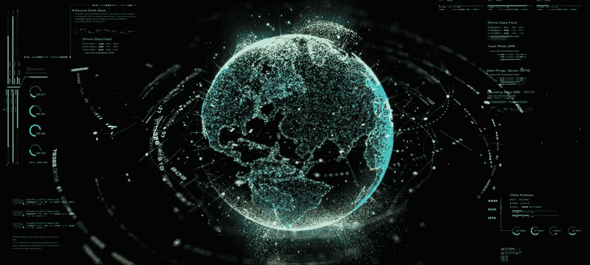
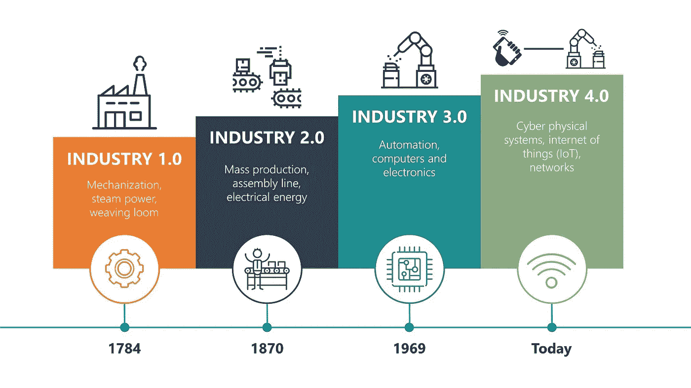
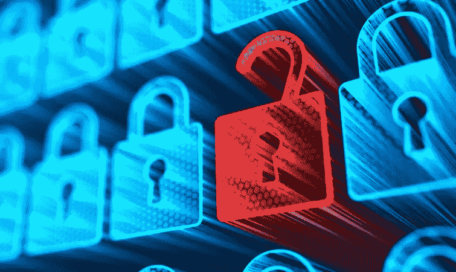
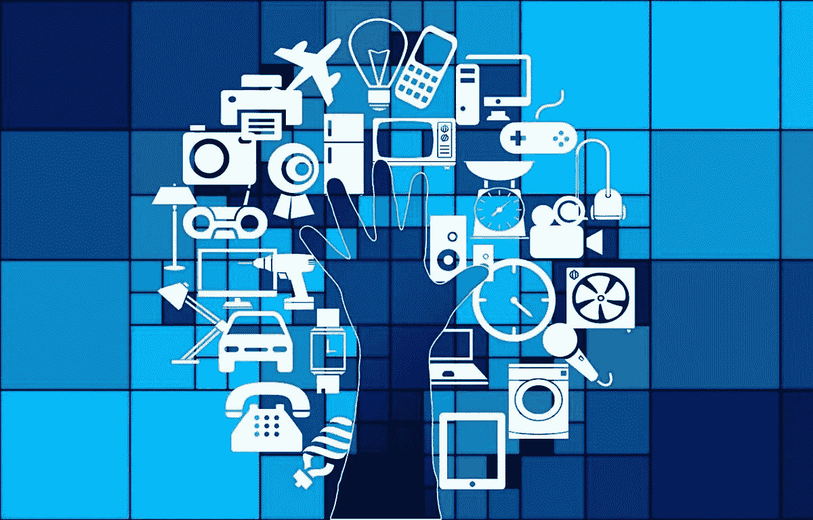

# 物联网:迈向永久互联的未来

> 原文：<https://medium.com/coinmonks/the-internet-of-things-b534ae2a9212?source=collection_archive---------13----------------------->

## 融合了数字世界和物理世界的“巨型机器人”。

目前有很多关于**物联网** ( *或* ***物联网*** )及其对一切事物的影响的噪音，从我们旅行和购物的方式到制造商跟踪库存的方式。

[智能烤面包机](https://toasteroid.com/)、联网的[直肠温度计](https://www.kinsahealth.co/)和狗用的健身项圈可能会被贴上一些日常的*哑物品*的标签，作为**物联网(*IoT*)**的一部分被连接到网络上，尽管我们正在目睹的是一项革命性技术的第一步，这项技术将改变我们的日常生活。

# 那么，什么是物联网(IoT)？

*先从了解几件事开始。*

随着**宽带互联网**可用性的增加，连接成本正在降低，更多内置了 *Wi-Fi* 功能和传感器的设备正在被制造出来，技术成本正在下降，智能手机的普及率正在飙升。

> 所有这些都在为物联网创造一场“ ***完美风暴*** ”。

简而言之，**物联网**的概念是将任何设备(只要它有开/关开关)连接到*互联网*和其他连接的设备。物联网是一个由互联的事物和人组成的巨大网络，所有这些事物和人都收集和共享关于其使用方式和周围环境的数据。

今天有超过 70 亿的物联网设备，专家预计这个数字到 2020 年将增长到 100 亿，到 2025 年将增长到 220 亿。这是一个很大的连接(有人甚至估计这个数字要高得多，超过 1000 亿个*)，使得物联网是一个由连接的**物**【其中也包括**人:**人与人、人与物、物与物之间的关系。*

# *简单介绍一下它是如何工作的*

**

*带有内置传感器的设备和对象连接到物联网平台，该平台集成来自不同设备的数据，并应用分析来与为满足特定需求而构建的应用程序共享最有价值的信息。*

*这些强大的物联网平台可以准确定位哪些信息是有用的，哪些信息可以安全地忽略。这些信息可用于检测模式、提出建议以及在问题发生之前检测出可能的问题。*

*一个最鲜明的例子是物联网在汽车行业的应用:如果我拥有一家汽车制造企业，我可能想知道哪些可选部件(例如，真皮座椅或合金车轮)最受欢迎。*

**利用物联网技术，我可以:**

*   ***使用传感器检测陈列室的哪个区域最受欢迎，顾客在哪里逗留的时间最长；***
*   ***深入研究可用的销售数据，确定哪些组件销售最快；***
*   ***自动使销售数据与供应保持一致，这样受欢迎的商品就不会缺货。***

*互联设备收集的信息使我能够根据实时信息做出明智的决定，决定采购哪些组件，从而帮助我节省时间和金钱。*

*借助高级分析提供的洞察力，可以提高流程效率。智能对象和系统意味着你可以自动化某些任务，尤其是当这些任务是重复的，平凡的，耗时的，甚至是危险的。*

**这种技术的其他实际例子有:**

*可以使用智能手机应用程序打开的**灯泡**是一种物联网设备，你办公室中的运动传感器或**智能恒温器**或联网的路灯也是如此。物联网设备可以像**儿童玩具**一样蓬松，也可以像 [**无人驾驶卡车**](https://www.cnbc.com/2021/11/08/walmart-is-using-fully-driverless-trucks-to-ramp-up-its-online-grocery-business.html) 一样严肃。*

*想想你的**智能手机，**就是一个例子:它可以作为一个*遥控器*来控制你家周围的每一个智能设备，使它成为在家庭环境中与物联网互动的事实上的完美工具。*

*此外，一些较大的物体本身可能充满了许多较小的物联网组件，例如一个喷气式发动机，它现在充满了数千个传感器，收集和传输数据，以确保它有效运行。在更大的范围内，智能城市项目正在用传感器填充整个区域，以帮助我们理解和控制环境。*

> *这是关于网络，关于设备，关于数据共享*

# ***物联网与数据***

*一个*物联网*设备可能会包含一个或多个传感器，用于收集数据。这些传感器收集的信息将取决于具体的设备及其任务。工业机械内部的传感器可以测量温度或压力；一个安全摄像头可能有一个接近传感器以及声音和视频，而您的家庭气象站可能会包装一个湿度传感器。所有这些传感器数据——以及更多的数据——都必须被发送到某个地方。这意味着物联网设备将需要传输数据，并将通过 Wi-Fi、4G、5G 等传输数据。*

## *[**科技分析师 IDC 计算出，五年内物联网设备将创造 79.4 吉字节的数据。**](https://infohub.delltechnologies.com/l/edge-to-core-and-the-internet-of-things-2/internet-of-things-and-data-placement)*

**

*这些*物联网*数据中的一些将会是“ ***小而突发的***”IDC**说**——像传感器的温度读数或智能仪表的读数这样的快速更新。其他设备可能会产生大量的数据流量，如使用计算机视觉的视频监控摄像头。*

*IDC 表示，物联网设备创建的数据量将在未来几年快速增长。它说，大多数数据是由视频监控产生的，但随着时间的推移，其他工业和医疗用途将产生更多的数据。*

*它表示，无人机也将是使用相机创建数据的一大驱动力。展望未来，自动驾驶汽车还将产生大量丰富的传感器数据，包括音频和视频，以及更专业的汽车传感器数据。*

# *是什么让物联网成为可能？*

**

*虽然物联网的概念已经存在了很长时间，但许多不同技术的最新进展使它变得切实可行。*

*   ***获得低成本、低功耗的传感器技术。**价格合理、性能可靠的传感器让更多制造商使用物联网技术成为可能。*
*   ***连通性。**互联网的大量网络协议使得将传感器连接到云和其他“东西”以实现高效的数据传输变得很容易。*
*   ***云计算平台。**云平台可用性的增加使企业和消费者都能够访问他们需要扩展的基础架构，而无需实际管理所有这些基础架构。*
*   ***机器学习和分析。**随着机器学习和分析的进步，以及对存储在云中的各种各样的海量数据的访问，企业可以更快更容易地收集见解。这些联合技术的出现继续推动物联网的边界，物联网产生的数据也为这些技术提供了支持。*
*   ***对话式人工智能(AI)。**神经网络的进步为物联网设备(如数字个人助理 Alexa、Cortana 和 Siri)带来了自然语言处理(NLP ),并使它们变得更具吸引力、更经济实惠、更适合家庭使用。*

# *物联网在行业中的应用及对消费者的益处*

**

***工业物联网(IIoT)** 或第四次工业革命或 ***工业 4.0*** 是在商业环境中使用物联网技术的所有名称。这个概念与家庭中的消费物联网设备相同，但在这种情况下，目标是使用传感器、无线网络、大数据、人工智能和分析的组合来测量和优化工业流程。*

*如果在整个供应链中引入，而不仅仅是单个公司，那么对于物料的及时交付和自始至终的生产管理，影响可能会更大。提高劳动力生产率或节约成本是两个潜在的目标，但 IIoT 也可以为企业创造新的收入来源；制造商不仅可以销售独立的产品，例如发动机，还可以销售发动机的预测性维护。*

*在工业应用中，生产线上的传感器可以提高效率，减少浪费。*

> *一项研究清楚地显示了传感器行业的指数增长，从 2019 年的 192.9 亿美元增长到 2027 年的 335.6 亿美元*

* [## 工业传感器市场规模、增长|全球报告[2020-2027]

### 2019 年全球工业传感器市场规模为 192.9 亿美元，预计到 2020 年将达到 335.6 亿美元

www.fortunebusinessinsights.com](https://www.fortunebusinessinsights.com/industry-reports/industrial-sensors-market-100591)* 

# *对隐私和安全的担忧*

**

*现实是，物联网允许几乎无限的机会和联系发生，其中许多我们甚至无法想到或完全理解今天的影响。不难看出物联网是如何以及为什么成为当今如此热门的话题；这无疑为许多机遇和挑战打开了大门。*

***安全性**是一个经常被提起的大问题。随着数十亿台设备连接在一起，**人们可以做些什么来确保他们的信息安全？有人能够侵入你的烤面包机，从而进入你的整个网络吗？***

*物联网也让世界各地的公司面临更多的安全威胁。然后我们有了**隐私**和**数据共享**问题。即使在今天，这也是一个热点话题，所以当我们谈论数十亿台设备联网时，人们只能想象对话和担忧会如何升级。*

*许多公司将面临的另一个问题是所有这些设备将产生的大量数据。公司需要找到一种方法来存储、跟踪、分析和理解将产生的大量数据，所有这些都要以安全的方式完成。*

# ***物联网下一步将走向何方？***

**

*随着传感器和通信价格的持续下降，向物联网添加更多设备变得更具成本效益——即使在某些情况下，消费者会有一点明显的好处。部署处于早期阶段；大多数参与物联网的公司目前都处于试验阶段，这主要是因为必要的技术——传感器技术、5G 和机器学习驱动的分析——本身仍处于合理的早期发展阶段。有许多竞争平台和标准，许多不同的供应商，从设备制造商到软件公司到网络运营商，都想分一杯羹。现在还不清楚哪一个会胜出。但是，如果没有标准，并且安全是一个持续的问题，我们可能会在未来几年看到更多重大的物联网安全事故。*

# *我们看到的未来是，公司将沉迷于数字达尔文主义，使用物联网、人工智能和机器学习以我们从未见过的方式快速进化，所有这些都发生在 Web 3.0 革命的快速到来中。*

*随着联网设备的数量不断增加，我们的生活和工作环境将充满智能产品——假设我们愿意接受安全和隐私的权衡。*

**一些人将迎来智能事物的新时代。**

*其他人会怀念椅子只是椅子的日子。*

***了解我们的新平台**👉**[**https://thecapital.io/**](https://thecapital.io/)***

***[https://twitter.com/thecapital_io](https://twitter.com/thecapital_io)***

> ***加入 Coinmonks [电报频道](https://t.me/coincodecap)和 [Youtube 频道](https://www.youtube.com/c/coinmonks/videos)了解加密交易和投资***

# ***另外，阅读***

*   ***什么是融资融券交易***
*   ***[维护卡审核](https://coincodecap.com/uphold-card-review) | [信任钱包 vs MetaMask](https://coincodecap.com/trust-wallet-vs-metamask)***
*   ***[Exness 点评](https://coincodecap.com/exness-review)|[moon xbt Vs bit get Vs Bingbon](https://coincodecap.com/bingbon-vs-bitget-vs-moonxbt)***
*   ***[如何开始通过加密贷款赚取被动收入](https://coincodecap.com/passive-income-crypto-lending)***
*   ***[BigONE 交易所评论](/coinmonks/bigone-exchange-review-64705d85a1d4) | [电网交易机器人](https://coincodecap.com/grid-trading)***