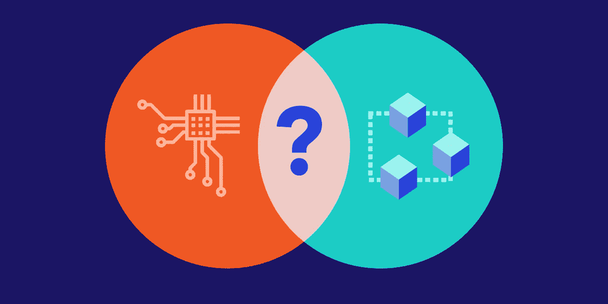
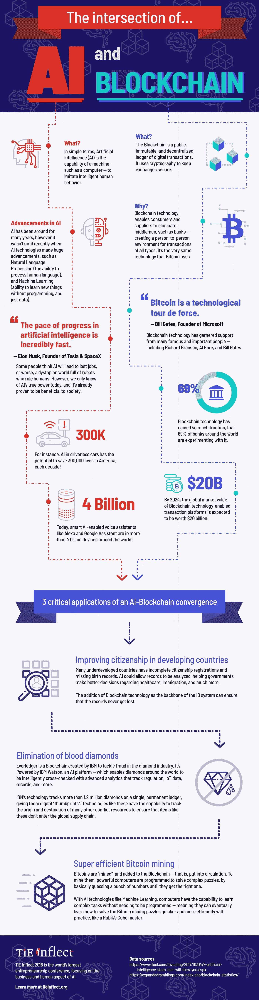

# 人工智能和区块链的交集:信息图

> 原文：<https://medium.com/coinmonks/the-intersection-of-ai-and-blockchain-an-infographic-d33578fe3235?source=collection_archive---------3----------------------->

几年来，人工智能和区块链一直在科技界掀起波澜——聊天机器人、加密货币、个人助理(如 Alexa)和机器人等热门技术的关键驱动因素。

随着这些技术各自成熟，并看到更广泛的应用，越来越明显的是，它们正在走向融合，无论是[改进自动驾驶汽车](https://futurism.com/cars-blockchain-six-ways/)还是[提高挖掘比特币的效率](https://www.cio.com/article/3263810/artificial-intelligence/how-blockchain-empowers-artificial-intelligence.html)。

如果你对人工智能和区块链不熟悉，或者需要了解它们的最新发展， [TiE Inflect](https://www.tieinflect.org/) 已经整理了一张关于这两种技术的便利信息图，以及它们如何协同工作。

你认为这两项技术将走向何方？

