# 区块链的投资案例——支持哪些加密货币

> 原文：<https://medium.com/coinmonks/the-investment-case-for-blockchain-which-cryptocurrencies-to-back-c9eb9f7df18d?source=collection_archive---------5----------------------->

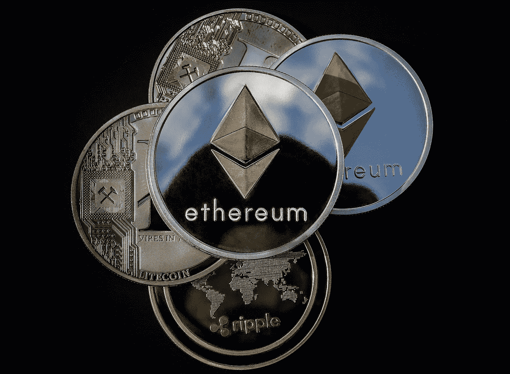

关于区块链的书籍和文章不计其数。为什么？因为这项技术有可能破坏我们今天认为理所当然的许多中央系统。区块链可以改造的几个行业包括:银行、医疗保健、财产记录、金融，包括支付产品和服务的替代方法(即利用加密货币)、供应链、投票、文件存储、社交媒体、交通。

## **区块链的定义**

区块链的定义是什么？分布式、分散式公共分类账。这到底是什么意思？因为老实说，几年前当我第一次读到这个定义的时候，我不知道它是什么意思，结果它的意义完全被我忽略了。

对于我们当中的专家来说，在我们讨论区块链的意义之前，请耐心听我们说，我们如何从这项技术中赚钱？

为什么叫区块链？因为它是一个“区块链”。信息包含在块中(例如关于交易的信息，包括日期、时间和值)，这些块又存储在称为链的公共数据库中。当一个块存储新数据时，它被添加到区块链中。区块链由多个区块串在一起组成。实际上有四种类型的区块链。

1.  **大众区块链**s——顾名思义任何人都可以使用它们。
2.  **二等兵区块链**——顾名思义，只有被邀请才能加入。这些通常被大公司用于内部目的，通常没有本地货币或代币。
3.  混合区块链——结合了集权和分权的元素。
4.  **侧链** —它们与主区块链平行运行。主区块链的条目可以连接到侧链，也可以连接到侧链，使侧链可以独立于区块链运行。

我们在这里要考察的是公共区块链。就应用和投资潜力而言，公共区块链是最活跃的地方。

**区块链有哪些独到之处？**

*   通过消除人工参与验证来提高准确性
*   通过消除第三方验证降低成本
*   权力下放使得篡改变得更加困难
*   交易安全、保密且高效
*   透明技术

当然，使用这种技术也有缺点，包括:

*   与采矿相关的巨大技术成本
*   每秒低事务数
*   在非法活动中使用的历史
*   易受黑客攻击

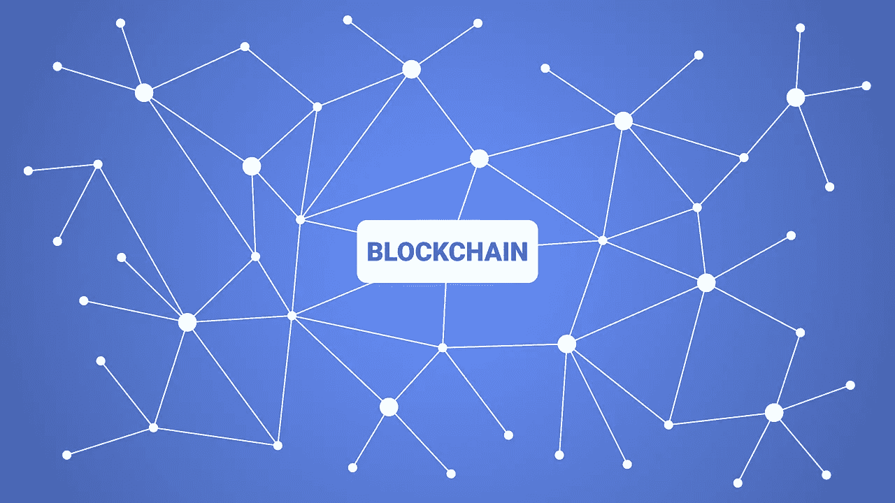

**区块链的历史**

Stuart Haber 和 W Scott Stornetta 两位研究人员在 1991 年首次提出了区块链的概念。然而，在 2009 年推出比特币之前，这个想法一直处于休眠状态。事实上，许多人对比特币作为一种货币的想法不屑一顾，但却爱上了区块链这种技术及其许多潜在的应用。

## **以太坊和区块链**

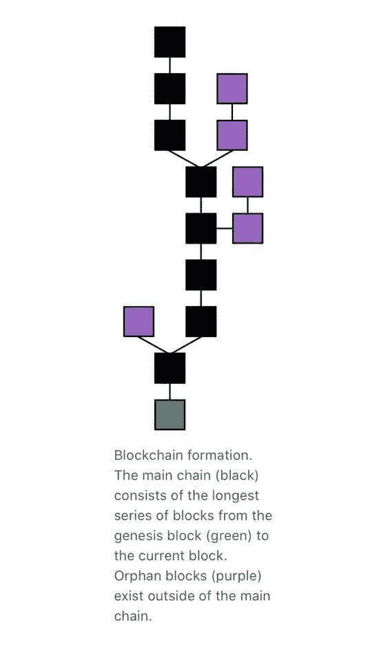

是以太坊让区块链更上一层楼。以太坊是一个基于区块链技术的开放软件平台，使开发人员能够构建和部署分散的应用程序。它利用以太网支付交易费用和网络服务。这是与比特币的根本区别，因为以太只在以太坊网络中使用，它不是正常意义上的交换媒介。正是以太坊实现了智能合约的理念，并为开发者提供了一个平台来构建所谓的 Dapps 或去中心化应用。

当然，对于大多数具有潜在革命性的东西来说，它们会产生复制猫。以太坊的虚拟世界计算机的想法产生了大量的模仿者。大多数可信的模仿者试图以某种形式将他们的区块链与以太坊区分开来。一些主要差异包括:

*   特定类型应用的专业化，例如娱乐(TRON)赌博、游戏、市场、供应链管理或令牌化。
*   速度—与 TRON 2，000 和 EOS 4，000 相比，以太坊以每秒 20 的速度处理交易。
*   成本——以太坊上处理交易的成本可能相对较高——其他区块链正寻求以低价收购它们——以太坊上的交易费用中值为 3 美元，TRON 要便宜得多，其他区块链的交易成本很低或为零。
*   不同的挖掘算法。

## **网络效应**

以太坊有一个显著的优势——网络效应。用简单的英语来说，就是以太坊首先推出。由于其先发优势，以太坊已经拥有了一批忠实的开发者，他们已经在这个平台上开发了许多应用程序。这意味着未来在以太坊上开发的应用可能会更可靠、更快速，当然也更便宜。一个巨大的优势。但这并不意味着没有可行的竞争，总会有第二或第三名的空间，自然还有一些其他值得仔细研究的异常值。

## **面向成年人的区块链**

以太坊上有超过 2500 个 Dapps，它拥有最大的市场份额。超过 50%的福布斯公司正在以太坊的基础上构建应用程序。不得不说，以太坊是创业公司在区块链设立摊位的明显领导者。

这种领先地位并没有阻止 IBM 试图通过加入 Linux 基金会的 Hyperledger 区块链项目来吸引更大的公司。IBM 已经帮助 220 多家企业开发了应用程序。

另一个进入区块链舞台的著名蓝筹股是摩根大通及其法定人数区块链。Quorum 是以太坊区块链的副本(技术上叫叉子——我们叫它副本)。Quorum 主要由银行使用，是一种许可的区块链，因为它并不对所有人开放。

肯定会有其他公司为企业提供解决方案，但重要的是，亚马逊和微软都提供以太坊平台作为他们自己的云计算解决方案的一部分。

以太坊不仅在初创公司和蓝筹股中都是可信的，它也在与 IBM 竞争，并且可能会继续这样做。

## **达普斯之王的伪装者**

这就把我们带到了本文更有趣的部分。谁是这个市场的参与者，什么项目和加密货币最有潜力？

不足为奇的是，十大加密货币中有五种是区块链本土货币。

以下是市值排名前五的区块链公司:

## [**以太坊**](https://ethereum.org/en/)

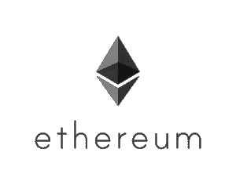

股票代码:ETH

排名:2

市值:400 亿美元

以太坊遥遥领先，以太坊企业联盟中有 100 多家知名公司，在 DeFi 领域占据主导地位，并拥有大量活跃的以太坊 Dapps。问题是他们能被抓住吗？即使他们能被抓住，这是一个相关的问题吗？因为他们继续在这个不断扩大的市场中占有很大一块。

## [**涟漪**](https://ripple.com)

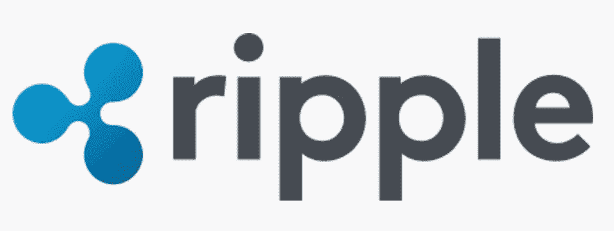

股票代码:XRP

排名:4

市值:110 亿美元

Ripple 现在与包括美国运通和桑坦德银行在内的 300 多家金融机构合作。然而，美国证券交易委员会已对其提起诉讼，称代币被指控作为未注册证券出售。也有关于首次公开募股的讨论。现实情况是，美国证交会的行动给 Ripple 蒙上了一层阴影，在达成和解、解决围绕和解的所有不确定性之前，不会进行 IPO。然而，作为一个项目，它肯定有潜力，已经创造了一个非常有利可图的利基。一旦不确定性被清除，它就值得密切关注。

## [**比特币现金**](https://www.bitcoincash.org)

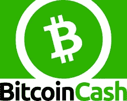

股票代码:BCH

排名:5

市值:42 亿美元

BCH 由比特币衍生而来，主要优势是交易处理速度更快。凭借其支持 ERC20 风格令牌的简单分类帐协议(SLP ),它以较低的费用建立了自己的增长引擎。现在有超过 10，000 SLP 代币。SLP 的发展将 DeFi 带到了 BCH。SLP 代币肯定会推动区块链的增长。

## [**【币安】**](https://www.binance.com/en) **硬币**

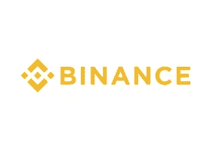

股票代码:BNB

排名:6

市值:41 亿美元

币安是这个市场的新手，2019 年 4 月才推出币安连锁店。虽然 BNB 是一种货币，创造这种货币是为了让币安的客户能够从交易和其他服务的折扣中受益，但它现在是币安连锁基础设施的一部分。币安连锁应该获得牵引力，因为它能够受益于其筹资能力，这可能会吸引 DeFi 协议和其他 Dapps 到连锁。然而，我们认为币安是建立在沙子上的，从长远来看不会成为加密领域的一部分，除非它对其结构做出重大改变。

## [**波尔卡多**](https://polkadot.network)

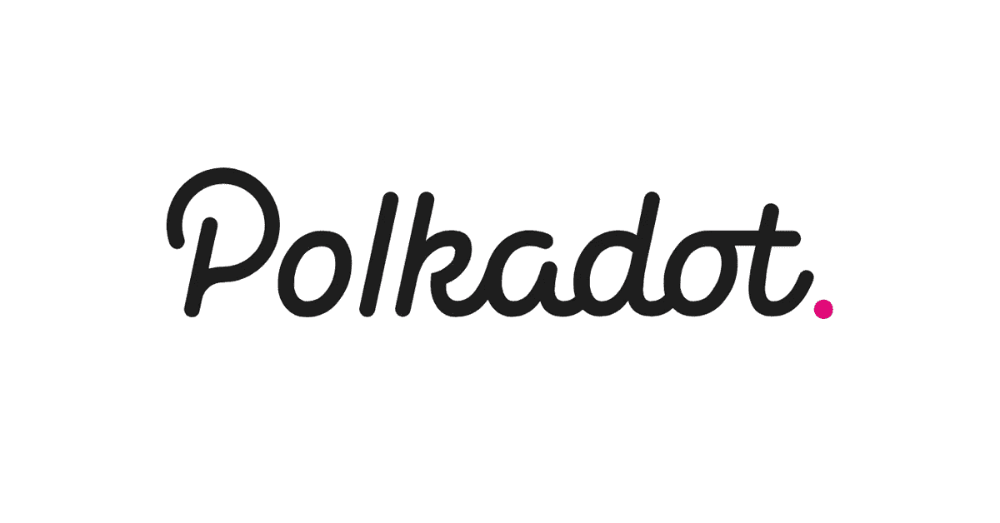

股票代码:(点)

排名:7

市值:39 亿美元

旨在支持不同开发人员创建的个人区块链。它还旨在提供互操作性、可伸缩性和安全性。该生态系统仅在 2020 年 8 月启动，目前已有 197 个项目。波尔卡多特并不直接与以太坊竞争，以太坊是一个很大的优势。许多人已经意识到了它的潜力，自从在币安上市以来，它的价格已经上涨了 200%。

## **销量排名前三的区块链**

虽然区块链的市值比 TRON 和 EOS 高，但以太网、TRON 和 EOS 按此顺序控制了 98%的 Dapp 量。让我们更详细地看看这两个竞争者。

## [**EOS**](https://eos.io)

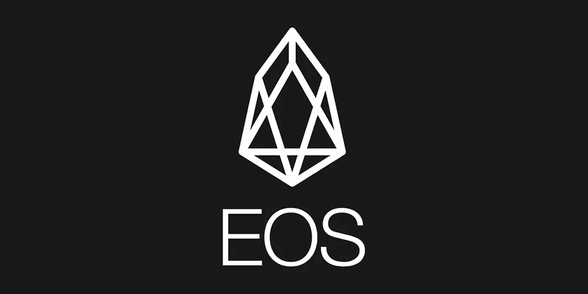

股票代码:EOS

排名:14

市值:240 万美元

从一年前开始，EOS 上的 Dapp 用户数量似乎已经大幅下降。这可能是因为 EOS 的一些领先 Dapps 离开平台，加入了竞争对手(WAX)。其 40 亿美元的 ICO 也面临集体诉讼。

## [**创**](https://tron.network)

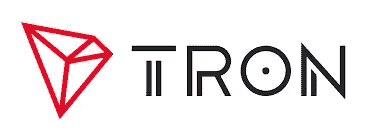

股票代码:TRX

排名:15

市值:19 亿美元

一个严肃的竞争者，尽管它最初是专门为“娱乐”而设立的。去追寻以太坊的头衔。他们最近推出了以太坊 UniSwap 的副本 JustSwap，这表明了他们进军以太坊主导的 DeFi 市场的决心。交易成本比 ETH 低得多，交易速度也高得多。流行的 WINK 游戏生态系统也驻留在这个平台上。

## **局外人**

正如你将看到的，许多区块链的外来者已经将自己定位在自己的利基市场，在此基础上，他们没有与以太坊竞争，而是潜在地开拓自己的市场，这无疑会及时带来自己的竞争。

## **卡尔达诺**

股票代码:ADA

排名:9

市值:32 亿美元

旨在与以太坊竞争。最终在 2020 年 8 月推出，他们预测在 2021 年将有“数以千计的 Dapps”在平台上。目前很少。围绕这个项目及其背后的团队有很多炒作。炒作买不到食品杂货！

## **泰佐斯**

股票代码:XTZ

排名:16

市值:17 亿美元

把自己标榜成一个利用利害关系证明的自我修正的密码分类帐。它已经成为最受欢迎的加密货币和区块链，用于令牌化的证券和房地产令牌。拉丁美洲最大的投资银行 BTG Pactual 宣布，它计划使用 Tezos 区块链提供安全令牌。他们通过专注于激动人心的令牌化市场创造了一个有利可图的利基市场。

## **恒星**

股票代码:XLM

排名:18

市值:15 亿美元

是一个开放的网络，允许资金转移和存储。它的首要任务是帮助金融公司通过区块链相互联系，让资金快速可靠地流动，而且几乎没有成本。Stellar 与一些最大的科技和金融公司建立了一系列合作伙伴关系，包括 IBM、Stripe 和德勤，以及欧洲和亚洲的至少十几家支付处理器和金融机构。像其他几个区块链一样，它巧妙地利用区块链的技术来建立自己吸引人的利基市场。

## **NEO**

股票代码:NEO

排名:19

市值:14 亿美元

专注于加密交易、数字身份和智能合约。类似于以太坊，但能够支持许多常见的编程语言。NEO 还将许多其他加密货币集成到其网络中。它经常被描述为中国的以太坊。该系统的法规遵从性远远强于许多其他系统，需要验证身份。它对接纳区块链的巨大中国市场的关注，可能会使这成为一个为未来储备的有吸引力的象征。

## **宇宙**

股票代码:ATOM

排名:22

市值:10 亿美元

以太坊的对手。它的创始人将其称为“区块链的互联网”,其目标是创建一个由开源工具联合起来的加密网络。它于 2019 年推出，已经有超过 100 个不同的 Dapps 建立在 Cosmos 生态系统上。在我们看来，宇宙是最令人兴奋的项目之一。

## **VeChain**

股票代码:兽医

排名:26

市值:8.28 亿美元

企业区块链是以太坊代码库的一个分支。它强调物联网和供应链，以实现安全的产品生命周期管理。自 2020 年 4 月以来，交易量增长了 1000%。从以太坊中脱颖而出的 Despote 创造了自己独特的市场。

## **IOTA**

股票代码:米欧塔

排名:28

市值:7.66 亿美元

是一种加密货币，旨在允许作为物联网一部分的任何数据记录机之间进行数据交换。事实上，IOTA 没有使用区块链。相反，它实现了一种不同类型的网络连接系统。该项目似乎有许多问题，包括安全性，当他们在遭受攻击后被迫关闭其中一个节点 12 天。该公司最近对其网络进行了升级，这将使其能够更快地处理交易。但目前，技术和商业模式还没有被证明能够保证如此高的估值。

## **雪崩**

股票代码:AVAX

排名:97

市值:1.03 亿美元

avalanche mainnet 最近上线，其货币最近在币安上市。许多人认为雪崩将是“下一代”区块链。它还被宣传为能够“以 DeFi 要求的规模提供服务”。现在说 Avalanche 是否会成为未来 DeFi 市场的重要参与者还为时过早，这个市场肯定会呈指数级增长。市值多少有些误导，因为最多有 3.6 亿股代币将发行，未来完全稀释后的市值为 16 亿美元，所以这不是乍看上去的“便宜货”。

## **实体**

股票代码:AE

排名:170

市值:3900 万美元

“实体”是区块链的一个网络，它托管智能合同，并与主网络相分离，这使得它自己的链运行得更快。目前只有少数 Dapps 使用该平台，由于某种原因，它似乎没有像一些更受欢迎的平台一样受到关注，尽管它的技术可以说更强。

## **早教网**

股票代码:POA

排名:637

市值:560 万美元

一种基于以太坊的公共网络，自称是由一组可信验证者保护的自治网络。POA 网络由大量精选的钱包支持。该项目似乎很有趣，与 Compound、MakerDAO 和 Bancor 等公司建立了引人注目的合作伙伴关系。

## **整党 RSK**

股票代码:RBTC

排名:798

市值:310 万美元

号称是目前加密领域最重要的项目之一。使用根茎允许用户在比特币区块链上创建和运行智能合约。尽管这个项目有着令人兴奋的前景，但它的采用速度确实很慢。

## 有哪些货币值得仔细看看？

以太坊显然处于领先地位，除非它向股权证明的过渡产生副作用，否则它将继续在这个不断增长的市场中建立自己的地位。随着时间的推移，其加密货币的价格可能会升至 1000 亿美元以上。

我们认为具有良好潜力的其他加密货币有:

**宇宙**——快速而令人印象深刻的采用

**恒星**——确保了一个强大的有利可图的利基市场

**TRON** —雄心勃勃，致力于打造一个坚实的 Dapps 平台

NEO 在中国市场为 Dapps 建立了一个利基市场，这个市场可能会很大

还有几个外人值得仔细看看…

**整党 RSK** —伟大的概念，然而要获得通过还有很多工作要做

**雪崩** —下一代技术提供了潜力，尽管估值似乎已经考虑了采用因素

## **大众市场采用和评估**

区块链竞技场有许多参与者。我们上面考察的项目仅仅代表了现有项目的一小部分。每周都会有一个新项目以不同的角度和革命性的潜力出现。我们确信会有一个未被提及的杀手区块链不知从哪里冒出来，在某个时候席卷市场。

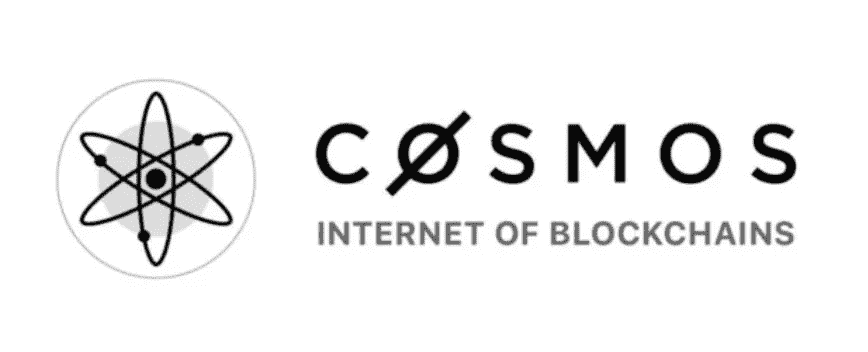

我们认为宇宙就是这样一个链条。但是这个领域的每个人都面临一个老问题，让人们使用这些 Dapps。根据 StateoftheDapps.com 的数据，Dapps 有 3727 个，每日用户只有 5.8 万。显然，我们离大规模采用还有很长的路要走。只有当网络变得更快，用户界面更容易操作时，这种情况才会发生。

目前，这个市场是为早期用户或极客建立的。以太坊的 400 亿美元估值、TRON 的 19 亿美元估值和 EOS 的 24 亿美元估值都是基于大规模采用，我们相信这将及时发生，但这是这个市场面临的最大风险。风险较低的做法是瞄准那些大规模采用可能不成问题的项目，例如 Stellars 和 Tezos，他们已经建立了自己的利基市场。

## **理财建议**

本文不以任何方式构成财务建议。这篇文章应该作为补充信息添加到您现有的知识库中。

**关注我们的推特新闻和提醒:**[**@ fraud stamp**](https://twitter.com/fraudstamp?lang=en)

## 另外，阅读

*   最好的[密码交易机器人](/coinmonks/crypto-trading-bot-c2ffce8acb2a)
*   [密码本交易平台](/coinmonks/top-10-crypto-copy-trading-platforms-for-beginners-d0c37c7d698c)
*   最好的[加密税务软件](/coinmonks/best-crypto-tax-tool-for-my-money-72d4b430816b)
*   [最佳加密交易平台](/coinmonks/the-best-crypto-trading-platforms-in-2020-the-definitive-guide-updated-c72f8b874555)
*   最佳[加密贷款平台](/coinmonks/top-5-crypto-lending-platforms-in-2020-that-you-need-to-know-a1b675cec3fa)
*   [最佳区块链分析工具](https://bitquery.io/blog/best-blockchain-analysis-tools-and-software)
*   [加密套利](/coinmonks/crypto-arbitrage-guide-how-to-make-money-as-a-beginner-62bfe5c868f6)指南:新手如何赚钱
*   最佳[加密制图工具](/coinmonks/what-are-the-best-charting-platforms-for-cryptocurrency-trading-85aade584d80)
*   [莱杰 vs 特雷佐](/coinmonks/ledger-vs-trezor-best-hardware-wallet-to-secure-cryptocurrency-22c7a3fd391e)
*   了解比特币最好的[书籍有哪些？](/coinmonks/what-are-the-best-books-to-learn-bitcoin-409aeb9aff4b)
*   [3 商业评论](/coinmonks/3commas-review-an-excellent-crypto-trading-bot-2020-1313a58bec92)
*   [AAX 交易所评论](/coinmonks/aax-exchange-review-2021-67c5ea09330c) |推荐代码、交易费用、利弊
*   [Deribit 审查](/coinmonks/deribit-review-options-fees-apis-and-testnet-2ca16c4bbdb2) |选项、费用、API 和 Testnet
*   [FTX 密码交易所评论](/coinmonks/ftx-crypto-exchange-review-53664ac1198f)
*   [n 零审核](/coinmonks/ngrave-zero-review-c465cf8307fc)
*   [Bybit 交换审查](/coinmonks/bybit-exchange-review-dbd570019b71)
*   [3Commas vs Cryptohopper](/coinmonks/cryptohopper-vs-3commas-vs-shrimpy-a2c16095b8fe)
*   最好的比特币[硬件钱包](/coinmonks/the-best-cryptocurrency-hardware-wallets-of-2020-e28b1c124069?source=friends_link&sk=324dd9ff8556ab578d71e7ad7658ad7c)
*   最佳 [monero 钱包](https://blog.coincodecap.com/best-monero-wallets)
*   [莱杰 nano s vs x](https://blog.coincodecap.com/ledger-nano-s-vs-x)
*   [bits gap vs 3 commas vs quad ency](https://blog.coincodecap.com/bitsgap-3commas-quadency)
*   [莱杰纳米 S vs 特雷佐 1 vs 特雷佐 T vs 莱杰纳米 X](https://blog.coincodecap.com/ledger-nano-s-vs-trezor-one-ledger-nano-x-trezor-t)
*   [block fi vs Celsius](/coinmonks/blockfi-vs-celsius-vs-hodlnaut-8a1cc8c26630)vs Hodlnaut
*   Bitsgap 评论——一个轻松赚钱的加密交易机器人
*   为专业人士设计的加密交易机器人
*   [PrimeXBT 审查](/coinmonks/primexbt-review-88e0815be858) |杠杆交易、费用和交易
*   [埃利帕尔泰坦评论](/coinmonks/ellipal-titan-review-85e9071dd029)
*   [SecuX Stone 评论](https://blog.coincodecap.com/secux-stone-hardware-wallet-review)
*   [BlockFi 评论](/coinmonks/blockfi-review-53096053c097) |从您的密码中赚取高达 8.6%的利息