# 看不见和说不出的支点

> 原文：<https://medium.com/coinmonks/the-invisible-unspoken-pivots-2151f44f86eb?source=collection_archive---------5----------------------->

## 简而言之:我应用传统支点公式，将 R6 至 R10 和 S6 至 S10 支点计算成一个新指标。值得花时间吗？它让我降落在枢轴卫星上了吗？下面是整个过程的演示

T **他的**，就是你平均每年的枢纽分析图的样子:

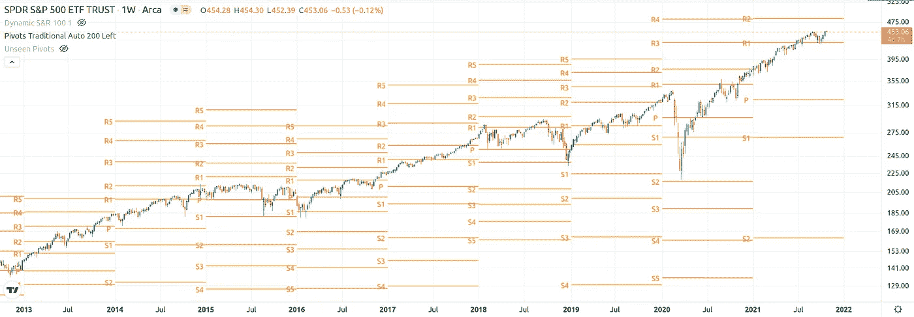

在这种情况下，上面的图表是每年的标准普尔 500 图表，在它上面绘制了传统的年度支点(P)，以及它们各自的阻力水平命名为 R1-R5 和支持水平命名为 S1-S5。

正如你可能注意到的，每个方向的支持或阻力不超过五级。为什么图表分析师不使用超过这五个支点水平？由于历史搜索没有得到真正的答案，我只能推测，根本没有人费心去计算它们，因为市场没有用它们的波动性、价格行为和回报来测试它们——正如你从上面的 S&P 图表中看到的——实际上没有必要进行更多的枢轴。

在我创建这个指标之前，我注意到，虽然在传统市场中，Pivots 提供给 R5 的好处或 S5 的坏处是如此之大，以至于在**的大多数**情况下都不需要它，但也有其他市场迫切需要它。我的理论是，计算和绘制 R6 R7 及以上的简单行为，可能对我已经绘制了几年的市场有用——这个市场几乎已经习惯了打破所有绘制的枢轴来寻找价格发现，在价格平流层的外围:加密市场！

你可以在这张比特币年度图表中很好地看到这一点，2013 年和 2017 年是突破所有 R 级的月份:

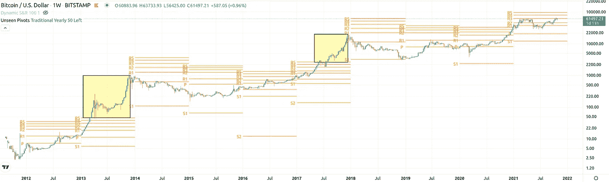

与上面 S&P500 的第一张图相比，这是一个明显的迹象，这是这两者和它们的本性之间的众多差异之一。

## 进行计算

支点最初是场内交易者用来设定关键水平的。在交易日开始时，场内交易者会查看前一天的最高价、最低价和收盘价，以计算当前交易日的支点——看涨和看跌力量平衡的地方。以此枢轴点为基础，进一步计算用于设置支撑 1、支撑 2、阻力 1 和阻力 2。这些水平将被用来帮助他们全天的交易。

同样的道理也适用于更长的时间框架，是一个非常强大的预测交易工具。这些传统枢轴点的公式(有更多类型的枢轴，但我们现在不会进入其中)简单而神奇:

`PP = (HIGHprev + LOWprev + CLOSEprev) / 3
R1 = PP * 2 - LOWprev S1 = PP * 2 - HIGHprev
R2 = PP + (HIGHprev - LOWprev) S2 = PP - (HIGHprev - LOWprev)
R3 = PP * 2 + (HIGHprev - 2 * LOWprev) S3 = PP * 2 - (2 * HIGHprev - LOWprev)
R4 = PP * 3 + (HIGHprev - 3 * LOWprev) S4 = PP * 3 - (3 * HIGHprev - LOWprev)
R5 = PP * 4 + (HIGHprev - 4 * LOWprev) S5 = PP * 4 - (4 * HIGHprev - LOWprev)`

所以现在，剩下的唯一事情就是将 R3/S3 的相同计算应用到 R6/S6 的创建中，如下所示:

`R6 = PP * 5 + (HIGHprev - 5 * LOWprev) S5 = PP * 5 - (5 * HIGHprev - LOWprev)`

依此类推，直到 R10/S10。不是火箭科学！

# 月亮枢轴？

我在绘制这些从未见过的支点时的希望是，在价格波动时发现稀薄的空气价格水平。成功了吗？底线是，它做到了，有时令人惊讶，但也比我希望的命中率要低。

在传统市场中，有一些 R6-R10 标志着顶部或重要水平的轶事般的罕见成功。这更多的是一个玩弄你的关键时间框架的问题。虽然在纳斯达克策划了十年之久的支点，但 R10 在 20 世纪 90 年代末和新千年初扮演的角色是显而易见的，就在去年，R6 也扮演了重要角色。

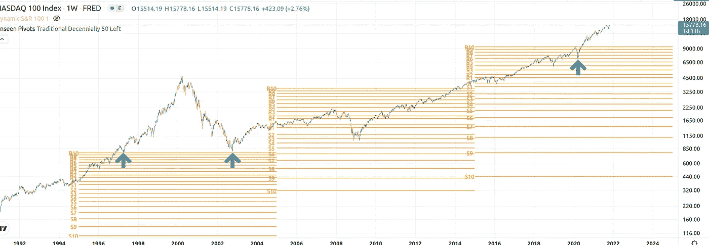

这是道琼斯指数的五年周期支点。在 2009 年的危机中，S6 是多么好的买入机会，或者说 R6 在整个 2015 年的重要性。

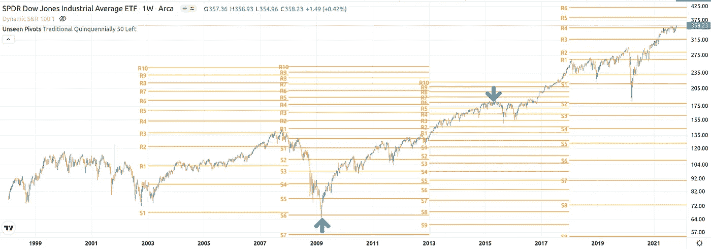

或者去年 9 月 21 日间谍遭遇 S8 时的每日中枢又如何呢？证明这些中枢水平不仅在高时间框架上起作用，而且在低时间框架上也起作用。

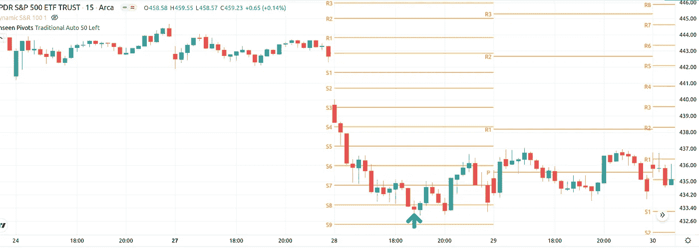

# 指数级波动

但是，你可以更好地看到这些新的支点是如何在加密市场发挥作用的。也许是因为它们的投机性和指数性。然而，很明显，即使有一些魔法，它缺乏传统支点的成功-那些对所有交易者都可见的，创造自我实现的预言和显示支点交易者的方式。

但这是以太坊 2016 年的周线图，每年都有变化:

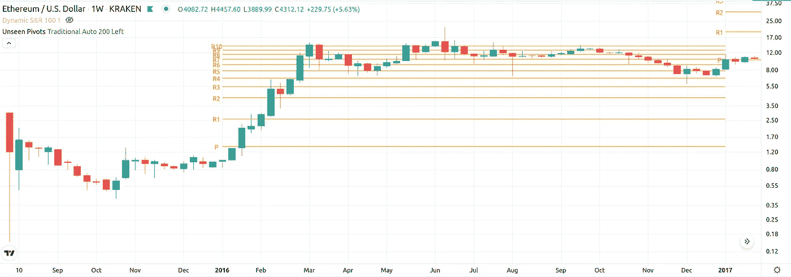

我想说，它们可以作为当年的路线图，因为那一年的大部分行动都围绕着 R6-R10。但这也体现在今年的价格走势上:

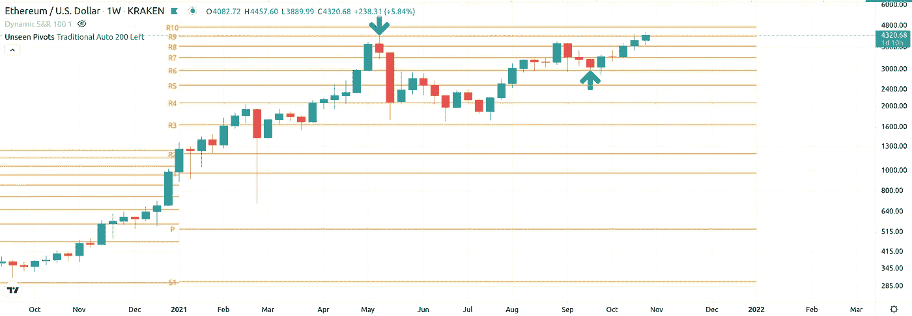

显然，R9 作为今年 5 月的顶部，而自 8 月以来，R6 作为一个不败的支持水平。

以下是 2017 年史诗时代的比特币:

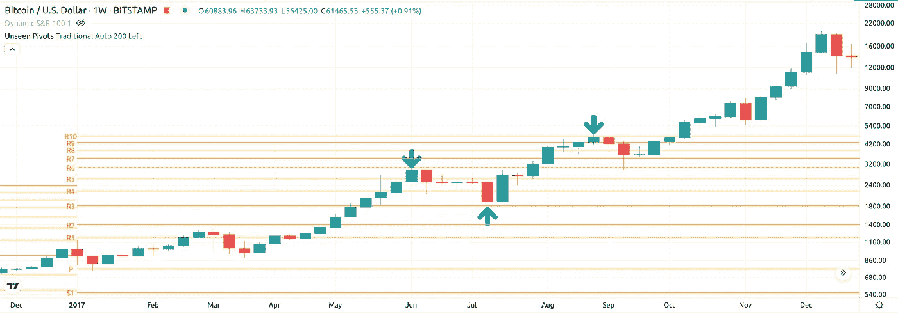

它贯穿了一年到 R6 的第一次拒绝，然后在 R10 到达当地的顶部，随后折回 R6，然后甚至留下那些月亮枢轴。

这些是阿达，露娜，索拉纳和 KSM。今年，所有人都已经或正在以这样或那样的方式与那些看不见的支点调情:

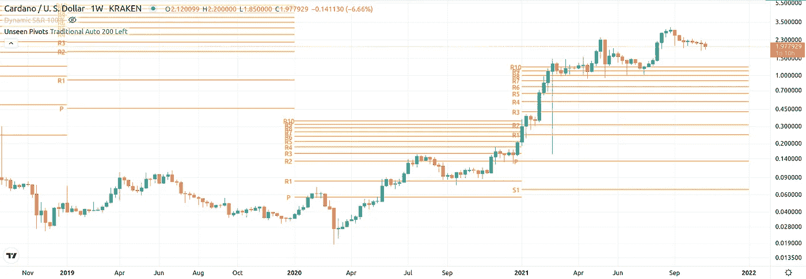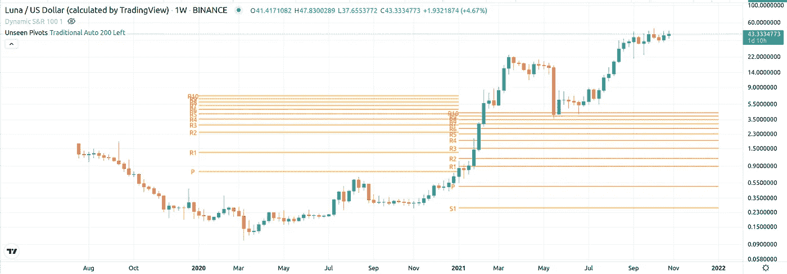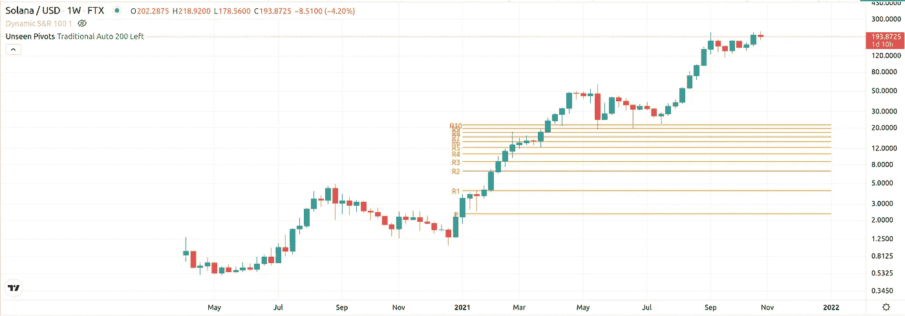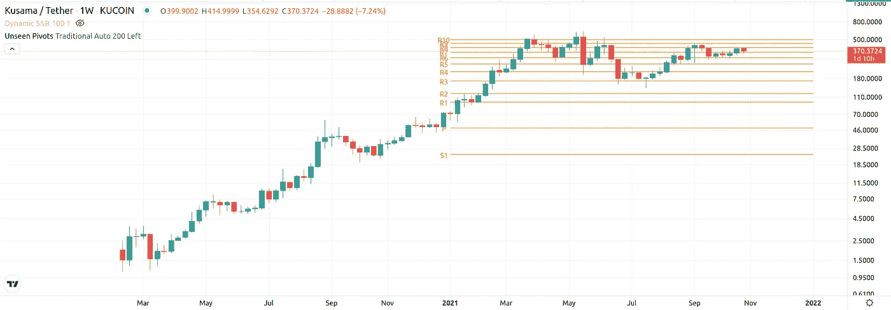

# 那么该拿什么？

老实说，我不知道。在练习这些新的从未见过的水平时，需要更深入的检查和更多的谨慎。对我个人来说，有足够的证据表明，这些水平正在发挥一些作用，并肯定在一些资产上表现出来。一些比另一些更好。

主要是，这是一个有趣的实验，以一种非常平庸的方式揭示了一个极其强大和古老的指标的更多能力。最重要的是，这证明了总会有新的发现。

我将为所有比特币月亮男孩和女孩做些什么来结束这一切。这是 R10 今年的优势:

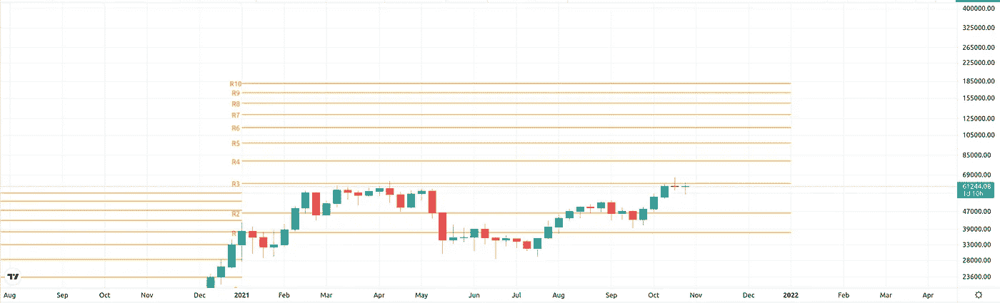

但是你应该寻找的是价格首先突破 R5 然后突破 R10 的一年——那是真正的**月**年！

**如果你确实想使用那些看不见的枢轴指示器，你可以在这里做:**

 [## 看不见的枢轴点-由 Rotzeod 指示

### 这个脚本采用标准的电视枢轴点指示器，并将其扩展到以前从未公开过的新枢轴级别。在…

www.tradingview.com](https://www.tradingview.com/script/9GDng9Mg-Unseen-Pivot-Points/) 

> 加入 Coinmonks [电报频道](https://t.me/coincodecap)和 [Youtube 频道](https://www.youtube.com/c/coinmonks/videos)了解加密交易和投资

## 另外，阅读

*   [3 商业评论](/coinmonks/3commas-review-an-excellent-crypto-trading-bot-2020-1313a58bec92) | [Pionex 评论](https://blog.coincodecap.com/pionex-review-exchange-with-crypto-trading-bot) | [Coinrule 评论](/coinmonks/coinrule-review-2021-a-beginner-friendly-crypto-trading-bot-daf0504848ba)
*   [莱杰 vs n rave](/coinmonks/ledger-vs-ngrave-zero-7e40f0c1d694)|[莱杰 nano s vs x](/coinmonks/ledger-nano-s-vs-x-battery-hardware-price-storage-59a6663fe3b0) | [币安评论](/coinmonks/binance-review-ee10d3bf3b6e)
*   [Bybit 交易所评论](/coinmonks/bybit-exchange-review-dbd570019b71) | [Bityard 评论](https://blog.coincodecap.com/bityard-reivew)
*   [3 commas vs crypto hopper](/coinmonks/3commas-vs-pionex-vs-cryptohopper-best-crypto-bot-6a98d2baa203)|[赚取秘密利息](/coinmonks/earn-crypto-interest-b10b810fdda3)
*   最好的比特币[硬件钱包](/coinmonks/hardware-wallets-dfa1211730c6) | [BitBox02 回顾](/coinmonks/bitbox02-review-your-swiss-bitcoin-hardware-wallet-c36c88fff29)
*   [BlockFi vs Celsius](/coinmonks/blockfi-vs-celsius-vs-hodlnaut-8a1cc8c26630)|[Hodlnaut 点评](/coinmonks/hodlnaut-review-best-way-to-hodl-is-to-earn-interest-on-your-bitcoin-6658a8c19edf) | [KuCoin 点评](https://blog.coincodecap.com/kucoin-review)
*   [Bitsgap 审查](/coinmonks/bitsgap-review-a-crypto-trading-bot-that-makes-easy-money-a5d88a336df2) | [Quadency 审查](/coinmonks/quadency-review-a-crypto-trading-automation-platform-3068eaa374e1) | [Bitbns 审查](/coinmonks/bitbns-review-38256a07e161)
*   [密码本交易平台](/coinmonks/top-10-crypto-copy-trading-platforms-for-beginners-d0c37c7d698c) | [Coinmama 审核](/coinmonks/coinmama-review-ace5641bde6e)
*   [印度的加密交易所](/coinmonks/bitcoin-exchange-in-india-7f1fe79715c9) | [比特币储蓄账户](/coinmonks/bitcoin-savings-account-e65b13f92451)
*   [OKEx vs KuCoin](https://blog.coincodecap.com/okex-kucoin) | [摄氏替代品](https://blog.coincodecap.com/celsius-alternatives) | [如何购买 VeChain](https://blog.coincodecap.com/buy-vechain)
*   [币安期货交易](https://blog.coincodecap.com/binance-futures-trading)|[3 commas vs Mudrex vs eToro](https://blog.coincodecap.com/mudrex-3commas-etoro)
*   [如何购买 Monero](https://blog.coincodecap.com/buy-monero) | [IDEX 评论](https://blog.coincodecap.com/idex-review) | [BitKan 交易机器人](https://blog.coincodecap.com/bitkan-trading-bot)
*   [CoinDCX 评论](/coinmonks/coindcx-review-8444db3621a2) | [加密保证金交易交易所](https://blog.coincodecap.com/crypto-margin-trading-exchanges)
*   [Bookmap 评论](https://blog.coincodecap.com/bookmap-review-2021-best-trading-software) | [美国 5 大最佳加密交易所](https://blog.coincodecap.com/crypto-exchange-usa)
*   [如何在 FTX 交易所交易期货](https://blog.coincodecap.com/ftx-futures-trading) | [OKEx vs 币安](https://blog.coincodecap.com/okex-vs-binance)
*   [CoinLoan 评论](https://blog.coincodecap.com/coinloan-review) | [YouHodler 评论](/coinmonks/youhodler-4-easy-ways-to-make-money-98969b9689f2) | [BlockFi 评论](https://blog.coincodecap.com/blockfi-review)
*   [XT.COM 评论](https://blog.coincodecap.com/profittradingapp-for-binance)币安评论 |
*   [SmithBot 评论](https://blog.coincodecap.com/smithbot-review) | [4 款最佳免费开源交易机器人](https://blog.coincodecap.com/free-open-source-trading-bots)
*   [比特币基地僵尸程序](/coinmonks/coinbase-bots-ac6359e897f3) | [AscendEX 审查](/coinmonks/ascendex-review-53e829cf75fa) | [OKEx 交易僵尸程序](/coinmonks/okex-trading-bots-234920f61e60)
*   [如何在印度购买比特币？](/coinmonks/buy-bitcoin-in-india-feb50ddfef94) | [瓦济克斯审查](/coinmonks/wazirx-review-5c811b074f5b)
*   [隐翅虫替代品](/coinmonks/cryptohopper-alternatives-d67287b16d27) | [HitBTC 审查](/coinmonks/hitbtc-review-c5143c5d53c2)
*   [折叠 App 审核](https://blog.coincodecap.com/fold-app-review) | [Kucoin 交易机器人](/coinmonks/kucoin-trading-bot-automate-your-trades-8cf0ca2138e0) | [Probit 审核](https://blog.coincodecap.com/probit-review)
*   [如何匿名购买比特币](https://blog.coincodecap.com/buy-bitcoin-anonymously) | [比特币现金钱包](https://blog.coincodecap.com/bitcoin-cash-wallets)
*   [币安 vs FTX](https://blog.coincodecap.com/binance-vs-ftx) | [最佳(索尔)索拉纳钱包](https://blog.coincodecap.com/solana-wallets)
*   [比诺莫评论](https://blog.coincodecap.com/binomo-review) | [斯多葛派 vs 3Commas vs TradeSanta](https://blog.coincodecap.com/stoic-vs-3commas-vs-tradesanta)
*   【Capital.com】|[港加密借贷平台](https://blog.coincodecap.com/crypto-lending-hong-kong)
*   [如何在 Uniswap 上交换加密？](https://blog.coincodecap.com/swap-crypto-on-uniswap) | [A-Ads 评论](https://blog.coincodecap.com/a-ads-review)
*   [WazirX vs CoinDCX vs bit bns](/coinmonks/wazirx-vs-coindcx-vs-bitbns-149f4f19a2f1)|[block fi vs coin loan vs Nexo](/coinmonks/blockfi-vs-coinloan-vs-nexo-cb624635230d)