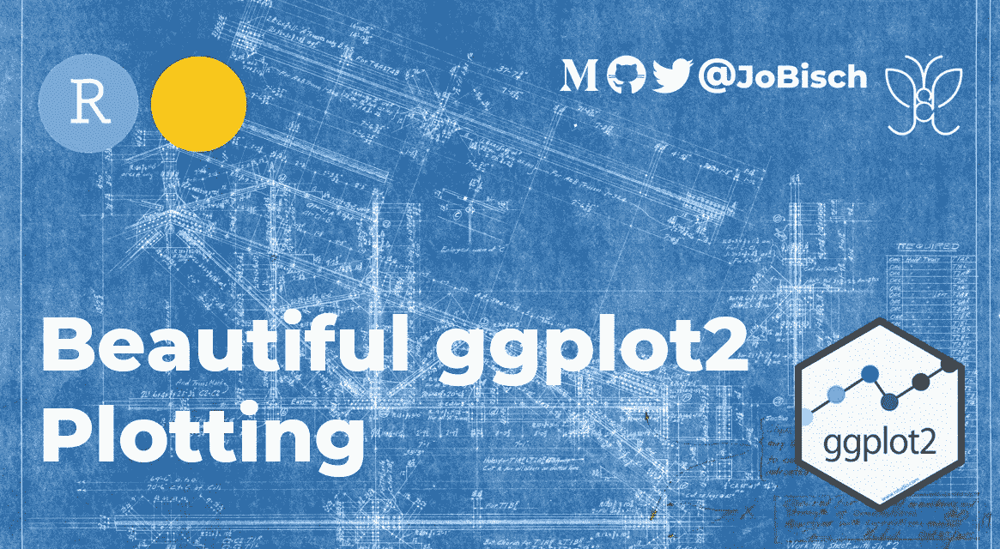
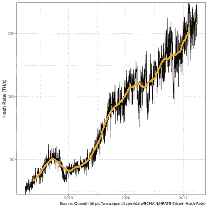

# 一个数据爱好者如何在不到一个小时的时间内升级他的 ggplot2 图表

> 原文：<https://medium.com/coinmonks/the-journey-to-a-neat-and-tidy-ggplot2-chart-with-r-e2ae269b8d78?source=collection_archive---------10----------------------->

Image by [**rawpixel.com**](https://rawpixel.com/)

First plot

目前，我正在努力提高我的 r 技能。因此，我希望我的 ggplot2 图表整洁。我们的目标是拥有一个可以轻松复制图表的模板…