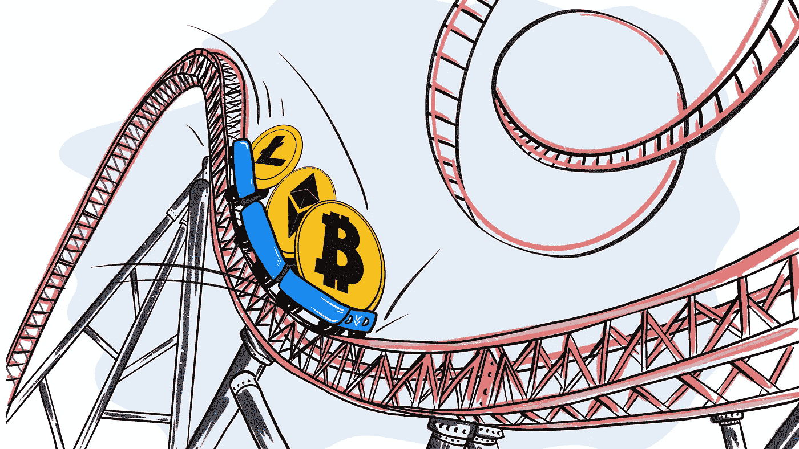
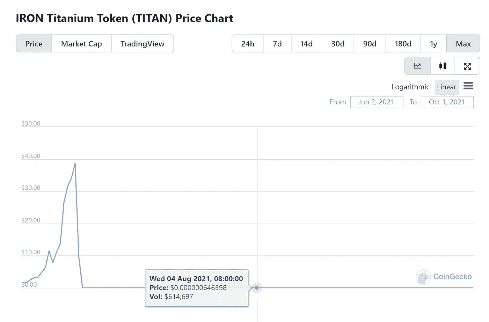
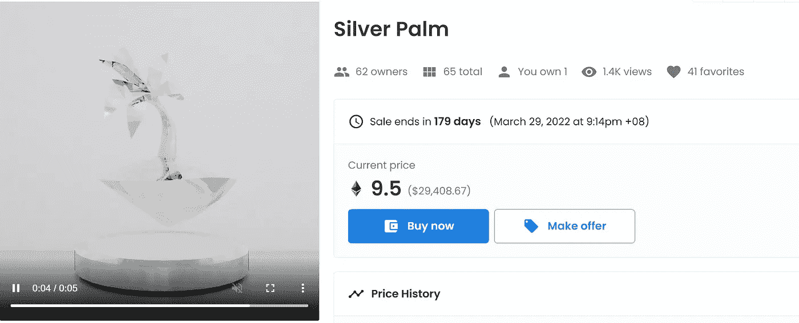
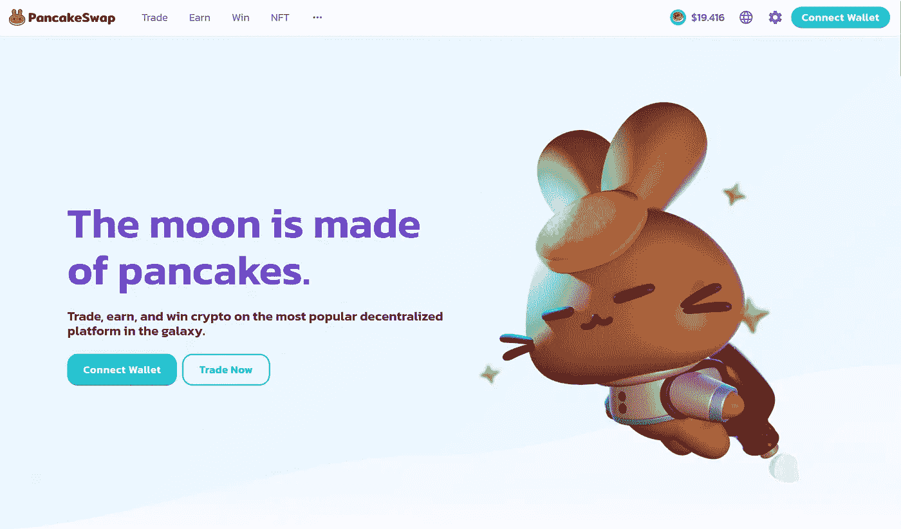
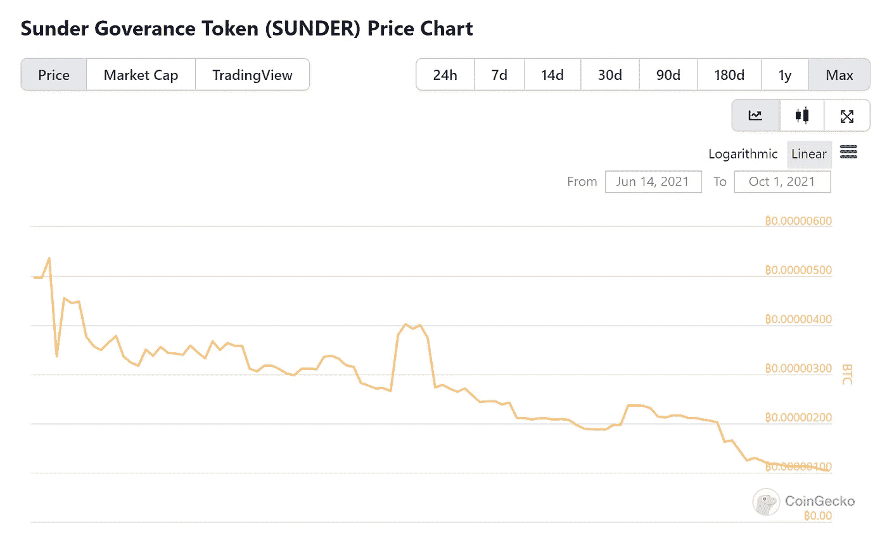
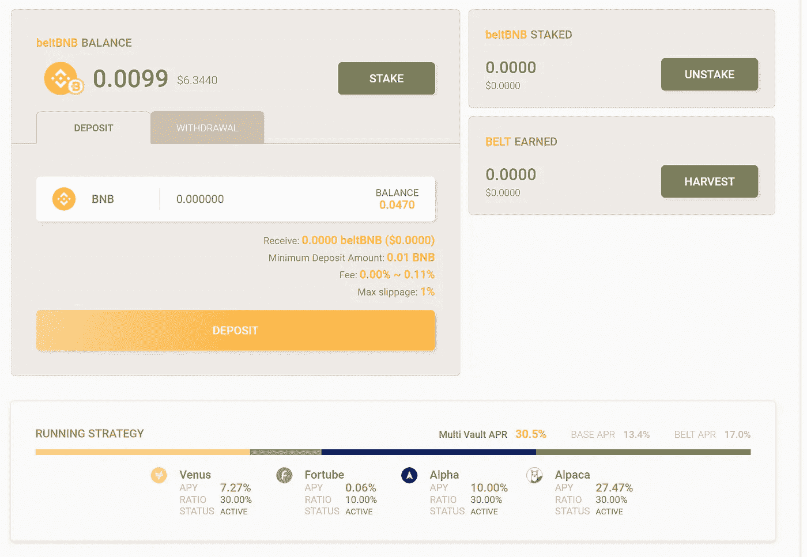

# 过去 6 个月在 crypto 我最大的成功和最严重的错误

> 原文：<https://medium.com/coinmonks/the-last-6-months-in-crypto-my-biggest-hits-and-worst-mistakes-d9bc714b1e1?source=collection_archive---------2----------------------->

是时候回顾一下我今年的交易和投资记录，评估一下哪些有效，哪些无效。总的来说，我比 BTC 高出 21.76%，我称之为成功。虽然不是所有的赌注都是好的-

# **我的前 3 注**

## [1。泰坦](https://www.coingecko.com/en/coins/iron-titanium-token)

r 倍数:11.24
总体收益:投资组合的 2.16%
持有时间:共 6.5 周

Ouch. But not my ouch!

这是一个有趣的问题。我一看就知道铁钛“稳定币”项目是一个伪装的庞氏骗局。因此我没有投资。两周后，我收到朋友发来的短信，说泰坦的价格在一轮近乎垂直的上涨后暴跌至几乎为零(事实证明是“银行挤兑”引发了螺旋式下跌)。我冲到我的电脑前，查看新的价格(见上文)。

我快速计算了一下，发现新的市值约为 100 万美元(低于几亿美元，如果不是 10 亿的话)。我嗅到了机会。即使协议完成，开发商也有可能宣布某种补偿或试图恢复协议，这将使价格略有上升，至少在短期内是如此。类似的事情以前也发生在 PancakeBunny 身上。

我进去买了价值 1000 美元的代币。我的论点证明是正确的——我在接下来的一个月内翻转了大部分代币。最大的错误？我应该早点卖出(在反弹后的最高点，我的 R 倍数几乎是 100 倍)。我也应该多买一些。如果我把我投资组合的 2%投资在这上面，按照我现在的标准头寸规模，并在早些时候卖出，仅在这笔交易上，我就可以把我的投资组合规模扩大一倍。

> 订阅 [**Coinmonks Youtube 频道**](https://www.youtube.com/c/coinmonks/videos) 获取每日加密新闻。

## [2。俏皮岛](https://www.niftyisland.com/)

r 倍数:3.88
总体收益:投资组合的 14.97%
持有时间:2-4 周+持续时间

这是一个早期的赌注。Nifty Island 仍处于预发布阶段。他们一直专注于建立一个不和谐的社区，我认为他们在这方面做得很好。我第一次加入他们的不和是在我听了创始人 Charles 在马孜红上的播客之后。查尔斯对整个元宇宙空间的看法给我留下了深刻的印象，与许多其他人相比，他的观点很有见地，令人耳目一新。

在我加入 discord 后不久，Nifty airdrop[palm NFTs](https://opensea.io/collection/nifty-island-legendary-palms)进入了这个社区。它们看起来不错。我没有参与太多，所以我得到了一个铁掌(最低层)。棕榈开始在 Opensea 上交易，我设法以每只 0.5 ETH 的价格买了两只额外的银棕榈，在任何一只都没有真正的市场之前，在 1 ETH 买了一只金棕榈。

几周后，该团队宣布他们将在掌上电脑上空投[刀片](https://opensea.io/collection/ultra-blades)，价格飙升，基本上是在一夜之间。我观察，下了一些卖单…然后等待。我最终以 9.8 ETH 的价格卖出了一个银棕榈，以 19.8 ETH 的价格卖出了我的金棕榈。这几乎是每种投资的 20 倍回报。我将部分收益再投资购买了另一个铁掌和一个额外的刀片，因此我的头寸仍然是开放的，有五件漂亮的艺术品(这在一定程度上证明了我对这个项目的信心)。也就是说，我在这两次销售中获得的利润已经超过了我投入的总和，所以我的净成本是-21 ETH。不算太寒酸！

-

## [3。蛋糕](https://www.coingecko.com/en/coins/pancakeswap)

r 倍数:2.40
总收益:投资组合的 11.95%
持有时间:6 个月，持续

Yes, indeed.

蛋糕，甜蜜的蛋糕！在 BSC 收益农业热潮中，我在 3 月份开始建立一个相当大的头寸(比我应该建立的要大)。币安智能链上的 DeFi 显然得到了以太坊没有得到的所有主流关注，但其主要的分散式交易所 PancakeSwap 的价值比以太坊的 Uniswap 低几倍。即使考虑到 TVL 较低的房价，这似乎仍是一笔便宜货。此外，CAKE 允许单个资产在当时的年利率超过 100%。不用动脑筋！

在我买下蛋糕后，蛋糕的价格几乎立刻开始对 BTC 上涨。我对我的农业产量很满意，所以直到 8 月底/9 月，价格有所调整，并且(至少对我来说)很明显，根据使用趋势、开发商活动和集中化问题，币安智能连锁不是未来(至少在大部分情况下)，我才开始出售大量产品。我已经把我的蛋糕份额减少到了我投资组合的 2%(最高峰时超过了 10%)，顺便获得了一些丰厚的回报！

-

# **我最糟糕的 3 次下注(到目前为止)**

## [1。破碎机](https://www.coingecko.com/en/coins/sunder-goverance-token)

r 倍数:-0.93(还在计算——不成功便成仁，lol)
总损失:投资组合的 0.82%
持有时间:3.5 个月，还在计算

Ouch. This time, my ouch.

我的。最差。打赌。永远不会。句号。我一看它的信纸就知道它是个垃圾硬币。这是 Sunder 被设定为首批(如果不是第一个)在寿司新推出的 Miso 平台上进行首次农场发行的令牌之一的前几天。错误在于:我太贪婪了。我想‘哦，我的上帝，这个平台上的第一个 IFO，人们会模仿它，它会爆炸的。’作为背景，这是在 6 月，仍然处于 ICO 热潮中，像 Coinlist 或币安 Launchpad 这样的平台上的令牌正是这样做的。

我现在可以告诉你，火箭它没有。在短暂且几乎不显著的上涨之后，该货币经历了迄今为止 93%的稳步下跌，并且仍在继续。我错过了最初的高峰，因为我出去约会了，大约在代币开始公开交易两小时后回来。显然是个错误。我不确定我会卖掉它。之后我没有卖出，等待产品真正上市，希望价格能够回升。市值相对较小，我的头寸也不大，所以如果需要的话，我可以一路下跌到零。

吸取的教训？不要盲目模仿你不相信的东西，只是因为你认为其他人也可能会盲目模仿。阅读白皮书时，相信你的直觉。不要贪心。当一件事希望渺茫时，最好等一等，然后再下一个更合适的赌注。我应该舒服地坐在我的筹码上等待。一线希望？这次不计后果的亏损给我敲响了警钟，让我投入大量精力来更好地记录和监控我的头寸，这就是我现在使用的系统。

## [2。皮带](https://bellt.finance/)

r 倍数:-0.54(还在计算中)
总损失:投资组合的 0.97%
持有时间:5 个月，还在计算中

Nice interface, right?

不要相信 160%的年利率。永远不会。Belt 在表面上和内在上都似乎是一个很好的 DeFi 协议——币安智能链上的前 5 名 TVL，一个不错的用户界面，一个独特的分布式单令牌赌注，以及一个经验丰富的团队。以太坊(Ethereum)上领先的收益率聚合器的市值超过 10 亿美元，而 Belt 的市值则低 10 倍。多汁的三位数 APYs 的赌注，它在 WBNB 带自动复合池。没脑子？

没有那么多。在 5 月份的 crypto 崩溃之后，皮带价格大幅下跌，然后继续下滑(现在仍然如此)。除了 BSC 的重要性相对下降之外，我认为这是由于新皮带的过度排放(在我投资时，每年超过 1.000%的新供应量，现在相对于现有供应量，可能下降到 200–300%)。我知道这一点，但认为在 DeFi 和 BSC 飞速发展的背景下，这不会有太大影响。事实证明确实如此。

吸取教训了？投资时考虑代币铸造和授予时间表。此外，不要对不同区块链的类似产品进行一对一的价格比较，而不要对每个产品的局限性和叙述缺乏足够的了解。

-

## [3。变异猿游艇俱乐部](https://opensea.io/collection/mutant-ape-yacht-club)

r 倍数:-0.37(还在计算中)
总损失:投资组合的 5.97%
持有时间:1 个月，还在计算中

This ugly mother***ing mutant has become synonymous with my online presence now

这是一个有趣的故事。这是我迄今为止资产负债表上记录的最大一笔亏损，尽管我希望它会好转。MAYC 是在最后一分钟宣布的对无聊猿类现有持有者的空投。我没有意识到，我的朋友(不是同一个人)在周四晚上 11 点 30 分给我发了一条短信，就在我准备睡觉的时候。“猿猴？”我以为。这可能太有趣了，不能不去看看。

于是我照做了。我把笔记本电脑带到床上，不知不觉中，我花了两个小时浏览 Opensea 和 rarity.tools，沉浸在试图找出哪一只新掉下来的地板猿足够稀有和值得购买的信息中。我买了一个，然后另一个，然后第三个。我喜欢它们的样子(比原始的无聊猿更喜欢)，它们的底价(当时大约是 7 ETH)大约是原始猿的底价的 15%。变种人是为了让更多的人加入俱乐部，他们看起来很棒，所以我确信(现在仍然很确信)随着时间的推移，他们的价格将会更接近无聊的类人猿的价格。

问题是我模仿得太多、太快，一下子就把超过 10%的投资组合投入到这个项目中(当天晚上晚些时候，我确实在 18 ETH 买了这个系列中非常罕见的第三只猿)。我对此很有信心，因为这个项目在没有事先宣布的情况下就被放弃了，它很有名，很可能会迅速蹿升，这让我至少可以很快卖掉几个。在接下来的一两天里，价格确实有所上涨，但随后随着整个 NFT 市场的下跌，价格开始急剧下降。

请记住，我是在 8 月 30 日买入 Apes 的，这是 Cryptopunks 地板在 140 ETH 左右达到历史高点后的一天，之后向下修正到 75(现在它回到了 100 ETH 以北)。不用说，NFT 市场的其他部分也跟着下跌，现在仍然有些沮丧。与 Sunder 类似，我的错误是贪婪，尽管在这种情况下，我并不缺乏对产品的信念。

然而，这个头寸太大了(数倍于此),我没能考虑到 NFT 的宏观背景。当然，我很不幸，下跌发生在市场周期中最糟糕的时候，但这是一个好老师。目前，我继续持有我的猿类，期待我的论点仍然成立，价格相对于市场其他部分回升。与此同时，在我在 discord 和 twitter 上使用它之后，我越来越喜欢我的个人资料 pic rare Ape，它已经成为第一个 meme 的主题，由其他人创建！

# **结论**

总而言之，与 3 月份相比，我对比特币的盈利超过了 21%，所以我不能抱怨。我已经检查了我的头寸，部分卖出了一些盈利，也吸收了一些亏损。因此，我对我的绝大多数头寸都相对自信，即使它们目前处于 a -(除了少数例外)。随着整个加密市场的复苏，我的相对利润应该会更高。

同样值得注意的是，我最大的赢数(绝对值)比我最大的输数多得多，尽管我输的总数比我赢的总数多。这是一个非常好的迹象，也应该如此。只要我能保持我的头寸规模正确，我应该能够最小化我的负面影响，继续玩 VC 风格的游戏——即我最大的 2-3 次胜利将吸收我所有的 20 次损失，然后还有一些可观的利润。

让我们牢记上面的教训，在接下来的两个季度里做得更好。向前向上！

-

*注:*

*我用比特币来命名我所有的盈利和亏损，因为我从来没有卖回给菲亚特。因此，所有的%收益和损失都是针对 BTC，而不是美元。这使得记录相对利润变得更加困难，但也抹杀了大部分市场范围内的波动。同样，以上所有的 R 倍数都是以 BTC 为单位的。这意味着，比方说，如果 R 的倍数是 3.88——在把我的头寸卖回 BTC 后，我收到的比特币是我最初投入的 4.88 倍。*

-

要了解更多关于我的加密之旅，请查看我在这里或➡️的其他文章[在 twitter 上关注我](https://twitter.com/m_goes_distance)🐦。如果你喜欢这篇文章，请鼓掌-

> 加入 Coinmonks [电报频道](https://t.me/coincodecap)和 [Youtube 频道](https://www.youtube.com/c/coinmonks/videos)了解加密交易和投资

## 另外，阅读

*   [什么是融资融券交易](https://blog.coincodecap.com/margin-trading) | [成本平均法](https://blog.coincodecap.com/dca)
*   [支持卡审核](https://blog.coincodecap.com/uphold-card-review) | [信任钱包 vs 元掩码](https://blog.coincodecap.com/trust-wallet-vs-metamask)
*   [Exness 点评](https://blog.coincodecap.com/exness-review)|[moon xbt Vs bit get Vs Bingbon](https://blog.coincodecap.com/bingbon-vs-bitget-vs-moonxbt)
*   [如何开始通过加密贷款赚取被动收入](https://blog.coincodecap.com/passive-income-crypto-lending)
*   [BigONE 交易所点评](/coinmonks/bigone-exchange-review-64705d85a1d4) | [电网交易 Bot](https://blog.coincodecap.com/grid-trading)
*   [新加坡十大最佳加密交易所](https://blog.coincodecap.com/crypto-exchange-in-singapore) | [购买 AXS](https://blog.coincodecap.com/buy-axs-token)
*   [投资印度的最佳加密软件](https://blog.coincodecap.com/best-crypto-to-invest-in-india-in-2021) | [WazirX P2P](https://blog.coincodecap.com/wazirx-p2p)
*   [7 个最佳零费用加密交易平台](https://blog.coincodecap.com/zero-fee-crypto-exchanges)
*   [分散交易所](https://blog.coincodecap.com/what-are-decentralized-exchanges) | [比特 FIP](https://blog.coincodecap.com/bitbns-fip)
*   用信用卡购买密码的 10 个最佳地点
*   [加拿大最佳加密交易机器人](https://blog.coincodecap.com/5-best-crypto-trading-bots-in-canada) | [Bybit vs 币安](https://blog.coincodecap.com/bybit-binance-moonxbt)
*   [用于 Huobi 的加密交易信号](https://blog.coincodecap.com/huobi-crypto-trading-signals) | [Swapzone 审查](/coinmonks/swapzone-review-crypto-exchange-data-aggregator-e0ad78e55ed7)
*   最佳[密码交易机器人](https://blog.coincodecap.com/best-crypto-trading-bots) | [购买索拉纳](https://blog.coincodecap.com/buy-solana) | [矩阵导出评论](https://blog.coincodecap.com/matrixport-review)
*   [Coldcard 评论](https://blog.coincodecap.com/coldcard-review) | [BOXtradEX 评论](https://blog.coincodecap.com/boxtradex-review)|[uni swap 指南](https://blog.coincodecap.com/uniswap)
*   [阿联酋 5 大最佳加密交易所](https://blog.coincodecap.com/best-crypto-exchanges-in-uae) | [SimpleSwap 评论](https://blog.coincodecap.com/simpleswap-review)
*   [购买 Dogecoin 的 7 种最佳方式](https://blog.coincodecap.com/ways-to-buy-dogecoin) | [ZebPay 评论](https://blog.coincodecap.com/zebpay-review)
*   [最佳期货交易信号](https://blog.coincodecap.com/futures-trading-signals) | [流动性交易所评论](https://blog.coincodecap.com/liquid-exchange-review)
*   [3 商业评论](/coinmonks/3commas-review-an-excellent-crypto-trading-bot-2020-1313a58bec92) | [Pionex 评论](https://blog.coincodecap.com/pionex-review-exchange-with-crypto-trading-bot) | [Coinrule 评论](/coinmonks/coinrule-review-2021-a-beginner-friendly-crypto-trading-bot-daf0504848ba)
*   [莱杰 vs n rave](/coinmonks/ledger-vs-ngrave-zero-7e40f0c1d694)|[莱杰 nano s vs x](/coinmonks/ledger-nano-s-vs-x-battery-hardware-price-storage-59a6663fe3b0) | [币安评论](/coinmonks/binance-review-ee10d3bf3b6e)
*   [Bybit Exchange 审查](/coinmonks/bybit-exchange-review-dbd570019b71) | [Bityard 审查](https://blog.coincodecap.com/bityard-reivew) | [CoinSpot 审查](https://blog.coincodecap.com/coinspot-review)
*   [3 commas vs crypto hopper](/coinmonks/3commas-vs-pionex-vs-cryptohopper-best-crypto-bot-6a98d2baa203)|[赚取加密利息](/coinmonks/earn-crypto-interest-b10b810fdda3)
*   [CoinLoan 评论](https://blog.coincodecap.com/coinloan-review) | [YouHodler 评论](/coinmonks/youhodler-4-easy-ways-to-make-money-98969b9689f2) | [BlockFi 评论](https://blog.coincodecap.com/blockfi-review)
*   [CoinFLEX 评论](https://blog.coincodecap.com/coinflex-review) | [AEX 交易所评论](https://blog.coincodecap.com/aex-exchange-review) | [UPbit 评论](https://blog.coincodecap.com/upbit-review)
*   [AscendEx 保证金交易](https://blog.coincodecap.com/ascendex-margin-trading) | [Bitfinex 赌注](https://blog.coincodecap.com/bitfinex-staking) | [bitFlyer 审核](https://blog.coincodecap.com/bitflyer-review)