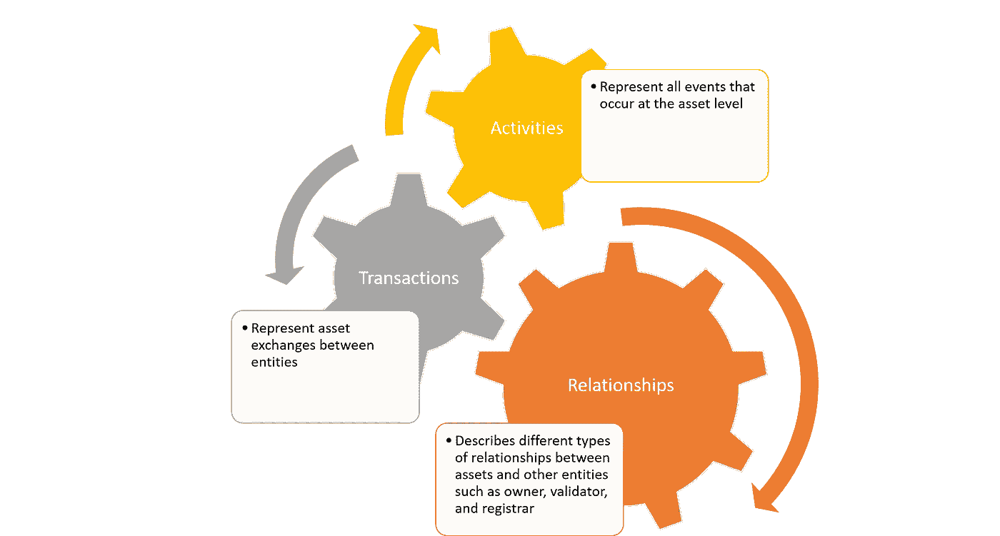

# 开放金融的推出和安全令牌成为现实的那一天

> 原文：<https://medium.com/coinmonks/the-launch-of-open-finance-and-the-day-security-tokens-became-real-6bb48767d5b5?source=collection_archive---------10----------------------->

自以太诞生以来，安全令牌是加密货币领域最令人兴奋的发展之一，这可能正是我们将加密资产与更广泛的金融生态系统联系起来所需要的。然而，安全令牌空间正处于萌芽状态，生态系统正在发展中。放眼望去，你会发现生态系统中的差距，以及致力于解决这些限制的勇敢而有才华的团队。当我键入这篇文章时，我可能删除了六次勇敢这个词(我不是一个非常喜欢用形容词夸大陈述的人)，但我认为这是正确的术语。安全令牌是一个非常复杂的问题，就像你在加密领域所能找到的一样。它不仅需要加密协议所特有的技术深度，还需要金融和监管工具方面的复杂知识，而且你试图破坏的正是一个自阿姆斯特丹第一家证券交易所开业以来为市场提供了 500 年动力的金融系统。所以，是的，勇敢是我用来描述任何认真从事安全令牌工作的人的一个术语。😉

安全令牌空间中的缺口无处不在。从流动性提供者、托管人、法律框架、所有权转移流程都是安全令牌市场需要努力的领域。然而，整个市场困扰的头号缺口是缺乏安全令牌交换。昨天， [Open Finance](https://www.openfinance.io/) 的“勇敢”团队公布了他们的网络，使安全令牌成为主流投资者可行的可交易机制。

我已经关注[开放金融项目](https://www.openfinance.io/)几个月了，我认为将其归类为交易所是一种保守的说法。开放金融网络是用于安全令牌交易的端到端处理的协议。该平台的最初重点是证券代币的清算和结算过程，充当不同市场参与者(如托管人、代币发行人或转账代理人)之间的经纪人。缩短距离，你不应该认为开放金融是安全令牌的纳斯达克，而更像是空间的彭博。

从功能角度来看，开放金融网络有三个主要组成部分:分类帐、令牌和适配器。

这三个组件可以以不同的方式组合，以实现安全令牌事务中的许多相关流程。开放金融网络包含由安全令牌代表的资产的全球注册，以及可在不同的安全令牌过程中使用的诸如经纪人-交易商、转账代理、保管人或托管代理等实体。

从技术角度来看，开放金融网络分类帐使用在实体和资产级别定义的智能合同来抽象其交互。资产智能合约是核心合约，它存储平台中资产的信息，以及它们的关系、交易和事件。资产智能契约由三个主要数据结构组成:关系、交易和活动。

实体智能合约实体智能合约是存储系统中所有实体的数据以及它们的验证和交易的核心合约。它的两个主要结构是验证和事务。

开放金融网络令牌充当在平台中进行交易的许可证。每个令牌允许的事务数量由一种算法控制，该算法根据网络中的活动来调整令牌容量。同样，网络的容量是根据活动水平而增加的。

开放金融网络中的适配器可以被视为与网站、API 或移动应用程序等链外参与者沟通的桥梁。这种机制在安全令牌中尤为重要，因为该领域的许多监管流程都是在链外进行的。

安全性是开放金融网络擅长的领域之一。该平台利用零知识协议来确保交易的匿名性和隐私性。类似地，所有敏感的私有数据都存储在安全的联邦侧链(SFS)上，然后散列回公共链，为 SFS 提供不变性。从这个角度来看，开放金融网络为实时数据和持久数据提供了隐私保护。

# 让安全令牌变得真实

开放金融网络的推出代表了安全令牌生态系统的重大发展。该平台将允许第一波安全令牌背后的许多想法在真实世界环境中得到测试。显然，开放金融仍有许多工作要做，才能与市场上的顶级加密交易所相媲美，但这无疑是一个良好的开端。