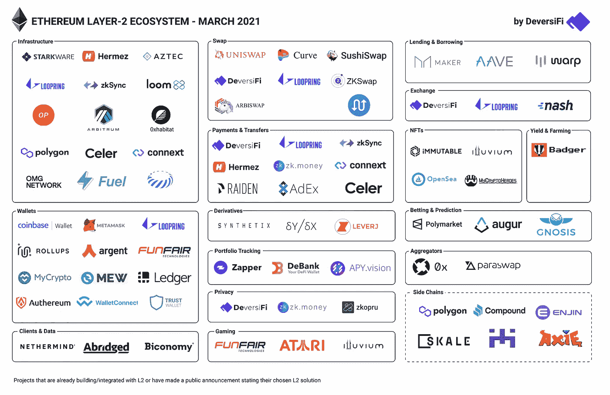

# 第二层战争升温

> 原文：<https://medium.com/coinmonks/the-layer-2-wars-heat-up-b8d02d3dd332?source=collection_archive---------1----------------------->

## 一场决定以太坊命运的持续战斗

Source: [Reddit](https://www.reddit.com/r/ethereum/comments/mfru8u/layer2_ethereum_is_in_supersonic_mode_big_props/)

和往常一样，这篇文章是为教育目的而写的。这既不构成财务建议，也不构成交易建议。过去的表现并不代表未来的结果。

*不要投资超过你能承受的损失。这不是财务建议；总是自己做研究:)*

昨天，我谈到了以太坊的乐观未来——无论是作为一个网络，还是其本身的硬币以太。

以太是目前所有密码中最有用的硬币；你可以持有它，它会升值，产生收益，用于 DeFi 应用程序，每周都会有越来越多的用例出现。

以太坊也为今年剩下的时间制定了一个疯狂的路线图。从供应角度来看，ETH2 将允许用户持有他们的 ETH，并产生每年 5-8%的“保守”收益率和[可能高达 25%](https://newsletter.banklesshq.com/p/the-case-for-never-selling-eth-market-ef6?token=eyJ1c2VyX2lkIjo1NDE1NTA1LCJwb3N0X2lkIjozNTY1NzMyNSwiXyI6IjhOK1VDIiwiaWF0IjoxNjE5NDgxMDQzLCJleHAiOjE2MTk0ODQ2NDMsImlzcyI6InB1Yi0xNjAxNSIsInN1YiI6InBvc3QtcmVhY3Rpb24ifQ.8JKnO1xUsfcemJN6WLw7Tg-303n7gekC57IjqkASi20)——将其锁定在流动性市场之外。EIP-1559 将使 ETH 成为通缩资产，击败比特币的固定通胀率。

从需求角度来看，通过一系列举措，如柏林硬分叉、Flashbots 和第 2 层扩展解决方案的推出，天然气费用得到了控制。

我在上一篇文章中多次提到“扩展”和“第二层”这两个术语，但我想花点时间写一篇专门的文章来解释它的真正含义。

我们知道以太坊一直受到高度网络拥塞的困扰——导致网络上的高额燃气费。

这并不是牛市中第一次出现这种情况。2017 年，NFT 应用 [CryptoKitties](https://www.cryptokitties.co/) 和 ICO 泡沫也导致以太坊天然气费用疯狂飙升——有段时间费用高达 500 gwei。

# 第二层将拯救以太坊

第 2 层扩展解决方案已经开始从这些可怕的天然气费用中拯救出来，希望它们的推出将永远解决网络拥塞问题。

“第 2 层”是指一组计划扩展第 1 层区块链(在本例中是以太坊)的解决方案，但任何“核心”区块链都被称为第 1 层。例如是比特币、索拉纳等。)通过提高网络的速度和吞吐量。

这些解决方案被称为第二层，因为它们在概念上位于以太网之上。

在高层次上，这些解决方案希望将交易和网络活动从以太坊卸载到它们的 L2 链上，并定期与 L1 通信，以便协调状态、资金、数据等。

你可以把它想象成一个**分类机制**，以太坊将只知道来自 L2 解决方案的最重要的信息。

有趣的是，许多这些解决方案看起来很像独立的区块链，对以太坊平台和生态系统“友好”——这意味着，它们不是像其他 L1 一样从以太坊窃取活动，而是与以太坊合作处理其交易。

L2s 的问题是有太多的解决方案——在一个具有极端网络效应的行业中，诚实地说，将从以太坊之上的一个内聚的 L2 解决方案中受益匪浅。

但每个连锁店都有不同的技术解决方案和权衡，并竞相推出和赢得 dapps 和用户。

# 第 2 层解决方案的类型

## 侧链

侧链本质上是分开的，完全独立的区块链。然而，它们是以太坊的一个分支，所以它们是 EVM 兼容的，可以快速部署现有的运行在以太坊上的 dapps。

[xDai](https://www.xdaichain.com/) 是一款基于以太坊的区块链，旨在实现快速、廉价的支付。它还有[包](https://www.bao.finance/)，我现在最喜欢的 dapps 之一。

## 血浆/子链

Plasma 是一个在以太坊上扩展建筑应用的框架。在高层次上，等离子体允许创建子链，在另一个链上复制以太坊。

因此，一些交易可以被分类并卸载到多个子链上，而不是在以太坊网络上处理每一笔交易——资金和状态的协调可以不那么频繁地按照预定的节奏发生。

Polygon/Matic 是一个等离子体实现的例子——我非常喜欢这个解决方案，因为他们在 GTM 方面做了很多工作，以赢得两个大型 dapp:Curve 和 Aave。

## 乐观汇总

概括地说，Rollups 也是侧链，它部署了一个新颖的技术框架，以便扩展和处理事务。

他们从他们的链中捆绑(称为“汇总”)交易，并以捆绑的状态(称为证明，或者更准确地说是标记)将它们发送回以太坊 L2，只暴露最重要的信息。

Vitalik Buterin 非常支持 rollup，他的博客文章是“[一个以 rollup 为中心的以太坊路线图](https://ethereum-magicians.org/t/a-rollup-centric-ethereum-roadmap/4698)”。

乐观汇总是一种允许与以太坊虚拟机(EVM)兼容的汇总，这意味着部署在以太坊上的智能合同可以在 L2 上重新部署，只需相对最小的额外技术提升。

它们被称为“乐观”汇总，因为它们假设为每个事务批次提供的证据(即，汇总的事务批次)是有效的。

每隔 1-2 周，任何人都可以质疑提交的证据，并声称他们是欺诈。因此，乐观汇总有一个很长的入职期，以确保在将批次提交到以太坊之前发现欺诈。

[乐观](https://optimism.io/)和 [Arbitrum](/offchainlabs/how-arbitrum-rollup-works-39788e1ed73f) 是两种领先的乐观上卷解决方案——前者由两种领先的 dapps 整合而成:Uniswap 和 Synthetix。

## ZK 卷

零知识汇总(ZK 汇总)不同于乐观汇总，因为没有长时间的上车/下车计时。

相反，这些证明通过使用零知识证明，从一开始就以密码方式确保交易有效，从而消除了检测欺诈所需的质询期。

此外，ZK 汇总比乐观汇总更快更有效 zkSync 的 zkPorter 承诺处理 20K+ TPS，甚至比 Visa 这样的集中式网络更快。

ZK 汇总长期以来被认为是乐观汇总的一种折衷，因为前者不支持 EVM 兼容性，因此在速度和智能合约部署便利性之间进行了权衡。然而，zkSync 2.0 承诺兼容 EVM，并将于今年 8 月初步推出。

# 总结想法

在我看来，L2 战争的胜利者必须满足两个条件:

1.  他们利用的技术(例如，子链、乐观总结、零知识总结)将解决当前在以太坊 L1 普遍存在的必要的用户问题
2.  平台上的 dapps 和用户会产生网络效应

在第一个条件下，每种 L2 技术都有各种权衡——无论是 EVM 兼容性、长时间启动、事务吞吐量等。

我认为，对于目前的 DeFi 用户来说，考虑 L2 时最重要的事情是:它使用起来便宜吗？我可以方便快捷地进出这个 L2 吗？我最喜欢的 dapps 在吗？流动性充裕吗？我还能和其他 L2 做可组合的有趣的定义/互操作吗？

第二个条件可以是第一个条件的函数。例如，更多的 dapps 可能会选择与完全兼容 EVM 的 L2 集成，这意味着它是现有 L1 智能合约在 L2 网络上的简单部署。

第二个条件意味着他们投入走向市场(GTM)的努力来获得用户:从产品增长的角度，以及合作伙伴关系和营销的角度。

大量的 dapps 意味着大量的用户。伟大的流动性挖掘计划意味着大量的用户。考虑到目前将资金转移到 L2 的摩擦，用户将与他们的 L2 解决方案保持粘性关系(至少目前如此)。

如果你认为这篇博文值得你花 5 分钟来阅读，请在下面鼓掌(最多 50 次)或者与一个会从这篇内容中受益的朋友分享。非常感谢！

> 加入 [Coinmonks 电报小组](https://t.me/joinchat/uiLERCQL1fQ5ZjA1)，了解加密交易和投资

## 另外，阅读

*   最好的[加密交易机器人](/coinmonks/crypto-trading-bot-c2ffce8acb2a) | [网格交易机器人](https://blog.coincodecap.com/grid-trading)
*   [加密副本交易平台](/coinmonks/top-10-crypto-copy-trading-platforms-for-beginners-d0c37c7d698c) | [五大 BlockFi 替代方案](https://blog.coincodecap.com/blockfi-alternatives)
*   [CoinLoan 审核](/coinmonks/coinloan-review-18128b9badc4)|[Crypto.com 审核](/coinmonks/crypto-com-review-f143dca1f74c) | [火币保证金交易](/coinmonks/huobi-margin-trading-b3b06cdc1519)
*   [尤霍德勒 vs 考尼洛 vs 霍德诺特](/coinmonks/youhodler-vs-coinloan-vs-hodlnaut-b1050acde55a) | [Cryptohopper vs 哈斯博特](https://blog.coincodecap.com/cryptohopper-vs-haasbot)
*   [杠杆代币](/coinmonks/leveraged-token-3f5257808b22) | [最佳密码交易所](/coinmonks/crypto-exchange-dd2f9d6f3769) | [Paxful 点评](/coinmonks/paxful-review-4daf2354ab70)
*   [如何在印度购买比特币？](/coinmonks/buy-bitcoin-in-india-feb50ddfef94) | [WazirX 评论](/coinmonks/wazirx-review-5c811b074f5b) | [BitMEX 评论](https://blog.coincodecap.com/bitmex-review)
*   [双子座 vs 比特币基地](https://blog.coincodecap.com/gemini-vs-coinbase) | [比特币基地 vs 北海巨妖](https://blog.coincodecap.com/kraken-vs-coinbase)|[coin jar vs coin spot](https://blog.coincodecap.com/coinspot-vs-coinjar)
*   [币安 vs 北海巨妖](https://blog.coincodecap.com/binance-vs-kraken) | [美元成本平均交易机器人](https://blog.coincodecap.com/pionex-dca-bot)
*   [印度比特币交易所](/coinmonks/bitcoin-exchange-in-india-7f1fe79715c9) | [比特币储蓄账户](/coinmonks/bitcoin-savings-account-e65b13f92451)
*   [币安费](/coinmonks/binance-fees-8588ec17965) | [Botcrypto 评论](/coinmonks/botcrypto-review-2021-build-your-own-trading-bot-coincodecap-6b8332d736c7) | [Hotbit 评论](/coinmonks/hotbit-review-cd5bec41dafb) | [KuCoin 评论](https://blog.coincodecap.com/kucoin-review)
*   [我的密码副本交易经验](/coinmonks/my-experience-with-crypto-copy-trading-d6feb2ce3ac5) | [购买硬币评论](https://blog.coincodecap.com/buycoins-review)
*   [加密货币储蓄账户](/coinmonks/cryptocurrency-savings-accounts-be3bc0feffbf) | [YoBit 审查](/coinmonks/yobit-review-175464162c62) | [Bitbns 审查](/coinmonks/bitbns-review-38256a07e161)
*   [最佳比特币保证金交易](/coinmonks/bitcoin-margin-trading-exchange-bcbfcbf7b8e3) | [比特币保证金交易](https://blog.coincodecap.com/bityard-margin-trading)
*   [加密保证金交易交易所](/coinmonks/crypto-margin-trading-exchanges-428b1f7ad108) | [赚取比特币](/coinmonks/earn-bitcoin-6e8bd3c592d9) | [Mudrex 投资](https://blog.coincodecap.com/mudrex-invest-review-the-best-way-to-invest-in-crypto)
*   [BlockFi 信用卡](https://blog.coincodecap.com/blockfi-credit-card) | [如何在币安购买比特币](https://blog.coincodecap.com/buy-bitcoin-binance)
*   [顶级付费加密货币和区块链课程](https://blog.coincodecap.com/blockchain-courses) | [币安评论](/coinmonks/binance-review-ee10d3bf3b6e)
*   [MXC 交易所评论](/coinmonks/mxc-exchange-review-3af0ec1cba8c) | [Pionex vs 币安](https://blog.coincodecap.com/pionex-vs-binance) | [Pionex 套利机器人](https://blog.coincodecap.com/pionex-arbitrage-bot)
*   [在美国如何使用 BitMEX？](https://blog.coincodecap.com/use-bitmex-in-usa) | [BitMEX 点评](https://blog.coincodecap.com/bitmex-review) | [币安 vs Bittrex](https://blog.coincodecap.com/binance-vs-bittrex)