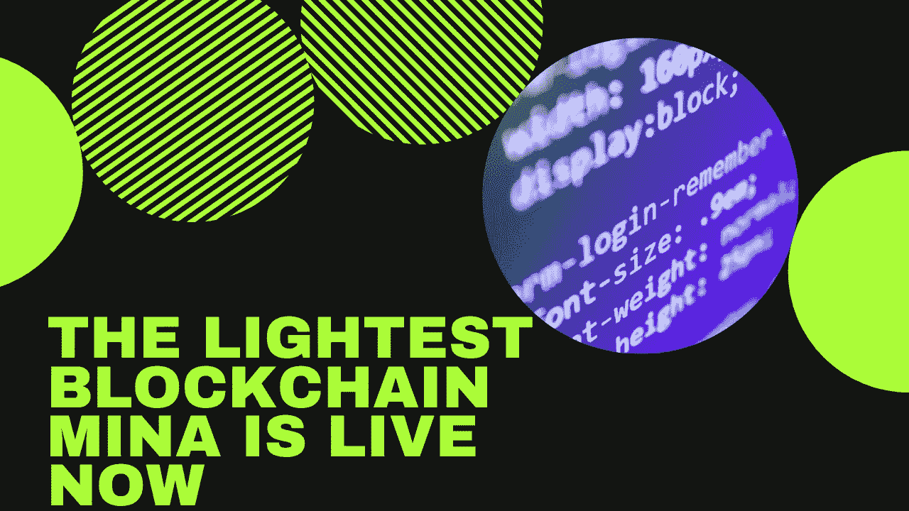
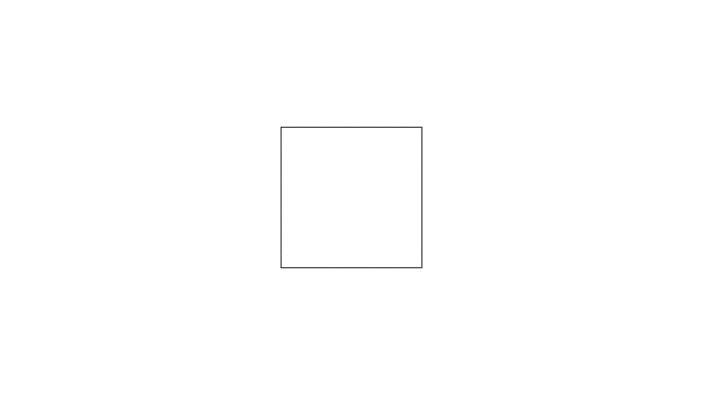

# 最轻的区块链米娜现已上线

> 原文：<https://medium.com/coinmonks/the-lightest-blockchain-mina-is-live-now-4828a0ada2a8?source=collection_archive---------10----------------------->

## 世界上最轻的 22kb 区块链是由 MINA 协议创建的，MINA 上个月发布了 mainnet。

即使区块链解决了现实世界的许多问题，但区块链本身也有许多问题，像区块链一样沉重，因为随着时间的推移，更多的块被添加到链中，链的大小也随之增长，区块链变得沉重，比特币区块链的当前大小为 327.99GB，区块链无法与互联网交互，这意味着你无法使用区块链的产品访问任何网站，区块链的参与者面临同步和验证网络的延迟，等等。

正如我们所知，有两种类型的区块链 1。工作证明(PoW)，以及 2。股权证明(PoS)和两种情况下，区块链的规模不断增长，在这种情况下，PoW work 区块链产生了计算障碍，PoS 所有大玩家控制了影响分散化的大部分股权([参考-1](https://www.investopedia.com/investing/why-centralized-crypto-mining-growing-problem/) 、[参考-2](/stakin/centralization-of-stake-in-pos-f7ccb8f8254) )。

# 整个米娜区块链大概 22kb

存在许多先进的区块链，它们以不同的方式保持其区块链去中心化，但大多数都应用蛮力计算来保持其区块链去中心化，其中 MINA 使用先进的加密和递归 zk-SNARKs 通过提供真正的大规模去中心化来保持区块链 22kb 的大小。

如果我给你一个关于区块链如何工作的简单想法，那么区块链是一个数字登记簿，每次一个人加入网络都需要下载整个登记簿，其中包含所有以前交易的列表，这可能是一个漫长的过程，但米娜用一个容易验证的、大小一致的密码证明([参考](https://minaprotocol.com/tech))代替了区块链。

# zk-SNARKs 是什么？

zk-SNARKs 代表“知识的零知识简洁非交互论证”,这是 MINA 的 22kb 区块链背后的关键技术。zk-SNARKs 帮助创建整个区块链的加密证书证明，并且随着每个新块的创建，它创建一个新的证明。例如:如果你点击一张图片，然后点击最后一张图片的图片，那么图片的框架大小保持不变，但你可以认为它是最后一张图片的证明。与 zk-SNARKs 相同，创建整个区块链的数字证书，在加入时，您需要下载该数字证书，尽管整个区块链([参考](https://minaprotocol.com/blog/what-are-zk-snarks))。

# MINA 的使用案例

22kb 区块链有无限的可能性，但现在，我们将讨论米娜区块链的三个重要用例。

## 从在线到链上的端到端数据隐私:

Mina 的用户可以在不共享个人数据的情况下访问关键的链上服务，你不需要信任第三方来共享你的数据，目前，MINA 的 Snapps 可以连接到信用评分提供商，以证明你的信用评分高于某个阈值，并测试这一点点击[此处](https://share.hsforms.com/1Sn4fK86ZTmyopxzvNhhtPg4xuul)。

## 无权限 Web Oracles:

在 Snapps 的帮助下，开发人员可以通过利用来自任何网站的私有、经过验证的真实数据来构建任何去中心化的应用程序，而无需征得该网站的许可。他们可以通过共享相关证据来访问、使用和保护敏感数据。无需可信的甲骨文或定制网站集成，点击[此处](https://minaprotocol.com/blog/building-a-private-gateway-between-the-real-world-and-crypto-three-use-cases)了解更多信息。

## 一次私人互联网登录:

Mina 正在为用户开发一个私人互联网登录，任何用户都可以使用单一登录 id 和密码访问任何集中的网站，用户无需为每个网站创建多个登录 id 和密码，您可以点击[此处](https://minaprotocol.com/blog/building-a-private-gateway-between-the-real-world-and-crypto-three-use-cases)了解更多信息。

# MINA 的状态

MINA 的 mainnet 将于 3 月 16 日上线，这意味着你可以加入 MINA，成为一名 [Block 制作人、](https://minaprotocol.com/docs)Snark 制作人、和[专业 Block 制作人](https://minaprotocol.com/docs)，但如果你想成为一名投资者，购买 MINA token，那么让我告诉你，token 的销售将从 [Coinlist](https://coinlist.co/mina) 开始。

## 结论:

MINA 正在首次创建最轻的区块链，只有 22kb，这对所有加密信徒来说都是一个惊人的消息，我可以说这个革命性的区块链将改变游戏。