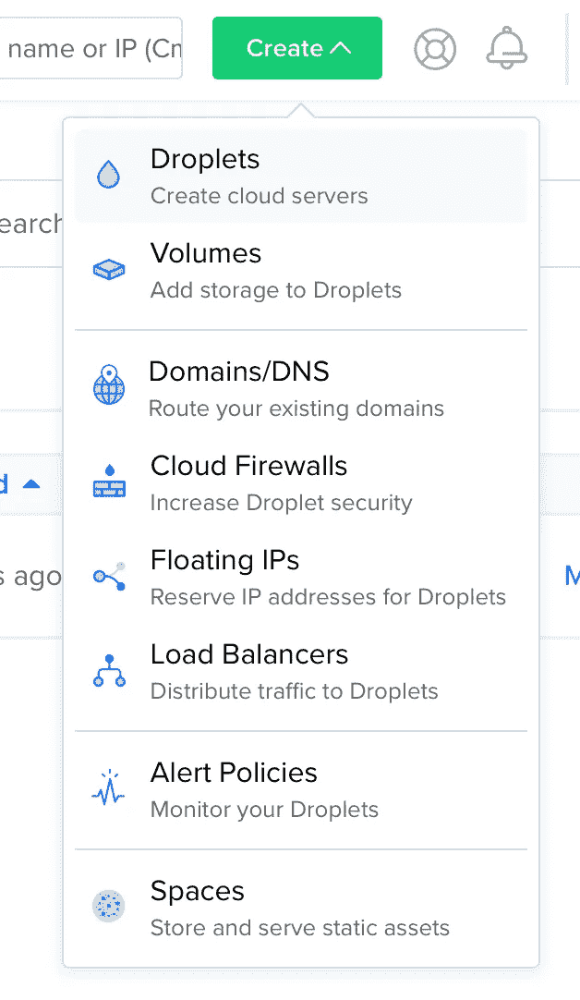
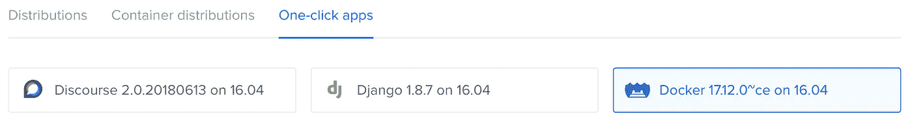
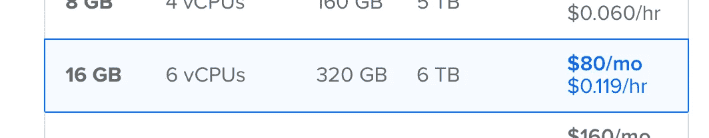
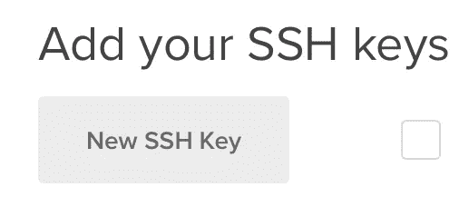
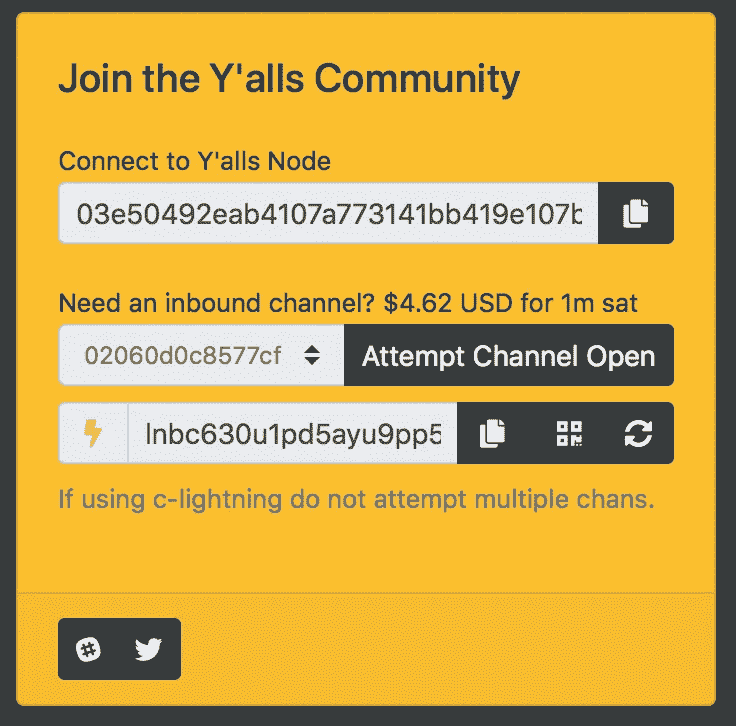

# 闪电网络:如何安装和(希望)赚钱

> 原文：<https://medium.com/coinmonks/the-lightning-network-how-to-install-and-hopefully-make-money-6e3058e3fa7c?source=collection_archive---------0----------------------->

*注:本文档写于 2018 年 7 月。闪电是一种新技术，进步很快。如果您发现任何过时的信息或遗漏，请留下评论。*


闪电是一种有趣的新技术，它承诺以比特币闻所未闻的规模(闪电般)快速交易。现在闪电在比特币主网上直播，它也是一个潜在的赚钱者。

不幸的是，我还发现 Lightning 极难安装，我已经浪费了很多时间来设置一个节点。我正在分享我的经历，所以希望其他人也能有更顺利的经历。

> 这篇博客文章只描述了安装过程，并假设读者精通设置服务器。要了解更多关于闪电本身的信息，请查阅[优秀白皮书](https://lightning.network/lightning-network-paper.pdf)。要了解更多关于闪电背后的经济学，请看[闪电网络费用的经济学](/social-evolution/the-economics-of-lightning-network-fees-76f0926da82)。LnRoute 列出了许多有用的资源。
> 
> 警告:闪电不适合胆小的人。有已知和未知的问题。钱包的私钥将存储在 Lightning 节点上，该节点必须全天候在线才能路由交易。和往常一样，不要尝试比你准备好的更多的 btc。(或者在 Testnet 上实验。但是这有什么意思呢？).

# 先决条件

在虚拟专用服务器(VPS)上的云中，或者在您自己的硬件上。本教程展示了如何在数字海洋 VPS 上安装 Lightning。我正在考虑在一个 [ODROID-HC1](https://www.amazon.com/gp/product/B074VF54LN) 上安装并记录 Lightning(如果你感兴趣，请留下评论)。

> 本教程假设您正在使用 Mac 连接到 VPS。使用 Linux 或 Windows 应该不会有太大的不同。
> 
> 您的 Lightning 节点必须始终在线才能转发付款。

> 如果你想轻松运行闪电网络节点，请查看这些[闪电网络和比特币节点提供商](https://blog.coincodecap.com/bitcoin-node-solutions/)。

# 建立数字海洋

在数字海洋上设置 VPS 大约需要 30 分钟。

1.  创建一个帐户
2.  创建新的 droplet
3.  创建 SSH 密钥对
4.  登录

使用以下推荐链接[在数字海洋上创建一个帐户，并获得 10 美元](https://m.do.co/c/b33858702e30)(我将获得 25 美元)。

创建新的 droplet



在`Create Droplet`页面，选择一键应用选项卡和`Docker`选项，在同一页面选择 320GB 选项。



接下来，我们将通过在终端中输入以下命令来创建一个新的 SSH 密钥对:

```
# 1\. Create SSH key pair. "lightning" will be the filename
#    Enter a passphrase to secure the file
$ **ssh-keygen -f ~/.ssh/lightning -t rsa -b 4096** # 2\. Backup lightning and lightning.pub files$ **cd ~/.ssh** $ (Make a safe backup)# 3\. Copy the public key to the clipboard
$ **pbcopy < ~/.ssh/lightning.pub**
```

回到浏览器，点击`New SSH Key`按钮，将公钥(在上面的步骤 3 中复制到剪贴板)粘贴到文本框中，然后点击`Create`按钮创建小程序。



一旦创建了水滴，复制水滴的`ip-address`。

```
# Log in.
$ **ssh root@**<droplet's ip-address> **-i ~/.ssh/lightning**
```

# 安装 bitcoind

Lightning 需要一个本地运行的完整比特币节点(这将在未来随着[中微子光客户端](https://github.com/lightninglabs/neutrino)的出现而改变)。这一步将下载完整的比特币区块链，大约需要 12 到 24 小时才能完成。

我按照道格·冯·科霍恩的[闪电帖](/@dougvk/run-your-own-mainnet-lightning-node-2d2eab628a8b)中的步骤。

1.  确保登录到您的服务器。
2.  安装 Bitcoind Docker 映像。
3.  下载比特币区块链。
4.  创建一个方便的脚本，以便轻松访问 bitcoind 容器
5.  正在下载区块链，请稍候。

如果您尚未登录，请登录。

```
# Log in.
$ **ssh root@**<droplet's ip-address> **-i ~/.ssh/lightning**
```

使用 dockerfile 创建一个 bitcoind Docker 容器，Docker file(容易混淆)位于一个名为 lightning-node 的 repo 中。

Bitcoind 会将区块链和所有设置保存在磁盘上，而不是保存在容器本身中。这样，即使我们用更新的版本替换 bitcoind 容器，所有数据都将持久化。

```
# 1\. Clone the bitcoind repo. (don't let the lightning 
#    node project name fool you, this will install bitcoind)
$ **git clone https://github.com/dougvk/lightning-node.git**# 2\. Build the bitcoind Docker container.
$ **cd lightning-node**
$ **docker build . -t dougvk/bitcoind**# 3\. Create a working directory outside of the Docker image,
#    so the working directory won't be overwritten when you 
#    update the Docker image with a new bitcoind version.
$ **mkdir -p /scratch/bitcoin/mainnet/bitcoind**# 4\. Run bitcoind and start downloading the blockchain.
$ **docker run --name bitcoind -d -v /scratch/bitcoin/mainnet/bitcoind:/data -p 8333:8333 -p 9735:9735 dougvk/bitcoind:latest**
```

添加一个方便的脚本来访问 bitcoind 容器:

```
# 1\. Create script.
$ **touch /bin/bitcoin-cli**# 2\. Make script executable.
$ **chmod +x /bin/bitcoin-cli**# 3\. Edit script (See below).
$ **nano /bin/bitcoin-cli**# 4\. Confirm script is working. This command shows the wallet info.
$ **bitcoin-cli getwalletinfo**
```

在 Nano(上面的步骤 3)中，编辑比特币 cli 脚本，如下所示:

```
**#!/usr/bin/env bash
docker run --rm --network container:bitcoind -v /scratch/bitcoin/mainnet/bitcoind:/data dougvk/bitcoind:latest bitcoin-cli "$@"**
```

在撰写本文时，比特币区块链的大小为 175GB。区块链下载应该已经在进行中，最多需要 24 小时才能完成。在区块链下载过程中休息一下，打个盹或度个短假。

通过输入以下命令检查下载的状态。下载完成后，最新下载的块应该是今天的日期。

```
# Check the blockchain download progress.
$ **docker logs bitcoind --tail "10"**
```

# 安装 C 型闪电

接下来，安装 Lightning 客户端。Lightning 实现有多种，比如 [C-Lightning](https://github.com/ElementsProject/lightning) 和 [lnd](https://github.com/lightningnetwork/lnd) 。您使用哪种实现并不重要，因为所有实现都应该是可互操作的。

我发现这一步比我想象的要复杂，并且浪费时间尝试使用 lnd 实现。最后我放弃了 lnd，转投 C-Lightning。(由于软件和文档几乎每天都在更新，所以当你读到这篇文章时，lnd 完全有可能更容易安装。)安装 C-Lightning 大约需要 30 分钟。

1.  确保登录到您的服务器。
2.  创建 C-Lightning docker 映像并同步 Lightning 网络。
3.  创建一个方便的脚本，以便轻松访问 bitcoind 容器。
4.  设置名称和其他选项

如果您尚未登录，请登录。

```
# Log in.
$ **ssh root@**<droplet's ip-address> **-i ~/.ssh/lightning**
```

在磁盘上创建 lightning docker 映像和一个暂存目录，这样即使我们替换了 lightning docker 容器，数据也会持续存在。

```
# 1\. Create a working directory outside of the Docker image,
#    so the working directory won't be overwritten when you 
#    update the Docker image with a newer C Lightning version.
$ **mkdir -p /scratch/bitcoin/mainnet/clightning**# 2\. Create the Lighting docker image.
$ **docker run --rm --name lightning --network container:bitcoind -v /scratch/bitcoin/mainnet/bitcoind:/root/.bitcoin -v /scratch/bitcoin/mainnet/clightning:/root/.lightning --entrypoint /usr/bin/lightningd elementsproject/lightningd --network=bitcoin --log-level=debug**
```

Lightning 节点现在应该正在下载 Lightning 网络，这大概需要 10 分钟。

由于最后一个命令没有返回到命令提示符，请打开一个新的终端窗口或标签，然后再次登录。

```
# Log in.
$ **ssh root@**<droplet's ip-address> **-i ~/.ssh/<filename>**
```

接下来，我们将创建一个方便的脚本来访问 Lightning 客户端。

```
# 1\. Create script.
$ **touch /bin/lightning-cli**# 2\. Make script executable.
$ **chmod +x /bin/lightning-cli**# 3\. Edit script (See below).
$ **nano /bin/lightning-cli**# 4\. Confirm script is working. 
$ **lightning-cli getinfo**
```

在 Nano 中(上面的步骤 3)，按如下方式编辑 lightning-cli 脚本:

```
**#!/usr/bin/env bash
docker run --rm -v /scratch/bitcoin/mainnet/clightning:/root/.lightning --entrypoint /usr/bin/lightning-cli** **elementsproject/lightningd** **"$@"**
```

我还没有找到所有配置文件选项的完整文档。如果你找到了，请留下评论。一个基本的配置文件设置 Lightning 节点的名称和该名称在 Lightning explorers 中显示的颜色，例如[recks proler](https://lnmainnet.gaben.win)。

```
# 1\. Create config file
$ **touch /scratch/bitcoin/mainnet/clightning/config**# 2\. Edit and save config file (see below)
$ **nano /scratch/bitcoin/mainnet/clightning/config**
```

我的配置文件如下。我将我的节点命名为 [Punchbeef](https://1ml.com/node/02060d0c8577cfc2a1962220a1cde4f623ca55ef80bd25e4be5a8b15fed78b11a3) ✅(是的，[一个神秘科学剧场 3000](http://mst3k.wikia.com/wiki/The_Nine_Billion_Names_of_David_Ryder) 参考)，并将其颜色设置为橙色。这种颜色被各种[闪电探索者](https://lnmainnet.gaben.win)使用，并提供了一种脱颖而出的方式。你显然想改变别名和颜色(除非你喜欢橙色)。为了保证更稳定的通道，FirstBlock 的李畅建议在配置文件中添加`bind-addr`和`announce-addr`。然而，`bind-addr`似乎并没有起到预期的作用。

```
**alias=Punchbeef✅** # Change the alias, obviously **rgb=FF4500** #bind-addr=0.0.0.0:9735This doesn't seem to work yet
**announce-addr=**<droplet's ip-address>**:9735**
```

重启 Lightning 节点以更新更改。

```
# 1\. Stop the Lightning node
$ **lightning-cli stop**# 2\. Start the Lightning node
#    Note: this creates a new container. How do we restart 
#    the existing one? Any Docker experts here?
$ **docker run --rm --name lightning --network container:bitcoind_mainnet -v /scratch/bitcoin/mainnet/bitcoind:/root/.bitcoin -v /scratch/bitcoin/mainnet/clightning:/root/.lightning --entrypoint /usr/bin/lightningd elementsproject/lightningd --network=bitcoin --log-level=debug**
```

我们现在有了一个运行在 mainnet 上的全功能闪电节点。

> 注意:如果您更喜欢使用 lnd 而不是 C-Lightning，在 mainnet 上安装 lnd 的未记录命令如下。为了获得支撑，检查它们的活动松弛度。

```
# Don't use unless you want to install LND, instead of C-Lightning!$ docker create --name=lnd lightninglabs/lnd --bitcoin.active --bitcoin.mainnet
```

# 设定费用

在闪电网上赚钱的方法就是通过你的节点转发其他节点的交易。发送节点将根据节点设置的费用选择最佳路径。因此，我们希望将费用定在一个足够低的价格，这样流量就会通过我们的节点，但又足够高，可以盈利。至少理论上是这样。

我期待能够设置费用，以优化更多的流量。不幸的是，我还没有找到这样做的方法，目前我使用默认设置。如果有人知道解决办法或者有建议，请留言评论。

# 连接到节点并创建通道

*注:如果你不熟悉闪电通道的概念，请参见《闪电白皮书》原文*[](https://lightning.network/lightning-network-paper.pdf)**或*[](https://bitcoinmagazine.com/articles/understanding-the-lightning-network-part-building-a-bidirectional-payment-channel-1464710791/)**。***

**资助渠道是一个两步流程:首先将 btc 从当前钱包发送到节点的钱包，然后从节点的钱包向渠道提供 btc。创建和资助渠道大约需要两个小时，包括以下步骤:**

1.  **为节点的钱包创建一个比特币地址。**
2.  **将 btc 发送到步骤 1 中创建的地址，并等待六次确认。**
3.  **连接到你选择的任何闪电节点来创建一个通道。**
4.  **从第 2 步开始用 btc 为渠道注资，并等待六次确认。**

**与任何其他比特币钱包一样，你可以为一个钱包创建多个地址。给闪电钱包发少量 btc，像这样:**

```
**# 1\. Create new address. 
$ **lightning-cli newaddr**# 2\. Send btc to the address generated above and wait for six 
#    confirmations. Check status at: 
#    [https://www.blockchain.com/btc/tx/](https://www.blockchain.com/btc/tx/)# 3\. Confirm the funds have been received.
$ **lightning-cli listfunds****
```

**需要时，使用 dev-listaddrs 命令列出您的 Lightning wallet 的所有地址:**

```
**# List all addresses of your Lightning wallet.
$ **lightning-cli dev-listaddrs****
```

**接下来，连接到一个或多个其他 Lightning 节点。**

```
**# 1\. Connect to another Lightning node. The parameters are 
#    the Lightning id, and optional ip-address and port.
#    The command below connects to the author's Punchbeef✅ node.
$ **lightning-cli connect** **02060d0c8577cfc2a1962220a1cde4f623ca55ef80bd25e4be5a8b15fed78b11a3@178.62.237.239**# 2\. Confirm your node is connected to the node in step 4, and 
#    the state is "GOSSIPING".
$ **lightning-cli listpeers****
```

> **寻找要连接的节点？ [Recksplorer](https://lnmainnet.gaben.win) 是一个实时的闪电网络地图，可以用来找到你可能想要连接的其他节点。其他伟大的资源是[闪电网络商店](http://lightningnetworkstores.com)列表，和[Y’alls 列表](https://mainnet.yalls.org/nodes/)。1ml 根据 btc 和具有最多通道的[节点维护一个](https://1ml.com/node?order=mostchannels)[最大节点的列表。](https://1ml.com/node?order=capacity&onlypublic=true)**

**我用 318 kSatoshi(大约。20 美元)。一些主机要求更高的最低限额，我也遵从了。我还检查了商家出售的商品的价格，并确保该频道有足够的 satoshi 来购买商店中至少较便宜的商品。**

> **为渠道提供资金是一个链上事件，需要得到确认。**

```
**# 1\. If needed, list connections. Unfunded channels will have 
#    state set to 'GOSSIPING'
$ **lightning-cli listpeers**# 2\. Fund the channel to peer ID 02060... belonging to Punchbeef✅
#    with 400 kSat.
$ **lightning-cli fundchannel** **02060d0c8577cfc2a1962220a1cde4f623ca55ef80bd25e4be5a8b15fed78b11a3** **400000****
```

**然后嘣。我们在直播。**

## **支付**

**为了测试闪电支付，你可以在不同的商家购买贴纸或 t 恤，但你也可以从 Y'alls node 购买一个约 4.62 美元的入站频道。为什么不呢？浏览至 Y’alls 网站的[关于页面，并遵循以下步骤。](https://mainnet.yalls.org/about/)**

****

```
**# 1\. Connect to the Y'alls node
$ **lightning-cli connect 03e50492eab4107a773141bb419e107bda3de3d55652e6e1a41225f06a0bbf2d56@mainnet-lnd.yalls.org**# 2\. Fund outbound channel with 1 mSat and wait for confirmation
$ **lightning-cli fundchannel 03e50492eab4107a773141bb419e107bda3de3d55652e6e1a41225f06a0bbf2d56 1000000**# 3\. Confirm the channel state is CHANNELD_NORMAL
$ **lightning-cli listpeers 03e50492eab4107a773141bb419e107bda3de3d55652e6e1a41225f06a0bbf2d56**# 4\. Browse to [https://mainnet.yalls.org/about/](https://mainnet.yalls.org/about/), locate the 'Join
#    the Y'alls Community' box and select your node from the 
#    dropdown list and click 'Attempt Channel Open'.# 5\. Copy the invoice starting with "lnbc" from the bottom box# 6\. Pay Y'alls node to create inbound channel using the invoice 
#    copied in step 5.
$ **lightning-cli pay** <lnbc...>**
```

# **关闭渠道，回笼资金**

**要将 btc 从一个通道撤回到节点的钱包中，您需要关闭该通道。这一步大约需要一个小时。**

1.  **找到您想要关闭的频道的 id**
2.  **关闭频道**
3.  **利润！**

> **就像资助一个渠道一样，关闭一个渠道也是一个连锁事件，需要得到确认。**

```
**# 1\. Show funded channels to look up channel id.
$ **lightning-cli listfunds**# 2\. Close channel. Command should return a txid, which is
#    verifiable on [https://www.blockchain.com/btc/tx/](https://www.blockchain.com/btc/tx/)
$ **lightning-cli close xxxxx:xxx:x**# 3\. After about one hour, the channel should be removed 
#    from the list, and a utxo should be added to the utxo list.
#    You may need to rescan the outputs to see the latest updates.
$ **lightning-cli dev-rescan-outputs**
$ **lightning-cli listfunds****
```

# **备份**

**由于真实 btc 存储在您的节点上，您肯定希望有一个备份，以防万一。然而，备份 Lightning 并不简单。**

**我的第一反应是备份通道本身的状态。但事实证明这是一个坏主意，据 Github 杂志报道，这可能是关于闪电备份的最佳资源。**

**要理解为什么你应该*永远不要*备份通道状态，你必须理解闪电协议是如何惩罚不诚实的节点的。一种攻击媒介是传播通道的旧状态，这正是备份通道状态时可能发生的情况。对传播旧状态的惩罚是由对等体没收通道中的所有资金。换句话说:如果你试图备份和恢复一个渠道状态，你就有失去所有渠道资金的风险。**

> **通道状态保存在`/scratch/bitcoin/mainnet/clightning/`目录下的`lightning.sqlite3`文件中。千万不要备份`lightning.sqlite3`文件。**

**相反，在`/scratch/bitcoin/mainnet/clightning/`目录中备份`hsm_secret`文件。以下命令将`hsm_secret`文件复制到您的本地主目录。**

```
**# Run from your local computer. <filename> is the ssh file on 
# your local drive, <ip-address> is your lightning
# server's IP address.$ **scp -i <filename> root@**<droplet's ip-address>**:/scratch/bitcoin/mainnet/clightning/hsm_secret ~****
```

**收回资金的步骤是从上面提到的 GitHub 问题中复制的:在全新安装时复制`hsm_secret`,用`--port=0`选项启动 lightningd。*不要连接或资助任何渠道*。运行 lightning-cli newaddr 几次，然后用`lightningd stop`关闭 lightning。使用`--port=0`选项再次运行`sqlite3 /scratch/bitcoin/mainnet/clightning/lightningd.sqlite3 "UPDATE vars SET val= 500000 WHERE name='last_processed_block';"`Run lightning。通过运行`lightning-cli withdraw all`将链上资金恢复到您的个人钱包中。然后等待几个月，让同行关闭你的旧渠道。一旦所有通道关闭，用`lightning-cli withdraw all`收回之前卡在通道中的资金。**

**由于您无法在不中断恢复过程的情况下创建或资助新的渠道，因此您需要设置第二台服务器来继续运行 lightning node。**

# **错误和解决方案**

**和任何技术一样，尤其是新技术，你会遇到错误。**

## **不知道地址，放弃**

**当 lightning 节点尚未完成同步时，尝试连接到节点会发生这种情况。请等待您的节点完全同步，然后重试。**

## **没有足够的资金打开渠道**

**在资助了几个渠道后，Lighting 可能会抱怨没有足够的资金。我第一次遇到这个错误时，我以为我的钱丢了。原来资金还在，你要做的就是让 C-Lightning 重新扫描 utxos:**

```
**# 1\. Rescan outputs if funds are 'missing'
$ **lightning-cli dev-rescan-outputs**# 2\. Confirm all bitcoins are still there.
$ **lightning-cli listfunds****
```

## **连接被拒绝**

**在尝试连接一些有很多通道的热门节点时，有时会遇到`-1, Connection establishment: Connection refused`错误。我假设一个节点可以维护的通道数量是有限的，除了定期重试之外没有其他解决方案。**

## **无法资助渠道**

**有时，您能够连接到一个节点，但由于各种原因，无法为到该节点的通道提供资金。这些对等体将永远处于`GOSSIPING`状态。要检查对等机是否处于`GOSSIPING`状态，运行:**

```
**# Outputs the nodes in Gossiping state
$ **lightning-cli listpeers | jq '.peers[] | select(.state == "GOSSIPING****") | .'****
```

**基金每个节点返回:**

```
**# Fund channel
$ **lightning-cli fundchannel <peer-id> <amount>****
```

## **通道等待锁定和通道关闭**

**我遇到了多个更严重的问题，渠道在融资几天后陷入停滞状态。所以资金被套牢了，渠道却没有活跃起来。频道要么等待锁定(`Peer already CHANNELD_AWAITING_LOCKIN`)，要么处于永久关闭状态(`Peer already CHANNELD_SHUTTING_DOWN`)，而不是预期的`CHANNELD_NORMAL`。C-Lightning 似乎还不能自动解决这些停滞状态，尽管`listpeers`信息表明资金将在 144 次确认(相当于 24 小时)后自动返还。**

```
**# List all channels that were not opened correctly
$ **lightning-cli listpeers | jq '.peers[].channels[] | select(.state != "****CHANNELD_NORMAL") | .'****
```

**忽略状态为`CHANNELD_AWAITING_LOCKIN:Funding needs more confirmations`的频道。**

**这个问题在[GitHub 问题](https://github.com/ElementsProject/lightning/issues/1246)中讨论过，我目前仍在等待看它是否会最终解决，尽管这些频道已经在这些状态中停留了大约一周。**

# **谢谢**

**Firstblock Capital 的李畅负责设置建议和配置文件提示，[谢恩·维塔拉纳](https://medium.com/u/cb01d8f3cd55?source=post_page-----6e3058e3fa7c--------------------------------)负责校对。Doug von Kohorn 的[Run Your Own Mainnet Lightning Node](/@dougvk/run-your-own-mainnet-lightning-node-2d2eab628a8b)blog post 非常有用，还有许多堆栈溢出答案、GitHub 问题和 lnd Slack 社区。**

## **这篇文章有帮助吗？**

**考虑建立一条通往 punchbeef✅的通道**

```
**# 1\. Connect to punchbeef✅
$ **lightning-cli connect** **02060d0c8577cfc2a1962220a1cde4f623ca55ef80bd25e4be5a8b15fed78b11a3@178.62.237.239**# 2\. Fund channel
$ **lightning-cli fundchannel** **02060d0c8577cfc2a1962220a1cde4f623ca55ef80bd25e4be5a8b15fed78b11a3** **400000****
```

> **加入 Coinmonks [电报频道](https://t.me/coincodecap)和 [Youtube 频道](https://www.youtube.com/c/coinmonks/videos)获取每日[加密新闻](http://coincodecap.com/)**

## **另外，阅读**

*   **[密码电报信号](http://Top 4 Telegram Channels for Crypto Traders) | [密码交易机器人](/coinmonks/crypto-trading-bot-c2ffce8acb2a)**
*   **[复制交易](/coinmonks/top-10-crypto-copy-trading-platforms-for-beginners-d0c37c7d698c) | [加密税务软件](/coinmonks/crypto-tax-software-ed4b4810e338)**
*   **[电网交易](https://coincodecap.com/grid-trading) | [加密硬件钱包](/coinmonks/the-best-cryptocurrency-hardware-wallets-of-2020-e28b1c124069)**
*   **[加密交易所](/coinmonks/crypto-exchange-dd2f9d6f3769) | [印度的加密应用](/coinmonks/buy-bitcoin-in-india-feb50ddfef94)**
*   **[面向开发人员的最佳加密 API](/coinmonks/best-crypto-apis-for-developers-5efe3a597a9f)**
*   **最佳[加密借贷平台](/coinmonks/top-5-crypto-lending-platforms-in-2020-that-you-need-to-know-a1b675cec3fa)**
*   **杠杆代币的终极指南**
*   **[8 大加密附属计划](https://coincodecap.com/crypto-affiliate-programs) | [eToro vs 比特币基地](https://coincodecap.com/etoro-vs-coinbase)**
*   **[币安期货交易](https://coincodecap.com/binance-futures-trading)|[3 comas vs Mudrex vs eToro](https://coincodecap.com/mudrex-3commas-etoro)**
*   **[如何购买 Monero](https://coincodecap.com/buy-monero) | [IDEX 评论](https://coincodecap.com/idex-review) | [BitKan 交易机器人](https://coincodecap.com/bitkan-trading-bot)**
*   **[尤霍德勒 vs 科恩洛 vs 霍德诺特](/coinmonks/youhodler-vs-coinloan-vs-hodlnaut-b1050acde55a) | [Cryptohopper vs 哈斯博特](https://coincodecap.com/cryptohopper-vs-haasbot)**