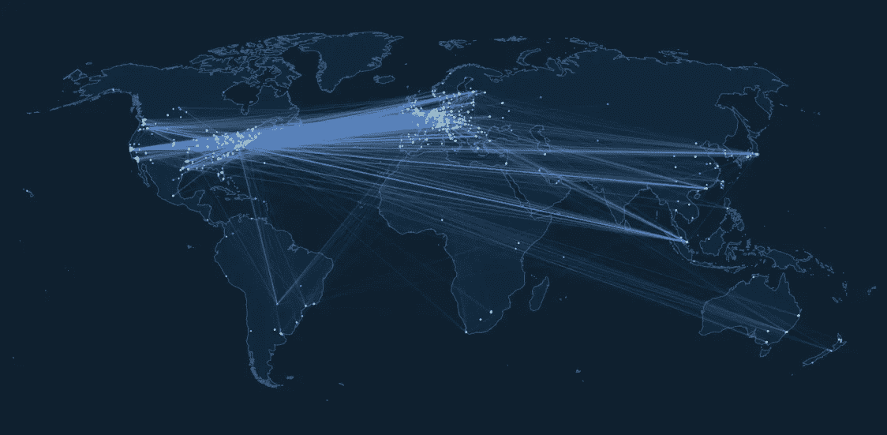

# ⚡闪电网络，第一部分:技术基础

> 原文：<https://medium.com/coinmonks/the-lightning-network-part-1-the-basics-of-the-technology-96b2d5fa7262?source=collection_archive---------1----------------------->

## 使用微支付渠道和比特币实现即时分散交易

via [Lightning Network Explorer](https://explorer.acinq.co/)

比特币社区的许多人最终希望看到比特币被用作全球货币，用于日常交易。然而，到目前为止，由于潜在的网络拥塞、高交易费用以及需要等待至少十分钟以确保交易被确认，这是不可行的。

注意:你可以看看我以前的一篇介绍比特币的文章:

 [## 无论你喜不喜欢，比特币都会存在

### 比特币是去中心化的点对点电子现金，这意味着没有第三方(像银行或其他…

ishaana-misra.medium.com](https://ishaana-misra.medium.com/bitcoin-is-here-to-stay-whether-you-like-it-or-not-b9cb9af256bd) 

# 比特币在全球范围内的实施存在重大障碍

在我们开始使用比特币进行日常支付之前，需要解决三个关键问题。

首先，比特币目前的结构是，比特币网络中的每个节点都知道网络上发生的每一笔交易。虽然这是比特币去中心化的原因，但事实证明，在可扩展性方面，这是一个挑战。如果我们用比特币执行所有的小额交易，它将很快使网络拥塞，因为截至目前，每 10 分钟就有一个区块被挖掘，并且有 1 兆字节的区块大小限制。

根据《比特币闪电网络:可扩展的链外即时支付》(约瑟夫·潘(Joseph Poon)和撒迪厄斯·德雷贾(Thaddeus Dryja)撰写的介绍闪电网络概念的论文)的说法，这意味着比特币每秒钟只能确认 7 笔交易。该论文继续指出，如果我们开始进行连续的小额交易，比特币网络要么会崩溃，要么会使运行比特币节点或矿工的成本非常高。这将违背比特币作为人人都能负担得起的去中心化货币的目的。

其次，即使在比特币目前的状态下，确认一笔交易也需要太长时间。你不仅需要等待大约 10 分钟，等待矿工将交易添加到区块链，而且建议等待 3-6 次确认(在包含你的交易的区块之上挖掘的区块数)，以确认交易没有被[双重花费](https://www.investopedia.com/terms/d/doublespending.asp)。

另一个问题是，由于网络拥塞，交易费用可能很高。这是因为如果大量用户在 mempool 中有未确认的事务，挖掘器必须选择将这些事务中的哪些事务包含在它将尝试挖掘的块中(由于块大小的限制)。矿商将选择收费最高的交易，以实现利润最大化。

消除这些问题将有助于我们减少在日常活动中使用比特币的摩擦。

# 介绍…闪电网络

闪电网络是一个分散的非链小额支付渠道网络，可以覆盖在任何区块链的加密货币如比特币之上，这就是为什么它被称为**第二层**技术。有了闪电网络，交易瞬间完成，交易费用微不足道。唯一需要支付全额交易费的时候是开通和关闭小额支付通道的时候。尽管闪电网络是离线的，这意味着它的交易不发生在区块链，但它仍然受到区块链的保护，允许快速、廉价和安全的交易。

## **微支付渠道**

闪电网络由许多小额支付渠道组成。微支付渠道是双方通过持续更新双方的余额来交换资金的渠道。与使用比特币或其他加密货币交易的传统方法不同，每当余额更新时，它不会立即广播到比特币网络中的节点。

虽然乍一看，似乎双方都需要相互信任，但这远远不是事实，因为闪电网络与比特币的原始原则之一并不冲突，即你不应该需要信任第三方或彼此来安全地交易你的资金。

## **开通支付通道&承诺资金**

支付通道由向**多重签名地址**承诺资金的双方打开。多签名地址是包含多个有效签名者的地址，其中需要一定数量的这些签名者来签署交易以使其生效。

通过 lightning 网络上的微支付通道，各方将资金投入到一个 2/2 多重签名地址。“2-of-2”意味着有两个有效的签名者，并且需要这两个签名者来验证交易。任何一方都可以随时获得资金退款。到目前为止，唯一被广播到网络上的是将资金存入多重签名地址。

因为任何人都可以创建支付渠道，所以我们需要一套标准来确保我们的小额支付渠道能够协同工作。这些标准被称为 BOLT(雷电技术基础)标准。

## **使用私人小额支付渠道进行资金交易**

闪电网上的一笔交易，只是更新双方可以兑换的金额的问题。交易可以由双方从多签名地址创建新的花费来进行。

在微支付渠道中只有一种正确的余额状态，即最近的一种。为了确保其中一方不会从之前的消费(之后是新的消费)中赎回资金，所有旧的交易都是无效的，只有新的交易是有效的。此外，试图广播无效状态的一方被迫将其所有资金交给相关的另一方。

这使得闪电网络受到区块链的保护，即使发生在闪电网络上的交易并不向区块链广播。这是两全其美的做法，因为通过在闪电网络上进行交易，交易是即时的，交易费用大大降低。

## **关闭支付通道&结算交易**

小额支付中的最后一笔交易是结算交易，结算交易由*向所有比特币节点*广播。任何一方可以进行结算交易。

请注意，双方实际上从来不需要结算，事实上，最初的闪电网络论文指出，“在这个网络内部创建近乎无限的交易量是可能的。”

## **通过具有公共小额支付渠道的闪电网络进行支付**

到目前为止，我们只讨论了已经开通小额支付通道的双方之间的支付，但如果每次需要与陌生人进行交易时都必须开通支付通道，这就违背了闪电网络的目的，因为我们正试图将需要向网络广播的交易数量降至最低。

有了 lightning network，你还可以通过与你开通了渠道的人将款项转给你尚未与之开通渠道的人。用一个例子来解释这一点将是最容易的，所以让我们假设 Alice 想要发送一些比特币给 Carol，但是不想与她一起打开小额支付通道。然而，Alice 与 Bob 有一个开放频道，Bob 又与 Carol 有一个开放的频道。

首先，卡罗尔随机生成一个只有她知道的秘密(R)。她生成了这个秘密的散列并发送给爱丽丝。然后，Alice 构建了一个只能使用秘密 r 来赎回的支付。Alice 随后将她刚刚构建的支付发送给 Bob，Bob 受到激励将其交给 carol，因为一旦 Bob 知道了秘密，Alice 将会给 Bob 一定数量的比特币。Bob 将此发送给 Carol，Carol 确实有秘密 R，因此 Carol 赎回了她的资金并将秘密反向传播给 Bob，Bob 将它交给 Alice，以便 Alice 将她欠他的比特币发送给他。

# 闪电网络的未来

一旦闪电网络成为主流，在安全、分散的比特币区块链基础上轻松进行即时交易将变得更加容易。我们有了一个良好的开端，目前网络中约有 12，400 个节点，随着闪电网络的继续扩张，我们越来越接近这样的现实。

**来源&有用的资源**

[比特币闪电网络:可扩展的离线即时支付](https://lightning.network/lightning-network-paper.pdf)

[闪电网络的技术介绍](https://www.youtube.com/watch?v=E1n3sKKPD_k)——我们是开发者 2020

[闪电网络可以让比特币更快更便宜](https://www.wired.com/story/the-lightning-network-could-make-bitcoin-faster-and-cheaper/)

**关于我**

*ishana Misra 是一名高一新生，对人工智能、医学和区块链感兴趣。*

推特:[https://twitter.com/IshaanaMisra](https://twitter.com/IshaanaMisra)

*查看我的简讯:*[*https://ishaana.substack.com*](https://ishaana.substack.com/)

> 加入 coin monks 电报频道，了解加密交易和投资

## 另外，阅读

 [## 最佳加密交易所| 2021 年十大加密货币交易所

### 加密货币交易所的加密交易需要了解市场，这可以帮助你获得利润…

blog.coincodecap.com](https://blog.coincodecap.com/crypto-exchange)  [## 2021 年 9 大最佳加密借贷平台

### 当谈到加密货币贷款时，大量因素等同于良好的收入状况。此外，借款的一部分…

blog.coincodecap.com](https://blog.coincodecap.com/crypto-lending)  [## 2021 年最佳加密交易机器人(免费和付费)

### 2021 年币安、比特币基地、库币和其他密码交易所的最佳密码交易机器人。四进制，位间隙…

medium.com](/coinmonks/crypto-trading-bot-c2ffce8acb2a)