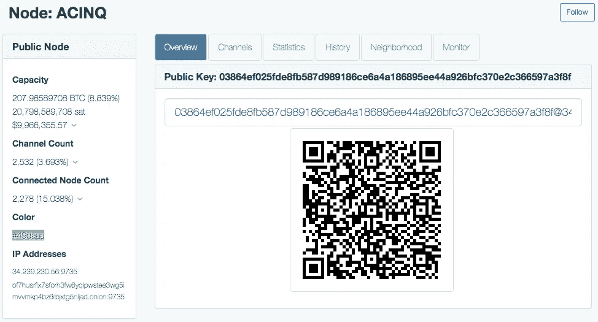

# 闪电网络⚡，第 2 部分:在 Raspberry Pi 上运行比特币闪电节点

> 原文：<https://medium.com/coinmonks/the-lightning-network-part-2-running-a-bitcoin-lightning-node-on-raspberry-pi-616e009529f2?source=collection_archive---------0----------------------->

## 通过安装闪电实验室 lnd 发布二进制

闪电网络是一个分散的链外小额支付渠道网络，可以覆盖在任何区块链的加密货币(如比特币)之上。

运行闪电节点不仅是使用比特币即时转移资金的简单方式，也是了解闪电网络如何工作的一种很酷的方式！

要了解关于 Lightning 网络的更多信息，您可以查看本系列的第 1 部分:

[](https://ishaana-misra.medium.com/the-lightning-network-part-1-the-basics-of-the-technology-96b2d5fa7262) [## ⚡闪电网络，第一部分:技术基础

### 使用微支付渠道和比特币实现即时分散交易

ishaana-misra.medium.com](https://ishaana-misra.medium.com/the-lightning-network-part-1-the-basics-of-the-technology-96b2d5fa7262) 

# 在 Raspberry Pi 上运行比特币节点

闪电节点将运行在比特币区块链之上，因此为了运行闪电节点，您已经需要运行比特币节点。您可以查看这篇文章了解更多信息:

[](https://ishaana-misra.medium.com/using-raspberry-pi-to-run-a-full-bitcoin-node-a30c6339b06e) [## 使用 Raspberry Pi 运行完整的比特币节点

### 由 Tor 担保

ishaana-misra.medium.com](https://ishaana-misra.medium.com/using-raspberry-pi-to-run-a-full-bitcoin-node-a30c6339b06e) 

一旦你在你的 Raspberry Pi 上运行 bitcoind，我们就可以开始了！

# 安装发布二进制文件

为了运行一个节点，我们需要运行 lnd，Lightning Labs 的 Lightning 网络守护程序。有三种主要的方法可以做到这一点:安装一个发布的二进制文件，从源代码构建它，手动构建它。我选择安装一个发布二进制文件，因为这是最简单的，而且我不需要使用更高级的方法所带来的好处。

发布二进制文件是计算机可读的源代码的编译版本。另一方面，一个源代码版本还没有编译，需要你来编译。因为已经编译过，所以您安装的二进制版本必须与您的操作系统相匹配。

我在 Raspberry Pi 终端上做的第一件事是将我的目录更改为下载目录，以保持有序。然后，我去了 [lnd 发布页面](https://github.com/lightningnetwork/lnd/releases/)，找到了最新的版本。我去了底部的“资产”部分，复制了“lnd-linux-arm7”的链接地址。然后我运行`wget [link]`下载 zip 文件:

```
$ wget [https://github.com/lightningnetwork/lnd/releases/download/
v0.13.1-beta/lnd-linux-armv7-v0.13.1-beta.tar.gz](https://github.com/lightningnetwork/lnd/releases/download/v0.13.1-beta/lnd-linux-armv7-v0.13.1-beta.tar.gz)
```

# 验证发布

在我们解压缩文件之前，我们需要确保它没有被修改，并且它是我们想要下载的正确文件。为了验证一个版本，我们可以获得 zip 文件的哈希，并将其与我们知道的该文件应该具有的哈希进行比较。你可以在这里了解更多关于哈希[的知识。](https://www.youtube.com/watch?v=b4b8ktEV4Bg)

首先，我从 lnd Github 库的同一个“发布”页面下载了以下两个文件:

```
$ wget [https://github.com/lightningnetwork/lnd/releases/download/
v0.13.1-beta/manifest-roasbeef-v0.13.1-beta.sig](https://github.com/lightningnetwork/lnd/releases/download/v0.13.1-beta/manifest-roasbeef-v0.13.1-beta.sig)$ wget [https://github.com/lightningnetwork/lnd/releases/download/ v0.13.1-beta/manifest-v0.13.1-beta.txt](https://github.com/lightningnetwork/lnd/releases/download/v0.13.1-beta/manifest-v0.13.1-beta.txt)
```

接下来，我导入了签署发布的密钥，如下所示:

```
$ curl https://keybase.io/bitconner/pgp_keys.asc | gpg --import
$ curl https://keybase.io/roasbeef/pgp_keys.asc | gpg --import
```

为了验证包含正确散列的文件，我运行了:

```
$ gpg — verify manifest-roasbeef-v0.13.1-beta.sig manifest-v0.13.1-beta.txtgpg: Signature made Mon 19 Jul 2021 05:41:37 PM EDTgpg:using RSA key 60A1FA7DA5BFF08BDCBBE7903BBD59E99B280306**gpg: Good signature from "Olaoluwa Osuntokun <laolu32@gmail.com>"** [unknown]gpg: WARNING: This key is not certified with a trusted signature!gpg: There is no indication that the signature belongs to the owner.Primary key fingerprint: E4D8 5299 674B 2D31 FAA1  892E 372C BD76 33C6 1696Subkey fingerprint: 60A1 FA7D A5BF F08B DCBB  E790 3BBD 59E9 9B28 0306
```

最后，我得到了 zip 文件的哈希，并将其与文本文件中相应的哈希进行了比较。

```
#got hash
$ shasum -a 256 lnd-linux-armv7-v0.13.1-beta.tar.gz76075aabb5dc13cb93b95ecb560e94d393e8efbd9d17db83b014b4cd87d57211  lnd-linux-armv7-v0.13.1-beta.tar.gz#checked hash under "lnd-linux-armv7-v0.13.1-beta.tar.gz" to make #sure the hash received above corresponds with that one
$ nano manifest-v0.13.1-beta.txt76075aabb5dc13cb93b95ecb560e94d393e8efbd9d17db83b014b4cd87d57211  lnd-linux-armv7-v0.13.1-beta.tar.gz
```

# 将版本放入。左颈部清扫术

首先，在您的 bitcoind 数据目录中创建一个名为“lnd-data”的目录。接下来，返回主目录并创建一个。lnd”目录，通过运行`ln -s /mnt/data/lnd-data .lnd`该目录将被用作符号链接。符号链接，也称为符号链接，允许您从多个位置访问一个目录，使导航更容易。

现在，返回到“下载”并将“lnd-Linux-arm V7-v 0 . 13 . 1-beta . tar . gz”文件移动到。lnd 通过运行`mv lnd-linux-armv7-v0.13.1-beta.tar.gz ~/.lnd`。接下来，回到”。lnd”并解压文件。转到创建的新目录“lnd-linux-armv7-v0.13.1-beta/”，应该会看到两个文件，“lnd”和“lncli”。将这些文件移动到”。lnd”并删除它们之前所在的现在为空的文件夹

# 通过修改 lnd.conf & bitcoin.conf 配置 lnd

在里面。lnd，我们需要创建一个包含闪电节点设置的配置文件。为了这样做，我运行`sudo nano lnd.conf`来创建并输入文件。在那里，我写下了以下内容:

```
[Application Options]
maxpendingchannels=10
alias=YOUR_ALIAS
color=#9999ff #or another color
maxlogfilesize=10[Bitcoin]
bitcoin.active=1
bitcoin.mainnet=1
bitcoin.node=bitcoind #specifying which bitcoin daemon we're using[Autopilot]
autopilot.active=0
autopilot.maxchannels=10
autopilot.allocation=1.0[Tor]
tor.active=true
tor.v3=true
tor.streamisolation=true
```

注意:你的别名只是你的闪电节点的公共名称

我们还需要更新比特币配置文件，以便 bitcoind 可以与 lnd 一起工作。首先，我去了。比特币目录并运行`sudo nano bitcoin.conf`。然后，我将以下内容添加到该文件中:

```
zmqpubrawblock=tcp://127.0.0.1:28332zmqpubrawtx=tcp://127.0.0.1:28333
```

这允许 lnd 使用 ZeroMQ 与 bitcoind 通信。最后，我回到主目录，通过运行`bitcoin-cli stop`，然后运行`bitcoind -daemon`，重启比特币守护进程。

# 运行 lnd

为了运行 lnd，你只需要输入`lnd`，但是在运行 lnd 之前，我们需要创建一个钱包。这样做相当简单，只需输入`lncli create`并按照说明创建一个钱包。然后，我运行`lnd`，看着它启动起来。

# 打开与另一个节点的通道

为了打开与另一个节点的通道，您只需要该节点的别名。一旦你有了别名(你可以简单地问节点的所有者要)，你就可以去[1ml.com](https://1ml.com/)，一个闪电网络搜索引擎，它允许你找到关于单个节点的信息，并搜索节点别名。看起来是这样的:



在这个页面中，我们需要两条信息:公钥和 IP 地址。使用这些信息，在您的终端上输入以下命令:

```
$ lncli openchannel --node_key PUBLIC_KEY --connect IP_ADDRESS --local_amt X
```

local_amt 参数是您希望提交给通道的 sat 数量。

# 发送和接收比特币/Satoshis

一旦您打开了与另一个节点的通道，您就可以来回发送 sat，而无需任何交易费用。

有两种方法可以做到这一点:发送发票付款，并使用 keysend。

**方法#1:发票**

在闪电网络中，发票是一种加密的支付请求。Alice 和 Bob 两个人打开了如上图所示的支付通道。假设 Alice 刚从 Bob 那里买了咖啡，Bob 希望得到 1,000 Sats 的报酬。为此，Bob 通过运行`lncli addinvoice --amt=1000 --memo="coffee"`创建了一张发票。“amt”字段包含 Satoshis 的数量，而“memo”字段包含一条消息，这样 Alice 就知道她在支付什么了。

Bob 现在可以向 Alice 发送“付款请求”消息。从这里，Alice 可以在她的 lightning 节点上运行`lncli sendpayment --pay_req=PAYMENT_REQUEST`,以便向 Bob 发送 sat。就是这样！Bob 的 sat 马上多了 1000 分。

**方法#2:按键发送**

使用这种方法，收件人不需要向发件人提出付款请求。相反，接收方要做的就是通过运行带有标志`--accept-keysend`的 lnd，在他们的节点上启用 keysend。这样做非常简单，只需运行`lnd --accept-keysend`。

现在，发送者可以运行`lncli sendpayment --keysend --dest [PUBLIC KEY] — amt [SATS]`。

为了检查您的渠道余额，您可以运行`lncli channelbalance`，为了检查您的钱包余额，您可以运行`lncli walletbalance`。当您关闭频道时，您的频道余额将转移到您的钱包中。要了解其他命令，只需运行`lncli`。

**关于我**

*ishana Misra 是一名高一新生，对人工智能、医学和区块链感兴趣。*

https://twitter.com/IshaanaMisra

*查看我的简讯:*[【https://ishaana.substack.com】T21](https://ishaana.substack.com/)

> 加入 [Coinmonks 电报频道](https://t.me/coincodecap)，了解加密交易和投资

## 另外，阅读

*   [网格交易机器人](https://blog.coincodecap.com/grid-trading) | [Cryptohopper 审查](/coinmonks/cryptohopper-review-a388ff5bae88) | [Bexplus 审查](https://blog.coincodecap.com/bexplus-review)
*   [加密复制交易平台](/coinmonks/top-10-crypto-copy-trading-platforms-for-beginners-d0c37c7d698c) | [如何在 WazirX 上购买比特币](/coinmonks/buy-bitcoin-on-wazirx-2d12b7989af1)
*   【Crypto.com 评论】|[|](/coinmonks/crypto-com-review-f143dca1f74c)|[信用交易](/coinmonks/huobi-margin-trading-b3b06cdc1519)
*   [Bookmap 评论](https://blog.coincodecap.com/bookmap-review-2021-best-trading-software) | [美国 5 大最佳加密交易所](https://blog.coincodecap.com/crypto-exchange-usa)
*   [如何在 FTX 交易所交易期货](https://blog.coincodecap.com/ftx-futures-trading) | [OKEx vs 币安](https://blog.coincodecap.com/okex-vs-binance)
*   [OKEx vs KuCoin](https://blog.coincodecap.com/okex-kucoin) | [摄氏替代品](https://blog.coincodecap.com/celsius-alternatives) | [如何购买 VeChain](https://blog.coincodecap.com/buy-vechain)
*   [币安期货交易](https://blog.coincodecap.com/binance-futures-trading)|[3 commas vs Mudrex vs eToro](https://blog.coincodecap.com/mudrex-3commas-etoro)
*   [如何购买 Monero](https://blog.coincodecap.com/buy-monero) | [IDEX 评论](https://blog.coincodecap.com/idex-review) | [BitKan 交易机器人](https://blog.coincodecap.com/bitkan-trading-bot)
*   [尤霍德勒 vs 科恩洛 vs 霍德诺特](/coinmonks/youhodler-vs-coinloan-vs-hodlnaut-b1050acde55a) | [Cryptohopper vs 哈斯博特](https://blog.coincodecap.com/cryptohopper-vs-haasbot)
*   [顶级付费加密货币和区块链课程](https://blog.coincodecap.com/blockchain-courses) | [币安评论](/coinmonks/binance-review-ee10d3bf3b6e)
*   [MXC 交易所评论](/coinmonks/mxc-exchange-review-3af0ec1cba8c) | [Pionex vs 币安](https://blog.coincodecap.com/pionex-vs-binance) | [Pionex 套利机器人](https://blog.coincodecap.com/pionex-arbitrage-bot)
*   [如何在印度购买比特币？](/coinmonks/buy-bitcoin-in-india-feb50ddfef94) | [WazirX 评论](/coinmonks/wazirx-review-5c811b074f5b) | [BitMEX 评论](https://blog.coincodecap.com/bitmex-review)
*   [印度的加密交易所](/coinmonks/bitcoin-exchange-in-india-7f1fe79715c9) | [比特币储蓄账户](/coinmonks/bitcoin-savings-account-e65b13f92451) | [HitBTC 评论](/coinmonks/hitbtc-review-c5143c5d53c2)
*   [币安收费](/coinmonks/binance-fees-8588ec17965) | [Botcrypto 审查](/coinmonks/botcrypto-review-2021-build-your-own-trading-bot-coincodecap-6b8332d736c7) | [Hotbit 审查](/coinmonks/hotbit-review-cd5bec41dafb) | [KuCoin 审查](https://blog.coincodecap.com/kucoin-review)
*   [我的密码交易经验](/coinmonks/my-experience-with-crypto-copy-trading-d6feb2ce3ac5) | [AAX 交易所评论](/coinmonks/aax-exchange-review-2021-67c5ea09330c)
*   [逐位融资融券交易](/coinmonks/bybit-margin-trading-e5071676244e) | [币安融资融券交易](/coinmonks/binance-margin-trading-c9eb5e9d2116) | [超位审核](/coinmonks/overbit-review-9446ed4f2188)
*   [有哪些交易信号？](https://blog.coincodecap.com/trading-signal) | [比特斯坦普 vs 比特币基地](https://blog.coincodecap.com/bitstamp-coinbase)
*   [ProfitFarmers 点评](https://blog.coincodecap.com/profitfarmers-review) | [如何使用 Cornix 交易机器人](https://blog.coincodecap.com/cornix-trading-bot)
*   [加密货币储蓄账户](/coinmonks/cryptocurrency-savings-accounts-be3bc0feffbf) | [YoBit 审核](/coinmonks/yobit-review-175464162c62) | [Bitbns 审核](/coinmonks/bitbns-review-38256a07e161)
*   [Botsfolio vs nap bots vs Mudrex](/coinmonks/botsfolio-vs-napbots-vs-mudrex-c81344970c02)|[gate . io 交流回顾](/coinmonks/gate-io-exchange-review-61bf87b7078f)
*   [CoinFLEX 评论](https://blog.coincodecap.com/coinflex-review) | [AEX 交易所评论](https://blog.coincodecap.com/aex-exchange-review) | [UPbit 评论](https://blog.coincodecap.com/upbit-review)
*   [AscendEx 保证金交易](https://blog.coincodecap.com/ascendex-margin-trading) | [Bitfinex 赌注](https://blog.coincodecap.com/bitfinex-staking) | [bitFlyer 点评](https://blog.coincodecap.com/bitflyer-review)
*   [Bitget 回顾](https://blog.coincodecap.com/bitget-review)|[Gemini vs block fi](https://blog.coincodecap.com/gemini-vs-blockfi)|[OKEx 期货交易](https://blog.coincodecap.com/okex-futures-trading)