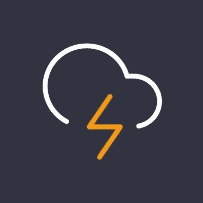

# ⚡闪电网络，第 3 部分:连接一个闪电节点从你的手机 Zap

> 原文：<https://medium.com/coinmonks/the-lightning-network-part-3-connecting-a-lightning-node-to-zap-from-your-mobile-phone-c49a424f4e69?source=collection_archive---------5----------------------->

## 同时使用 Tor 保持安全



[Source](https://twitter.com/ln_zap)

如果你正在运行一个 lightning 网络节点，并且需要能够访问它以便在旅途中使用你的 sat 进行支付，Zap 是一个相对容易设置的简单解决方案。使用 Zap，你可以通过打开频道、支付和结算余额来与你的闪电节点进行交互。使用 Zap 你可以与任何运行 LND 的节点交互(一个闪电节点实现)

我决定在我的 iphone 上设置 Zap，所以我下载了它的移动应用程序。为了让 Zap 能够连接到您的节点，它需要知道关于您的节点的一些关键信息。为了以 Zap 能够理解的方式从您的节点获取这些信息，我们可以使用 [lndconnect](https://github.com/LN-Zap/lndconnect) 来生成一个二维码，Zap 将能够从中获取信息。

如果您还没有安装，为了运行 lndconnect，您需要在您的节点上安装 Go。您可以前往 [Go 下载页面](https://golang.org/doc/install)并按照指示进行下载。确保选择与您的计算机的正确计算机体系结构相对应的文件。

一旦你验证了 Go 的安装，就该下载 lndconnect 了。起初，当我试图使用存储库的 README 文件中的说明来做这件事时，我不断遇到错误，但我很快发现了一些替代说明，作者是[@ siprocer](https://github.com/sipsorcery)y on[github](https://github.com/LN-Zap/lndconnect/issues/20#issuecomment-825211584):

```
~$ git clone <https://github.com/LN-Zap/lndconnect>
~/lndconnect$ go mod init github.com/lndconnect/v2
~/lndconnect$ go mod edit -require github.com/lightningnetwork/ lnd@v0.12.1-beta
~/lndconnect$ go build
~/lndconnect$ sudo cp lndconnect /usr/local/bin/lndconnect
```

接下来，我们需要创建一个 Tor 隐藏服务，让 Zap 连接到 LND REST 服务。我们可以通过修改 torrc 文件来配置 Tor。torrc 位于/etc/tor，可以通过运行`sudo nano /etc/tor/torrc`进行修改。在“位置隐藏服务”部分下，编写以下内容:

```
HiddenServiceDir /var/lib/tor/lnd_rest/
HiddenServicePort 8080 127.0.0.1:8080
```

为了让这些更改生效，我们需要通过运行`sudo systemctl stop tor.service`来重启 tor。如果 lnd 还没有在您的节点上运行，也要启动它。

为了创建正确的二维码，我们需要找出我们刚刚创建的隐藏服务的洋葱地址。我通过运行`sudo cat /var/lib/tor/lnd_rest/hostname`做到了这一点。要生成二维码，只需运行:

```
lndconnect --host=[onion address] --port=8080
```

扫描 Zap 上的二维码，就搞定了！你现在应该可以从你的手机与你的闪电节点互动了！为了额外的安全，建议在你的手机上运行 VPN。

总的来说，一旦 lightning 节点连接上，我发现 Zap 相当直观且易于使用，尽管运行 lndconnect 的时间确实比预期的要长一些。作为一个额外的奖励，我发现它的用户界面比我测试过的其他应用要好得多，这些应用也可以用来连接到你的节点。我打开频道，来回发送 sat，玩得很开心！

**关于我**

*ishana Misra 是一名对人工智能、医学和区块链感兴趣的高一新生。*

推特:【https://twitter.com/IshaanaMisra 

*查看我的简讯:*[*https://ishaana.substack.com*](https://ishaana.substack.com/)

> 加入 Coinmonks [电报频道](https://t.me/coincodecap)和 [Youtube 频道](https://www.youtube.com/channel/UCbyDhTbOiKh2iUMKBi4-4Zg)了解加密交易和投资

## 另外，阅读

*   [网格交易机器人](https://blog.coincodecap.com/grid-trading) | [Cryptohopper 审查](/coinmonks/cryptohopper-review-a388ff5bae88) | [Bexplus 审查](https://blog.coincodecap.com/bexplus-review)
*   [加密复制交易平台](/coinmonks/top-10-crypto-copy-trading-platforms-for-beginners-d0c37c7d698c) | [如何在 WazirX 上购买比特币](/coinmonks/buy-bitcoin-on-wazirx-2d12b7989af1)
*   [CoinLoan 点评](https://blog.coincodecap.com/coinloan-review)|[Crypto.com 点评](/coinmonks/crypto-com-review-f143dca1f74c) | [火币保证金交易](/coinmonks/huobi-margin-trading-b3b06cdc1519)
*   [Bookmap 评论](https://blog.coincodecap.com/bookmap-review-2021-best-trading-software) | [美国 5 大最佳加密交易所](https://blog.coincodecap.com/crypto-exchange-usa)
*   [如何在 FTX 交易所交易期货](https://blog.coincodecap.com/ftx-futures-trading) | [OKEx vs 币安](https://blog.coincodecap.com/okex-vs-binance)
*   [OKEx vs KuCoin](https://blog.coincodecap.com/okex-kucoin) | [摄氏替代度](https://blog.coincodecap.com/celsius-alternatives) | [如何购买 VeChain](https://blog.coincodecap.com/buy-vechain)
*   [币安期货交易](https://blog.coincodecap.com/binance-futures-trading)|[3 commas vs Mudrex vs eToro](https://blog.coincodecap.com/mudrex-3commas-etoro)
*   [如何购买 Monero](https://blog.coincodecap.com/buy-monero) | [IDEX 评论](https://blog.coincodecap.com/idex-review) | [BitKan 交易机器人](https://blog.coincodecap.com/bitkan-trading-bot)
*   [尤霍德勒 vs 科恩洛 vs 霍德诺特](/coinmonks/youhodler-vs-coinloan-vs-hodlnaut-b1050acde55a) | [Cryptohopper vs 哈斯博特](https://blog.coincodecap.com/cryptohopper-vs-haasbot)
*   [顶级付费加密货币和区块链课程](https://blog.coincodecap.com/blockchain-courses) | [币安评论](/coinmonks/binance-review-ee10d3bf3b6e)
*   [MXC 交易所评论](/coinmonks/mxc-exchange-review-3af0ec1cba8c) | [Pionex vs 币安](https://blog.coincodecap.com/pionex-vs-binance) | [Pionex 套利机器人](https://blog.coincodecap.com/pionex-arbitrage-bot)
*   [币安收费](/coinmonks/binance-fees-8588ec17965) | [Botcrypto 审查](/coinmonks/botcrypto-review-2021-build-your-own-trading-bot-coincodecap-6b8332d736c7) | [Hotbit 审查](/coinmonks/hotbit-review-cd5bec41dafb) | [KuCoin 审查](https://blog.coincodecap.com/kucoin-review)
*   [我的密码交易经验](/coinmonks/my-experience-with-crypto-copy-trading-d6feb2ce3ac5) | [AAX 交易所评论](/coinmonks/aax-exchange-review-2021-67c5ea09330c)
*   [Bybit 融资融券交易](/coinmonks/bybit-margin-trading-e5071676244e) | [币安融资融券交易](/coinmonks/binance-margin-trading-c9eb5e9d2116) | [Overbit 审核](/coinmonks/overbit-review-9446ed4f2188)