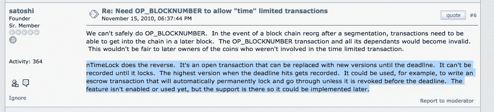
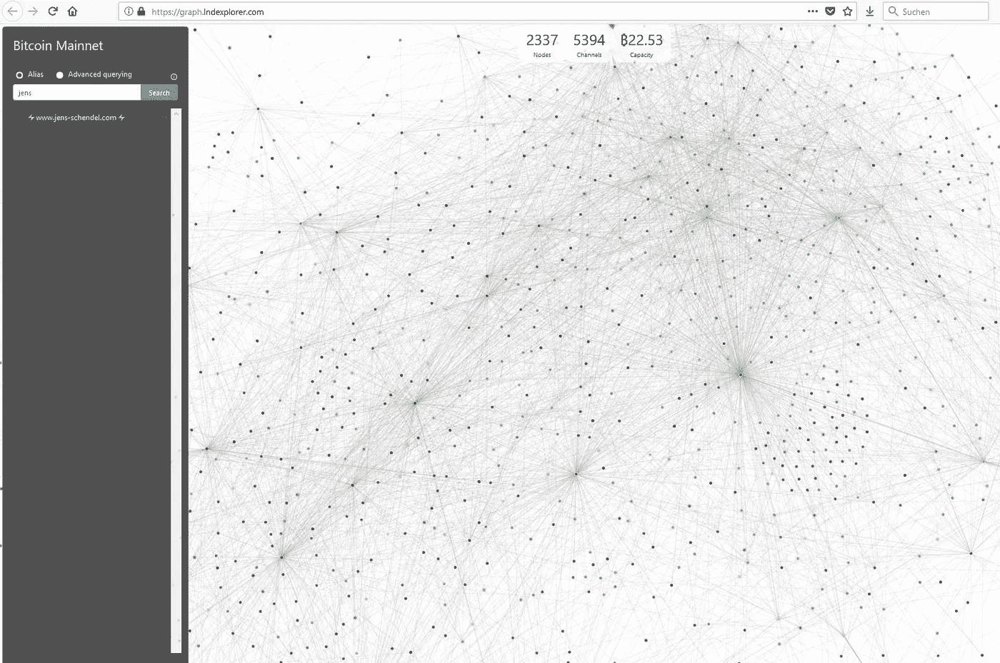

# 闪电网络⚡将掀起一场革命或为什么霍德林不是解决方案，而是问题的一部分！

> 原文：<https://medium.com/coinmonks/the-lightning-network-will-revolutionize-a-revolution-or-why-hodling-is-not-the-solution-but-part-13716ef55c1e?source=collection_archive---------6----------------------->


在准备这篇关于闪电网络的文章时，我考虑了几个标题，即使在发表后，我也不确定我是否选择了正确的标题。

我的替代者:

# 比特币已死，比特币万岁！

或者

# 闪电网络没有进化就没有革命！

或者

# 比特币将再次发明自己！了解闪电网！

它们都以某种方式表达了我想向你解释的东西。

但是从一开始。你可能知道[我从 2013 年](https://www.jens-schendel.com/)开始投资比特币。开始是家庭矿工，偶尔是，后来经常是商人。我多年来一直坚持比特币，因为这是一种爱好，导致我和妻子一直在讨论，当她支付我们的电费时，我的爱好值多少钱。她当时表现出了极大的理解，并一直支持我。早期，我以 200 美元到 500 美元的价格交易比特币，并乐在其中。在我有 30 个比特币的时候，我希望我知道那时的未来。😢

然后 2017 年来了，比特币汇率爆炸，而正在进行的关于缩放的讨论导致了不同派别之间的公开战争和有争议的妥协。在这一点上，我不想深入探讨这个问题，但最终它导致了比特币的几个分叉和比特币汇率在 20，000 美元左右的高峰。然后是漫长的下跌和今天比特币在反弹的同时对抗强大的看跌阻力线。


# 比特币是失败的吗？

真的就这样结束了吗？所有反对者的呼声都要被证明是对的吗？比特币是所有专家反复称之为巨大泡沫的吗？

比特币是作为一种消除第三方信任的点对点价值转移系统而发明的。它被设计成一种为没有银行账户的人提供银行服务的工具，并且在全世界都可以使用。但是作为一个天才，中本聪并没有预见到它会有迫在眉睫的缺陷。Satoshi 大概没想到会发明 ASIC。我很确定，如果他这样做了，他会让挖掘/制造算法变得更复杂，以便尽可能长时间地保留在 CPU/GPU 上。也许他只是不在乎。矿池的成功可能是最初没有预料到的，甚至也不是有意的。比特币的理念是分布式账本和去中心化。资金池的形成恰恰相反，最终导致一些大型矿商和采矿设备硬件供应商认为，他们“拥有”或经营比特币，他们不会放弃将爪子伸向过去几年为他们提供了如此多财富的印钞机。

你仍然可以在比特币现金(一种从比特币派生出来的替代货币)的支持者那里找到这种态度，比如吴和罗杰弗，他们试图误导人们比特币到底是什么。(顺便说一下，在他们的论证中，他们坚持比特币的原始白皮书，但没有考虑到如果你意识到缺陷，你需要开发一些东西，只有人们接受的比特币才会是比特币。他们改变了一些操纵策略，但请注意，比特币现金不是比特币——不支持 SegWit 永远不会是比特币。)

比特币的第三大缺陷是，其汇率的飙升吸引了越来越多甚至是大型机构投资者投资比特币。与此同时，比特币作为一种支付选择越来越被拒绝，因为由于长期的规模争论，交易费用变得过高。突然间，比特币成了投机的对象，普通人再也买不起了，这使得许多人不愿购买比特币，即使他们根本不理解比特币作为一种技术的市场机制。

如果你看到这三个隔离的缺陷，你已经对实际情况有了很好的印象，但你需要更深入地挖掘，以揭示比特币的真正问题，以及迫切需要解决的问题。比特币的目的是成为某种货币，但它更像是一种商品。当然，你可以用比特币在网上商店买这个或那个，但几个月后，比特币的价值就变得如此之高，以至于手续费耗尽了转账的价值。没有人真的想接受比特币。卖家、商家和店主认为它更像是一个时髦的支付渠道，而不是 VISA、Paypal 或 Fiat Money 的合理竞争对手。比特币的成功及其波动的汇率使其不可能被用作货币，所有迫在眉睫的缺陷共同作用，将它拖向价值储存的方向，这使得所有的大喊“泡沫！泡！”成了自我实现的预言。

从这个角度来看，这是真的:比特币——作为一种货币——是失败的。


# 而未来呢？

比特币是一个失败，但它不是一个史诗般的失败，因为一小撮抵制的开发者几年前就已经意识到，比特币的问题出在哪里，以及如何解决它们。我给你画个图，细节上不自称真实，但请允许我牵着你的手，带着一点怪异的想法，把你引向正确的方向。

加入我的阴谋理论的兔子洞，爱丽丝已经伪装成比特币发明者中本聪在那里等着我们。相信他是谁取决于你，但你有没有想过，在他开始如此努力地创造比特币并向他人解释他的想法后，他为什么完全从舞台上消失了？为什么他展示了这些概念并实现了其愿景，激励了世界各地的许多开发人员、密码学家和数学界人士，却一次也没有公开身份？我确信他计划把接力棒传给其他人，然后从另一个角度观察和/或处理其他事情。还是？

> 中本聪创建了一个域名为 bitcoin.org 的网站，并继续与其他开发者合作开发比特币软件，直到 2010 年年中。大约在这个时候，他将源代码库和网络警报密钥的控制权移交给了加文·安德森，将几个相关的域转让给了比特币社区的各个知名成员，并停止了对该项目的参与。直到他离开和移交前不久，中本聪自己对源代码进行了所有的修改。

维基百科贡献者。“中本聪。”维基百科，免费的百科全书。维基百科，免费百科，2018 年 6 月 24 日。网络。2018 年 6 月 26 日。

我无法想象他在离开之前没有确保他的“比特币:一个点对点的电子现金系统”得到妥善保管。有传言称，Satoshi 甚至可能是如今被称为“比特币核心”的那群人(或其中的一部分)。

现在是怪异的想象:我心中的浪漫主义者有一个秘密社会的想法，大约 5 到 10 个人共享一个私钥的一部分，如果在特定条件下一起使用，比如特定的街区高度或流通中的比特币数量，可以解锁第一个 100 万个铸造的比特币。

可以肯定的是，被称为“比特币核心”的群体从未在营销上花费太多时间，将自己置于关注的中心或对自己的人身造成很大影响，但他们在以可持续的方式发展比特币方面付出了很多努力。关于缩放的讨论导致了斗争，但比特币核心从未放弃任何土地，让用户决定。他们从不关心社区中的其他趋势是否导致了替代硬币的产生，以及有多少新硬币被采用或从比特币中夺走了市值。他们或多或少忽视了以太坊等类似图灵机的发展，但愿意与 Litecoin、Groestl 或 Dogecoin 等同源密码合作，以实现互惠互利——至少这是我的印象。

因此，作为比特币协议进一步发展的主要要求，SegWit 最终被成功激活，这就像是全球开发者的一个发令枪。我认为这就是比特币核心团队的目标，因为他们很早就意识到，激活 SegWit 对于将比特币从一个失败的投机泡沫转变为一个成功的完全数字化的点对点支付网络至关重要。SegWit 的支持有助于解决缩放问题，这只是额外的好处。比特币核心坚持 1 MB 块。如果缩放是一个大问题，已经有了解决方案，比如更大的块大小，甚至是[杰夫·加齐克的](https://twitter.com/jgarzik)不冷不热的妥协(对不起，[杰夫](https://twitter.com/jgarzik)，我尊重你和你的工作！祝[节拍器](https://metronome.io/auction/)一切顺利——甚至我认为它会在几年内过时)SegWit2x。顺便说一下:真正使 SegWit 成为可能的唯一倡议是 UASF——我的两分钱。

如果解决缩放问题不是坚持 SegWit 和 1 MB 小块甚至让用户增加比特币可能崩溃的压力的原因，那么我能看到的唯一原因是比特币的进一步发展，我花了几天时间才理解。

SegWit 允许对比特币协议进行几种可能的部署。通过 SetWit，比特币的区块链技术揭示了它的真实面目:一个巨大的分散式自组织公共数据库，其中保存着交易数据。这是一本公共账本。使用 SegWit 的新选项，比特币正在摆脱潜在缺陷的链条，并通过使用闪电网络，其原始效用再次出现。

# 嬉闹，救世主近了！

闪电网络实现了比特币在过去做出的所有承诺。有更好的来源向你解释细节

*   [https://lightning . network/](https://lightning.network/)
*   [https://decentralized . blog/the-lightning-network-新秀指南. html](https://decentralized.blog/the-lightning-network-rookie-guide.html)
*   [https://medium . com/@ argon group/bit coin-lightning-network-7-things-you-should-know-604 ef 687 af 5a](/@argongroup/bitcoin-lightning-network-7-things-you-should-know-604ef687af5a)

但是让我给你简单介绍一下:

闪电网不是新货币，不会有 ICO 或者 swap 什么的。Lightning Network 主要做这样的事情:每个有客户端的人都可以加入 Lightning Network，并且通过每个连接建立一个自组织网状网络。由于比特币协议的简单性，每个闪电网络节点都可以创建哈希值，这些哈希值可以锚定在比特币区块链中，而无需被“记录”。它们就像区块链中的钩子或书签。

如果爱丽丝想给鲍勃发送比特币，她现在可以使用该挂钩在闪电网络上打开一个直接通往鲍勃的通道。该信道是在网络的其他成员上建立的。这些跳对它们传输的事务内容没有任何线索。他们也不能阻止或影响它——他们只能作为某种中继站。他们只是建立了一个信任链。爱丽丝和鲍勃之间的通道建立后，他们可以免费双向交换比特币。他们可以给对方开发票或付款。所有的信息都保存在那个通道中，并且它是以一种在任何时候都有一个相互同意的状态(consenus)的方式构建的。因此，即使网络连接中断，通道中的比特币也是安全的。所有交易完成后，通道关闭，但只有结果被写入区块链。

但巨大的优势还在后面:如果你用闪电网络支付比特币，你就不需要在意 6 次确认时间。比特币已经在渠道内被转移和接受。交易已经谈妥，且结果不可逆转。Blockhain 仅在关闭通道后记录结果。并且在 6 次以上的确认之后，记录也是不可逆的。

而且你也不需要对每一个你想与之交换比特币的其他用户开放一个通道！因此，如果你建立了一个渠道，让我们说你最喜欢的咖啡店连锁，并资助了一些 Satoshis，闪电网络上的每个人都可能利用你的渠道建立自己的渠道。反之亦然。一旦连接到网络后，你的节点可以使用其他人的通道连接到闪电网络的另一个参与者。而且，你不用为一个渠道的比特币交易支付费用(与普通的比特币交易高度相同)，你只需支付一部分中继费。假设“[六度分离](https://en.wikipedia.org/wiki/Six_degrees_of_separation)”(从客厅游戏“[六度凯文·贝肯](https://en.wikipedia.org/wiki/Six_Degrees_of_Kevin_Bacon)”)的原理在真实世界环境中起作用，闪电网络通过最便宜和最快的可能方式将你对信道的连接请求引导到目的地。

**Lighning Network 为比特币添加了你一直希望的所有功能:**

*   光速般的即时交易
*   低交易费用甚至免费
*   低交易量低至 1 Satoshi
*   在您的交易历史中没有直接公开查看
*   在渠道内将比特币轻松兑换为莱特币、Groestl 或 Dogecoin(原子互换)
*   由于其 p2p 性质，闪电网络是“不可阻断的”

这为所有相关方打开了各种用例。请考虑一下！比特币将从一种商品变成一种真正的全球通用货币。商户终于可以实现比特币支付了。星巴克可以让你在几秒钟内支付咖啡费用。脸书可以用支付比特币来奖励商业广告，你最终可以用手机在飞行中给人们小费。支持闪电网络的网络商店不是未来的梦想，它们已经成为现实。比特币诞生时，Satoshi 就是这么想的！2010 年 11 月，Satoshi 已经向人们介绍了比特币闪电网络！



This is already a description of how the Lightning Network works.

请花你一分钟，做一些结论，你会意识到，比特币已经是一场革命，但闪电网络将再次革命比特币。让比特币成为一个可用的现实世界支付选项，才是唯一合理的发展。这将解决比特币实际存在的所有问题。比特币不再需要霍德勒。长期持有比特币完全是适得其反的，但不幸的是，这实际上是小投资者与机构投资者(以及鲸鱼的货币力量)竞争的唯一选择，让他们带着财富度过漫长的等待时间，直到比特币成为有用的、波动性较小的货币并“成为主流”。你认为那已经发生了？它没有。比特币引起了很多媒体的关注，但仍远未被大规模采用。即使你对比特币深感兴趣，你认识的人中有多少人在现实生活中使用比特币进行支付？

如果你不相信闪电网络的优势和原理及其对费用的影响，我建议你阅读贾斯汀·戈罗关于闪电网络经济学的文章。

**别担心——时间快到了！**


# HODL 现在用，以后用！

只要比特币汇率受到鲸鱼和投机者心血来潮的高度操纵，并且从平面到数字的转变仍在进行，每个人都在从比特币中撤出流动性。由于没有流动性或流动性很低，比特币的使用非常有限，商家不再使用工具来接受比特币支付。如果商家不接受比特币，不使用比特币交易商品或服务，比特币就没有用武之地，人们对比特币的兴趣也会下降。像黄金一样被广泛使用的“比特币持有价值”并不存在，因为比特币是由人们对它的估价支持的。它更像是一件现代艺术品——你知道评价会有多么不同。

**闪电网络将打破这种恶性循环。比特币将成为主流，当人们克服这种认识时，比特币将达到一个新的历史高点。我猜大玩家已经意识到，如果比特币价格再次持续上涨，这可能是你最后一次看到它以 4 位数的价格交易。闪电网络非常发达，所以也许你会在 2020 年初大吃一惊。即使没有——你也会有更多的时间来收集 BTC。**

三个小组急切地在闪电网络上合作。

有

*   [**lnd**](https://github.com/LightningNetwork/lnd)——一个 Lightning 网络客户端，以后可以选择使用轻型客户端，也可以挂钩几个可视化选项
*   [**eclair**](https://github.com/ACINQ/eclair) —一个优雅的实现(专注于移动设备—我不确定)
*   [**clightning**](https://github.com/ElementsProject/lightning)——用 C 语言编写的 lightning 客户端，已经处于测试状态，为几个应用程序提供基础，如 woocommerce、小费或按商品付费的支付插件



这三个国家都非常发达。据我所知，clightning 已经在 mainnet 上使用并处于测试阶段。

尽管不推荐在写作状态下使用主网，但是有 2337 个闪电节点，5394 个通道跨越拥有 55.53 BTC 的主网。

顺便说一句:我经营我自己的小闪电节点。

公钥:03f 810 AC 5 ca 2 EDF 9 e 7908 B4 EDF 98411 a 26 b 555d 8 aee 6 B1 c 9 a 0 a 5 ad 62 b 9359 aa 546
地址:【2 a2:180:6:1::3e】:9735

随意打开频道，例如

```
lightning-cli connect 03f810ac5ca2edf9e7908b4edf98411a26b555d8aee6b1c9a0a5ad62b9359aa546 81.7.17.202 9735
```

**比特币汇率约 6150 美元。在我看来，这并不遗憾，但这可能是你跳上开往财富谷的火车的最后机会了！**