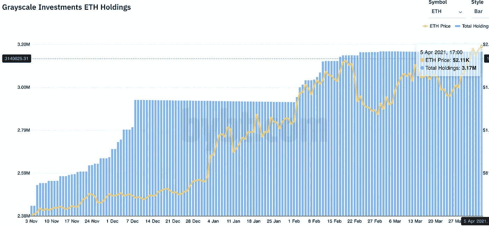

# 流动性危机第二部分:ETH

> 原文：<https://medium.com/coinmonks/the-liquidity-crisis-part-two-eth-254d721c181b?source=collection_archive---------4----------------------->

这是市场上最强有力的组合。

我把它比作一列货运列车。

起初，它的引擎发出咕噜咕噜的声音，直到嘎吱声被低沉的滚动声取代。旁观者没有注意到，乘客也几乎没有注意到。这一事件的展开并不引人注目。

这只是一个缓慢的滚动，产生的动量如此模糊以至于几乎被忽视。

一旦火车离开站台，旁观者就会扬起眉毛，对这台 14000 吨重的机器有节奏的运动表示出微妙的惊讶。势头越来越大……已经没有什么能阻挡这样的力量了。

然后，随着速度的增加，火车展现出可控的速度，其破坏力要求你看着它沿着铁轨疾驶。你不要妨碍它。也不要指望它会很快停止。享受旅行的乘客在火车的冲力达到如此令人印象深刻的高度之前就登上了火车。

这是我在看比特币定价的以太坊(ETH/BTC)图表时看到的看涨势头。价格正在缓慢上涨，只有少数人注意到了这一点。

即使对那些注意到的人来说，我也不相信大多数人会意识到即将发生的事情的重要性。

在需求上升的情况下，ETH 供应下降的爆炸性组合将刺激比特币减半周期的最大狂热。它准备在几个月后展开。

让我给你看看…

交易所的以太币交易量正在快速下降。这与我们在 2017 年看到的情况类似。

从 2017 年 3 月到 2018 年 1 月市场见顶后不久，交易所的储备减少了 975 万以太币。结果是少了 44%。

快进到这个牛市周期，交易所见证了比大约九个月前少 650 万的 ETH。结果是储备减少了约 25%。

当前图表中有趣的是瑞士联邦理工学院离开交易所的速度。

在下图中，我强调了 2017 年储量的下降，这导致了 ETH 之前的 ATH(垂直蓝线)。这是 ETH 脱离的速度——显示在一个绿色的盒子里。

我们现在正经历着类似的势头。唯一的区别是，在触及之前的 ATH 之前，最终离开交易所的 ETH 的百分比是 39%。这个循环如果重复的话，在我们达到一个相似的数字之前，会给我们更多的空间和时间。

让这一点变得更有意思的是，了解了许多不在交易所的 ETH 现在的位置…这是因为与上次不同，很大一部分 ETH 的流动性较低或实际上缺乏流动性。

这里有一个细目分类:

1070 万 ETH 被关押在 DeFi。

317 万 ETH 被锁在 gray 的以太坊信托(ETHE)里。

370 万以太押在以太坊 2.0 的信标链上。

50 万 ETH 作为 BEP-20 令牌坐在币安链上。

这比 1800 万 ETH 少了一点点，或者说几乎没有流动性。

当谈到我们的货运列车的第一部分时，供应的减少是人们没有注意到的。这是缓慢发生的，它对市场的影响并不明显。

需求创造了爆炸性的变化。根据我们在过去几周在 *Espresso* 中的展示，需求不仅在这里，而且正准备增加。

这要归功于不断增长的机构需求，这是由于美元的不道德管理、灰度效应以及加密慢慢被用作日常解决方案，而不仅仅是投机市场(即马克·库班最近的声明)。

这意味着 ETH 的价格正在加速历史性的上涨。普通读者一直在关注我们一个月前发布的图表。这是利弗莫尔累积圆筒图。

这是一个非常看涨的形态，发生在资产变成抛物线之前。这种情况最常见于周期性牛市，也就是我们目前所处的阶段。

有趣的是，我们已经看到了“7”附近的发展势头。

当价格打破这个圆筒时，它会产生突破速度。如果你决定花时间去做，价格目标会变得相当疯狂。

那条白色水平线很可能是这个编队的第一个目标。也就是每比特币 0.08845。如果达到这个目标时比特币是 120，000 美元，那就是每以太网 10，614 美元。

如果你认为这是疯狂的，那就等着看这种价格行为会对风险曲线上更远的地方产生什么影响吧。

这将是三年半以来的第一个“替代季”。

在以太坊的流动性危机把你甩在身后之前，现在就打卡吧。

你的脉搏在加密，

本·莉莉

附注[——这是流动性危机第一部分:比特币](https://jarvislabs.substack.com/p/bitcoins-current-crisis)，如果你喜欢这个，一定要关注我的《媒介》。谢谢！

> 加入 Coinmonks [电报集团](https://t.me/joinchat/Trz8jaxd6xEsBI4p)，了解加密交易和投资

## 另外，阅读

*   [什么是融资融券交易](https://blog.coincodecap.com/margin-trading)
*   最好的[密码交易机器人](/coinmonks/crypto-trading-bot-c2ffce8acb2a) | [网格交易](https://blog.coincodecap.com/grid-trading)
*   [3 商业评论](/coinmonks/3commas-review-an-excellent-crypto-trading-bot-2020-1313a58bec92) | [Pionex 评论](/coinmonks/pionex-review-exchange-with-crypto-trading-bot-1e459d0191ea) | [Coinrule 评论](/coinmonks/coinrule-review-2021-a-beginner-friendly-crypto-trading-bot-daf0504848ba)
*   [AAX 交易所评论](/coinmonks/aax-exchange-review-2021-67c5ea09330c) | [德里比特评论](/coinmonks/deribit-review-options-fees-apis-and-testnet-2ca16c4bbdb2) | [FTX 交易所评论](/coinmonks/ftx-crypto-exchange-review-53664ac1198f)
*   [n 零复习](/coinmonks/ngrave-zero-review-c465cf8307fc) | [Phemex 复习](/coinmonks/phemex-review-4cfba0b49e28) | [PrimeXBT 复习](/coinmonks/primexbt-review-88e0815be858)
*   [Bybit Exchange 审查](/coinmonks/bybit-exchange-review-dbd570019b71) | [Bityard 审查](/coinmonks/bityard-review-7d104239be35) | [CoinSpot 审查](https://blog.coincodecap.com/coinspot-review)
*   [3 commas vs crypto hopper](/coinmonks/3commas-vs-pionex-vs-cryptohopper-best-crypto-bot-6a98d2baa203)|[赚取加密利息](/coinmonks/earn-crypto-interest-b10b810fdda3)
*   最好的比特币[硬件钱包](/coinmonks/the-best-cryptocurrency-hardware-wallets-of-2020-e28b1c124069?source=friends_link&sk=324dd9ff8556ab578d71e7ad7658ad7c) | [BitBox02 回顾](/coinmonks/bitbox02-review-your-swiss-bitcoin-hardware-wallet-c36c88fff29)
*   [莱杰 vs n rave](/coinmonks/ledger-vs-ngrave-zero-7e40f0c1d694)|[莱杰 nano s vs x](/coinmonks/ledger-nano-s-vs-x-battery-hardware-price-storage-59a6663fe3b0)
*   [密码本交易平台](/coinmonks/top-10-crypto-copy-trading-platforms-for-beginners-d0c37c7d698c) | [Coinmama 审核](/coinmonks/coinmama-review-ace5641bde6e)
*   [CoinLoan 审核](/coinmonks/coinloan-review-18128b9badc4) | [YouHodler 审核](/coinmonks/youhodler-4-easy-ways-to-make-money-98969b9689f2) | [BlockFi 审核](/coinmonks/blockfi-review-53096053c097)
*   最好的[加密税务软件](/coinmonks/best-crypto-tax-tool-for-my-money-72d4b430816b) | [硬币追踪评论](/coinmonks/cointracking-review-a-reliable-cryptocurrency-tax-software-5114e3eb5737)
*   最佳[加密借贷平台](/coinmonks/top-5-crypto-lending-platforms-in-2020-that-you-need-to-know-a1b675cec3fa) | [杠杆令牌](/coinmonks/leveraged-token-3f5257808b22)
*   [BlockFi vs Celsius](/coinmonks/blockfi-vs-celsius-vs-hodlnaut-8a1cc8c26630)|[Hodlnaut 回顾](/coinmonks/hodlnaut-review-best-way-to-hodl-is-to-earn-interest-on-your-bitcoin-6658a8c19edf)
*   [Bitsgap 审核](/coinmonks/bitsgap-review-a-crypto-trading-bot-that-makes-easy-money-a5d88a336df2) | [Quadency 审核](/coinmonks/quadency-review-a-crypto-trading-automation-platform-3068eaa374e1) | [Bitbns 审核](/coinmonks/bitbns-review-38256a07e161)
*   [埃利帕尔泰坦评论](/coinmonks/ellipal-titan-review-85e9071dd029) | [赛克斯斯通评论](/coinmonks/secux-stone-hardware-wallet-review-15-discount-coupon-2020-7577032faa6e)
*   [本地比特币审核](/coinmonks/localbitcoins-review-6cc001c6ed56) | [加密货币储蓄账户](https://blog.coincodecap.com/cryptocurrency-savings-accounts)
*   最佳[区块链分析](https://bitquery.io/blog/best-blockchain-analysis-tools-and-software)工具| [赚比特币](/coinmonks/earn-bitcoin-6e8bd3c592d9)
*   [加密套利](/coinmonks/crypto-arbitrage-guide-how-to-make-money-as-a-beginner-62bfe5c868f6)指南| [如何做空比特币](/coinmonks/how-to-short-bitcoin-568a2d0b4ae5)
*   最佳[加密制图工具](/coinmonks/what-are-the-best-charting-platforms-for-cryptocurrency-trading-85aade584d80) | [最佳加密交易所](/coinmonks/crypto-exchange-dd2f9d6f3769)
*   [如何在印度购买比特币？](/coinmonks/buy-bitcoin-in-india-feb50ddfef94) | [WazirX 评论](/coinmonks/wazirx-review-5c811b074f5b)
*   [印度比特币交易所](/coinmonks/bitcoin-exchange-in-india-7f1fe79715c9) | [比特币储蓄账户](/coinmonks/bitcoin-savings-account-e65b13f92451)
*   [CoinDCX 评论](/coinmonks/coindcx-review-8444db3621a2) | [加密保证金交易交易所](https://blog.coincodecap.com/crypto-margin-trading-exchanges)