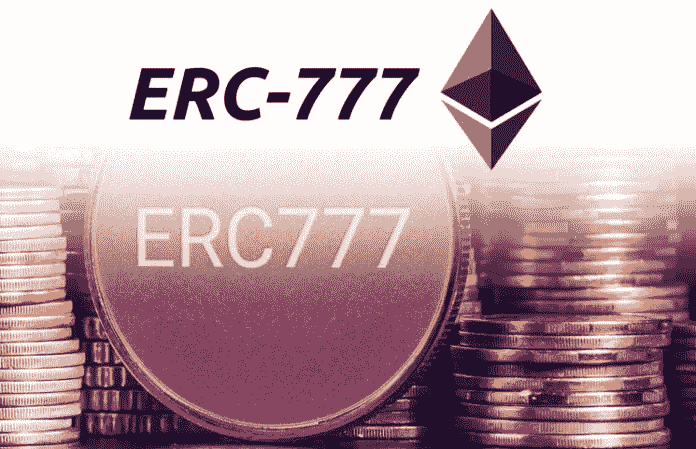

# 幸运的合同——ERC-777

> 原文：<https://medium.com/coinmonks/the-lucky-contract-erc-777-45b53df1454c?source=collection_archive---------0----------------------->

## ERC-777 令牌合同承诺进一步扩展 ERC 令牌的功能…



[image source](https://www.google.co.in/url?sa=i&source=images&cd=&cad=rja&uact=8&ved=2ahUKEwi7y97q7ZnfAhVC6RoKHWqgBjoQjxx6BAgBEAI&url=https%3A%2F%2Fbitcoinexchangeguide.com%2Ferc-20-erc-223-erc-721-and-erc-777-ethereum-eth-token-types%2F&psig=AOvVaw3cFgvfrKyw-6Pei5Z5pcWG&ust=1544689198362576)

## 背景

ERC-777 令牌来自 Jacques Dafflon、Jordi Baylina 和 Thomas Shababi 编写的原始 EIP(以太坊改进提案)——[https://eips.ethereum.org/EIPS/eip-777](https://eips.ethereum.org/EIPS/eip-777)。名字中的`777`除了是当时 github `issues`的当前索引之外，真的没有别的意思。不过，你不能否认，这个数字让各地有赌博倾向的开发人员都为之动容。这个提议的最初动机是提供比当前 ERC-20 规范更少摩擦的交易。如果你在这个领域工作了足够长的时间，你就会知道，拥有自己的钥匙和钱包的个人之间的交易是很容易的。您还知道，一旦您偏离了这个简单的用例，事情就会变得异常困难。

## ERC-777 将如何停止伤害

以下是我在使用以太坊时经历的一些常见事情，以及 ERC-777 规范如何能有所帮助。

## **第三方消费——运营商**

## ERC-20

在一个典型的 ERC 20 场景中，如果我想批准一个第三方账户或智能合约来使用我账户中的代币，我需要两次交易来执行一次转账。我需要调用`approve`方法来批准支出者和他们被授权支出的金额，智能合同或地址将需要执行交易。问题不在于我必须批准这个账户，而在于我必须给它一个消费限额，并确保它总是足以满足我的交易。

## ERC-777

ERC-777 规范希望通过引入`operators`的概念来解决第三方支出问题。操作员是服务架构中的一个众所周知的概念，因为他们是被给予特定许可来执行特定任务的帐户。在 ERC-777 令牌的情况下，操作符有两种类型——常规的`operator`和`default operator`。常规`operator`是允许代表另一个地址发送和烧录令牌的地址。`default operator`是允许代表所有令牌持有者发送和烧录令牌的地址。

## 天然气消费解决方案

在交易所或 dApps 上使用钱包时，一个常见的问题是为交易支付汽油费。只要速度够快，用户不需要或者不必关心他们的事务来自哪个块。使用“运营商”可以让您作为 dApp 或交易所所有者来管理天然气成本，以保持用户体验，而不是依赖客户。

## 所有权与支出

ERC20 规范的一大优点是有如此多的令牌与之兼容。这为开发和用户采用提供了一个很好的生态系统。然而，当你有一个以太坊钱包时，每个地址都构成一个具有唯一公钥/私钥的账户，如果你在一个交易所有数千名用户，当你没有该用户资金的私钥时，你如何提供结算？一个`operator`将是一个很好的用例，因为它并不真正构成所有权，但将允许您为交易结算转移资金。应该注意的是，一个地址可能会在任何时候添加/删除一个`operator`——所以这是一件棘手的事情，所以请记住…

## 奇迹发生的地方——ERC-820 合同

`operator`的使用最终由另一份合同 ERC-820 实现。该契约充当通用且无主的注册表，其中任何账户/地址可以检查以查看他们试图向其发送令牌的目的地是否可以接收/管理这些类型的令牌。这似乎是 [ERC-223 规范](/coinmonks/the-erc-223-evolution-eec0ef23e5cc)的演变，旨在帮助防止用户向不兼容的智能合约发送令牌。在一个正常的 ERC-20 用例中，发送方必须发送一个`approve`交易，然后才能向`SureThing`智能合约发送他们的`PokerCoin`令牌。在这种情况下，`PokerCoin`代币(ERC-777)开发者可以简单地向博彩业`PokerRegistry`合同(ERC-820)注册他们的代币，并声明它与`PokerCoin`合同(赌博智能合同)兼容。任何将`PokerCoin`发送到另一个没有在 ERC-820 合同中注册的合同的尝试都将失败。

如果您想详细阅读，eip 的[在这里](https://eips.ethereum.org/EIPS/eip-820)，eip 作者的测试示例在这里！按如下方式运行测试

```
git clone [git@github.com](mailto:git@github.com):jbaylina/ERC820.git && npm i
cd ERC820 && truffle test
```

## 钩住

ERC-777 规格的另一个承诺是`hooks`。它们对我来说仍然有点神秘，但本质上它们将允许开发人员实现在交易前/后执行的代码块，以做一些事情，如通过`event`发送通知、要求额外的输入、块地址或其他与流程相关的项目。

## 摘要

一个`operator`和 ERC-820 的组合意味着我们知道我们可以把代币送到哪里，以及我们授权谁来使用代币。作为我们虚构的扑克 dApp 的用户，我感到安全的是，我已经将合同地址`PokerCoin`设置为我的`operator`，并且根据开发人员在`PokerRegistry` ERC-820 智能合同上的注册，我被允许发送这些代币的唯一目的地是`PokerCoin`合同。

这里是[完整的 EIP](https://github.com/ethereum/EIPs/blob/master/EIPS/eip-777.md)，这里是一个实施的[示例项目。看看这些测试，并通过运行以下命令来运行它们。](https://github.com/jacquesd/ERC777)

```
git clone [git@github.com](mailto:git@github.com):jacquesd/ERC777.git && npm i
cd ERC777 && truffle test
```

> [直接在您的收件箱中获得最佳软件交易](https://coincodecap.com/?utm_source=coinmonks)

[](https://coincodecap.com/?utm_source=coinmonks)