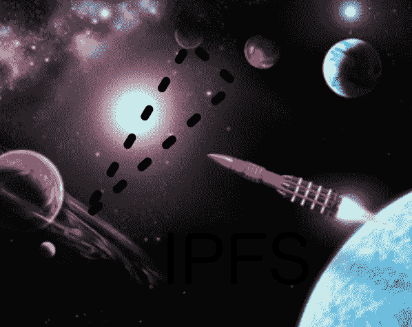

# IPFS 的魔力

> 原文：<https://medium.com/coinmonks/the-magic-of-ipfs-21485de2f550?source=collection_archive---------0----------------------->



用 IPFS 发布一个完整的网站是非常容易的。如果安装了本地 IPFS 节点，只需运行:

```
ipfs add -r webapp
```

这里的`webapp`需要是您的本地文件系统中的目录，完整的 web 应用程序就驻留在这里。

但是这真的是一种有用的发布网站的方式吗？

**是的，如果你能处理好的话！**

*的利弊*和*的利弊*在网上被广泛讨论，你必须意识到它与普通的网络出版物*完全不同。*(一些已知的陷阱在[这篇文章](https://revelry.co/ipfs-infrastructure/)中描述得很清楚。)

在您输入上面的命令后，您将得到一堆散列码，看起来可能像这样:`QmSH4VDxSY2V3KoDLojHZGkfPtVoVhDoisaLGBL2RPnvqM`

只要您自己的 IPFS 节点配置正确，启动并运行，现在每个人都可以访问您的网站。通过一个简单的命令，您已经将 web 应用程序的所有文件递归地添加到 IPFS 中。应用程序的*根*是输出中显示的最后一个散列。

有[公共 IPFS 网关](https://ipfs.github.io/public-gateway-checker/)，免费提供你的内容，**如果**他们碰巧在线。在撰写本文时，网关检查器发现了 33 个网关，其中 17 个在线。这似乎是可用性差，但事实上，你已经成功地在 17 个不同的网站上发布了你的内容。如果再有 16 台停机，您仍将保持“在线”。您非常接近高可用性。

公共网关是这样工作的:它们向 IPFS 查询你指定的散列码，然后像对待静态网站一样对待结果。当然，这意味着您不能执行任何服务器端逻辑，因为后端只能提供静态内容。

没有*应用服务器*来做繁重的工作，比如读写数据库。如今，这已不像过去那样是一个不利条件。在许多情况下，应用服务器可以被称为恐龙。正在向客户端应用程序转变。无服务器已经成为新的模式。当然，在目前，这还不是对每种情况都可行的解决方案。但是事情会改变的。

像 IPFS 这样的新发展很好地预示了未来会是什么样子。我们第一次拥有了一个非集中式的数据存储系统。随着基础设施的改善，其剩余的局限性将会消失。

对于 IPFS 来说，需要更好的浏览器支持。简单来说，浏览器需要从`client/server`移动到`decentralized`。当这一切发生时，*无服务器*应用程序将比现在更容易编写。它们将能够与各种各样的对等网络通信:与区块链或像 IPFS 这样的更新的文件系统通信。

与此同时，我认为 IPFS 只回答了一半的重要问题。加密呢？数据完整性、权限呢？在任何本地文件系统中，你都可以限制访问，你可以给不同的用户授予不同的权限。可以加密。这些目前在 IPFS 都不可能。它的优势来自于一个完全不同的方面，而不是模仿传统文件系统的特性。因此，旧文件系统的更多传统功能在 IPFS 消失了。

只有未来才能告诉我们这个问题到底有多严重。以加密为例:这项技术总是隐含着所有权，因此也隐含着不平等。私钥需要对所有其他人保密。在某种程度上，这与对等网络的理念相矛盾，在对等网络中，所有节点都是平等的。也许我们只是需要一种比老派加密更好的方式来处理隐私和所有权。加密当然是不可或缺的(它在区块链技术中被大量使用)。但是，这足以实现对等网络中的安全交易吗？

目前，我们不得不承认，加密或任何形式的授权和认证都不是 IPFS 的一部分。所以我们必须找到一种方法来解决这个问题——或者只是坐下来，放松一下，等待更好的时机。

在我的实验中，我试图用 IPFS 解决另一个不太难的问题:URL 的易变性。每次你的网页内容只改变一点点，就需要用一个不同的散列来处理。如上所述，不同的内容需要由不同的 URL 请求。

有许多方法可以处理这个问题，例如，。读起来也很有趣，你如何调整 DNS 来为你的主页提供一个稳定的 URL。

所有这些都是先进的东西，它已经超越了 IPFS 的基本用法。我发现接受临时地址的事实并稍微摆弄一下更有意思。

我使用了一个简单的页面，它很少改变，但是不显示任何内容。内容是分开发布的，是一系列的页面，就像[这个](https://ipfs.io/ipfs/QmSJucQ9MMHzbfzkbPqVcDRL32pb3cQV94v7otTrCUrwu8)。您只需使用如下 URL 将这两个散列组合起来:

```
/ipfs/<HASH1>#<HASH2>
```

因为内容由许多可以顺序加载的 HTML 片段组成，所以用 JavaScript 编写一个用于浏览内容的[向导](/@alexander.weinmann/a-coders-diary-5-how-i-finished-my-wizard-cbd5c91d395c)很容易。您最终得到了这个[样本页面](https://ipfs.io/ipfs/QmSH4VDxSY2V3KoDLojHZGkfPtVoVhDoisaLGBL2RPnvqM#QmSJucQ9MMHzbfzkbPqVcDRL32pb3cQV94v7otTrCUrwu8)。

我认为这样你可以从 IPFS 带来的许多好处中获益。任何新内容都可以通过将新页面序列发布(并固定)到 IPFS 来发布，如示例所示。除了在某个地方发布新的 URL 之外，没有什么可以做的了。您的内容将永远在线，**IFF**IPFS 的[钉住功能](https://docs.ipfs.io/guides/concepts/pinning/)如预期工作。

有用！您可以在此处找到您的内容[，在此处](https://cloudflare-ipfs.com/ipfs/QmSH4VDxSY2V3KoDLojHZGkfPtVoVhDoisaLGBL2RPnvqM#QmSJucQ9MMHzbfzkbPqVcDRL32pb3cQV94v7otTrCUrwu8)[找到](https://ipfs.io/ipfs/QmSH4VDxSY2V3KoDLojHZGkfPtVoVhDoisaLGBL2RPnvqM#QmSJucQ9MMHzbfzkbPqVcDRL32pb3cQV94v7otTrCUrwu8)或在此处找到[或在当前在线的任何其他 ipfs 网关中找到。](https://gateway.ipfs.io/ipfs/QmSH4VDxSY2V3KoDLojHZGkfPtVoVhDoisaLGBL2RPnvqM#QmSJucQ9MMHzbfzkbPqVcDRL32pb3cQV94v7otTrCUrwu8)

这还不是真正的*无服务器*，因为仍然需要网关服务器。但是它确实给你一种未来可能发生的感觉。范式的改变是显而易见的，而且很快会变得更加明显…

> [直接在您的收件箱中获得最佳软件交易](https://coincodecap.com/?utm_source=coinmonks)

[](https://coincodecap.com/?utm_source=coinmonks)